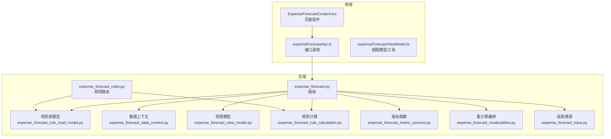
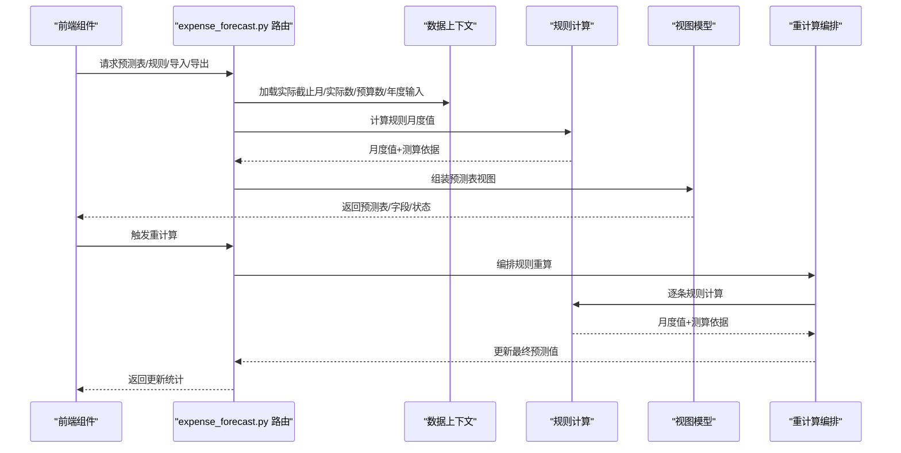
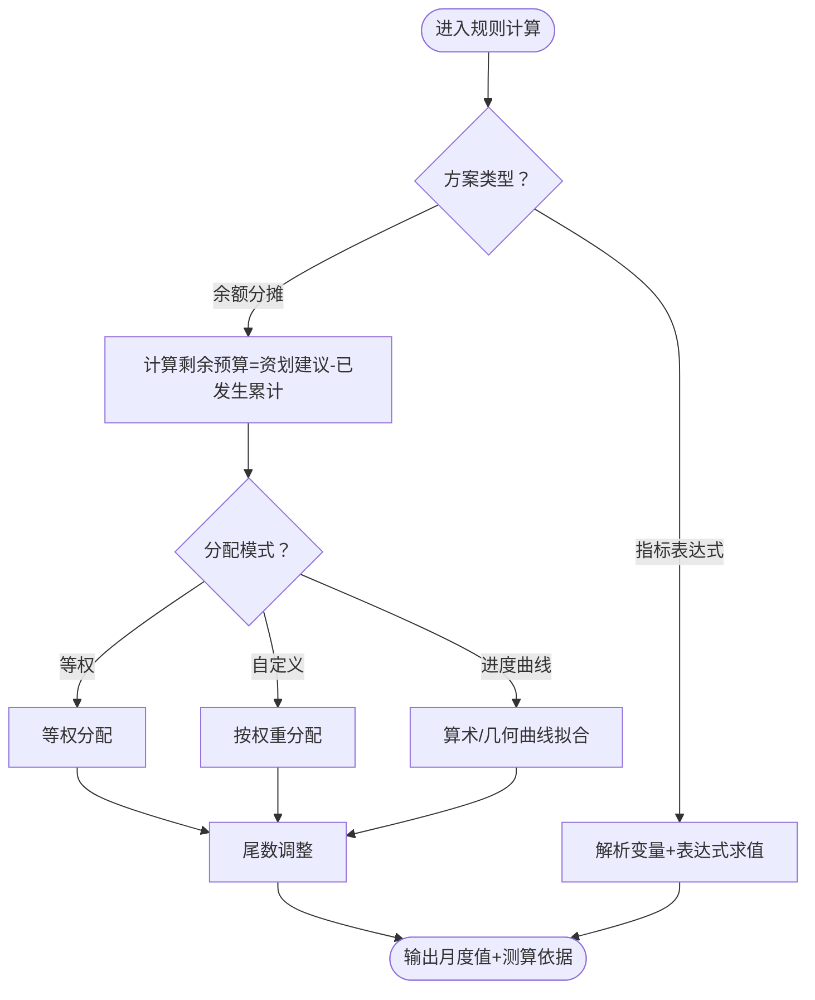
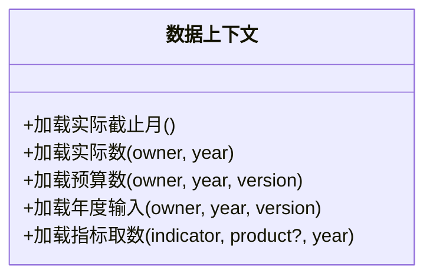
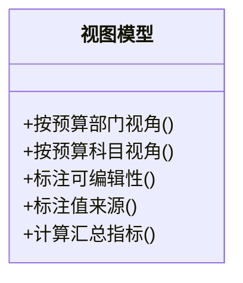
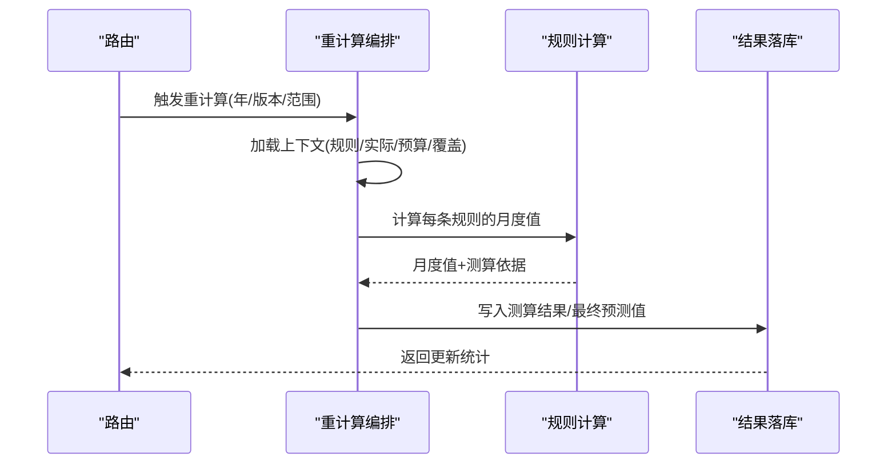
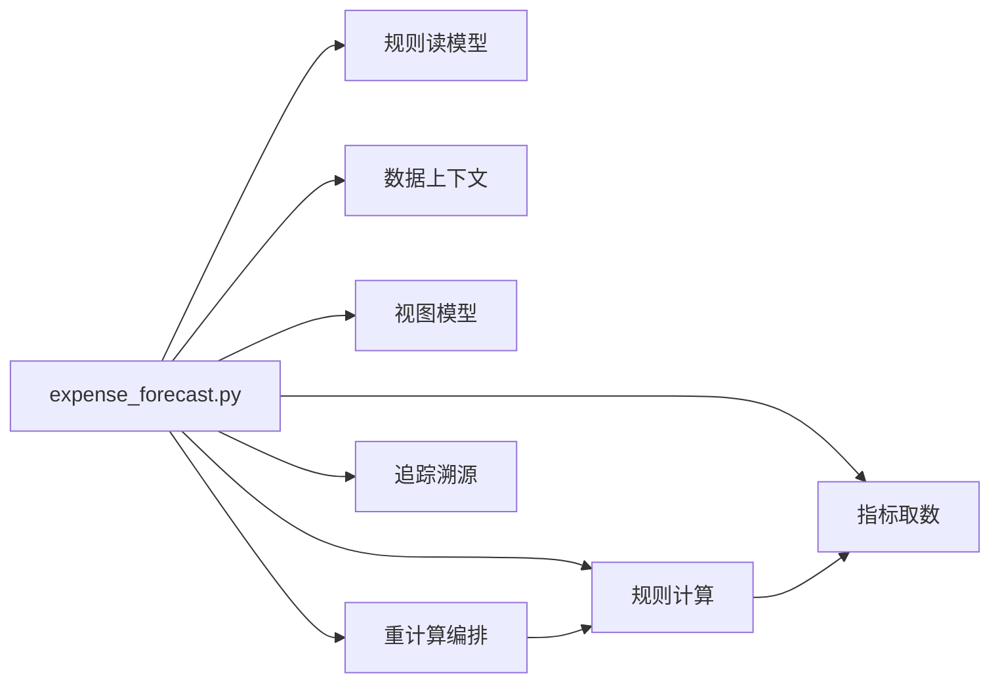

# 预算预测模块

<cite>
**本文档引用的文件**
- [apps/api/app/services/expense_forecast_rule_calculation.py](file://apps/api/app/services/expense_forecast_rule_calculation.py)
- [apps/api/app/services/expense_forecast_data_context.py](file://apps/api/app/services/expense_forecast_data_context.py)
- [apps/api/app/services/expense_forecast_view_model.py](file://apps/api/app/services/expense_forecast_view_model.py)
- [apps/api/app/services/expense_forecast_rule_read_model.py](file://apps/api/app/services/expense_forecast_rule_read_model.py)
- [apps/api/app/services/expense_forecast_rule_commands.py](file://apps/api/app/services/expense_forecast_rule_commands.py)
- [apps/api/app/services/expense_forecast_recalculation.py](file://apps/api/app/services/expense_forecast_recalculation.py)
- [apps/api/app/services/expense_forecast_recalculation_commands.py](file://apps/api/app/services/expense_forecast_recalculation_commands.py)
- [apps/api/app/services/expense_forecast_metric_sources.py](file://apps/api/app/services/expense_forecast_metric_sources.py)
- [apps/api/app/services/expense_forecast_trace.py](file://apps/api/app/services/expense_forecast_trace.py)
- [apps/api/app/routers/expense_forecast.py](file://apps/api/app/routers/expense_forecast.py)
- [apps/api/app/routers/expense_forecast_rules.py](file://apps/api/app/routers/expense_forecast_rules.py)
- [apps/web/src/lib/expenseForecastViewModel.ts](file://apps/web/src/lib/expenseForecastViewModel.ts)
- [apps/web/src/app/components/ExpenseForecastContent.tsx](file://apps/web/src/app/components/ExpenseForecastContent.tsx)
- [docs/product/Banking_Budget_System_PDD.md](file://docs/product/Banking_Budget_System_PDD.md)
</cite>

## 目录
1. [简介](#简介)
2. [项目结构](#项目结构)
3. [核心组件](#核心组件)
4. [架构总览](#架构总览)
5. [详细组件分析](#详细组件分析)
6. [依赖分析](#依赖分析)
7. [性能考虑](#性能考虑)
8. [故障排查指南](#故障排查指南)
9. [结论](#结论)
10. [附录](#附录)

## 简介
预算预测模块围绕“规则驱动”的预测引擎构建，支持多套预测方案（余额分摊、指标表达式等），通过规则配置、数据上下文加载、实时重计算与追踪溯源，形成从规则定义到预测表呈现的完整闭环。模块强调：
- 规则配置与持久化：规则、参数、变量的结构化存储与版本化管理
- 数据上下文：实际数、预算数、年度输入、指标树取数等多源聚合
- 实时重计算：手动触发与自动刷新策略，保证预测表一致性
- 可视化与交互：前端预测表、导入/导出、覆盖与追踪

## 项目结构
模块采用后端服务与前端组件协同的分层设计：
- 后端服务层：规则计算、数据上下文、视图组装、重计算编排、追踪溯源
- 接口层：FastAPI 路由，暴露预测表、规则、导入/导出、重计算、模拟等接口
- 前端展示层：预测表视图模型与组件，负责交互、导入导出、覆盖与搜索

**图表来源**
- [apps/api/app/routers/expense_forecast.py:317-800](file://apps/api/app/routers/expense_forecast.py#L317-L800)
- [apps/api/app/routers/expense_forecast_rules.py:164-280](file://apps/api/app/routers/expense_forecast_rules.py#L164-L280)
- [apps/api/app/services/expense_forecast_rule_read_model.py:59-184](file://apps/api/app/services/expense_forecast_rule_read_model.py#L59-L184)
- [apps/api/app/services/expense_forecast_data_context.py:31-319](file://apps/api/app/services/expense_forecast_data_context.py#L31-L319)
- [apps/api/app/services/expense_forecast_view_model.py:46-375](file://apps/api/app/services/expense_forecast_view_model.py#L46-L375)
- [apps/api/app/services/expense_forecast_rule_calculation.py:270-447](file://apps/api/app/services/expense_forecast_rule_calculation.py#L270-L447)
- [apps/api/app/services/expense_forecast_metric_sources.py:16-138](file://apps/api/app/services/expense_forecast_metric_sources.py#L16-L138)
- [apps/api/app/services/expense_forecast_recalculation.py:104-219](file://apps/api/app/services/expense_forecast_recalculation.py#L104-L219)
- [apps/api/app/services/expense_forecast_trace.py:71-144](file://apps/api/app/services/expense_forecast_trace.py#L71-L144)

**章节来源**
- [apps/api/app/routers/expense_forecast.py:317-800](file://apps/api/app/routers/expense_forecast.py#L317-L800)
- [apps/api/app/routers/expense_forecast_rules.py:164-280](file://apps/api/app/routers/expense_forecast_rules.py#L164-L280)
- [docs/product/Banking_Budget_System_PDD.md:54-81](file://docs/product/Banking_Budget_System_PDD.md#L54-L81)

## 核心组件
- 规则计算引擎：支持余额分摊、指标表达式等方案，提供表达式求值、几何/算术曲线拟合、权重分配与尾数调整
- 数据上下文：统一加载实际截止月、实际数、预算数、年度输入、指标树取数等
- 视图组装：按预算部门/预算科目维度聚合与渲染预测表，标注可编辑性、来源与覆盖状态
- 重计算编排：按规则启用条件与触发方式批量重算，落库最终预测值
- 追踪溯源：输出月度来源、系统值、覆盖值与测算依据
- 前端视图模型：金额单位换算、导出字段、搜索过滤、树形结构与交互状态

**章节来源**
- [apps/api/app/services/expense_forecast_rule_calculation.py:270-447](file://apps/api/app/services/expense_forecast_rule_calculation.py#L270-L447)
- [apps/api/app/services/expense_forecast_data_context.py:194-319](file://apps/api/app/services/expense_forecast_data_context.py#L194-L319)
- [apps/api/app/services/expense_forecast_view_model.py:46-375](file://apps/api/app/services/expense_forecast_view_model.py#L46-L375)
- [apps/api/app/services/expense_forecast_recalculation.py:159-219](file://apps/api/app/services/expense_forecast_recalculation.py#L159-L219)
- [apps/api/app/services/expense_forecast_trace.py:71-144](file://apps/api/app/services/expense_forecast_trace.py#L71-L144)
- [apps/web/src/lib/expenseForecastViewModel.ts:36-351](file://apps/web/src/lib/expenseForecastViewModel.ts#L36-L351)

## 架构总览
预算预测模块遵循“路由-服务-读模型-持久化”的分层，规则计算作为核心算法层，数据上下文与视图模型分别承担数据准备与展示职责，重计算编排贯穿规则生命周期。

**图表来源**
- [apps/api/app/routers/expense_forecast.py:317-800](file://apps/api/app/routers/expense_forecast.py#L317-L800)
- [apps/api/app/services/expense_forecast_data_context.py:194-319](file://apps/api/app/services/expense_forecast_data_context.py#L194-L319)
- [apps/api/app/services/expense_forecast_rule_calculation.py:270-447](file://apps/api/app/services/expense_forecast_rule_calculation.py#L270-L447)
- [apps/api/app/services/expense_forecast_view_model.py:46-375](file://apps/api/app/services/expense_forecast_view_model.py#L46-L375)
- [apps/api/app/services/expense_forecast_recalculation.py:159-219](file://apps/api/app/services/expense_forecast_recalculation.py#L159-L219)

## 详细组件分析

### 规则计算引擎（核心算法）
- 支持方案
  - 余额分摊（RESIDUAL_ALLOC）：基于“资划建议-已发生累计”剩余预算，在生效月范围内进行权重分配；支持等权、自定义权重、算术/几何曲线增长；允许负值开关与尾数调整
  - 指标表达式（METRIC_EXPR）：通过表达式语言与变量（指标树、实际累计、年度输入、内嵌字段等）计算月度值
- 关键能力
  - 表达式求值：支持 IF/MAX/MIN/ABS/ROUND/CEIL/FLOOR 等函数与比较/布尔运算
  - 曲线拟合：几何序列比率求解，退化为算术序列
  - 变量解析：常量、年度字段、内嵌字段、实际累计、指标树取数
  - 月度范围：受规则生效月与实际截止月共同约束

**图表来源**
- [apps/api/app/services/expense_forecast_rule_calculation.py:270-447](file://apps/api/app/services/expense_forecast_rule_calculation.py#L270-L447)

**章节来源**
- [apps/api/app/services/expense_forecast_rule_calculation.py:270-447](file://apps/api/app/services/expense_forecast_rule_calculation.py#L270-L447)

### 数据上下文（预测输入）
- 实际截止月：从实际明细中提取当前年已匹配的最大月份
- 实际数/预算数/年度输入：按部门/科目聚合，支持按预算部门或预算科目维度
- 指标取数：通过数据账户-指标节点绑定，按运行时引用代码与产品维度取数

**图表来源**
- [apps/api/app/services/expense_forecast_data_context.py:194-319](file://apps/api/app/services/expense_forecast_data_context.py#L194-L319)
- [apps/api/app/services/expense_forecast_metric_sources.py:16-138](file://apps/api/app/services/expense_forecast_metric_sources.py#L16-L138)

**章节来源**
- [apps/api/app/services/expense_forecast_data_context.py:194-319](file://apps/api/app/services/expense_forecast_data_context.py#L194-L319)
- [apps/api/app/services/expense_forecast_metric_sources.py:16-138](file://apps/api/app/services/expense_forecast_metric_sources.py#L16-L138)

### 视图组装（预测表渲染）
- 按预算部门/预算科目两种视角聚合
- 自动/覆盖/手工/实际等值来源标注，编辑态控制
- 年度预算、业务报送、资划建议、缺口与执行率等指标
- 树形结构与搜索过滤，支持按主体/事业群/费用归属部门切换

**图表来源**
- [apps/api/app/services/expense_forecast_view_model.py:46-375](file://apps/api/app/services/expense_forecast_view_model.py#L46-L375)
- [apps/web/src/lib/expenseForecastViewModel.ts:36-351](file://apps/web/src/lib/expenseForecastViewModel.ts#L36-L351)

**章节来源**
- [apps/api/app/services/expense_forecast_view_model.py:46-375](file://apps/api/app/services/expense_forecast_view_model.py#L46-L375)
- [apps/web/src/lib/expenseForecastViewModel.ts:36-351](file://apps/web/src/lib/expenseForecastViewModel.ts#L36-L351)

### 重计算编排（实时重计算）
- 触发方式：手动触发与按规则启用条件自动触发
- 上下文：规则集、实际截止月、实际数、年度输入、预算数、覆盖映射
- 结果落库：更新测算结果与最终预测值，同步覆盖系统值

**图表来源**
- [apps/api/app/services/expense_forecast_recalculation.py:159-219](file://apps/api/app/services/expense_forecast_recalculation.py#L159-L219)
- [apps/api/app/services/expense_forecast_recalculation_commands.py:28-66](file://apps/api/app/services/expense_forecast_recalculation_commands.py#L28-L66)

**章节来源**
- [apps/api/app/services/expense_forecast_recalculation.py:159-219](file://apps/api/app/services/expense_forecast_recalculation.py#L159-L219)
- [apps/api/app/services/expense_forecast_recalculation_commands.py:28-66](file://apps/api/app/services/expense_forecast_recalculation_commands.py#L28-L66)

### 追踪溯源（月度来源与测算依据）
- 输出：最终值、系统值、覆盖值、值来源、测算依据JSON
- 用于审计与问题定位，支持按规则/科目/部门/月份检索

**章节来源**
- [apps/api/app/services/expense_forecast_trace.py:71-144](file://apps/api/app/services/expense_forecast_trace.py#L71-L144)

### 前端组件与交互
- 页面组件：ExpenseForecastContent.tsx 负责状态管理、加载视图、导入/导出、覆盖保存、搜索与树形展开
- 视图模型：提供金额单位换算、导出字段集合、预算科目/部门树构建、搜索与过滤、深度映射等
- 组件子集：按预算部门/按预算科目/按事业群的表格与弹窗组件

**章节来源**
- [apps/web/src/app/components/ExpenseForecastContent.tsx:81-800](file://apps/web/src/app/components/ExpenseForecastContent.tsx#L81-L800)
- [apps/web/src/lib/expenseForecastViewModel.ts:36-351](file://apps/web/src/lib/expenseForecastViewModel.ts#L36-L351)

## 依赖分析
- 路由依赖：expense_forecast.py 依赖规则读模型、数据上下文、视图模型、规则计算、指标取数、重计算编排与追踪
- 规则读模型：统一加载规则、参数、变量、测算结果与覆盖映射
- 规则计算：表达式求值、曲线拟合、变量解析
- 重计算编排：协议化数据源，屏蔽具体存储细节
- 前端：通过API封装与视图模型解耦后端实现

**图表来源**
- [apps/api/app/routers/expense_forecast.py:317-800](file://apps/api/app/routers/expense_forecast.py#L317-L800)
- [apps/api/app/services/expense_forecast_rule_read_model.py:59-184](file://apps/api/app/services/expense_forecast_rule_read_model.py#L59-L184)
- [apps/api/app/services/expense_forecast_rule_calculation.py:270-447](file://apps/api/app/services/expense_forecast_rule_calculation.py#L270-L447)
- [apps/api/app/services/expense_forecast_recalculation.py:104-219](file://apps/api/app/services/expense_forecast_recalculation.py#L104-L219)

**章节来源**
- [apps/api/app/routers/expense_forecast.py:317-800](file://apps/api/app/routers/expense_forecast.py#L317-L800)
- [apps/api/app/services/expense_forecast_rule_read_model.py:59-184](file://apps/api/app/services/expense_forecast_rule_read_model.py#L59-L184)
- [apps/api/app/services/expense_forecast_rule_calculation.py:270-447](file://apps/api/app/services/expense_forecast_rule_calculation.py#L270-L447)
- [apps/api/app/services/expense_forecast_recalculation.py:104-219](file://apps/api/app/services/expense_forecast_recalculation.py#L104-L219)

## 性能考虑
- 查询批量化：实际数/预算数/年度输入按部门列表一次性加载，减少多次往返
- 指标取数缓存：按指标与产品维度加载最新版本预算数据，避免重复扫描
- 表达式求值：AST解析与函数白名单，避免复杂表达式导致的CPU开销
- 重计算批处理：按规则集批量计算，减少事务次数
- 前端渲染：树形展开与搜索过滤在客户端完成，降低后端压力

[本节为通用指导，无需特定文件引用]

## 故障排查指南
- 规则不存在/删除失败：检查规则ID与版本，确认规则存在性与外键约束
- 预测表为空：确认实际截止月是否为0，或规则未启用/未生效
- 导入/导出异常：核对Excel模板字段、预算科目匹配与部门范围
- 重计算无变化：确认规则启用标志、手动重算开关与覆盖映射
- 表达式错误：检查变量来源、函数合法性与语法

**章节来源**
- [apps/api/app/routers/expense_forecast_rules.py:164-280](file://apps/api/app/routers/expense_forecast_rules.py#L164-L280)
- [apps/api/app/services/expense_forecast_rule_commands.py:143-169](file://apps/api/app/services/expense_forecast_rule_commands.py#L143-L169)
- [apps/api/app/services/expense_forecast_recalculation.py:96-101](file://apps/api/app/services/expense_forecast_recalculation.py#L96-L101)

## 结论
预算预测模块通过“规则+数据+视图+重计算”的闭环设计，实现了灵活可配置的预测能力。规则计算引擎提供强大的表达式与曲线拟合能力，数据上下文与指标取数确保输入质量，视图模型与前端组件提升用户体验，重计算编排保障预测表一致性与可追溯性。模块在BI映射与指标树关系下，能够稳定支撑历史趋势、季节性调整与外部因素影响等预测场景。

[本节为总结，无需特定文件引用]

## 附录

### 预测规则存储结构
- 规则表：规则基础信息（年、版本、部门、科目、方案、生效月、优先级、备注等）
- 参数表：规则参数（分组、键、值、类型）
- 变量表：规则变量（变量代码、来源类型/键/子键、默认值、排序）

**章节来源**
- [apps/api/app/services/expense_forecast_rule_commands.py:36-141](file://apps/api/app/services/expense_forecast_rule_commands.py#L36-L141)
- [apps/api/app/services/expense_forecast_rule_read_model.py:59-184](file://apps/api/app/services/expense_forecast_rule_read_model.py#L59-L184)

### API 接口规范（概要）
- 获取预测表：按预算部门/预算科目/事业群维度返回预测表
- 获取规则：按年/版本/部门/科目查询规则列表与详情
- 保存/更新/删除规则：规则定义持久化
- 重计算：按年/版本/范围触发规则重算
- 模拟规则：按传入规则参数模拟月度值
- 导入/导出：Excel模板下载、预览、应用与分组导出

**章节来源**
- [apps/api/app/routers/expense_forecast.py:317-800](file://apps/api/app/routers/expense_forecast.py#L317-L800)
- [apps/api/app/routers/expense_forecast_rules.py:164-280](file://apps/api/app/routers/expense_forecast_rules.py#L164-L280)

### 前端组件实现要点
- 状态管理：年份、版本、单位、编制维度、预算科目选择、搜索关键词、展开状态、上下文菜单
- 视图切换：按预算部门/按预算科目/按事业群三种视图
- 交互行为：单元格编辑、覆盖保存、导入预览与应用、导出字段选择
- 树形结构：预算科目树与部门树构建、路径映射、搜索匹配

**章节来源**
- [apps/web/src/app/components/ExpenseForecastContent.tsx:81-800](file://apps/web/src/app/components/ExpenseForecastContent.tsx#L81-L800)
- [apps/web/src/lib/expenseForecastViewModel.ts:36-351](file://apps/web/src/lib/expenseForecastViewModel.ts#L36-L351)

### 用户操作流程示例
- 历史趋势分析：配置指标表达式规则，引用实际累计与指标树变量，观察月度趋势
- 季节性调整：余额分摊方案中设置自定义权重，使Q4权重更高
- 外部因素影响：通过年度输入（业务报送/资划建议）调整预算总额，系统自动重算

[本节为概念性说明，无需特定文件引用]