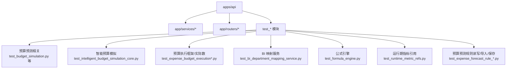
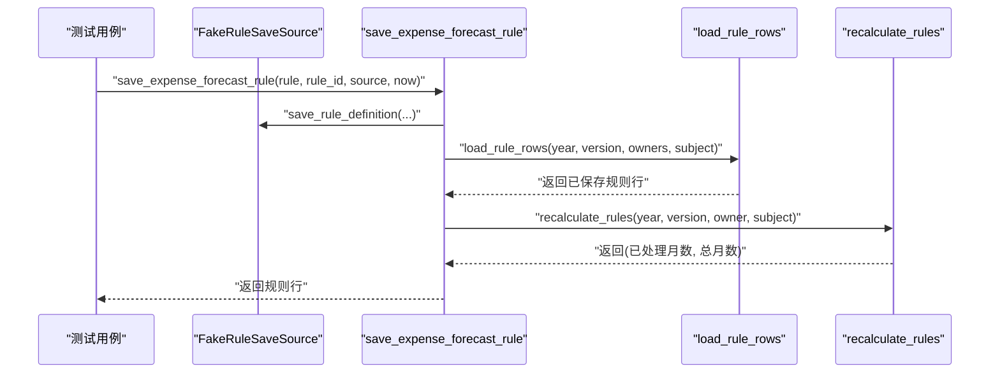
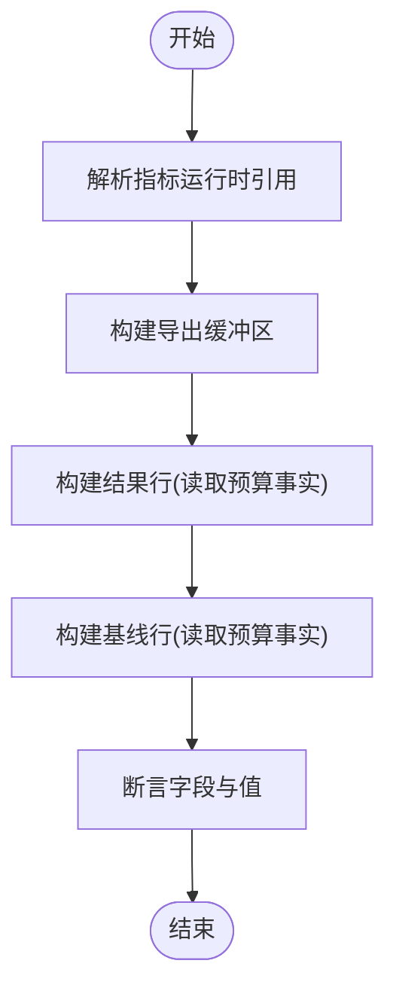
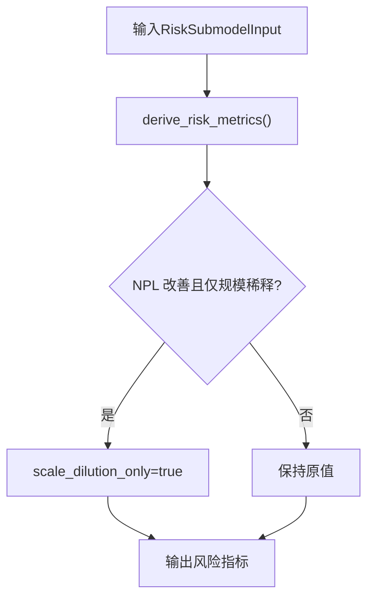
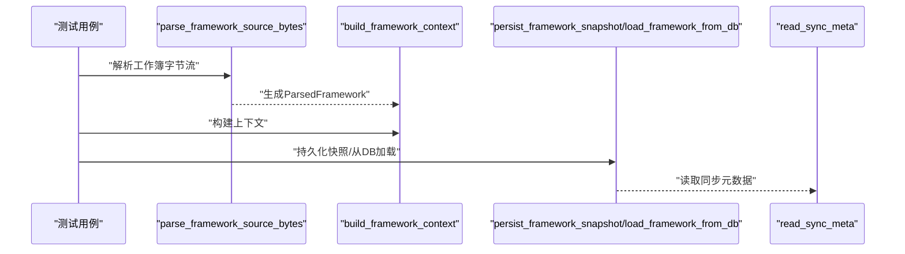
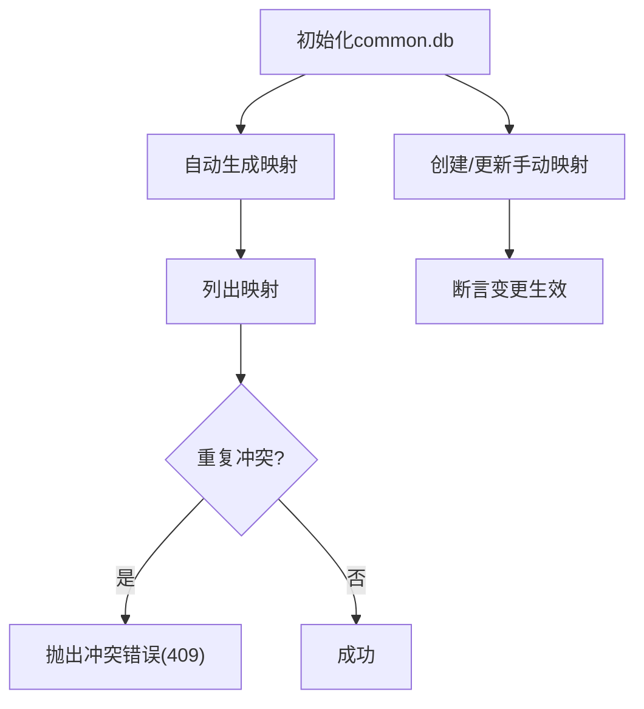
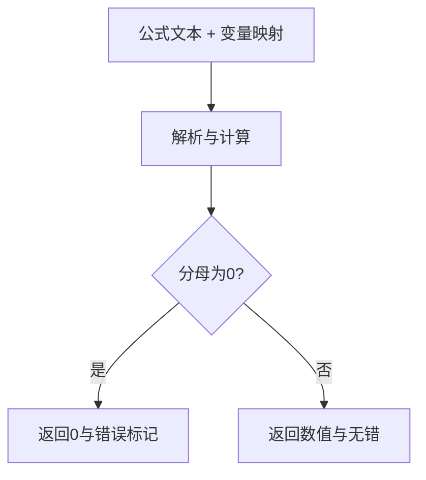
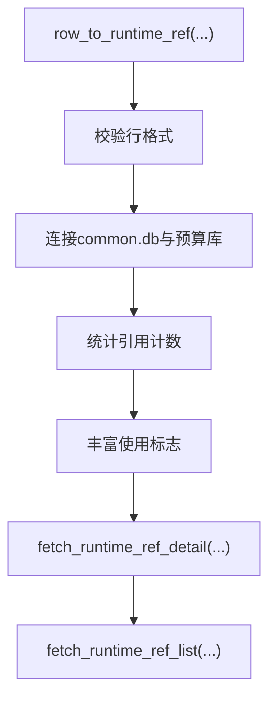
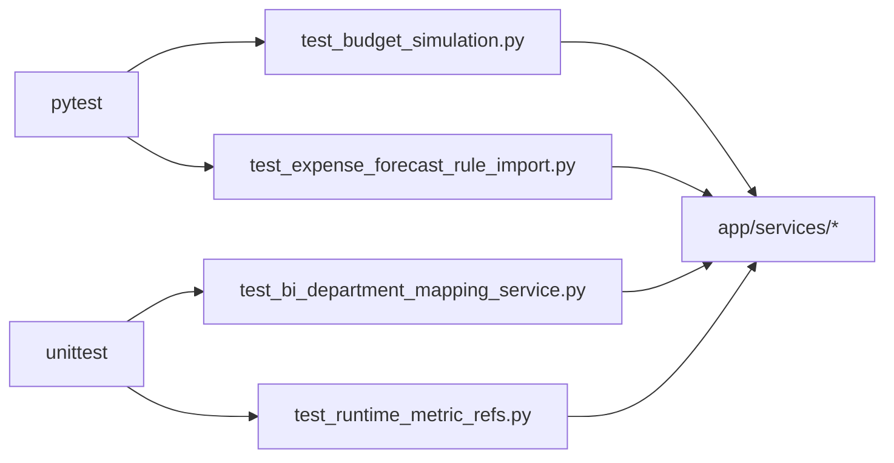

# 单元测试

<cite>
**本文引用的文件**
- [apps/api/pyproject.toml](file://apps/api/pyproject.toml)
- [apps/api/requirements.txt](file://apps/api/requirements.txt)
- [apps/api/test_budget_simulation.py](file://apps/api/test_budget_simulation.py)
- [apps/api/test_intelligent_budget_simulation_core.py](file://apps/api/test_intelligent_budget_simulation_core.py)
- [apps/api/test_expense_budget_execution_framework.py](file://apps/api/test_expense_budget_execution_framework.py)
- [apps/api/test_bi_department_mapping_service.py](file://apps/api/test_bi_department_mapping_service.py)
- [apps/api/test_expense_budget_execution_actuals.py](file://apps/api/test_expense_budget_execution_actuals.py)
- [apps/api/test_expense_forecast_rule_calculation.py](file://apps/api/test_expense_forecast_rule_calculation.py)
- [apps/api/test_formula_engine.py](file://apps/api/test_formula_engine.py)
- [apps/api/test_runtime_metric_refs.py](file://apps/api/test_runtime_metric_refs.py)
- [apps/api/test_expense_forecast_rule_read_model.py](file://apps/api/test_expense_forecast_rule_read_model.py)
- [apps/api/test_expense_forecast_rule_import.py](file://apps/api/test_expense_forecast_rule_import.py)
- [apps/api/test_expense_forecast_rule_save.py](file://apps/api/test_expense_forecast_rule_save.py)
</cite>

## 目录
1. [引言](#引言)
2. [项目结构](#项目结构)
3. [核心组件](#核心组件)
4. [架构总览](#架构总览)
5. [详细组件分析](#详细组件分析)
6. [依赖分析](#依赖分析)
7. [性能考虑](#性能考虑)
8. [故障排查指南](#故障排查指南)
9. [结论](#结论)
10. [附录](#附录)

## 引言
本文件面向智能预算预测系统后端应用，提供基于 Pytest 的单元测试文档与最佳实践指南。内容覆盖预算预测、智能预算模拟、预算执行、BI 映射、公式引擎、运行期指标引用、以及预算预测规则的读写与导入导出等模块的测试策略与实现要点。文档同时给出测试数据准备、Mock 使用、断言规范、错误处理测试、覆盖率统计与报告生成建议，以及独立功能与边界条件测试方法。

## 项目结构
后端测试主要位于 apps/api 目录下，采用 Python 标准库 unittest 与 pytest 并存的现状：部分测试使用 unittest（如预算模拟、BI 映射、执行框架、公式引擎、运行期指标引用等），部分测试使用 pytest（如预算预测规则导入）。测试文件以 test_ 前缀命名，按功能域划分，便于定位与维护。



图示来源
- [apps/api/test_budget_simulation.py:1-319](file://apps/api/test_budget_simulation.py#L1-L319)
- [apps/api/test_intelligent_budget_simulation_core.py:1-146](file://apps/api/test_intelligent_budget_simulation_core.py#L1-L146)
- [apps/api/test_expense_budget_execution_framework.py:1-262](file://apps/api/test_expense_budget_execution_framework.py#L1-L262)
- [apps/api/test_bi_department_mapping_service.py:1-128](file://apps/api/test_bi_department_mapping_service.py#L1-L128)
- [apps/api/test_formula_engine.py:1-56](file://apps/api/test_formula_engine.py#L1-L56)
- [apps/api/test_runtime_metric_refs.py:1-365](file://apps/api/test_runtime_metric_refs.py#L1-L365)
- [apps/api/test_expense_forecast_rule_read_model.py:1-316](file://apps/api/test_expense_forecast_rule_read_model.py#L1-L316)
- [apps/api/test_expense_forecast_rule_import.py:1-145](file://apps/api/test_expense_forecast_rule_import.py#L1-L145)
- [apps/api/test_expense_forecast_rule_save.py:1-210](file://apps/api/test_expense_forecast_rule_save.py#L1-L210)

章节来源
- [apps/api/pyproject.toml:1-33](file://apps/api/pyproject.toml#L1-L33)
- [apps/api/requirements.txt:1-18](file://apps/api/requirements.txt#L1-L18)

## 核心组件
- 预算预测与模拟
  - 预算模拟指标解析、基线与结果构建、导出缓冲区生成
  - 智能预算模拟风险子模型、步长生成、评分与排序
- 预算执行
  - 执行框架解析与持久化、上下文加载、同步元数据记录
  - 实际数加载与来源模式判定
- BI 映射
  - 自动/手动映射生成、重复冲突处理、引用数据查询
- 公式引擎
  - 公式解析与计算、错误返回、跨产品/组织公式作用域校验
- 运行期指标引用
  - 指标引用计数、绑定关系、产品树快照关联、数据库路径显式控制
- 预算预测规则
  - 规则读模型（启用映射、计算结果、覆盖值）、导入模板与解析、保存流程与审计日志

章节来源
- [apps/api/test_budget_simulation.py:25-319](file://apps/api/test_budget_simulation.py#L25-L319)
- [apps/api/test_intelligent_budget_simulation_core.py:1-146](file://apps/api/test_intelligent_budget_simulation_core.py#L1-L146)
- [apps/api/test_expense_budget_execution_framework.py:51-258](file://apps/api/test_expense_budget_execution_framework.py#L51-L258)
- [apps/api/test_expense_budget_execution_actuals.py:69-115](file://apps/api/test_expense_budget_execution_actuals.py#L69-L115)
- [apps/api/test_bi_department_mapping_service.py:71-124](file://apps/api/test_bi_department_mapping_service.py#L71-L124)
- [apps/api/test_formula_engine.py:11-53](file://apps/api/test_formula_engine.py#L11-L53)
- [apps/api/test_runtime_metric_refs.py:24-361](file://apps/api/test_runtime_metric_refs.py#L24-L361)
- [apps/api/test_expense_forecast_rule_read_model.py:18-312](file://apps/api/test_expense_forecast_rule_read_model.py#L18-L312)
- [apps/api/test_expense_forecast_rule_import.py:15-145](file://apps/api/test_expense_forecast_rule_import.py#L15-L145)
- [apps/api/test_expense_forecast_rule_save.py:14-206](file://apps/api/test_expense_forecast_rule_save.py#L14-L206)

## 架构总览
以下序列图展示“预算预测规则保存”流程的关键调用链，体现测试中对异步接口、加载与重算流程、审计日志的验证点。



图示来源
- [apps/api/test_expense_forecast_rule_save.py:92-140](file://apps/api/test_expense_forecast_rule_save.py#L92-L140)

## 详细组件分析

### 预算预测与模拟
- 指标运行时引用解析：验证本地指标码与产品作用域匹配、退休后缀回退策略
- 导出缓冲区：校验工作簿结构、参数与结果表头、源数据账户引用
- 结果与基线构建：通过临时 SQLite 数据库注入组织产品树、指标节点、数据账户、绑定关系与预算事实，断言基线与模拟值一致性
- 断言要点：字段存在性、值相等或近似相等、Excel 工作簿内容与结构



图示来源
- [apps/api/test_budget_simulation.py:25-319](file://apps/api/test_budget_simulation.py#L25-L319)

章节来源
- [apps/api/test_budget_simulation.py:25-319](file://apps/api/test_budget_simulation.py#L25-L319)

### 智能预算模拟
- 风险子模型：期初/期末贷款规模、NPL 平衡、拨备计提与消耗、超额拨备、稀释改善标记
- 步长生成：基于敏感度、历史步长、业务单位、上下界与层级生成候选值
- 评分与排序：目标阈值过滤、数学得分比较、排名确定



图示来源
- [apps/api/test_intelligent_budget_simulation_core.py:14-54](file://apps/api/test_intelligent_budget_simulation_core.py#L14-L54)

章节来源
- [apps/api/test_intelligent_budget_simulation_core.py:1-146](file://apps/api/test_intelligent_budget_simulation_core.py#L1-L146)

### 预算执行框架与实际数
- 框架解析：去重、别名上下文、实体/事业群映射
- 快照持久化：排除行过滤、元数据记录
- 上下文加载：主数据优先、内部快照不回退
- 实际数加载：当前年份原始明细导入要求、来源模式与汇总金额



图示来源
- [apps/api/test_expense_budget_execution_framework.py:51-135](file://apps/api/test_expense_budget_execution_framework.py#L51-L135)

章节来源
- [apps/api/test_expense_budget_execution_framework.py:51-258](file://apps/api/test_expense_budget_execution_framework.py#L51-L258)
- [apps/api/test_expense_budget_execution_actuals.py:69-115](file://apps/api/test_expense_budget_execution_actuals.py#L69-L115)

### BI 映射服务
- 自动生成映射并去重冲突、手动“其他-手填费用归属”允许更新
- 引用数据：费用归属部门组、可选部门列表、归口部门列表



图示来源
- [apps/api/test_bi_department_mapping_service.py:71-124](file://apps/api/test_bi_department_mapping_service.py#L71-L124)

章节来源
- [apps/api/test_bi_department_mapping_service.py:71-124](file://apps/api/test_bi_department_mapping_service.py#L71-L124)

### 公式引擎
- 公式计算：全角函数与运算符、裸数据账户引用、多级父子账户引用
- 作用域校验：全组织公式允许子产品引用
- 错误处理：除零返回特定错误标记



图示来源
- [apps/api/test_formula_engine.py:11-53](file://apps/api/test_formula_engine.py#L11-L53)

章节来源
- [apps/api/test_formula_engine.py:11-53](file://apps/api/test_formula_engine.py#L11-L53)

### 运行期指标引用
- 行格式校验：拒绝旧短格式
- 多年预算库引用计数：跨年数据库聚合
- 详情查询：连接指标身份只读模型、产品树快照
- 列表查询：应用使用计数、组织产品指标引用计数
- 显式数据库路径：仅在指定预算库中统计



图示来源
- [apps/api/test_runtime_metric_refs.py:24-361](file://apps/api/test_runtime_metric_refs.py#L24-L361)

章节来源
- [apps/api/test_runtime_metric_refs.py:24-361](file://apps/api/test_runtime_metric_refs.py#L24-L361)

### 预算预测规则：读模型/导入/保存
- 读模型：规则行展开参数与变量、启用映射、按部门/科目过滤、计算结果与覆盖映射、空部门短路
- 导入：模板构建、填写说明与候选指标、解析规范化、必填校验
- 保存：新增/更新审计日志、自动刷新规则重算、保存后无法回读的异常

```mermaid
sequenceDiagram
participant T as "测试用例"
participant RM as "load_expense_forecast_rule_rows"
participant Map as "build_enabled_expense_forecast_rule_map"
participant Calc as "load_expense_forecast_calc_result_map"
participant Over as "load_expense_forecast_override_map"
T->>RM : "查询规则行(年/版本/部门/科目)"
RM-->>Map : "构建启用规则映射"
T->>Calc : "加载计算结果映射"
T->>Over : "加载覆盖映射"
```

图示来源
- [apps/api/test_expense_forecast_rule_read_model.py:18-312](file://apps/api/test_expense_forecast_rule_read_model.py#L18-L312)

章节来源
- [apps/api/test_expense_forecast_rule_read_model.py:18-312](file://apps/api/test_expense_forecast_rule_read_model.py#L18-L312)
- [apps/api/test_expense_forecast_rule_import.py:15-145](file://apps/api/test_expense_forecast_rule_import.py#L15-L145)
- [apps/api/test_expense_forecast_rule_save.py:92-206](file://apps/api/test_expense_forecast_rule_save.py#L92-L206)

## 依赖分析
- 测试框架与工具
  - 开发依赖：pytest
  - 运行依赖：FastAPI、aiosqlite、openpyxl、pydantic、langgraph 等
- 测试文件与被测模块关系
  - 各 test_* 文件直接导入 app/services/* 与 app/routers/* 中的服务/路由实现
  - 部分测试通过临时 SQLite 文件模拟数据库环境，避免外部依赖



图示来源
- [apps/api/pyproject.toml:26-29](file://apps/api/pyproject.toml#L26-L29)
- [apps/api/requirements.txt:1-18](file://apps/api/requirements.txt#L1-L18)
- [apps/api/test_budget_simulation.py:1-25](file://apps/api/test_budget_simulation.py#L1-L25)
- [apps/api/test_expense_forecast_rule_import.py:1-14](file://apps/api/test_expense_forecast_rule_import.py#L1-L14)
- [apps/api/test_bi_department_mapping_service.py:1-18](file://apps/api/test_bi_department_mapping_service.py#L1-L18)
- [apps/api/test_runtime_metric_refs.py:1-22](file://apps/api/test_runtime_metric_refs.py#L1-L22)

章节来源
- [apps/api/pyproject.toml:26-29](file://apps/api/pyproject.toml#L26-L29)
- [apps/api/requirements.txt:1-18](file://apps/api/requirements.txt#L1-L18)

## 性能考虑
- 测试数据库访问
  - 使用临时目录与 SQLite 内存/文件数据库，减少 IO 开销；对多数据库场景明确预算库路径，避免无关扫描
- 异步测试
  - 对涉及异步 I/O 的模块（如预算执行框架、运行期指标引用）采用 IsolatedAsyncioTestCase，确保事件循环隔离
- 导出与解析
  - Excel 导出/解析测试通过内存流操作，避免磁盘 IO；仅在必要时保存到临时文件

## 故障排查指南
- 断言失败
  - 优先检查被测函数的输入参数与期望输出字段名称是否一致；对于浮点数比较使用近似相等断言
- 数据库相关错误
  - 确认临时数据库初始化脚本是否完整；注意表名大小写与字段顺序；确保事务提交后再断言
- 异常断言
  - 使用正则匹配错误消息，确保异常类型与状态码符合预期
- 导入/解析错误
  - 校验必填列是否存在；检查 JSON 字段格式；确认默认值与规范化逻辑

章节来源
- [apps/api/test_expense_budget_execution_framework.py:254-257](file://apps/api/test_expense_budget_execution_framework.py#L254-L257)
- [apps/api/test_expense_forecast_rule_import.py:112-145](file://apps/api/test_expense_forecast_rule_import.py#L112-L145)
- [apps/api/test_expense_forecast_rule_save.py:185-196](file://apps/api/test_expense_forecast_rule_save.py#L185-L196)

## 结论
本测试文档系统性地梳理了预算预测系统各模块的测试策略与实现要点，覆盖预算预测、智能预算模拟、预算执行、BI 映射、公式引擎、运行期指标引用与预算预测规则的导入/保存/读取。通过临时数据库、异步测试与严格的断言规范，确保核心业务逻辑的正确性与稳定性。建议在持续集成中引入覆盖率统计与报告生成，进一步提升质量保障水平。

## 附录

### Pytest 配置与使用方法
- 安装开发依赖
  - 在 apps/api 目录安装 pytest 与项目依赖
- 运行测试
  - 使用 pytest 或 python -m pytest 执行单个或批量测试文件
  - 建议使用 -v 输出详细日志，使用 -k 过滤测试名称
- 覆盖率与报告
  - 推荐使用 pytest-cov 统计覆盖率，生成 HTML 报告
  - 命令示例：pytest --cov=app/services --cov-report=html --cov-report=term
- 并行与缓存
  - 可使用 pytest-xdist 并行执行，结合 .pytest_cache 加速二次运行

章节来源
- [apps/api/pyproject.toml:26-29](file://apps/api/pyproject.toml#L26-L29)
- [apps/api/requirements.txt:1-18](file://apps/api/requirements.txt#L1-L18)

### 测试数据准备与 Mock 使用
- 临时数据库
  - 使用临时目录存放 common.db 与多预算库，按需注入测试数据
- Mock 对象
  - 对外部服务/数据库访问进行 Mock，隔离被测函数
- 异步 Mock
  - 使用 unittest.mock.AsyncMock 或在测试中封装异步调用

### 断言最佳实践
- 明确断言目标：字段存在、值相等、范围判断、异常类型与消息
- 浮点数比较：使用近似相等断言，设置合理容差
- Excel 比较：逐单元格断言关键字段，避免整表比对

### 错误处理测试
- 必填字段缺失：触发 ValueError/自定义异常
- 业务冲突：重复映射、保存后无法回读等
- 权限/状态：异常状态码与错误描述

### 测试用例编写规范与命名约定
- 文件命名：test_<模块>.py
- 类命名：模块名Tests 或功能名Tests
- 方法命名：test_<动作>_<场景> 或 test_<条件>_<期望>
- 参数化：对边界值与异常输入使用参数化测试

### 独立功能测试与边界条件测试
- 独立功能：最小化前置条件，聚焦单一职责
- 边界条件：空输入、极值、越界、异常分支、并发访问