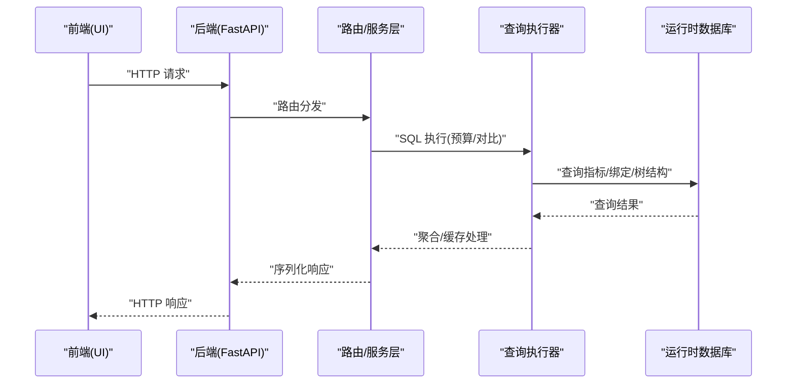
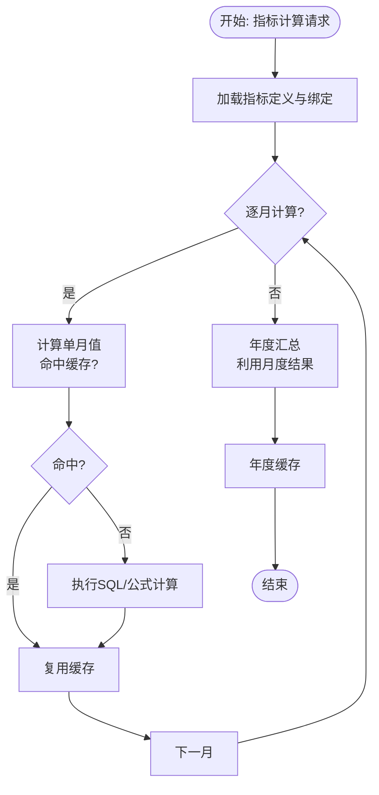
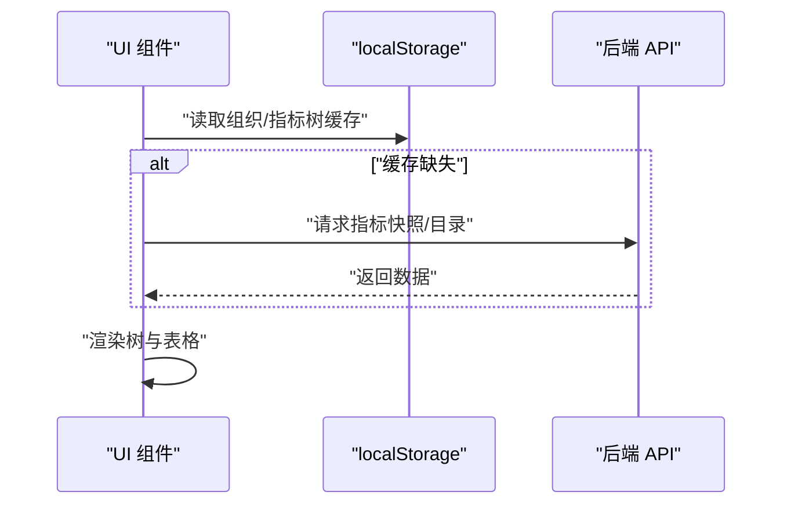
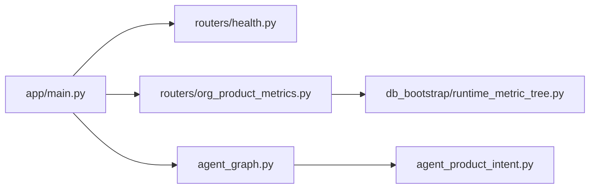

# 性能测试

<cite>
**本文引用的文件**   
- [apps/api/app/main.py](file://apps/api/app/main.py)
- [apps/api/app/routers/health.py](file://apps/api/app/routers/health.py)
- [apps/api/app/routers/org_product_metrics.py](file://apps/api/app/routers/org_product_metrics.py)
- [apps/api/app/services/runtime_metric_refs.py](file://apps/api/app/services/runtime_metric_refs.py)
- [apps/api/app/agent_graph.py](file://apps/api/app/agent_graph.py)
- [apps/api/app/agent_product_intent.py](file://apps/api/app/agent_product_intent.py)
- [apps/api/app/db_bootstrap/runtime_metric_tree.py](file://apps/api/app/db_bootstrap/runtime_metric_tree.py)
- [apps/api/run_server.py](file://apps/api/run_server.py)
- [apps/api/pyproject.toml](file://apps/api/pyproject.toml)
- [apps/web/package.json](file://apps/web/package.json)
- [apps/web/playwright.config.ts](file://apps/web/playwright.config.ts)
- [apps/api/scripts/full_user_journey.py](file://apps/api/scripts/full_user_journey.py)
- [apps/api/test_health_router.py](file://apps/api/test_health_router.py)
- [apps/api/test_full_user_journey_script.py](file://apps/api/test_full_user_journey_script.py)
- [apps/api/test_budget_simulation.py](file://apps/api/test_budget_simulation.py)
- [apps/web/src/app/components/OrgProductMetricContent.tsx](file://apps/web/src/app/components/OrgProductMetricContent.tsx)
- [apps/web/src/app/components/InputOutputTopicOverviewContent.tsx](file://apps/web/src/app/components/InputOutputTopicOverviewContent.tsx)
</cite>

## 目录
1. [引言](#引言)
2. [项目结构](#项目结构)
3. [核心组件](#核心组件)
4. [架构总览](#架构总览)
5. [详细组件分析](#详细组件分析)
6. [依赖关系分析](#依赖关系分析)
7. [性能考量](#性能考量)
8. [故障排查指南](#故障排查指南)
9. [结论](#结论)
10. [附录](#附录)

## 引言
本文件面向“智能预算预测系统”的性能测试工作，目标是建立一套可落地、可度量、可持续的性能测试体系，覆盖后端 API 响应时间与吞吐量、数据库查询性能与缓存效果、前端页面加载与用户体验、资源消耗（CPU/内存）、压力与负载测试方案、性能基线与回归策略，以及瓶颈识别与优化建议。本文结合仓库中的现有服务、路由、脚本与测试文件进行分析，并给出可操作的测试方法与工具使用建议。

## 项目结构
系统由三部分组成：
- 后端 API（FastAPI + Uvicorn）：提供预算、指标、模拟、执行等接口，包含健康检查、认证、查询执行器、代理图谱等能力。
- 前端 Web（React + Vite + Playwright）：负责用户界面、交互与端到端测试；支持本地开发与外部服务联调。
- 测试与脚本：包含健康检查测试、端到端脚本、预算模拟测试等，便于构建自动化性能测试流程。

```mermaid
graph TB
subgraph "前端"
WEB_PKG["apps/web/package.json<br/>脚本与测试"]
PW_CONFIG["apps/web/playwright.config.ts<br/>端到端配置"]
UI_COMP["apps/web/src/app/components/*<br/>页面组件"]
end
subgraph "后端"
MAIN["apps/api/app/main.py<br/>应用入口与路由装配"]
RUNTIME["apps/api/run_server.py<br/>启动脚本(Uvicorn)"]
HEALTH["apps/api/app/routers/health.py<br/>健康检查"]
ROUTER_METRICS["apps/api/app/routers/org_product_metrics.py<br/>指标相关路由"]
AGENT_GRAPH["apps/api/app/agent_graph.py<br/>代理查询执行"]
INTENT["apps/api/app/agent_product_intent.py<br/>意图解析与查询轴"]
DB_BOOT["apps/api/app/db_bootstrap/runtime_metric_tree.py<br/>运行时指标树校验"]
TEST_SCRIPTS["apps/api/scripts/full_user_journey.py<br/>端到端脚本"]
TEST_HEALTH["apps/api/test_health_router.py<br/>健康检查测试"]
end
UI_COMP --> |"HTTP 请求"| MAIN
PW_CONFIG --> |"启动/停止"| RUNTIME
MAIN --> |"include_router"| HEALTH
MAIN --> |"include_router"| ROUTER_METRICS
MAIN --> |"查询执行"| AGENT_GRAPH
INTENT --> |"查询轴解析"| AGENT_GRAPH
TEST_SCRIPTS --> |"调用"/api/health 等"| HEALTH
TEST_HEALTH --> |"断言状态码/内容"| HEALTH
```

图表来源
- [apps/api/app/main.py:109-412](file://apps/api/app/main.py#L109-L412)
- [apps/api/run_server.py:16-30](file://apps/api/run_server.py#L16-L30)
- [apps/api/app/routers/health.py:8-16](file://apps/api/app/routers/health.py#L8-L16)
- [apps/api/app/routers/org_product_metrics.py:3320-3342](file://apps/api/app/routers/org_product_metrics.py#L3320-L3342)
- [apps/api/app/agent_graph.py:1102-1132](file://apps/api/app/agent_graph.py#L1102-L1132)
- [apps/api/app/agent_product_intent.py:284-311](file://apps/api/app/agent_product_intent.py#L284-L311)
- [apps/api/app/db_bootstrap/runtime_metric_tree.py:81-128](file://apps/api/app/db_bootstrap/runtime_metric_tree.py#L81-L128)
- [apps/api/scripts/full_user_journey.py:205-235](file://apps/api/scripts/full_user_journey.py#L205-L235)
- [apps/api/test_health_router.py:9-20](file://apps/api/test_health_router.py#L9-L20)

章节来源
- [apps/api/app/main.py:109-412](file://apps/api/app/main.py#L109-L412)
- [apps/api/run_server.py:16-30](file://apps/api/run_server.py#L16-L30)
- [apps/web/package.json:6-14](file://apps/web/package.json#L6-L14)
- [apps/web/playwright.config.ts:10-46](file://apps/web/playwright.config.ts#L10-L46)

## 核心组件
- 应用入口与路由装配：在应用生命周期内完成数据库初始化、中间件与路由注册，包含健康检查、指标路由、预算模拟、执行等。
- 查询执行与代理：通过只读 SQL 执行器与代理图谱执行复杂查询，支持对比模式与预算模式。
- 运行时指标树与引用：提供运行时指标节点、引用计数、代码规范化等能力，支撑指标计算与缓存。
- 健康检查与端到端脚本：提供最小可用健康检查接口与端到端脚本，便于性能测试中快速验证系统可用性。

章节来源
- [apps/api/app/main.py:109-412](file://apps/api/app/main.py#L109-L412)
- [apps/api/app/agent_graph.py:1102-1132](file://apps/api/app/agent_graph.py#L1102-L1132)
- [apps/api/app/services/runtime_metric_refs.py:294-301](file://apps/api/app/services/runtime_metric_refs.py#L294-L301)
- [apps/api/app/routers/health.py:8-16](file://apps/api/app/routers/health.py#L8-L16)
- [apps/api/scripts/full_user_journey.py:205-235](file://apps/api/scripts/full_user_journey.py#L205-L235)

## 架构总览
下图展示性能测试关注的关键路径：前端发起请求，经由后端路由与查询执行器，访问运行时数据库与指标树，最终返回结果。健康检查作为最小可用性保障，贯穿测试流程。



图表来源
- [apps/api/app/main.py:109-412](file://apps/api/app/main.py#L109-L412)
- [apps/api/app/agent_graph.py:1102-1132](file://apps/api/app/agent_graph.py#L1102-L1132)
- [apps/api/app/routers/org_product_metrics.py:3320-3342](file://apps/api/app/routers/org_product_metrics.py#L3320-L3342)

## 详细组件分析

### API 响应时间与吞吐量测试
- 方法
  - 使用压测工具对关键路由进行并发请求，记录响应时间分布与吞吐量。
  - 关键路由示例：健康检查、指标目录、预算模拟、执行查询等。
  - 并发梯度：从低并发逐步提升至系统瓶颈点，观察 P95/P99 延迟与错误率。
- 工具建议
  - 后端：Locust、k6、JMeter 或 wrk2。
  - 前端：浏览器开发者工具或 Lighthouse（用于页面性能）。
- 可观测点
  - 响应时间（平均/中位数/P95/P99）
  - 吞吐量（requests/sec）
  - 错误率（5xx/4xx）
  - 资源占用（CPU/内存/连接数）

章节来源
- [apps/api/app/routers/health.py:8-16](file://apps/api/app/routers/health.py#L8-L16)
- [apps/api/app/routers/org_product_metrics.py:3320-3342](file://apps/api/app/routers/org_product_metrics.py#L3320-L3342)
- [apps/api/app/agent_graph.py:1102-1132](file://apps/api/app/agent_graph.py#L1102-L1132)

### 数据库查询性能与缓存效果验证
- 查询路径
  - 指标目录与表目录：通过运行时数据库加载指标树与表目录，支持过滤与状态筛选。
  - 指标计算：按年份与月份维度计算指标值，内置月度与年度缓存逻辑，避免重复计算。
  - 引用与绑定：统计指标引用计数，辅助定位热点数据与潜在冗余。
- 缓存策略
  - 月度结果缓存与年度结果缓存，递归计算时利用 visiting 集合防止环路与重复计算。
- 性能验证
  - 对同一查询多次执行，观察缓存命中率与延迟下降。
  - 在不同数据规模下对比缓存开启/关闭的差异。



图表来源
- [apps/api/app/routers/org_product_metrics.py:4890-4910](file://apps/api/app/routers/org_product_metrics.py#L4890-L4910)
- [apps/api/app/routers/org_product_metrics.py:4938-4956](file://apps/api/app/routers/org_product_metrics.py#L4938-L4956)
- [apps/api/app/services/runtime_metric_refs.py:294-301](file://apps/api/app/services/runtime_metric_refs.py#L294-L301)

章节来源
- [apps/api/app/routers/org_product_metrics.py:3320-3342](file://apps/api/app/routers/org_product_metrics.py#L3320-L3342)
- [apps/api/app/routers/org_product_metrics.py:4890-4910](file://apps/api/app/routers/org_product_metrics.py#L4890-L4910)
- [apps/api/app/routers/org_product_metrics.py:4938-4956](file://apps/api/app/routers/org_product_metrics.py#L4938-L4956)
- [apps/api/app/services/runtime_metric_refs.py:294-301](file://apps/api/app/services/runtime_metric_refs.py#L294-L301)

### 前端页面加载性能与用户体验指标
- 页面加载链路
  - 组件首次渲染：组织产品树与指标树加载，涉及本地存储读取与默认树回退。
  - 数据获取：通过 API 获取指标快照、产品范围、表格目录等。
- 用户体验指标
  - FCP/LCP/INP/CLS 等 Core Web Vitals（可通过 Lighthouse 或浏览器性能面板采集）。
  - 首屏渲染时间、交互就绪时间、滚动与展开操作的流畅度。
- 优化方向
  - 减少首屏请求数与体积，合理拆分组件与懒加载。
  - 利用本地存储减少重复请求，优化树结构的序列化与反序列化。



图表来源
- [apps/web/src/app/components/OrgProductMetricContent.tsx:1098-1121](file://apps/web/src/app/components/OrgProductMetricContent.tsx#L1098-L1121)
- [apps/web/src/app/components/InputOutputTopicOverviewContent.tsx:74-91](file://apps/web/src/app/components/InputOutputTopicOverviewContent.tsx#L74-L91)
- [apps/api/app/routers/org_product_metrics.py:3320-3342](file://apps/api/app/routers/org_product_metrics.py#L3320-L3342)

章节来源
- [apps/web/src/app/components/OrgProductMetricContent.tsx:1098-1121](file://apps/web/src/app/components/OrgProductMetricContent.tsx#L1098-L1121)
- [apps/web/src/app/components/InputOutputTopicOverviewContent.tsx:74-91](file://apps/web/src/app/components/InputOutputTopicOverviewContent.tsx#L74-L91)

### 内存使用与 CPU 占用监控
- 监控对象
  - 后端进程：Uvicorn 主进程与工作进程的 CPU/内存占用。
  - 前端进程：Vite 开发服务器与浏览器渲染进程。
- 监控方式
  - 使用系统工具（如 top/htop、Activity Monitor）或容器监控（Prometheus Node Exporter + Grafana）。
  - 在压测期间持续采集 CPU 利用率、RSS、GC 次数与暂停时间（如适用）。
- 关注点
  - 长时间运行下的内存泄漏迹象。
  - 大数据集查询时的峰值内存与 CPU 抖动。

章节来源
- [apps/api/run_server.py:16-30](file://apps/api/run_server.py#L16-L30)
- [apps/web/package.json:6-14](file://apps/web/package.json#L6-L14)

### 压力测试与负载测试实施方案
- 压力测试
  - 逐步提高并发与请求速率，直至系统出现错误率上升、延迟突增或资源耗尽，定位极限容量。
- 负载测试
  - 在稳定高负载下持续运行，观察稳定性、资源占用与恢复能力。
- 场景设计
  - 典型场景：健康检查高频访问、指标目录批量查询、预算模拟并发计算、执行查询对比模式。
- 结果记录
  - 记录每轮的延迟分布、吞吐量、错误率与资源指标，形成性能画像。

章节来源
- [apps/api/app/routers/health.py:8-16](file://apps/api/app/routers/health.py#L8-L16)
- [apps/api/app/routers/org_product_metrics.py:3320-3342](file://apps/api/app/routers/org_product_metrics.py#L3320-L3342)
- [apps/api/app/agent_graph.py:1102-1132](file://apps/api/app/agent_graph.py#L1102-L1132)

### 性能基线与回归测试策略
- 基线建立
  - 在标准环境与数据规模下，记录健康检查、指标目录、预算模拟等关键路径的基准指标（P50/P95/P99、吞吐量）。
- 回归策略
  - 将健康检查测试与端到端脚本纳入 CI，每次变更后自动执行，对比延迟与错误率是否超出阈值。
  - 对热点路由设置回归阈值，异常即阻断发布。

章节来源
- [apps/api/test_health_router.py:9-20](file://apps/api/test_health_router.py#L9-L20)
- [apps/api/scripts/full_user_journey.py:205-235](file://apps/api/scripts/full_user_journey.py#L205-L235)

### 性能瓶颈识别与优化建议
- 瓶颈识别
  - 若延迟集中在指标计算环节，优先检查缓存命中与 SQL 执行计划。
  - 若延迟集中在网络层，检查路由分发与序列化开销。
  - 若资源占用偏高，检查是否存在未释放的连接、大对象常驻内存或重复计算。
- 优化建议
  - 引入更细粒度的缓存与失效策略，减少重复计算。
  - 对热点查询添加索引或物化视图（基于运行时数据库结构）。
  - 分离计算密集型任务到后台队列，避免阻塞主线程。
  - 前端侧采用虚拟列表、分页与懒加载，降低 DOM 与渲染压力。

## 依赖关系分析
- 应用入口与路由装配：集中注册健康检查、指标、预算、执行等路由，统一中间件与生命周期。
- 查询执行：代理图谱通过只读执行器访问运行时数据库，支持预算与对比两种模式。
- 运行时指标树：提供节点校验、引用计数与代码规范化，支撑指标计算与缓存。



图表来源
- [apps/api/app/main.py:109-412](file://apps/api/app/main.py#L109-L412)
- [apps/api/app/routers/health.py:8-16](file://apps/api/app/routers/health.py#L8-L16)
- [apps/api/app/routers/org_product_metrics.py:3320-3342](file://apps/api/app/routers/org_product_metrics.py#L3320-L3342)
- [apps/api/app/agent_graph.py:1102-1132](file://apps/api/app/agent_graph.py#L1102-L1132)
- [apps/api/app/agent_product_intent.py:284-311](file://apps/api/app/agent_product_intent.py#L284-L311)
- [apps/api/app/db_bootstrap/runtime_metric_tree.py:81-128](file://apps/api/app/db_bootstrap/runtime_metric_tree.py#L81-L128)

章节来源
- [apps/api/app/main.py:109-412](file://apps/api/app/main.py#L109-L412)
- [apps/api/app/agent_graph.py:1102-1132](file://apps/api/app/agent_graph.py#L1102-L1132)
- [apps/api/app/agent_product_intent.py:284-311](file://apps/api/app/agent_product_intent.py#L284-L311)
- [apps/api/app/db_bootstrap/runtime_metric_tree.py:81-128](file://apps/api/app/db_bootstrap/runtime_metric_tree.py#L81-L128)

## 性能考量
- 后端
  - 使用异步上下文与只读执行器，避免阻塞。
  - 合理设置并发与工作进程数量，平衡吞吐与资源占用。
- 前端
  - 控制初始包体大小，拆分路由与组件，启用懒加载。
  - 优化树渲染与数据请求，减少不必要的重绘与回流。
- 数据库
  - 基于运行时数据库结构，确保常用查询具备合适索引。
  - 利用缓存与物化视图降低重复计算成本。

## 故障排查指南
- 健康检查失败
  - 确认后端服务已启动且监听端口可达。
  - 使用测试客户端验证 GET/HEAD 是否返回 200。
- 端到端脚本异常
  - 检查脚本是否正确启动前后端服务并等待健康检查通过。
  - 核对环境变量与数据目录路径。
- 预算模拟/指标计算缓慢
  - 查看缓存命中情况与递归深度，必要时调整缓存策略或拆分计算。

章节来源
- [apps/api/test_health_router.py:9-20](file://apps/api/test_health_router.py#L9-L20)
- [apps/api/scripts/full_user_journey.py:205-235](file://apps/api/scripts/full_user_journey.py#L205-L235)
- [apps/api/test_budget_simulation.py:1-41](file://apps/api/test_budget_simulation.py#L1-L41)

## 结论
通过将健康检查、端到端脚本、关键路由与指标计算路径纳入统一的性能测试框架，结合数据库缓存与前端渲染优化，可以系统性地发现并解决性能瓶颈。建议以基线为依据，持续回归，确保在功能演进过程中维持稳定的用户体验与系统性能。

## 附录
- 工具与脚本清单
  - 后端：Uvicorn 启动脚本、FastAPI 应用入口、健康检查路由。
  - 前端：Playwright 配置、Vite 开发脚本、页面组件。
  - 测试：健康检查测试、端到端脚本、预算模拟测试。

章节来源
- [apps/api/run_server.py:16-30](file://apps/api/run_server.py#L16-L30)
- [apps/api/app/main.py:109-412](file://apps/api/app/main.py#L109-L412)
- [apps/api/app/routers/health.py:8-16](file://apps/api/app/routers/health.py#L8-L16)
- [apps/web/playwright.config.ts:10-46](file://apps/web/playwright.config.ts#L10-L46)
- [apps/web/package.json:6-14](file://apps/web/package.json#L6-L14)
- [apps/api/scripts/full_user_journey.py:205-235](file://apps/api/scripts/full_user_journey.py#L205-L235)
- [apps/api/test_budget_simulation.py:1-41](file://apps/api/test_budget_simulation.py#L1-L41)