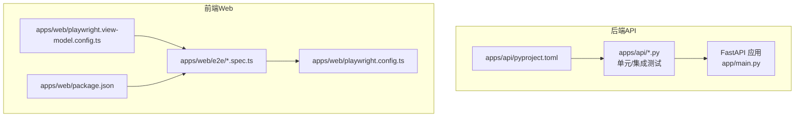
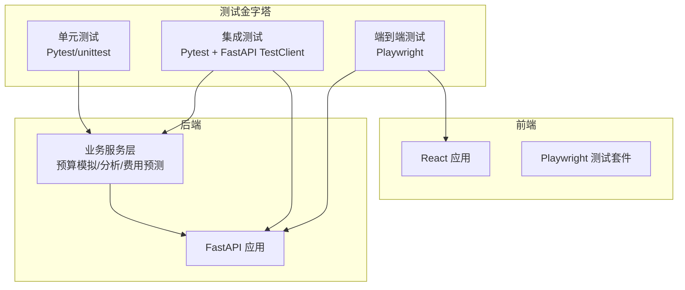
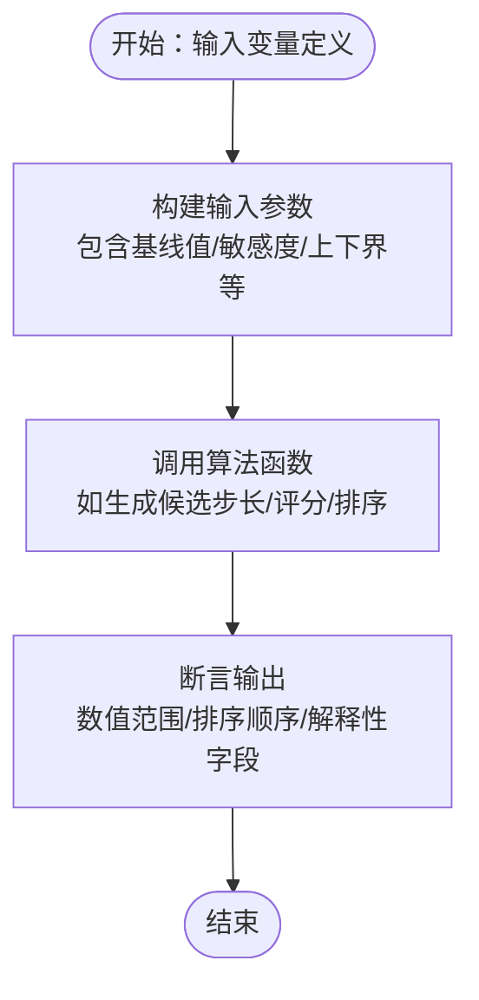
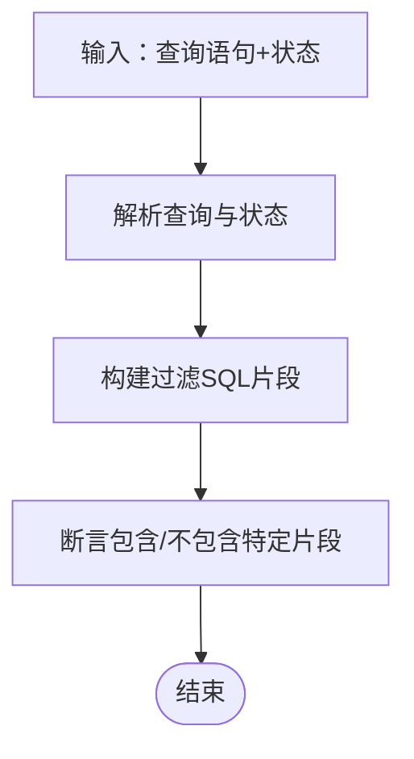
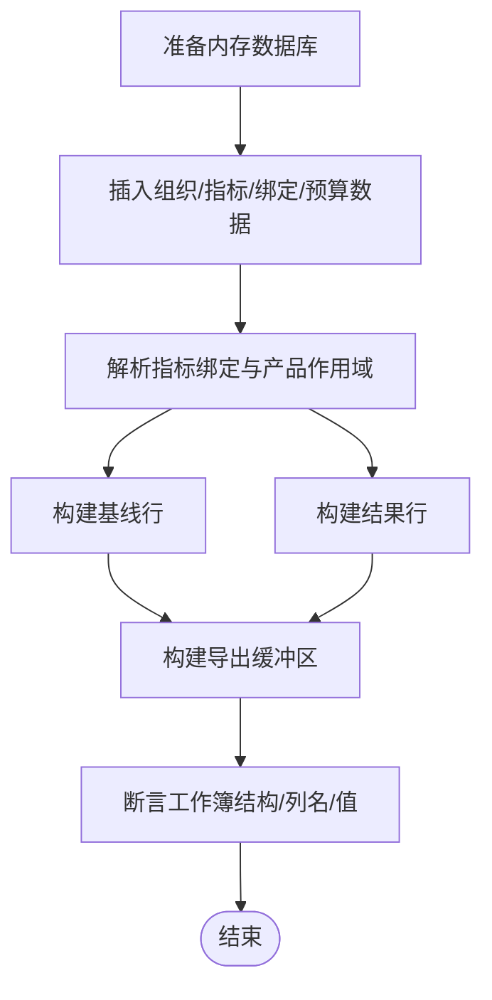
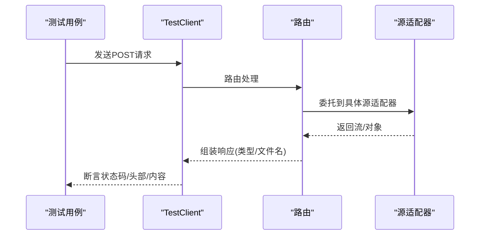
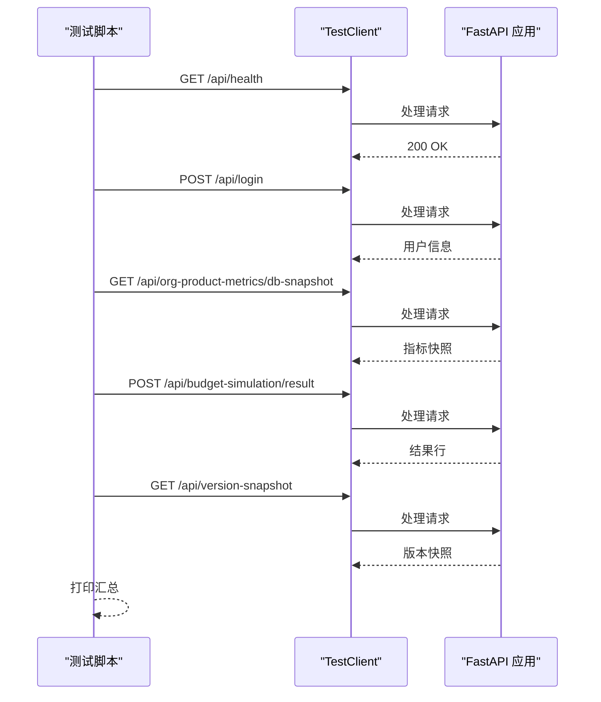
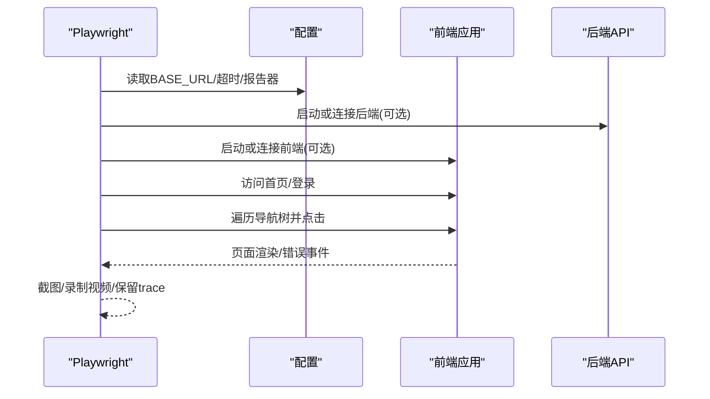
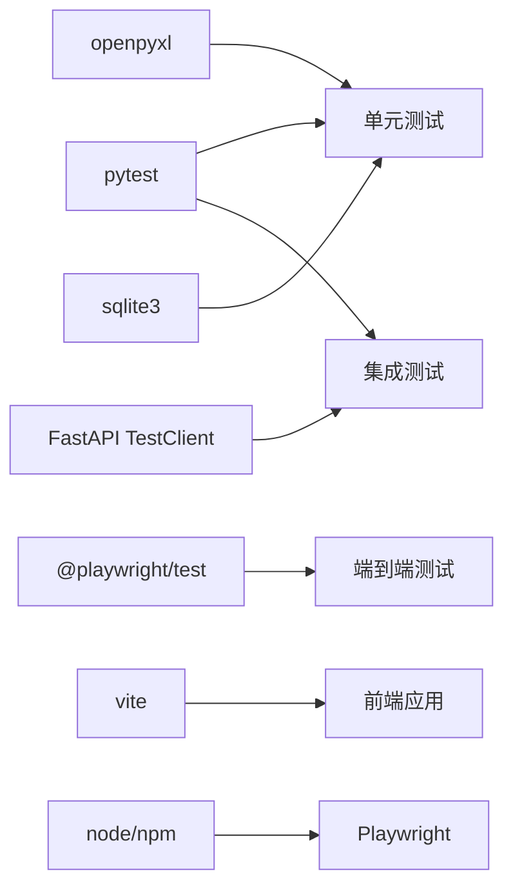

# 测试策略

<cite>
**本文引用的文件**
- [apps/api/pyproject.toml](file://apps/api/pyproject.toml)
- [apps/api/test_agent_analysis_filters.py](file://apps/api/test_agent_analysis_filters.py)
- [apps/api/test_intelligent_budget_simulation_core.py](file://apps/api/test_intelligent_budget_simulation_core.py)
- [apps/api/test_simulation_api.py](file://apps/api/test_simulation_api.py)
- [apps/api/test_agent_runtime_config.py](file://apps/api/test_agent_runtime_config.py)
- [apps/api/test_budget_simulation.py](file://apps/api/test_budget_simulation.py)
- [apps/api/test_expense_forecast_router.py](file://apps/api/test_expense_forecast_router.py)
- [apps/api/test_intelligent_budget_simulation_router.py](file://apps/api/test_intelligent_budget_simulation_router.py)
- [apps/web/package.json](file://apps/web/package.json)
- [apps/web/playwright.config.ts](file://apps/web/playwright.config.ts)
- [apps/web/playwright.view-model.config.ts](file://apps/web/playwright.view-model.config.ts)
- [apps/web/e2e/full-user-journey.spec.ts](file://apps/web/e2e/full-user-journey.spec.ts)
</cite>

## 目录
1. [引言](#引言)
2. [项目结构](#项目结构)
3. [核心组件](#核心组件)
4. [架构总览](#架构总览)
5. [详细组件分析](#详细组件分析)
6. [依赖关系分析](#依赖关系分析)
7. [性能考虑](#性能考虑)
8. [故障排除指南](#故障排除指南)
9. [结论](#结论)
10. [附录](#附录)

## 引言
本测试策略文档面向“智能预算预测系统”，覆盖单元测试、集成测试、端到端测试与性能测试的实施方法，明确测试框架选择（Pytest、Playwright）、测试用例设计原则、测试数据准备与管理、自动化CI/CD集成、测试覆盖率度量、性能测试与基准、测试环境搭建与管理、调试工具与故障排除以及测试报告生成与分析。

## 项目结构
系统由后端API服务与前端Web应用组成，测试分布在以下位置：
- 后端Python工程位于 apps/api，使用Pytest进行单元/集成测试，并通过FastAPI TestClient进行API端到端验证。
- 前端Web工程位于 apps/web，使用Playwright进行端到端测试与视图模型专项测试。

图表来源
- [apps/api/pyproject.toml:1-33](file://apps/api/pyproject.toml#L1-L33)
- [apps/web/package.json:1-34](file://apps/web/package.json#L1-L34)
- [apps/web/playwright.config.ts:1-46](file://apps/web/playwright.config.ts#L1-L46)
- [apps/web/playwright.view-model.config.ts:1-10](file://apps/web/playwright.view-model.config.ts#L1-L10)

章节来源
- [apps/api/pyproject.toml:1-33](file://apps/api/pyproject.toml#L1-L33)
- [apps/web/package.json:1-34](file://apps/web/package.json#L1-L34)

## 核心组件
- 单元测试（后端）
  - 使用unittest与pytest，覆盖预算模拟核心算法、路由行为、分析过滤器等。
  - 示例文件：[apps/api/test_intelligent_budget_simulation_core.py:1-146](file://apps/api/test_intelligent_budget_simulation_core.py#L1-L146)、[apps/api/test_agent_analysis_filters.py:1-94](file://apps/api/test_agent_analysis_filters.py#L1-L94)、[apps/api/test_agent_runtime_config.py:1-40](file://apps/api/test_agent_runtime_config.py#L1-L40)、[apps/api/test_budget_simulation.py:1-319](file://apps/api/test_budget_simulation.py#L1-L319)、[apps/api/test_expense_forecast_router.py:1-395](file://apps/api/test_expense_forecast_router.py#L1-L395)、[apps/api/test_intelligent_budget_simulation_router.py:1-92](file://apps/api/test_intelligent_budget_simulation_router.py#L1-L92)。
- 端到端测试（后端）
  - 使用FastAPI TestClient对健康检查、登录、产品列表、指标快照、版本快照、模拟测算等进行链路验证。
  - 示例文件：[apps/api/test_simulation_api.py:1-170](file://apps/api/test_simulation_api.py#L1-L170)。
- 端到端测试（前端）
  - 使用Playwright进行全用户旅程验证与视图模型专项测试，支持自动启动前后端服务或连接外部服务。
  - 示例文件：[apps/web/playwright.config.ts:1-46](file://apps/web/playwright.config.ts#L1-L46)、[apps/web/playwright.view-model.config.ts:1-10](file://apps/web/playwright.view-model.config.ts#L1-L10)、[apps/web/e2e/full-user-journey.spec.ts:1-84](file://apps/web/e2e/full-user-journey.spec.ts#L1-L84)。

章节来源
- [apps/api/test_intelligent_budget_simulation_core.py:1-146](file://apps/api/test_intelligent_budget_simulation_core.py#L1-L146)
- [apps/api/test_agent_analysis_filters.py:1-94](file://apps/api/test_agent_analysis_filters.py#L1-L94)
- [apps/api/test_agent_runtime_config.py:1-40](file://apps/api/test_agent_runtime_config.py#L1-L40)
- [apps/api/test_budget_simulation.py:1-319](file://apps/api/test_budget_simulation.py#L1-L319)
- [apps/api/test_expense_forecast_router.py:1-395](file://apps/api/test_expense_forecast_router.py#L1-L395)
- [apps/api/test_intelligent_budget_simulation_router.py:1-92](file://apps/api/test_intelligent_budget_simulation_router.py#L1-L92)
- [apps/api/test_simulation_api.py:1-170](file://apps/api/test_simulation_api.py#L1-L170)
- [apps/web/playwright.config.ts:1-46](file://apps/web/playwright.config.ts#L1-L46)
- [apps/web/playwright.view-model.config.ts:1-10](file://apps/web/playwright.view-model.config.ts#L1-L10)
- [apps/web/e2e/full-user-journey.spec.ts:1-84](file://apps/web/e2e/full-user-journey.spec.ts#L1-L84)

## 架构总览
下图展示了测试金字塔与各层级测试的交互关系，以及Playwright如何与后端FastAPI TestClient协同工作。

图表来源
- [apps/api/test_simulation_api.py:1-170](file://apps/api/test_simulation_api.py#L1-L170)
- [apps/web/playwright.config.ts:1-46](file://apps/web/playwright.config.ts#L1-L46)

## 详细组件分析

### 单元测试：预算模拟核心算法
- 覆盖内容
  - 风险子模型指标推导、敏感度步长生成、评分与排序等核心逻辑。
- 设计要点
  - 使用构造输入参数与断言输出，确保数学正确性与边界条件处理。
  - 对浮点比较使用容差断言，避免精度误差导致失败。
- 关键文件
  - [apps/api/test_intelligent_budget_simulation_core.py:1-146](file://apps/api/test_intelligent_budget_simulation_core.py#L1-L146)

图表来源
- [apps/api/test_intelligent_budget_simulation_core.py:56-98](file://apps/api/test_intelligent_budget_simulation_core.py#L56-L98)

章节来源
- [apps/api/test_intelligent_budget_simulation_core.py:1-146](file://apps/api/test_intelligent_budget_simulation_core.py#L1-L146)

### 单元测试：分析过滤器与时间窗口
- 覆盖内容
  - 查询关键字与维度过滤、时间窗口SQL拼接、缺失维度检测与规范化。
- 设计要点
  - 使用固定日期作为基准，验证不同周期描述下的SQL片段。
  - 断言包含/不包含特定字符串，确保过滤器拼接正确。
- 关键文件
  - [apps/api/test_agent_analysis_filters.py:1-94](file://apps/api/test_agent_analysis_filters.py#L1-L94)

图表来源
- [apps/api/test_agent_analysis_filters.py:18-77](file://apps/api/test_agent_analysis_filters.py#L18-L77)

章节来源
- [apps/api/test_agent_analysis_filters.py:1-94](file://apps/api/test_agent_analysis_filters.py#L1-L94)

### 单元测试：运行时配置与默认值
- 覆盖内容
  - 缺失运行时配置时回退默认值并写回磁盘的行为。
- 设计要点
  - 临时目录隔离，写入/读取JSON配置，断言默认值生效。
- 关键文件
  - [apps/api/test_agent_runtime_config.py:1-40](file://apps/api/test_agent_runtime_config.py#L1-L40)

章节来源
- [apps/api/test_agent_runtime_config.py:1-40](file://apps/api/test_agent_runtime_config.py#L1-L40)

### 单元测试：预算模拟指标解析与导出
- 覆盖内容
  - 指标绑定解析、基线/结果行构建、Excel导出缓冲区结构校验。
- 设计要点
  - 内存数据库初始化，构造真实表结构与数据，断言导出工作簿列名与内容。
- 关键文件
  - [apps/api/test_budget_simulation.py:1-319](file://apps/api/test_budget_simulation.py#L1-L319)

图表来源
- [apps/api/test_budget_simulation.py:144-226](file://apps/api/test_budget_simulation.py#L144-L226)

章节来源
- [apps/api/test_budget_simulation.py:1-319](file://apps/api/test_budget_simulation.py#L1-L319)

### 单元测试：费用预测路由行为契约
- 覆盖内容
  - 导出/分组导出/覆写/单元格更新/导入预览/规则导入等路由委托关系与响应契约。
- 设计要点
  - Mock源适配器，断言HTTP状态码、响应头、下载文件名；同时通过源码静态检查确保未在路由中直接实现复杂逻辑。
- 关键文件
  - [apps/api/test_expense_forecast_router.py:1-395](file://apps/api/test_expense_forecast_router.py#L1-L395)

图表来源
- [apps/api/test_expense_forecast_router.py:86-131](file://apps/api/test_expense_forecast_router.py#L86-L131)

章节来源
- [apps/api/test_expense_forecast_router.py:1-395](file://apps/api/test_expense_forecast_router.py#L1-L395)

### 单元测试：智能预算模拟路由
- 覆盖内容
  - 目标解析需用户确认、任务创建与读取、导出返回工作簿结构。
- 设计要点
  - 断言JSON响应字段、状态码、工作簿表单数量与首行标题。
- 关键文件
  - [apps/api/test_intelligent_budget_simulation_router.py:1-92](file://apps/api/test_intelligent_budget_simulation_router.py#L1-L92)

章节来源
- [apps/api/test_intelligent_budget_simulation_router.py:1-92](file://apps/api/test_intelligent_budget_simulation_router.py#L1-L92)

### 端到端测试：后端FastAPI TestClient
- 覆盖内容
  - 健康检查、登录、产品列表、指标快照、版本快照、模拟测算结果、公式示例验证。
- 设计要点
  - 通过TestClient直接调用路由，无需网络绑定；按步骤断言状态码与关键字段。
- 关键文件
  - [apps/api/test_simulation_api.py:1-170](file://apps/api/test_simulation_api.py#L1-L170)

图表来源
- [apps/api/test_simulation_api.py:43-165](file://apps/api/test_simulation_api.py#L43-L165)

章节来源
- [apps/api/test_simulation_api.py:1-170](file://apps/api/test_simulation_api.py#L1-L170)

### 端到端测试：前端Playwright
- 覆盖内容
  - 全用户旅程：打开所有可见导航页，断言无运行时错误；视图模型专项测试筛选特定规格文件。
- 设计要点
  - 可配置外部服务或自动启动本地服务；启用trace/screenshot/video便于失败定位。
- 关键文件
  - [apps/web/playwright.config.ts:1-46](file://apps/web/playwright.config.ts#L1-L46)、[apps/web/playwright.view-model.config.ts:1-10](file://apps/web/playwright.view-model.config.ts#L1-L10)、[apps/web/e2e/full-user-journey.spec.ts:1-84](file://apps/web/e2e/full-user-journey.spec.ts#L1-L84)

图表来源
- [apps/web/playwright.config.ts:10-45](file://apps/web/playwright.config.ts#L10-L45)
- [apps/web/e2e/full-user-journey.spec.ts:42-74](file://apps/web/e2e/full-user-journey.spec.ts#L42-L74)

章节来源
- [apps/web/playwright.config.ts:1-46](file://apps/web/playwright.config.ts#L1-L46)
- [apps/web/playwright.view-model.config.ts:1-10](file://apps/web/playwright.view-model.config.ts#L1-L10)
- [apps/web/e2e/full-user-journey.spec.ts:1-84](file://apps/web/e2e/full-user-journey.spec.ts#L1-L84)

## 依赖关系分析
- 后端测试依赖
  - Pytest与FastAPI TestClient用于单元与端到端测试；部分测试依赖SQLite内存数据库与OpenPyXL进行Excel导出验证。
- 前端测试依赖
  - Playwright测试框架；可通过配置自动启动后端与前端服务，或连接外部服务；支持HTML报告与trace/screenshot/video。
- 依赖可视化

图表来源
- [apps/api/pyproject.toml:27-29](file://apps/api/pyproject.toml#L27-L29)
- [apps/web/package.json:22-32](file://apps/web/package.json#L22-L32)

章节来源
- [apps/api/pyproject.toml:1-33](file://apps/api/pyproject.toml#L1-L33)
- [apps/web/package.json:1-34](file://apps/web/package.json#L1-L34)

## 性能考虑
- 单元测试
  - 使用内存数据库与最小化依赖，避免I/O瓶颈；对耗时计算采用合理断言策略，必要时拆分为多个小用例。
- 集成测试
  - 使用TestClient避免网络开销；对导出类测试仅断言响应头与工作簿结构，不加载完整数据集。
- 端到端测试
  - 合理设置超时与并发策略；开启trace/screenshot/video会增加资源消耗，建议仅在失败时保留。
- 性能基准
  - 建议为关键算法（如预算模拟评分/排序）建立基准测试用例，记录执行时间与内存占用，纳入CI回归。

## 故障排除指南
- 后端测试
  - 登录失败：检查环境变量HERMES_TEST_USER/HERMES_TEST_PASSWORD；确认用户状态与密码策略。
  - 导出失败：检查响应头content-type与content-disposition；验证工作簿表单名称与行列。
  - 数据库异常：确认内存数据库初始化脚本与表结构一致。
- 前端测试
  - 页面错误：关注页面错误事件与控制台错误；检查导航树元素是否可见与可点击。
  - 服务未就绪：调整webServer命令与url等待策略；确保端口未被占用。
- 通用
  - trace/screenshot/video可用于定位失败场景；必要时降低并发以减少资源竞争。

章节来源
- [apps/api/test_simulation_api.py:25-60](file://apps/api/test_simulation_api.py#L25-L60)
- [apps/web/e2e/full-user-journey.spec.ts:42-74](file://apps/web/e2e/full-user-journey.spec.ts#L42-L74)
- [apps/web/playwright.config.ts:28-44](file://apps/web/playwright.config.ts#L28-L44)

## 结论
本测试策略以Pytest与Playwright为核心，结合单元、集成与端到端测试，覆盖预算模拟、分析过滤、费用预测与UI导航等关键路径。通过明确的测试用例设计原则、测试数据管理与清理策略、CI/CD集成与报告生成，确保系统质量与稳定性。建议在CI中引入覆盖率统计与性能基准回归，持续提升测试效率与覆盖面。

## 附录

### 测试框架与配置
- 后端
  - 测试框架：pytest（dev依赖）
  - 运行方式：pytest或unittest.main()
  - 参考文件：[apps/api/pyproject.toml:27-29](file://apps/api/pyproject.toml#L27-L29)
- 前端
  - 测试框架：@playwright/test
  - 运行方式：npm脚本 test:e2e 与 test:view-model
  - 参考文件：[apps/web/package.json:6-14](file://apps/web/package.json#L6-L14)

章节来源
- [apps/api/pyproject.toml:27-29](file://apps/api/pyproject.toml#L27-L29)
- [apps/web/package.json:6-14](file://apps/web/package.json#L6-L14)

### 测试用例设计原则与编写指南
- 原则
  - 单一职责：每个用例聚焦一个功能点或边界条件。
  - 可重复：使用固定输入与断言，避免随机性。
  - 可维护：命名清晰、注释说明预期行为与前置条件。
  - 可观测：失败时提供明确的断言信息与trace。
- 编写指南
  - 使用Mock隔离外部依赖；对导出类测试仅断言响应契约。
  - 对算法类测试使用容差断言与边界值覆盖。
  - 对路由测试断言HTTP状态码、响应头与关键字段。

### 测试数据准备、管理与清理
- 单元测试
  - 内存数据库：使用sqlite3在临时目录创建数据库，初始化表结构与样本数据。
  - Excel导出：使用BytesIO构建工作簿，断言表单与单元格。
- 集成测试
  - 使用TestClient直连路由，避免真实数据库写入。
- 清理策略
  - 临时目录与内存数据库在测试结束后自动释放；导出缓冲区在断言后销毁。

章节来源
- [apps/api/test_budget_simulation.py:144-226](file://apps/api/test_budget_simulation.py#L144-L226)
- [apps/api/test_expense_forecast_router.py:46-53](file://apps/api/test_expense_forecast_router.py#L46-L53)

### 自动化测试与CI/CD集成
- 建议流水线阶段
  - 安装依赖：后端使用uv或pip安装；前端使用npm install。
  - 单元测试：pytest运行后端测试。
  - 端到端测试：Playwright运行e2e与视图模型测试；可配置自动启动服务。
  - 报告与Artifacts：上传HTML报告、trace/screenshot/video。
- 环境变量
  - HERMES_TEST_USER/HERMES_TEST_PASSWORD（后端）
  - E2E_BASE_URL/E2E_USE_EXTERNAL_SERVERS/E2E_START_SERVERS（前端）

章节来源
- [apps/api/test_simulation_api.py:25-26](file://apps/api/test_simulation_api.py#L25-L26)
- [apps/web/playwright.config.ts:3-8](file://apps/web/playwright.config.ts#L3-L8)

### 测试覆盖率要求与度量
- 覆盖率目标（建议）
  - 行覆盖率：≥80%
  - 分支覆盖率：≥70%
  - 指标覆盖率：≥90%
- 度量方式
  - 使用pytest插件生成覆盖率报告；在CI中设置阈值失败。
  - 对关键算法与路由模块提高覆盖率要求。

### 性能测试方法与基准
- 方法
  - 为预算模拟评分/排序等关键路径添加基准测试，记录执行时间。
  - 在CI中对比历史基准，发现回归。
- 基准
  - 建议记录TopN方案生成时间、导出工作簿构建时间等关键指标。

### 测试环境搭建与管理
- 后端
  - Python版本：>=3.11；安装dev依赖pytest。
- 前端
  - Node版本：满足package.json要求；安装Playwright浏览器依赖。
- 服务启动
  - Playwright配置支持自动启动后端与前端服务；也可连接外部服务。

章节来源
- [apps/api/pyproject.toml:5-6](file://apps/api/pyproject.toml#L5-L6)
- [apps/web/package.json:15-32](file://apps/web/package.json#L15-L32)
- [apps/web/playwright.config.ts:28-44](file://apps/web/playwright.config.ts#L28-L44)

### 测试报告生成与分析
- 后端
  - pytest默认输出；可扩展HTML报告或CI专用报告器。
- 前端
  - Playwright内置HTML报告；可配置不自动打开；保留trace/screenshot/video便于分析。
- 分析要点
  - 关注失败用例的trace/screenshot；统计失败率与重试次数；定期审查覆盖率与回归趋势。

章节来源
- [apps/web/playwright.config.ts:15](file://apps/web/playwright.config.ts#L15)
- [apps/web/package.json:12-13](file://apps/web/package.json#L12-L13)