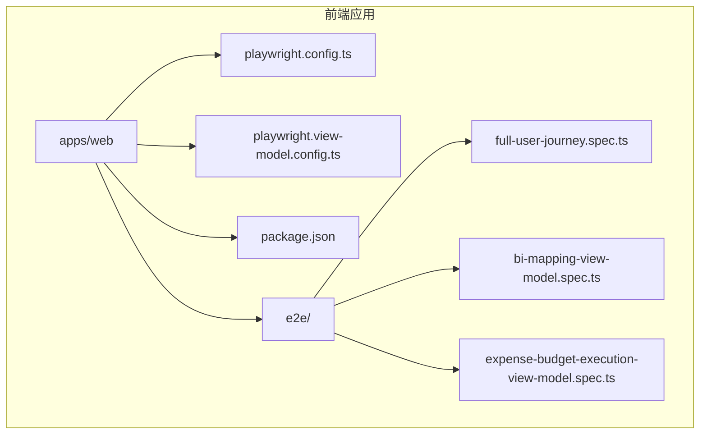
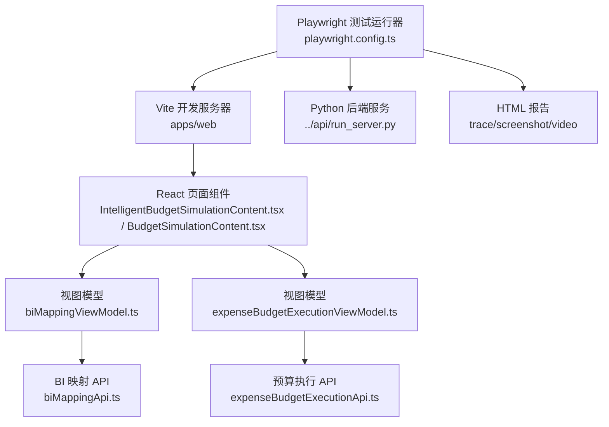
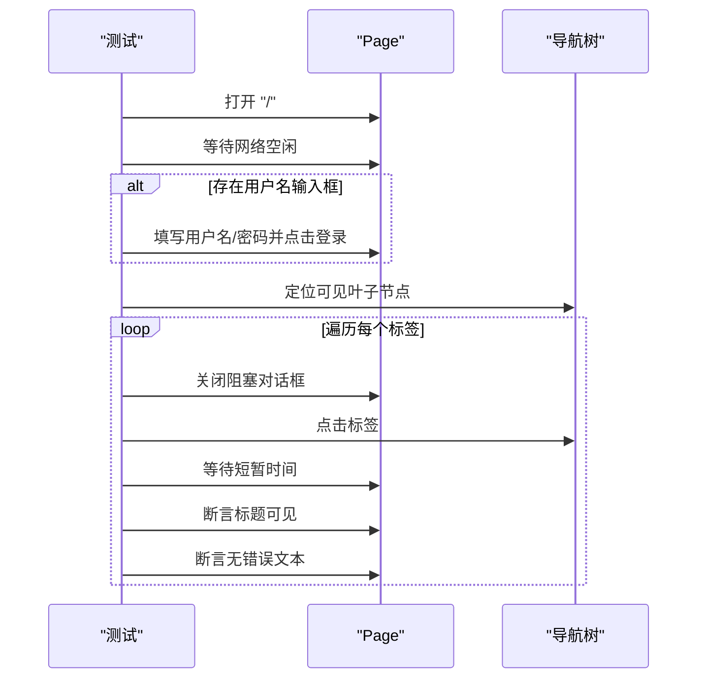
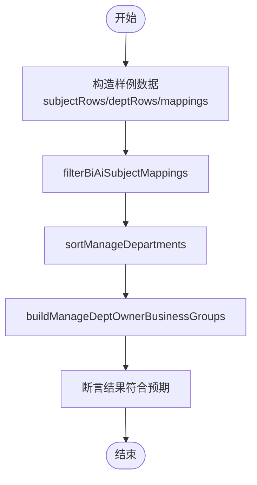
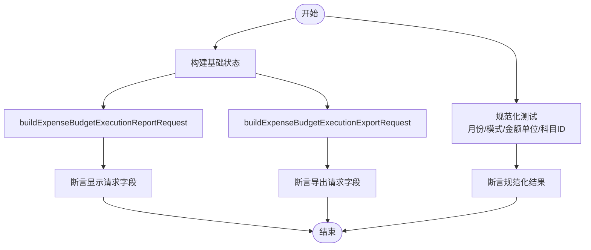
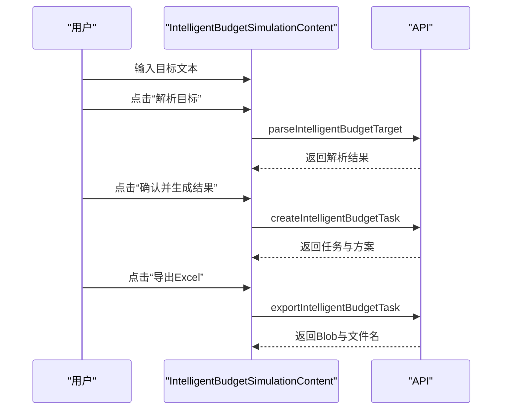
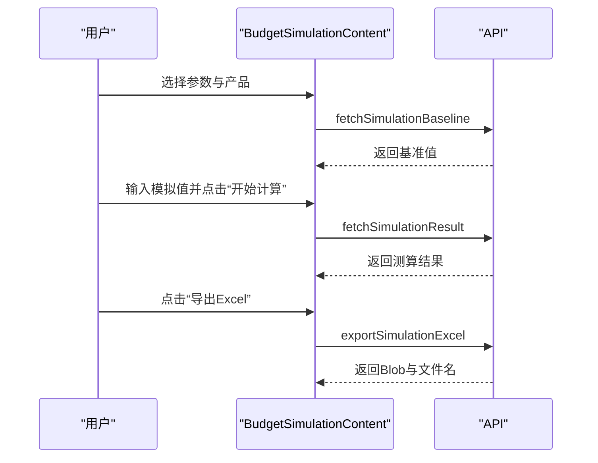
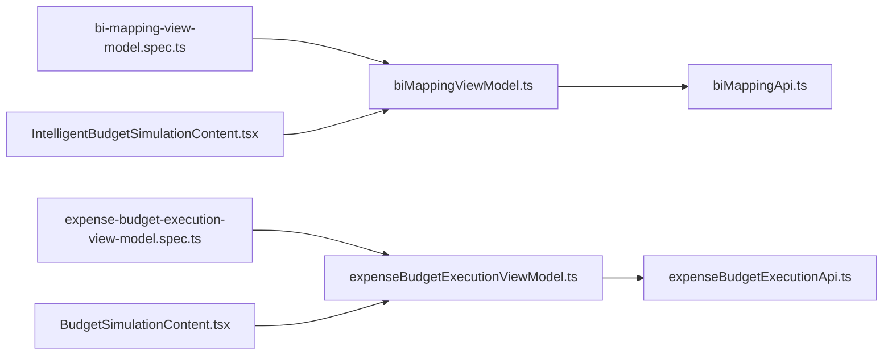

# 端到端测试

<cite>
**本文档引用的文件**
- [playwright.config.ts](file://apps/web/playwright.config.ts)
- [playwright.view-model.config.ts](file://apps/web/playwright.view-model.config.ts)
- [package.json](file://apps/web/package.json)
- [full-user-journey.spec.ts](file://apps/web/e2e/full-user-journey.spec.ts)
- [bi-mapping-view-model.spec.ts](file://apps/web/e2e/bi-mapping-view-model.spec.ts)
- [expense-budget-execution-view-model.spec.ts](file://apps/web/e2e/expense-budget-execution-view-model.spec.ts)
- [biMappingViewModel.ts](file://apps/web/src/lib/biMappingViewModel.ts)
- [expenseBudgetExecutionViewModel.ts](file://apps/web/src/lib/expenseBudgetExecutionViewModel.ts)
- [biMappingApi.ts](file://apps/web/src/lib/biMappingApi.ts)
- [expenseBudgetExecutionApi.ts](file://apps/web/src/lib/expenseBudgetExecutionApi.ts)
- [IntelligentBudgetSimulationContent.tsx](file://apps/web/src/app/components/IntelligentBudgetSimulationContent.tsx)
- [BudgetSimulationContent.tsx](file://apps/web/src/app/components/BudgetSimulationContent.tsx)
</cite>

## 目录
1. [简介](#简介)
2. [项目结构](#项目结构)
3. [核心组件](#核心组件)
4. [架构总览](#架构总览)
5. [详细组件分析](#详细组件分析)
6. [依赖关系分析](#依赖关系分析)
7. [性能考量](#性能考量)
8. [故障排查指南](#故障排查指南)
9. [结论](#结论)
10. [附录](#附录)

## 简介
本文件面向智能预算预测系统的端到端测试，基于 Playwright 测试框架，覆盖用户工作流中的关键业务流程，包括预算预测、智能模拟、预算执行等。文档详细说明了测试配置与运行方式、页面元素定位与交互策略、测试数据准备与清理、响应式与浏览器兼容性、测试报告与失败截图、跨浏览器与移动端测试实践，并提供关键流程的序列图与时序图帮助理解。

## 项目结构
前端 E2E 测试位于 apps/web/e2e 目录，Playwright 配置分别针对通用 E2E 与视图模型测试场景：
- 通用 E2E：playwright.config.ts
- 视图模型专用：playwright.view-model.config.ts
- 前端脚本与依赖：apps/web/package.json

图表来源
- [playwright.config.ts:1-46](file://apps/web/playwright.config.ts#L1-L46)
- [playwright.view-model.config.ts:1-10](file://apps/web/playwright.view-model.config.ts#L1-L10)
- [package.json:1-34](file://apps/web/package.json#L1-L34)
- [full-user-journey.spec.ts:1-84](file://apps/web/e2e/full-user-journey.spec.ts#L1-L84)
- [bi-mapping-view-model.spec.ts:1-89](file://apps/web/e2e/bi-mapping-view-model.spec.ts#L1-L89)
- [expense-budget-execution-view-model.spec.ts:1-225](file://apps/web/e2e/expense-budget-execution-view-model.spec.ts#L1-L225)

章节来源
- [playwright.config.ts:1-46](file://apps/web/playwright.config.ts#L1-L46)
- [playwright.view-model.config.ts:1-10](file://apps/web/playwright.view-model.config.ts#L1-L10)
- [package.json:1-34](file://apps/web/package.json#L1-L34)

## 核心组件
- Playwright 配置与启动
  - 通过 playwright.config.ts 统一配置测试目录、超时、并发、报告器、trace/screenshot/video 策略、以及 webServer 自动启动前后端服务。
  - 通过 playwright.view-model.config.ts 限定仅运行视图模型相关测试文件，便于快速验证纯函数逻辑。
- 页面与业务组件
  - 智能预算模拟界面：IntelligentBudgetSimulationContent.tsx
  - 预算模拟（正算）界面：BudgetSimulationContent.tsx
  - 视图模型与 API 层：biMappingViewModel.ts、expenseBudgetExecutionViewModel.ts、biMappingApi.ts、expenseBudgetExecutionApi.ts
- E2E 场景
  - 用户全旅程打开校验：full-user-journey.spec.ts
  - 视图模型单元化测试：bi-mapping-view-model.spec.ts、expense-budget-execution-view-model.spec.ts

章节来源
- [playwright.config.ts:10-46](file://apps/web/playwright.config.ts#L10-L46)
- [playwright.view-model.config.ts:3-9](file://apps/web/playwright.view-model.config.ts#L3-L9)
- [full-user-journey.spec.ts:42-84](file://apps/web/e2e/full-user-journey.spec.ts#L42-L84)
- [bi-mapping-view-model.spec.ts:62-88](file://apps/web/e2e/bi-mapping-view-model.spec.ts#L62-L88)
- [expense-budget-execution-view-model.spec.ts:34-225](file://apps/web/e2e/expense-budget-execution-view-model.spec.ts#L34-L225)

## 架构总览
下图展示了 E2E 测试从 Playwright 到前端页面再到 API 的调用链路，以及测试数据与清理策略的建议位置。

图表来源
- [playwright.config.ts:28-44](file://apps/web/playwright.config.ts#L28-L44)
- [IntelligentBudgetSimulationContent.tsx:326-532](file://apps/web/src/app/components/IntelligentBudgetSimulationContent.tsx#L326-L532)
- [BudgetSimulationContent.tsx:58-643](file://apps/web/src/app/components/BudgetSimulationContent.tsx#L58-L643)
- [biMappingViewModel.ts:28-46](file://apps/web/src/lib/biMappingViewModel.ts#L28-L46)
- [expenseBudgetExecutionViewModel.ts:221-255](file://apps/web/src/lib/expenseBudgetExecutionViewModel.ts#L221-L255)
- [biMappingApi.ts:58-111](file://apps/web/src/lib/biMappingApi.ts#L58-L111)
- [expenseBudgetExecutionApi.ts:191-204](file://apps/web/src/lib/expenseBudgetExecutionApi.ts#L191-L204)

## 详细组件分析

### Playwright 配置与运行
- 关键配置项
  - testDir：测试目录为 ./e2e
  - timeout/expect.timeout：整体与断言超时
  - fullyParallel：禁用并行以避免资源竞争
  - reporter：list 与 HTML 报告
  - trace/screenshot/video：失败时保留
  - webServer：条件启动后端与前端服务
- 运行命令
  - package.json 提供 e2e 与 test:view-model 两个脚本，分别对应通用与视图模型测试配置

章节来源
- [playwright.config.ts:10-46](file://apps/web/playwright.config.ts#L10-L46)
- [package.json:6-14](file://apps/web/package.json#L6-L14)

### 用户全旅程打开校验（full-user-journey.spec.ts）
- 目标：确保导航树中可见页面均可正常打开且无运行时错误
- 步骤要点
  - 登录流程：若存在用户名输入框则填写环境变量凭证并点击登录
  - 导航树校验：遍历可见叶子节点，点击并断言页面标题与正文不出现错误文本
  - 对话框处理：循环关闭“关闭”按钮与 ESC 键，避免遮挡
- 断言策略
  - 页面加载后检查 body 文本是否包含常见错误关键词
  - 收集 pageerror 事件，确保无运行时错误

图表来源
- [full-user-journey.spec.ts:42-84](file://apps/web/e2e/full-user-journey.spec.ts#L42-L84)

章节来源
- [full-user-journey.spec.ts:42-84](file://apps/web/e2e/full-user-journey.spec.ts#L42-L84)

### 视图模型测试（bi-mapping-view-model.spec.ts）
- 覆盖范围
  - BI-AI 科目映射过滤
  - 归口部门与业务组构建稳定性
  - 管理部门排序与显示规则
- 数据结构
  - BiAiSubjectMappingDto、ManageDeptOwnerMappingDto、DeptAccountDto
- 断言策略
  - 使用固定样例数据，断言过滤结果、分组顺序与选项稳定性

图表来源
- [bi-mapping-view-model.spec.ts:11-88](file://apps/web/e2e/bi-mapping-view-model.spec.ts#L11-L88)
- [biMappingViewModel.ts:28-129](file://apps/web/src/lib/biMappingViewModel.ts#L28-L129)
- [biMappingApi.ts:25-52](file://apps/web/src/lib/biMappingApi.ts#L25-L52)

章节来源
- [bi-mapping-view-model.spec.ts:62-88](file://apps/web/e2e/bi-mapping-view-model.spec.ts#L62-L88)
- [biMappingViewModel.ts:28-129](file://apps/web/src/lib/biMappingViewModel.ts#L28-L129)
- [biMappingApi.ts:25-52](file://apps/web/src/lib/biMappingApi.ts#L25-L52)

### 视图模型测试（expense-budget-execution-view-model.spec.ts）
- 覆盖范围
  - 报表请求与导出请求的构建差异
  - 金额单位与月份等规范化
  - 主题/科目/查询模式下的视图状态
- 数据结构
  - ExpenseBudgetExecutionReportRequest/ExportRequest 及相关 DTO
- 断言策略
  - 分别断言显示请求不含导出专属字段，导出请求包含金额单位与月份
  - 断言不同模式下的 activeKeyword 与 keywordMode

图表来源
- [expense-budget-execution-view-model.spec.ts:15-225](file://apps/web/e2e/expense-budget-execution-view-model.spec.ts#L15-L225)
- [expenseBudgetExecutionViewModel.ts:221-255](file://apps/web/src/lib/expenseBudgetExecutionViewModel.ts#L221-L255)
- [expenseBudgetExecutionApi.ts:141-177](file://apps/web/src/lib/expenseBudgetExecutionApi.ts#L141-L177)

章节来源
- [expense-budget-execution-view-model.spec.ts:34-225](file://apps/web/e2e/expense-budget-execution-view-model.spec.ts#L34-L225)
- [expenseBudgetExecutionViewModel.ts:221-255](file://apps/web/src/lib/expenseBudgetExecutionViewModel.ts#L221-L255)
- [expenseBudgetExecutionApi.ts:141-177](file://apps/web/src/lib/expenseBudgetExecutionApi.ts#L141-L177)

### 智能预算模拟（IntelligentBudgetSimulationContent.tsx）
- 关键交互
  - 解析目标：parseIntelligentBudgetTarget
  - 确认并生成：createIntelligentBudgetTask
  - 导出 Excel：exportIntelligentBudgetTask
- 页面元素定位
  - 目标输入框、解析/生成/导出按钮、状态徽章、方案卡片、详情弹窗等
- 测试建议
  - 使用环境变量提供目标文本与期望解析结果
  - 断言任务状态、方案数量与详情弹窗内容

图表来源
- [IntelligentBudgetSimulationContent.tsx:352-396](file://apps/web/src/app/components/IntelligentBudgetSimulationContent.tsx#L352-L396)
- [IntelligentBudgetSimulationContent.tsx:407-418](file://apps/web/src/app/components/IntelligentBudgetSimulationContent.tsx#L407-L418)

章节来源
- [IntelligentBudgetSimulationContent.tsx:326-532](file://apps/web/src/app/components/IntelligentBudgetSimulationContent.tsx#L326-L532)

### 预算模拟（正算）（BudgetSimulationContent.tsx）
- 关键交互
  - 参数选择：贷款产品维度
  - 基准加载：fetchSimulationBaseline
  - 计算：fetchSimulationResult
  - 导出：exportSimulationExcel
- 页面元素定位
  - 参数选择器、搜索框、情景参数表、测算结果表、导出按钮
- 测试建议
  - 选择多个产品维度，输入模拟值，断言结果表格更新
  - 断言导出文件存在且可下载

图表来源
- [BudgetSimulationContent.tsx:177-272](file://apps/web/src/app/components/BudgetSimulationContent.tsx#L177-L272)
- [BudgetSimulationContent.tsx:285-300](file://apps/web/src/app/components/BudgetSimulationContent.tsx#L285-L300)

章节来源
- [BudgetSimulationContent.tsx:58-643](file://apps/web/src/app/components/BudgetSimulationContent.tsx#L58-L643)

## 依赖关系分析
- 组件耦合
  - 页面组件依赖视图模型进行请求构建与规范化
  - 视图模型依赖 API 层进行数据访问
- 外部依赖
  - Playwright 作为测试运行器与浏览器自动化
  - Vite 作为开发服务器，Python 后端通过 webServer 启动
- 潜在环依赖
  - 测试文件与源码模块单向依赖，无循环

图表来源
- [bi-mapping-view-model.spec.ts:1-10](file://apps/web/e2e/bi-mapping-view-model.spec.ts#L1-L10)
- [expense-budget-execution-view-model.spec.ts:1-13](file://apps/web/e2e/expense-budget-execution-view-model.spec.ts#L1-L13)
- [biMappingViewModel.ts:1-12](file://apps/web/src/lib/biMappingViewModel.ts#L1-L12)
- [expenseBudgetExecutionViewModel.ts:1-9](file://apps/web/src/lib/expenseBudgetExecutionViewModel.ts#L1-L9)
- [biMappingApi.ts:1-1](file://apps/web/src/lib/biMappingApi.ts#L1-L1)
- [expenseBudgetExecutionApi.ts:1-1](file://apps/web/src/lib/expenseBudgetExecutionApi.ts#L1-L1)
- [IntelligentBudgetSimulationContent.tsx:14-21](file://apps/web/src/app/components/IntelligentBudgetSimulationContent.tsx#L14-L21)
- [BudgetSimulationContent.tsx:4-12](file://apps/web/src/app/components/BudgetSimulationContent.tsx#L4-L12)

章节来源
- [bi-mapping-view-model.spec.ts:1-10](file://apps/web/e2e/bi-mapping-view-model.spec.ts#L1-L10)
- [expense-budget-execution-view-model.spec.ts:1-13](file://apps/web/e2e/expense-budget-execution-view-model.spec.ts#L1-L13)
- [biMappingViewModel.ts:1-12](file://apps/web/src/lib/biMappingViewModel.ts#L1-L12)
- [expenseBudgetExecutionViewModel.ts:1-9](file://apps/web/src/lib/expenseBudgetExecutionViewModel.ts#L1-L9)
- [biMappingApi.ts:1-1](file://apps/web/src/lib/biMappingApi.ts#L1-L1)
- [expenseBudgetExecutionApi.ts:1-1](file://apps/web/src/lib/expenseBudgetExecutionApi.ts#L1-L1)
- [IntelligentBudgetSimulationContent.tsx:14-21](file://apps/web/src/app/components/IntelligentBudgetSimulationContent.tsx#L14-L21)
- [BudgetSimulationContent.tsx:4-12](file://apps/web/src/app/components/BudgetSimulationContent.tsx#L4-L12)

## 性能考量
- 并发与超时
  - fullyParallel 已禁用，避免并发导致的资源争用
  - timeout 与 expect.timeout 已设置，平衡稳定性与速度
- 服务启动
  - webServer 条件启动，减少本地开发时的重复启动
- 截图与视频
  - 失败时保留 trace/screenshot/video，便于定位问题但需注意磁盘占用

章节来源
- [playwright.config.ts:14-21](file://apps/web/playwright.config.ts#L14-L21)
- [playwright.config.ts:28-44](file://apps/web/playwright.config.ts#L28-L44)

## 故障排查指南
- 常见错误定位
  - 页面错误：使用 pageerror 事件收集并断言为空
  - 导航异常：确保关闭所有“关闭”按钮与 ESC
  - 登录失败：检查环境变量 E2E_USER/E2E_PASSWORD
- 截图与报告
  - HTML 报告与 trace/screenshot/video 在失败时保留，可在 CI 中收集 artifacts
- 日志与调试
  - 使用 page.on('console') 捕获前端日志
  - 在本地运行时开启浏览器开发者工具辅助定位

章节来源
- [full-user-journey.spec.ts:43-82](file://apps/web/e2e/full-user-journey.spec.ts#L43-L82)

## 结论
本测试体系通过 Playwright 将前端页面、视图模型与 API 层串联起来，既覆盖用户全旅程的可用性校验，又对关键视图模型逻辑进行单元化验证。结合 trace/screenshot/video 与 HTML 报告，能够高效定位问题并持续保障预算预测与模拟功能的稳定性。

## 附录

### 测试数据准备与清理
- 准备
  - 使用固定样例数据驱动视图模型测试，确保断言稳定
  - 在 E2E 中通过环境变量注入登录凭证与目标文本
- 清理
  - 导出文件由浏览器下载，测试结束后无需额外清理
  - 若涉及后端数据，建议在测试前/后调用相应 API 进行回滚或重建

章节来源
- [bi-mapping-view-model.spec.ts:11-61](file://apps/web/e2e/bi-mapping-view-model.spec.ts#L11-L61)
- [expense-budget-execution-view-model.spec.ts:15-32](file://apps/web/e2e/expense-budget-execution-view-model.spec.ts#L15-L32)
- [full-user-journey.spec.ts:49-54](file://apps/web/e2e/full-user-journey.spec.ts#L49-L54)

### 响应式设计与浏览器兼容性
- 响应式
  - 使用 viewport 控制桌面分辨率，确保布局与交互一致
- 浏览器
  - 通过 projects 字段扩展 Chromium/Firefox/Safari 等设备
  - 在 CI 中并行运行，提升覆盖率

章节来源
- [playwright.config.ts:22-27](file://apps/web/playwright.config.ts#L22-L27)

### 跨浏览器与移动端测试
- 跨浏览器
  - 在 projects 中添加 Desktop Firefox/Chrome/Safari
- 移动端
  - 添加 Mobile Chrome/iPhone/Android 设备配置
  - 注意触屏交互与断点适配

章节来源
- [playwright.config.ts:22-27](file://apps/web/playwright.config.ts#L22-L27)

### 测试报告与失败截图收集
- 报告器
  - list 与 html 报告同时启用
- 失败收集
  - trace/screenshot/video 在失败时保留
  - 在 CI 中将 artifacts 上传至制品库

章节来源
- [playwright.config.ts:15-21](file://apps/web/playwright.config.ts#L15-L21)