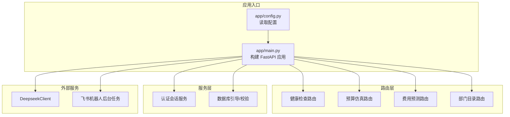
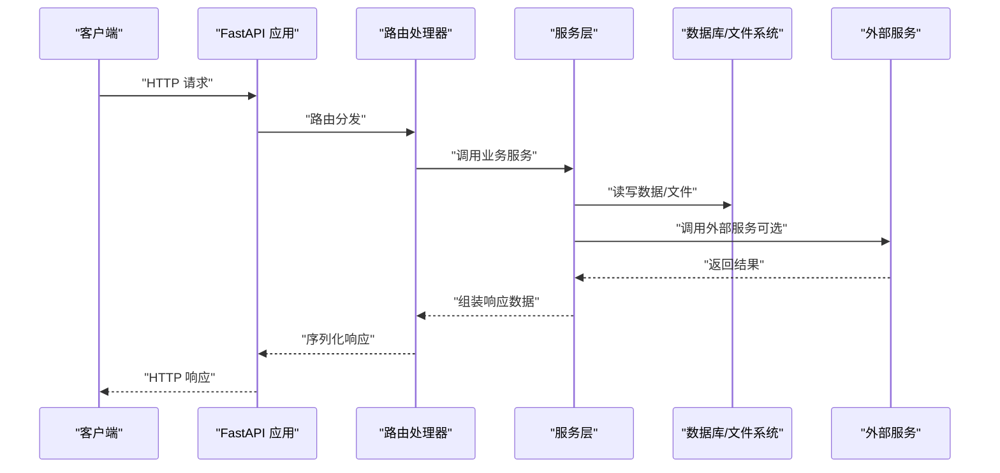
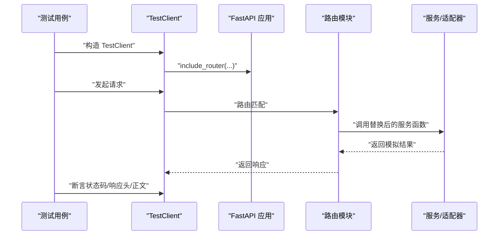
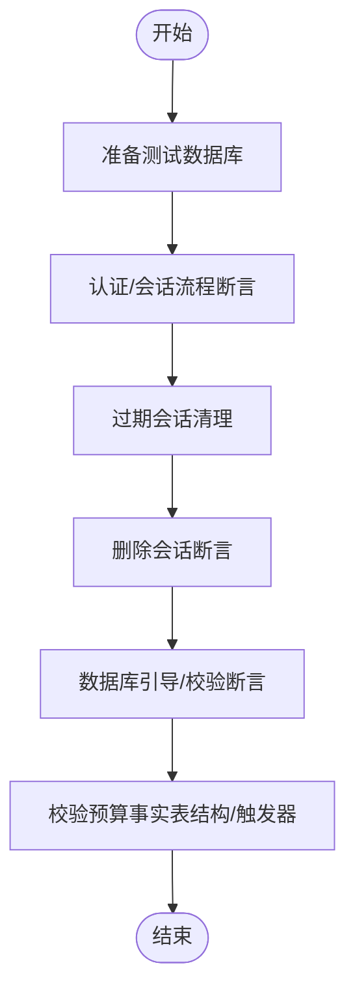
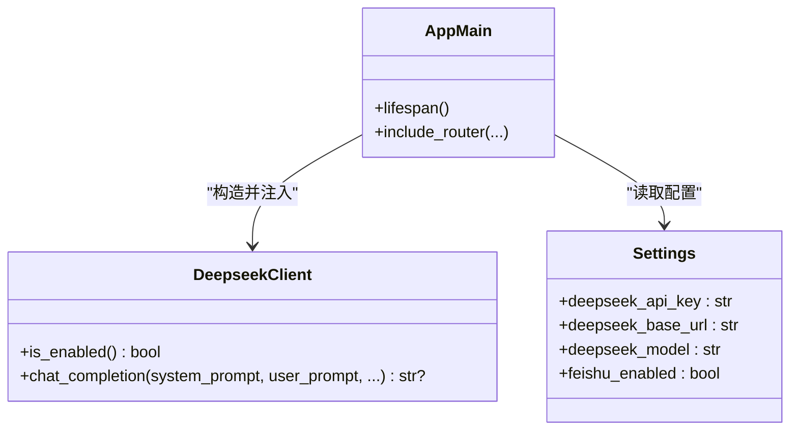
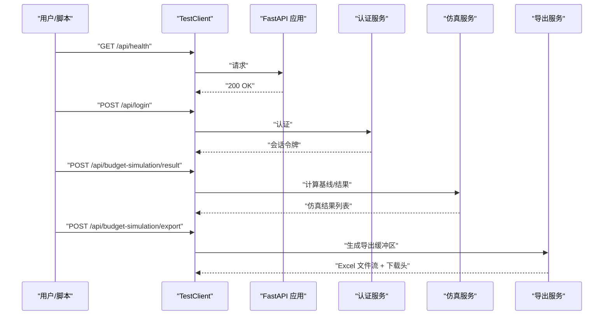
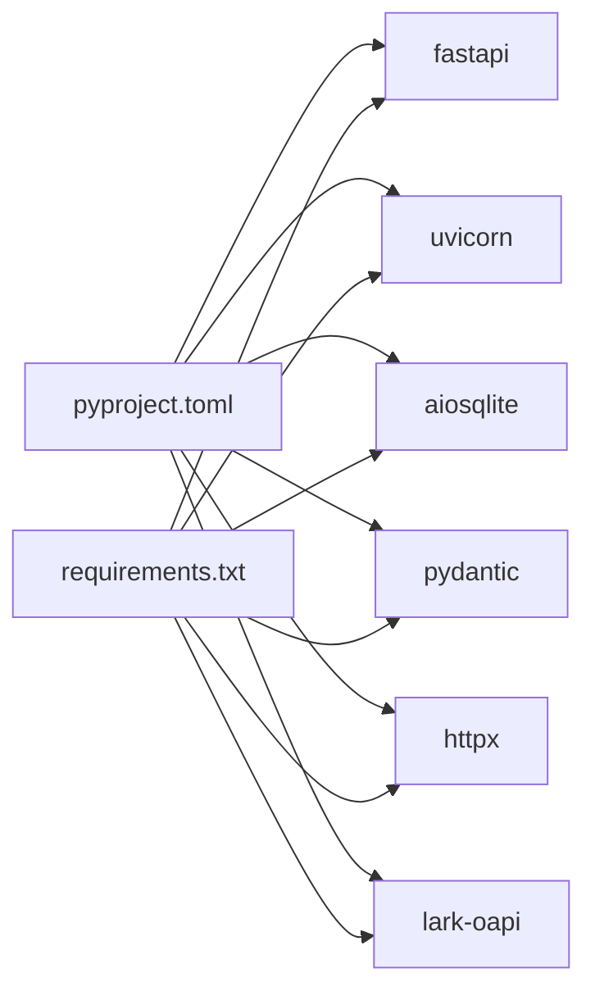

# 集成测试

<cite>
**本文引用的文件**
- [apps/api/test_simulation_api.py](file://apps/api/test_simulation_api.py)
- [apps/api/test_driver_api.py](file://apps/api/test_driver_api.py)
- [apps/api/test_full_user_journey_script.py](file://apps/api/test_full_user_journey_script.py)
- [apps/api/test_db_bootstrap_runner.py](file://apps/api/test_db_bootstrap_runner.py)
- [apps/api/test_auth_sessions_service.py](file://apps/api/test_auth_sessions_service.py)
- [apps/api/test_expense_forecast_router.py](file://apps/api/test_expense_forecast_router.py)
- [apps/api/test_budget_simulation_router.py](file://apps/api/test_budget_simulation_router.py)
- [apps/api/test_dept_catalog_router.py](file://apps/api/test_dept_catalog_router.py)
- [apps/api/test_health_router.py](file://apps/api/test_health_router.py)
- [apps/api/app/main.py](file://apps/api/app/main.py)
- [apps/api/app/config.py](file://apps/api/app/config.py)
- [apps/api/app/deepseek_client.py](file://apps/api/app/deepseek_client.py)
- [apps/api/pyproject.toml](file://apps/api/pyproject.toml)
- [apps/api/requirements.txt](file://apps/api/requirements.txt)
</cite>

## 目录
1. [引言](#引言)
2. [项目结构](#项目结构)
3. [核心组件](#核心组件)
4. [架构总览](#架构总览)
5. [详细组件分析](#详细组件分析)
6. [依赖分析](#依赖分析)
7. [性能考虑](#性能考虑)
8. [故障排查指南](#故障排查指南)
9. [结论](#结论)
10. [附录](#附录)

## 引言
本文件面向“智能预算预测系统”的集成测试，目标是提供一套可执行、可复现、可扩展的测试方法论与实践指南。内容覆盖：
- 路由层、服务层与数据访问层的端到端交互测试
- 数据库连接与事务处理的验证方法
- 外部服务集成测试（DeepSeek AI 与飞书机器人）
- API 端点的完整请求-响应测试流程
- 测试环境配置与测试数据同步策略
- 跨模块功能集成测试的组织方式

## 项目结构
后端采用 FastAPI 应用，核心入口在应用主文件中注册各路由模块，并在生命周期内初始化数据库、知识库、AI 与飞书等外部服务。测试以“最小化依赖替换 + TestClient”为核心策略，确保在沙箱环境下完成端到端验证。

图表来源
- [apps/api/app/main.py:109-145](file://apps/api/app/main.py#L109-L145)
- [apps/api/app/config.py:9-41](file://apps/api/app/config.py#L9-L41)

章节来源
- [apps/api/app/main.py:109-145](file://apps/api/app/main.py#L109-L145)
- [apps/api/app/config.py:9-41](file://apps/api/app/config.py#L9-L41)

## 核心组件
- 应用入口与生命周期：负责数据库初始化、外部服务启动、路由注册与中间件装配。
- 路由层：围绕预算仿真、费用预测、部门目录、健康检查等模块提供 HTTP 接口。
- 服务层：认证会话、数据库引导与校验、全局刷新状态、导出服务等。
- 外部服务：DeepSeek AI 对话与飞书机器人事件处理。

章节来源
- [apps/api/app/main.py:109-145](file://apps/api/app/main.py#L109-L145)
- [apps/api/app/config.py:9-41](file://apps/api/app/config.py#L9-L41)

## 架构总览
下图展示从客户端到路由、服务与数据层的典型调用链路，以及外部服务的参与点。

图表来源
- [apps/api/app/main.py:109-145](file://apps/api/app/main.py#L109-L145)

## 详细组件分析

### 路由层集成测试策略
- 健康检查：验证 GET/HEAD 方法均返回 200 且负载为状态对象。
- 预算仿真：通过替换服务函数，断言参数传递与导出下载响应头一致性。
- 费用预测：断言导出工作簿生成、响应头与下载契约一致。
- 部门目录：断言导入应用与树导出的响应头与下载契约一致。

图表来源
- [apps/api/test_health_router.py:9-21](file://apps/api/test_health_router.py#L9-L21)
- [apps/api/test_budget_simulation_router.py:88-120](file://apps/api/test_budget_simulation_router.py#L88-L120)
- [apps/api/test_expense_forecast_router.py:86-139](file://apps/api/test_expense_forecast_router.py#L86-L139)
- [apps/api/test_dept_catalog_router.py:29-104](file://apps/api/test_dept_catalog_router.py#L29-L104)

章节来源
- [apps/api/test_health_router.py:9-21](file://apps/api/test_health_router.py#L9-L21)
- [apps/api/test_budget_simulation_router.py:14-120](file://apps/api/test_budget_simulation_router.py#L14-L120)
- [apps/api/test_expense_forecast_router.py:30-200](file://apps/api/test_expense_forecast_router.py#L30-L200)
- [apps/api/test_dept_catalog_router.py:16-104](file://apps/api/test_dept_catalog_router.py#L16-L104)

### 服务层与数据访问层测试策略
- 认证会话服务：通过内存临时数据库，验证登录、首次登录改密、会话上下文加载、过期与删除等流程。
- 数据库引导与校验：针对预算事实表结构、更新时间触发器、列迁移策略进行断言，确保非预算数据文件与已退休字段被正确拒绝或忽略。

图表来源
- [apps/api/test_auth_sessions_service.py:54-154](file://apps/api/test_auth_sessions_service.py#L54-L154)
- [apps/api/test_db_bootstrap_runner.py:39-263](file://apps/api/test_db_bootstrap_runner.py#L39-L263)

章节来源
- [apps/api/test_auth_sessions_service.py:53-155](file://apps/api/test_auth_sessions_service.py#L53-L155)
- [apps/api/test_db_bootstrap_runner.py:39-267](file://apps/api/test_db_bootstrap_runner.py#L39-L267)

### 外部服务集成测试策略
- DeepSeek AI：通过客户端封装，断言启用条件、请求参数、重试与错误处理、响应解析等。
- 飞书机器人：在应用生命周期中启动后台任务，结合配置开关控制是否连接开放平台。

图表来源
- [apps/api/app/deepseek_client.py:9-70](file://apps/api/app/deepseek_client.py#L9-L70)
- [apps/api/app/config.py:27-37](file://apps/api/app/config.py#L27-L37)
- [apps/api/app/main.py:102-106](file://apps/api/app/main.py#L102-L106)

章节来源
- [apps/api/app/deepseek_client.py:9-70](file://apps/api/app/deepseek_client.py#L9-L70)
- [apps/api/app/config.py:27-37](file://apps/api/app/config.py#L27-L37)
- [apps/api/app/main.py:102-106](file://apps/api/app/main.py#L102-L106)

### API 端点完整请求-响应测试流程
以下流程以“预算仿真”为例，其他端点可类比：

图表来源
- [apps/api/test_simulation_api.py:43-165](file://apps/api/test_simulation_api.py#L43-L165)
- [apps/api/test_budget_simulation_router.py:88-120](file://apps/api/test_budget_simulation_router.py#L88-L120)

章节来源
- [apps/api/test_simulation_api.py:29-165](file://apps/api/test_simulation_api.py#L29-L165)
- [apps/api/test_budget_simulation_router.py:88-120](file://apps/api/test_budget_simulation_router.py#L88-L120)

### 测试环境配置与测试数据同步
- 环境变量：通过配置类读取，包括数据目录、知识库目录、跨域设置、DeepSeek 与飞书配置。
- 依赖管理：使用 pyproject.toml 与 requirements.txt 统一依赖版本。
- 启动与引导：应用生命周期中确保数据库存在、外部服务启动。
- 测试数据：通过临时数据库与模拟响应，避免对真实数据造成影响。

章节来源
- [apps/api/app/config.py:9-41](file://apps/api/app/config.py#L9-L41)
- [apps/api/pyproject.toml:1-33](file://apps/api/pyproject.toml#L1-L33)
- [apps/api/requirements.txt:1-18](file://apps/api/requirements.txt#L1-L18)
- [apps/api/app/main.py:102-106](file://apps/api/app/main.py#L102-L106)

### 跨模块功能集成测试
- 产品维度与指标树：通过“用户旅程”脚本模拟前端选择产品与指标身份识别路径，断言 API 调用与返回值。
- 路由替换策略：在单元测试中替换路由内部的异步服务函数，确保路由契约与响应头符合通用下载契约。
- 端到端脚本：使用 TestClient 在沙箱中执行完整用户旅程，验证健康检查、登录、指标快照、版本快照与仿真结果。

章节来源
- [apps/api/test_full_user_journey_script.py:64-71](file://apps/api/test_full_user_journey_script.py#L64-L71)
- [apps/api/test_expense_forecast_router.py:132-144](file://apps/api/test_expense_forecast_router.py#L132-L144)
- [apps/api/test_budget_simulation_router.py:113-120](file://apps/api/test_budget_simulation_router.py#L113-L120)
- [apps/api/test_simulation_api.py:43-165](file://apps/api/test_simulation_api.py#L43-L165)

## 依赖分析
- 运行时依赖：FastAPI、Uvicorn、aiosqlite、Pydantic、httpx、lark-oapi 等。
- 开发依赖：pytest。
- 外部集成：DeepSeek API、飞书开放平台。

图表来源
- [apps/api/pyproject.toml:6-24](file://apps/api/pyproject.toml#L6-L24)
- [apps/api/requirements.txt:1-18](file://apps/api/requirements.txt#L1-L18)

章节来源
- [apps/api/pyproject.toml:1-33](file://apps/api/pyproject.toml#L1-L33)
- [apps/api/requirements.txt:1-18](file://apps/api/requirements.txt#L1-L18)

## 性能考虑
- 使用 TestClient 替代真实网络绑定，避免沙箱限制与网络抖动。
- 将重逻辑下沉至服务层，路由层保持薄路由职责，便于替换与隔离。
- 对外部服务调用增加超时与重试策略，降低偶发失败对测试的影响。
- 导出类接口统一响应头与下载契约，减少路由层重复实现。

## 故障排查指南
- 健康检查失败：确认应用生命周期钩子已正确初始化数据库与外部服务。
- 登录失败：检查认证服务的凭据校验与会话上下文加载逻辑。
- 导出下载异常：核对路由是否使用统一的导出响应契约，检查响应头与文件名编码。
- 外部服务不可用：确认配置项是否启用，API Key 是否有效，网络连通性与超时设置是否合理。
- 数据库校验失败：检查预算事实表结构、触发器是否存在，已退休字段是否被移除。

章节来源
- [apps/api/test_health_router.py:9-21](file://apps/api/test_health_router.py#L9-L21)
- [apps/api/test_auth_sessions_service.py:107-116](file://apps/api/test_auth_sessions_service.py#L107-L116)
- [apps/api/test_expense_forecast_router.py:132-139](file://apps/api/test_expense_forecast_router.py#L132-L139)
- [apps/api/test_db_bootstrap_runner.py:139-141](file://apps/api/test_db_bootstrap_runner.py#L139-L141)
- [apps/api/app/config.py:27-37](file://apps/api/app/config.py#L27-L37)

## 结论
通过“路由替换 + TestClient + 服务与数据库校验”的组合，可以在不启动真实网络监听的前提下完成端到端集成测试。配合统一的导出契约与外部服务封装，能够稳定地验证多模块协同行为与数据一致性。建议持续完善测试矩阵，覆盖关键路径与边界条件，并将外部服务的可用性纳入冒烟检查。

## 附录
- 快速运行示例（概念性说明）
  - 运行后端冒烟检查脚本，验证核心路由与源码编译。
  - 执行端到端脚本，完成健康检查、登录、指标快照、版本快照与仿真结果的链路验证。
  - 分别运行路由层与服务层的单元测试，覆盖导出契约、认证流程与数据库校验。

章节来源
- [apps/api/test_driver_api.py:19-41](file://apps/api/test_driver_api.py#L19-L41)
- [apps/api/test_simulation_api.py:43-165](file://apps/api/test_simulation_api.py#L43-L165)