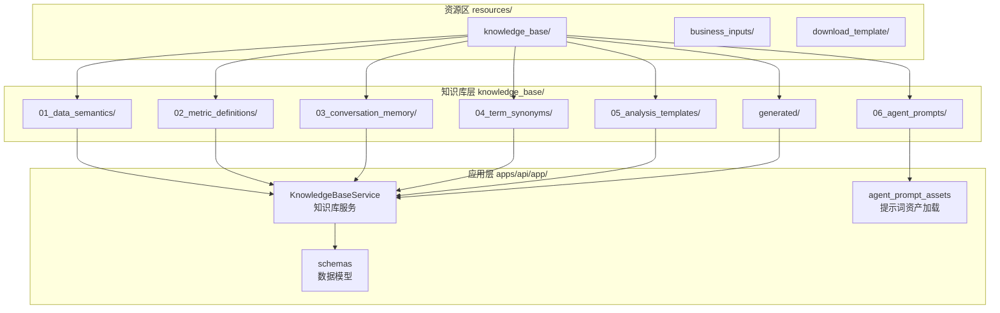
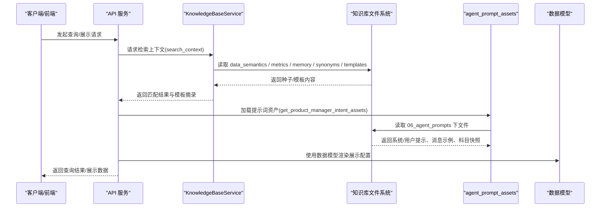
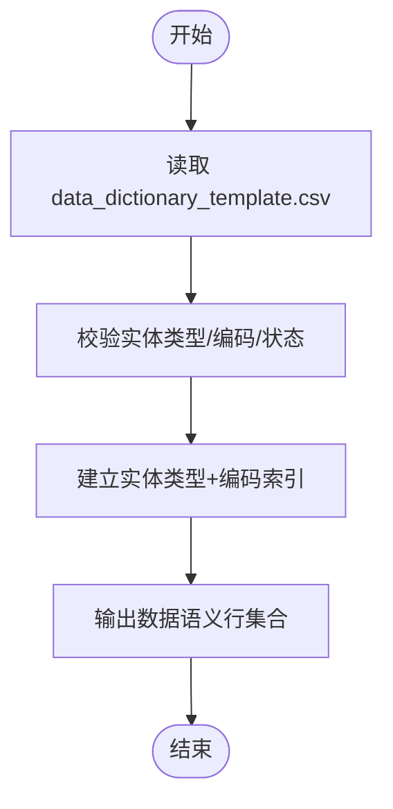
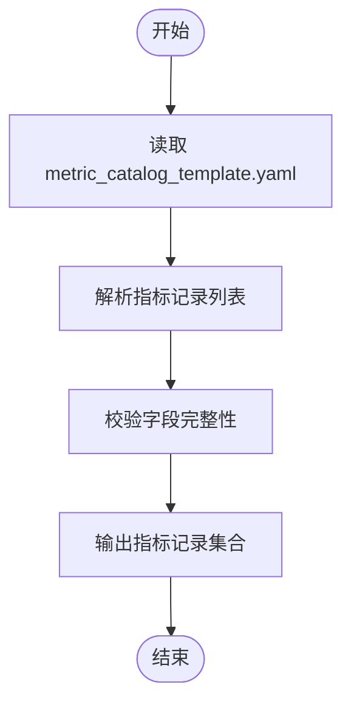
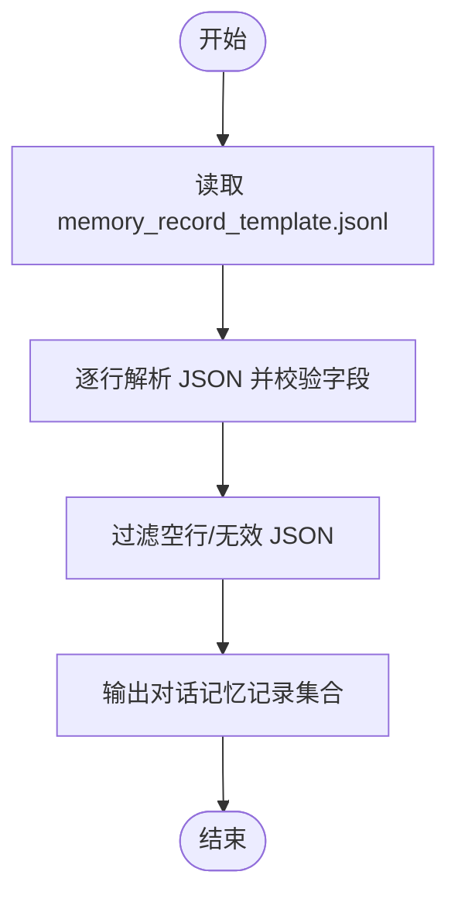
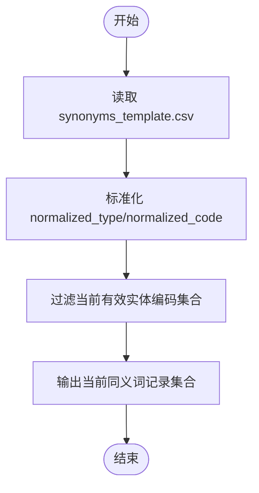
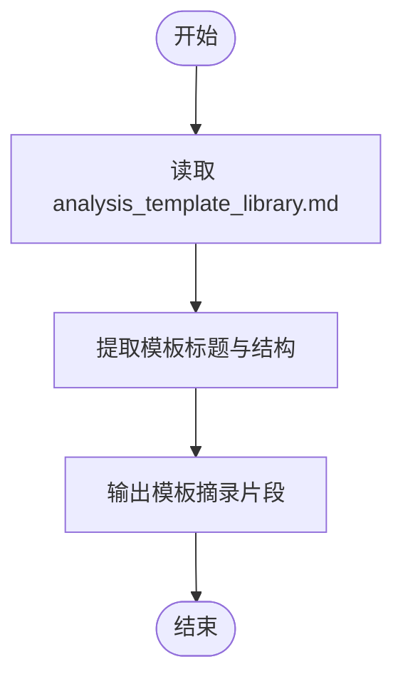
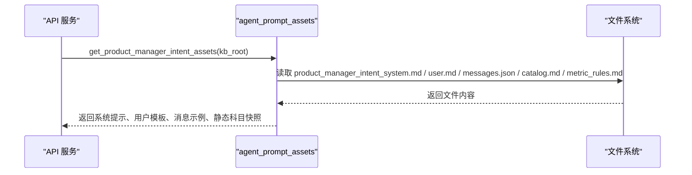
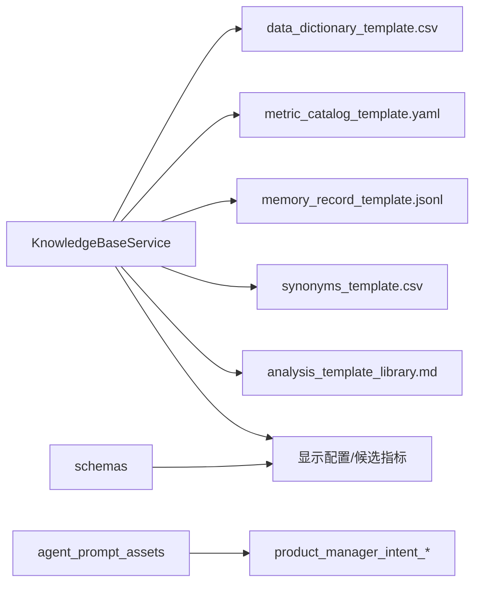

# 知识库与资源

<cite>
**本文引用的文件**   
- [resources/knowledge_base/README.md](file://resources/knowledge_base/README.md)
- [resources/README.md](file://resources/README.md)
- [apps/api/app/knowledge_base.py](file://apps/api/app/knowledge_base.py)
- [apps/api/app/agent_prompt_assets.py](file://apps/api/app/agent_prompt_assets.py)
- [apps/api/app/schemas.py](file://apps/api/app/schemas.py)
- [resources/knowledge_base/01_data_semantics/README.md](file://resources/knowledge_base/01_data_semantics/README.md)
- [resources/knowledge_base/02_metric_definitions/README.md](file://resources/knowledge_base/02_metric_definitions/README.md)
- [resources/knowledge_base/03_conversation_memory/README.md](file://resources/knowledge_base/03_conversation_memory/README.md)
- [resources/knowledge_base/04_term_synonyms/README.md](file://resources/knowledge_base/04_term_synonyms/README.md)
- [resources/knowledge_base/05_analysis_templates/README.md](file://resources/knowledge_base/05_analysis_templates/README.md)
- [resources/knowledge_base/06_agent_prompts/README.md](file://resources/knowledge_base/06_agent_prompts/README.md)
- [resources/knowledge_base/01_data_semantics/data_dictionary_template.csv](file://resources/knowledge_base/01_data_semantics/data_dictionary_template.csv)
- [resources/knowledge_base/02_metric_definitions/metric_catalog_template.yaml](file://resources/knowledge_base/02_metric_definitions/metric_catalog_template.yaml)
- [resources/knowledge_base/03_conversation_memory/memory_record_template.jsonl](file://resources/knowledge_base/03_conversation_memory/memory_record_template.jsonl)
- [resources/knowledge_base/04_term_synonyms/synonyms_template.csv](file://resources/knowledge_base/04_term_synonyms/synonyms_template.csv)
- [resources/knowledge_base/05_analysis_templates/analysis_template_library.md](file://resources/knowledge_base/05_analysis_templates/analysis_template_library.md)
</cite>

## 目录
1. [简介](#简介)
2. [项目结构](#项目结构)
3. [核心组件](#核心组件)
4. [架构总览](#架构总览)
5. [详细组件分析](#详细组件分析)
6. [依赖关系分析](#依赖关系分析)
7. [性能考量](#性能考量)
8. [故障排查指南](#故障排查指南)
9. [结论](#结论)
10. [附录](#附录)

## 简介
本文件面向智能预算预测系统的知识库与资源，系统性说明受控业务资源的组织结构、内容分类与使用方法，覆盖 Agent 知识库、提示词模板、语义映射、数据字典、历史问答经验、分析模板与生成配置等。文档同时提供资源管理、维护与更新流程、版本控制与变更管理、访问权限与使用限制、扩展与定制方法、资源贡献流程与标准，以及术语表与业务概念解释。

## 项目结构
- resources/ 为当前可复用资源根目录，包含三类区域：business_inputs（业务证据与重建来源）、download_template（下载/导入模板）、knowledge_base（Agent 知识库种子、提示词资产与生成配置）。
- knowledge_base/ 下设七层子目录，分别承载不同知识域：数据语义、指标口径、对话记忆、术语同义词、分析模板、Agent 提示词资产、生成运行快照。
- apps/api/app/knowledge_base.py 提供知识库服务，负责读取种子/模板文件、构建检索上下文、统计与状态报告。
- apps/api/app/agent_prompt_assets.py 提供产品经理意图分类所需的提示词资产加载与缓存。
- apps/api/app/schemas.py 定义与预算输出展示、显示配置、指标引用等相关的数据模型，支撑知识库与前端/后端交互。

图表来源
- [resources/README.md:1-22](file://resources/README.md#L1-L22)
- [resources/knowledge_base/README.md:1-47](file://resources/knowledge_base/README.md#L1-L47)
- [apps/api/app/knowledge_base.py:50-282](file://apps/api/app/knowledge_base.py#L50-L282)
- [apps/api/app/agent_prompt_assets.py:33-83](file://apps/api/app/agent_prompt_assets.py#L33-L83)
- [apps/api/app/schemas.py:8-114](file://apps/api/app/schemas.py#L8-L114)

章节来源
- [resources/README.md:1-22](file://resources/README.md#L1-L22)
- [resources/knowledge_base/README.md:1-47](file://resources/knowledge_base/README.md#L1-L47)

## 核心组件
- 知识库服务（KnowledgeBaseService）
  - 负责定位与读取各层种子/模板文件，构建检索上下文，进行关键词匹配与排序，输出结构化匹配结果与分析模板摘录。
  - 提供统计接口，返回知识库根路径、文件存在性、各类资源计数与构建报告。
- 提示词资产加载（agent_prompt_assets）
  - 从知识库 06_agent_prompts 目录加载系统提示、用户模板、消息示例、指标规则与静态科目快照，按文件修改时间进行进程内缓存。
- 数据模型（schemas）
  - 定义预算输出显示配置、候选指标、显示行、版本选择等模型，支撑前端展示与后端处理。

章节来源
- [apps/api/app/knowledge_base.py:50-282](file://apps/api/app/knowledge_base.py#L50-L282)
- [apps/api/app/agent_prompt_assets.py:33-83](file://apps/api/app/agent_prompt_assets.py#L33-L83)
- [apps/api/app/schemas.py:8-114](file://apps/api/app/schemas.py#L8-L114)

## 架构总览
知识库与资源的运行链路如下：
- 系统启动或调用时，KnowledgeBaseService 读取各层种子/模板文件，构建检索上下文。
- 检索上下文包含数据语义、指标口径、对话记忆与分析模板摘录。
- 提示词资产加载器从 06_agent_prompts 目录读取系统提示、用户模板、消息示例与静态科目快照，按文件变更时间缓存。
- 前端/后端通过数据模型对接预算输出展示与显示配置。

图表来源
- [apps/api/app/knowledge_base.py:197-248](file://apps/api/app/knowledge_base.py#L197-L248)
- [apps/api/app/agent_prompt_assets.py:67-83](file://apps/api/app/agent_prompt_assets.py#L67-L83)
- [apps/api/app/schemas.py:51-114](file://apps/api/app/schemas.py#L51-L114)

## 详细组件分析

### 数据语义知识库（01_data_semantics）
- 目标：将“用户自然语言”映射到“数据库可查询字段与编码”，确保“问什么能查到什么”。
- 文件清单与模板：主数据字典模板、维度映射模板。
- 填充原则：编码以系统 PDD 为准；每条记录包含业务名、标准编码、所属表、可用过滤条件；同义词不在此处维护。

图表来源
- [apps/api/app/knowledge_base.py:66-82](file://apps/api/app/knowledge_base.py#L66-L82)
- [resources/knowledge_base/01_data_semantics/README.md:1-15](file://resources/knowledge_base/01_data_semantics/README.md#L1-L15)
- [resources/knowledge_base/01_data_semantics/data_dictionary_template.csv:1-6](file://resources/knowledge_base/01_data_semantics/data_dictionary_template.csv#L1-L6)

章节来源
- [resources/knowledge_base/01_data_semantics/README.md:1-15](file://resources/knowledge_base/01_data_semantics/README.md#L1-L15)
- [resources/knowledge_base/01_data_semantics/data_dictionary_template.csv:1-6](file://resources/knowledge_base/01_data_semantics/data_dictionary_template.csv#L1-L6)
- [apps/api/app/knowledge_base.py:66-82](file://apps/api/app/knowledge_base.py#L66-L82)

### 指标口径知识库（02_metric_definitions）
- 目标：统一指标计算口径，确保 Agent 分析一致性。
- 文件清单与模板：指标清单及公式模板。
- 维护建议：新增指标时补充自然语言定义、计算公式、依赖字段、适用范围、异常解释；变更时保留版本号并记录原因。

图表来源
- [apps/api/app/knowledge_base.py:124-153](file://apps/api/app/knowledge_base.py#L124-L153)
- [resources/knowledge_base/02_metric_definitions/README.md:1-13](file://resources/knowledge_base/02_metric_definitions/README.md#L1-L13)
- [resources/knowledge_base/02_metric_definitions/metric_catalog_template.yaml:1-44](file://resources/knowledge_base/02_metric_definitions/metric_catalog_template.yaml#L1-L44)

章节来源
- [resources/knowledge_base/02_metric_definitions/README.md:1-13](file://resources/knowledge_base/02_metric_definitions/README.md#L1-L13)
- [resources/knowledge_base/02_metric_definitions/metric_catalog_template.yaml:1-44](file://resources/knowledge_base/02_metric_definitions/metric_catalog_template.yaml#L1-L44)
- [apps/api/app/knowledge_base.py:124-153](file://apps/api/app/knowledge_base.py#L124-L153)

### 历史问答经验知识库（03_conversation_memory）
- 目标：沉淀“问题 -> 澄清 -> 查询 -> 结论 -> 反馈”的完整经验闭环，使 Agent 越用越聪明。
- 文件清单与模板：结构化记录字段规范、JSONL 样例。
- 维护建议：一次会话一条主记录，必要时追加修订记录；推荐保留字段：问题意图、关键维度、最终 SQL、分析结论、用户满意度；向量化使用 embedding_text 字段。

图表来源
- [apps/api/app/knowledge_base.py:110-122](file://apps/api/app/knowledge_base.py#L110-L122)
- [resources/knowledge_base/03_conversation_memory/README.md:1-15](file://resources/knowledge_base/03_conversation_memory/README.md#L1-L15)
- [resources/knowledge_base/03_conversation_memory/memory_record_template.jsonl:1-2](file://resources/knowledge_base/03_conversation_memory/memory_record_template.jsonl#L1-L2)

章节来源
- [resources/knowledge_base/03_conversation_memory/README.md:1-15](file://resources/knowledge_base/03_conversation_memory/README.md#L1-L15)
- [resources/knowledge_base/03_conversation_memory/memory_record_template.jsonl:1-2](file://resources/knowledge_base/03_conversation_memory/memory_record_template.jsonl#L1-L2)
- [apps/api/app/knowledge_base.py:110-122](file://apps/api/app/knowledge_base.py#L110-L122)

### 术语同义词知识库（04_term_synonyms）
- 目标：将用户口语表达归一化到数据库标准维度，减少澄清轮次。
- 文件清单与模板：同义词映射模板。
- 维护建议：一个业务词可映射多个候选标准项并设置置信度；模糊度较高词条建议 requires_confirmation=true，让 Agent 二次确认。

图表来源
- [apps/api/app/knowledge_base.py:84-102](file://apps/api/app/knowledge_base.py#L84-L102)
- [resources/knowledge_base/04_term_synonyms/README.md:1-13](file://resources/knowledge_base/04_term_synonyms/README.md#L1-L13)
- [resources/knowledge_base/04_term_synonyms/synonyms_template.csv:1-8](file://resources/knowledge_base/04_term_synonyms/synonyms_template.csv#L1-L8)

章节来源
- [resources/knowledge_base/04_term_synonyms/README.md:1-13](file://resources/knowledge_base/04_term_synonyms/README.md#L1-L13)
- [resources/knowledge_base/04_term_synonyms/synonyms_template.csv:1-8](file://resources/knowledge_base/04_term_synonyms/synonyms_template.csv#L1-L8)
- [apps/api/app/knowledge_base.py:84-102](file://apps/api/app/knowledge_base.py#L84-L102)

### 分析模板知识库（05_analysis_templates）
- 目标：规范 Agent 输出结构，保证分析结果稳定、可读、可审阅。
- 文件清单与模板：分析模板库。
- 维护建议：每种模板包含适用场景、输入变量、结论结构、风险提示；保持“数据事实 -> 原因解释 -> 建议动作”的三段式。

图表来源
- [apps/api/app/knowledge_base.py:235-238](file://apps/api/app/knowledge_base.py#L235-L238)
- [resources/knowledge_base/05_analysis_templates/README.md:1-13](file://resources/knowledge_base/05_analysis_templates/README.md#L1-L13)
- [resources/knowledge_base/05_analysis_templates/analysis_template_library.md:1-67](file://resources/knowledge_base/05_analysis_templates/analysis_template_library.md#L1-L67)

章节来源
- [resources/knowledge_base/05_analysis_templates/README.md:1-13](file://resources/knowledge_base/05_analysis_templates/README.md#L1-L13)
- [resources/knowledge_base/05_analysis_templates/analysis_template_library.md:1-67](file://resources/knowledge_base/05_analysis_templates/analysis_template_library.md#L1-L67)
- [apps/api/app/knowledge_base.py:235-238](file://apps/api/app/knowledge_base.py#L235-L238)

### Agent 提示词资产（06_agent_prompts）
- 目标：支撑产品经理意图分类、组织提示、指标规则与提示词资产。
- 文件清单与用途：目录内文件清单与用途说明。
- 使用规则：提示词变更需与系统上下文、开发现状与同步契约保持一致；运行时轨迹、失败对话与调试日志属于运行日志区，不得存放于此。

图表来源
- [apps/api/app/agent_prompt_assets.py:33-83](file://apps/api/app/agent_prompt_assets.py#L33-L83)
- [resources/knowledge_base/06_agent_prompts/README.md:1-22](file://resources/knowledge_base/06_agent_prompts/README.md#L1-L22)

章节来源
- [resources/knowledge_base/06_agent_prompts/README.md:1-22](file://resources/knowledge_base/06_agent_prompts/README.md#L1-L22)
- [apps/api/app/agent_prompt_assets.py:33-83](file://apps/api/app/agent_prompt_assets.py#L33-L83)

### 生成运行快照（generated）
- 目标：保存当前 Agent 运行配置与运行库统计快照，不保存运行 trace。
- 使用注意：大规模主数据调整后，先更新种子文件，再用 API smoke 或 Agent 查询验证当前口径；运行时调试日志写入运行日志区，不得回到 generated。

章节来源
- [resources/knowledge_base/README.md:30-47](file://resources/knowledge_base/README.md#L30-L47)

## 依赖关系分析
- 知识库服务依赖各层种子/模板文件路径与内容；检索过程对四类资源分别进行关键词评分与排序，最后拼装成统一上下文。
- 提示词资产加载依赖 06_agent_prompts 目录下的固定文件集，按文件修改时间进行进程内缓存，避免频繁 IO。
- 数据模型支撑前端展示与后端处理，与知识库检索结果共同构成完整的分析与展示链路。

图表来源
- [apps/api/app/knowledge_base.py:50-282](file://apps/api/app/knowledge_base.py#L50-L282)
- [apps/api/app/agent_prompt_assets.py:33-83](file://apps/api/app/agent_prompt_assets.py#L33-L83)
- [apps/api/app/schemas.py:51-114](file://apps/api/app/schemas.py#L51-L114)

章节来源
- [apps/api/app/knowledge_base.py:50-282](file://apps/api/app/knowledge_base.py#L50-L282)
- [apps/api/app/agent_prompt_assets.py:33-83](file://apps/api/app/agent_prompt_assets.py#L33-L83)
- [apps/api/app/schemas.py:51-114](file://apps/api/app/schemas.py#L51-L114)

## 性能考量
- 检索评分与排序：采用关键词匹配与令牌化评分，支持 top_k 控制与范围约束，避免过度扫描。
- 缓存策略：提示词资产按文件 mtime 做进程内缓存，降低热路径 IO 开销。
- 文件读取：CSV/JSON/YAML/JSONL 读取均进行存在性检查与容错处理，避免异常中断。
- 建议：定期清理低质量历史经验，避免错误经验被重复召回；主数据大规模调整后，优先更新种子文件并进行 smoke 测试。

## 故障排查指南
- 已退休资源标记检测：知识库服务在读取与检索过程中对记录进行校验，若命中已退休标记则抛出错误，防止使用过时口径。
- 文件缺失与格式错误：提示词资产加载对必需文件进行存在性检查与格式校验；JSONL 读取忽略空行与解析失败行。
- 日志与运行态分离：运行时调试日志写入运行日志区，不得回写至知识库目录，避免污染当前知识资源。

章节来源
- [apps/api/app/knowledge_base.py:11-33](file://apps/api/app/knowledge_base.py#L11-L33)
- [apps/api/app/knowledge_base.py:159-164](file://apps/api/app/knowledge_base.py#L159-L164)
- [apps/api/app/agent_prompt_assets.py:40-64](file://apps/api/app/agent_prompt_assets.py#L40-L64)
- [resources/knowledge_base/README.md:42-47](file://resources/knowledge_base/README.md#L42-L47)

## 结论
本知识库与资源体系通过“数据语义—指标口径—对话记忆—术语同义词—分析模板—提示词资产—生成快照”的分层设计，形成闭环的知识沉淀与检索增强能力。配合严格的维护流程、版本控制与变更管理，以及明确的访问权限与使用限制，能够持续提升 Agent 的理解速度、输出质量与意图路由稳定性。

## 附录

### 术语表与业务概念
- 实体类型/编码：如 dept_account（部门科目）、org_product（机构及产品）、data_account（数据账户）、metric_node（指标节点），用于统一标识与过滤。
- 指标口径：指标的自然语言定义、计算公式、依赖字段、适用范围与异常解释，确保跨团队一致性。
- 对话记忆：一次会话的完整经验记录，包含问题、澄清、SQL、结论与反馈，支撑后续检索与学习。
- 同义词：将口语化表达映射到标准编码，提高识别准确率与减少澄清轮次。
- 分析模板：标准化输出结构，保证“数据事实—原因解释—建议动作”的可读性与可审阅性。
- 提示词资产：系统提示、用户模板、消息示例、指标规则与静态科目快照，支撑意图分类与查询规划。

### 资源管理与维护流程
- 维护顺序建议：先补数据语义，再补指标口径，逐步沉淀对话记忆，最后扩展术语、模板与提示词。
- 更新机制：主数据变更后优先更新数据语义；新增分析口径后更新指标定义并发布到 Agent；每次真实问答后将有效记录写入对话记忆；每周清洗低质量历史经验。
- 工作树门禁：每个一级目录保留独立 README，说明用途、文件清单与禁止混入的历史/运行态材料。

章节来源
- [resources/knowledge_base/README.md:16-47](file://resources/knowledge_base/README.md#L16-L47)

### 版本控制与变更管理
- 指标口径：保留版本号并记录变更原因；变更时确保与系统上下文与同步契约一致。
- 提示词资产：变更需与系统上下文、开发现状与同步契约保持一致；运行时轨迹、失败对话与调试日志属于运行日志区，不得存放于此。
- 生成快照：仅保留当前运行库快照说明，不得把不存在于当前 schema 的历史表作为新业务来源。

章节来源
- [resources/knowledge_base/02_metric_definitions/README.md:9-13](file://resources/knowledge_base/02_metric_definitions/README.md#L9-L13)
- [resources/knowledge_base/06_agent_prompts/README.md:17-22](file://resources/knowledge_base/06_agent_prompts/README.md#L17-L22)
- [resources/knowledge_base/README.md:42-43](file://resources/knowledge_base/README.md#L42-L43)

### 访问权限与使用限制
- 资源归属：resources/ 仅存放当前可复用资源；历史 Excel 证据、旧生成预览、旧导入样例与退役包资产属于 archive/。
- 运行日志与输出：运行时日志、输出与数据库备份属于 var/，不得放入 resources/。
- 工作树门禁：每个一级目录保留独立 README，工作树门禁会检查是否符合要求。

章节来源
- [resources/README.md:1-22](file://resources/README.md#L1-L22)

### 扩展与定制方法
- 新增知识层：遵循现有分层命名与职责划分，补充对应 README 与模板文件。
- 自定义检索：在知识库服务中扩展检索字段与评分逻辑，确保与数据模型一致。
- 提示词扩展：在 06_agent_prompts 下新增文件并更新加载逻辑，按文件变更时间自动刷新缓存。

章节来源
- [resources/knowledge_base/README.md:5-14](file://resources/knowledge_base/README.md#L5-L14)
- [apps/api/app/agent_prompt_assets.py:14-30](file://apps/api/app/agent_prompt_assets.py#L14-L30)

### 资源贡献流程与标准
- 新增业务证据与模板：在 business_inputs/ 与 download_template/ 中新增文件，并在各自 README 中精确列出文件清单；移动到 archive/ 时从清单移除。
- 新增知识资源：在对应知识库层新增种子/模板文件，补充 README 说明；提交前进行 smoke 测试与格式校验。
- 回收与归档：历史文档与运行快照归档至 archive/，运行日志与输出归档至 var/。

章节来源
- [resources/README.md:15-22](file://resources/README.md#L15-L22)