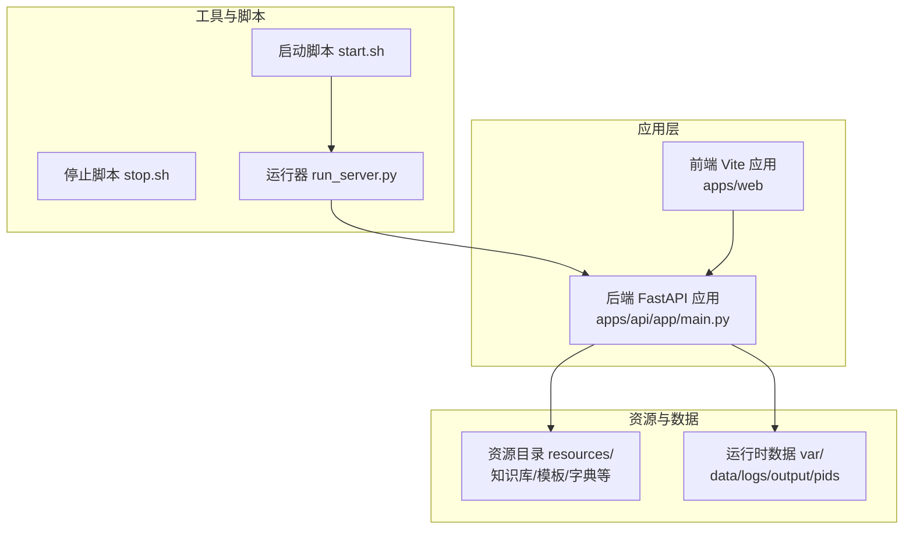
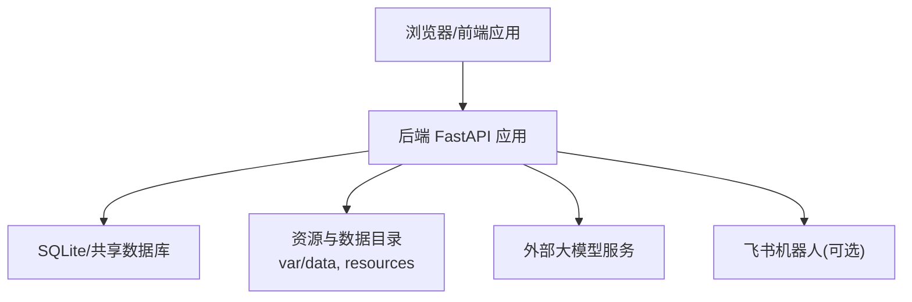
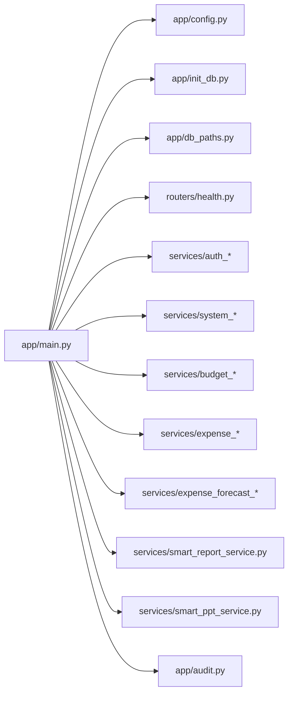

# 部署与运维

<cite>
**本文引用的文件**
- [apps/api/pyproject.toml](file://apps/api/pyproject.toml)
- [apps/api/requirements.txt](file://apps/api/requirements.txt)
- [apps/api/run_server.py](file://apps/api/run_server.py)
- [apps/api/app/config.py](file://apps/api/app/config.py)
- [apps/api/app/main.py](file://apps/api/app/main.py)
- [start.sh](file://start.sh)
- [stop.sh](file://stop.sh)
- [apps/api/app/routers/health.py](file://apps/api/app/routers/health.py)
- [apps/api/app/init_db.py](file://apps/api/app/init_db.py)
- [apps/api/app/db_paths.py](file://apps/api/app/db_paths.py)
- [apps/api/app/services/global_refresh_status.py](file://apps/api/app/services/global_refresh_status.py)
- [apps/api/app/services/budget_summary_export_service.py](file://apps/api/app/services/budget_summary_export_service.py)
- [apps/api/app/services/compare_summary_sync.py](file://apps/api/app/services/compare_summary_sync.py)
- [apps/api/app/services/smart_report_service.py](file://apps/api/app/services/smart_report_service.py)
- [apps/api/app/services/smart_ppt_service.py](file://apps/api/app/services/smart_ppt_service.py)
- [apps/api/app/feishu_bot.py](file://apps/api/app/feishu_bot.py)
- [apps/api/app/audit.py](file://apps/api/app/audit.py)
- [apps/api/app/services/auth_sessions.py](file://apps/api/app/services/auth_sessions.py)
- [apps/api/app/services/auth_access_policy.py](file://apps/api/app/services/auth_access_policy.py)
- [apps/api/app/services/auth_request_middleware.py](file://apps/api/app/services/auth_request_middleware.py)
- [apps/api/app/services/system_catalog.py](file://apps/api/app/services/system_catalog.py)
- [apps/api/app/services/system_versions.py](file://apps/api/app/services/system_versions.py)
- [apps/api/app/services/version_snapshot.py](file://apps/api/app/services/version_snapshot.py)
- [apps/api/app/services/budget_fact_periods.py](file://apps/api/app/services/budget_fact_periods.py)
- [apps/api/app/services/metric_tree_rollups.py](file://apps/api/app/services/metric_tree_rollups.py)
- [apps/api/app/services/formula_engine.py](file://apps/api/app/services/formula_engine.py)
- [apps/api/app/services/export_common.py](file://apps/api/app/services/export_common.py)
- [apps/api/app/services/dept_catalog.py](file://apps/api/app/services/dept_catalog.py)
- [apps/api/app/services/expense_budget_execution_framework.py](file://apps/api/app/services/expense_budget_execution_framework.py)
- [apps/api/app/services/expense_budget_execution_metrics.py](file://apps/api/app/services/expense_budget_execution_metrics.py)
- [apps/api/app/services/expense_budget_execution_status.py](file://apps/api/app/services/expense_budget_execution_status.py)
- [apps/api/app/services/expense_budget_execution_report_resolver.py](file://apps/api/app/services/expense_budget_execution_report_resolver.py)
- [apps/api/app/services/expense_budget_execution_template_report.py](file://apps/api/app/services/expense_budget_execution_template_report.py)
- [apps/api/app/services/expense_budget_execution_query_report.py](file://apps/api/app/services/expense_budget_execution_query_report.py)
- [apps/api/app/services/expense_budget_execution_monthly_report.py](file://apps/api/app/services/expense_budget_execution_monthly_report.py)
- [apps/api/app/services/expense_budget_execution_export.py](file://apps/api/app/services/expense_budget_execution_export.py)
- [apps/api/app/services/expense_budget_execution_master_sync.py](file://apps/api/app/services/expense_budget_execution_master_sync.py)
- [apps/api/app/services/expense_budget_execution_framework_sync.py](file://apps/api/app/services/expense_budget_execution_framework_sync.py)
- [apps/api/app/services/expense_budget_execution_actual_routing.py](file://apps/api/app/services/expense_budget_execution_actual_routing.py)
- [apps/api/app/services/expense_budget_execution_actuals.py](file://apps/api/app/services/expense_budget_execution_actuals.py)
- [apps/api/app/services/expense_budget_execution_budget_rollup.py](file://apps/api/app/services/expense_budget_execution_budget_rollup.py)
- [apps/api/app/services/expense_budget_execution_budget_source.py](file://apps/api/app/services/expense_budget_execution_budget_source.py)
- [apps/api/app/services/expense_budget_execution_caliber_catalog.py](file://apps/api/app/services/expense_budget_execution_caliber_catalog.py)
- [apps/api/app/services/expense_budget_execution_modes.py](file://apps/api/app/services/expense_budget_execution_modes.py)
- [apps/api/app/services/expense_budget_execution_subject_catalog.py](file://apps/api/app/services/expense_budget_execution_subject_catalog.py)
- [apps/api/app/services/expense_budget_execution_subject_report.py](file://apps/api/app/services/expense_budget_execution_subject_report.py)
- [apps/api/app/services/expense_budget_execution_template_report.py](file://apps/api/app/services/expense_budget_execution_template_report.py)
- [apps/api/app/services/expense_forecast_rule_import_workflow.py](file://apps/api/app/services/expense_forecast_rule_import_workflow.py)
- [apps/api/app/services/expense_forecast_rule_import.py](file://apps/api/app/services/expense_forecast_rule_import.py)
- [apps/api/app/services/expense_forecast_rule_read_model.py](file://apps/api/app/services/expense_forecast_rule_read_model.py)
- [apps/api/app/services/expense_forecast_rule_save.py](file://apps/api/app/services/expense_forecast_rule_save.py)
- [apps/api/app/services/expense_forecast_rule_simulation.py](file://apps/api/app/services/expense_forecast_rule_simulation.py)
- [apps/api/app/services/expense_forecast_rule_calculation.py](file://apps/api/app/services/expense_forecast_rule_calculation.py)
- [apps/api/app/services/expense_forecast_rule_commands.py](file://apps/api/app/services/expense_forecast_rule_commands.py)
- [apps/api/app/services/expense_forecast_rule_copy.py](file://apps/api/app/services/expense_forecast_rule_copy.py)
- [apps/api/app/services/expense_forecast_rule_detail.py](file://apps/api/app/services/expense_forecast_rule_detail.py)
- [apps/api/app/services/expense_forecast_recalculation_commands.py](file://apps/api/app/services/expense_forecast_recalculation_commands.py)
- [apps/api/app/services/expense_forecast_recalculation.py](file://apps/api/app/services/expense_forecast_recalculation.py)
- [apps/api/app/services/expense_forecast_override_commands.py](file://apps/api/app/services/expense_forecast_override_commands.py)
- [apps/api/app/services/expense_forecast_write_commands.py](file://apps/api/app/services/expense_forecast_write_commands.py)
- [apps/api/app/services/expense_forecast_view_model.py](file://apps/api/app/services/expense_forecast_view_model.py)
- [apps/api/app/services/expense_forecast_view_read_model.py](file://apps/api/app/services/expense_forecast_view_read_model.py)
- [apps/api/app/services/expense_forecast_trace.py](file://apps/api/app/services/expense_forecast_trace.py)
- [apps/api/app/services/expense_forecast_schema.py](file://apps/api/app/services/expense_forecast_schema.py)
- [apps/api/app/services/expense_forecast_meta.py](file://apps/api/app/services/expense_forecast_meta.py)
- [apps/api/app/services/expense_forecast_metric_sources.py](file://apps/api/app/services/expense_forecast_metric_sources.py)
- [apps/api/app/services/expense_forecast_data_context.py](file://apps/api/app/services/expense_forecast_data_context.py)
- [apps/api/app/services/expense_forecast_cell_commands.py](file://apps/api/app/services/expense_forecast_cell_commands.py)
- [apps/api/app/services/expense_forecast_export_workflow.py](file://apps/api/app/services/expense_forecast_export_workflow.py)
- [apps/api/app/services/expense_forecast_export_plan.py](file://apps/api/app/services/expense_forecast_export_plan.py)
- [apps/api/app/services/expense_forecast_export.py](file://apps/api/app/services/expense_forecast_export.py)
- [apps/api/app/services/expense_forecast_import_preview.py](file://apps/api/app/services/expense_forecast_import_preview.py)
- [apps/api/app/services/expense_forecast_import_plan.py](file://apps/api/app/services/expense_forecast_import_plan.py)
- [apps/api/app/services/expense_forecast_import_parser.py](file://apps/api/app/services/expense_forecast_import_parser.py)
- [apps/api/app/services/expense_forecast_import_apply.py](file://apps/api/app/services/expense_forecast_import_apply.py)
- [apps/api/app/services/expense_forecast.py](file://apps/api/app/services/expense_forecast.py)
- [apps/api/app/services/expense_actual_import_apply.py](file://apps/api/app/services/expense_actual_import_apply.py)
- [apps/api/app/services/expense_actual_import_batches.py](file://apps/api/app/services/expense_actual_import_batches.py)
- [apps/api/app/services/expense_actual_import_context.py](file://apps/api/app/services/expense_actual_import_context.py)
- [apps/api/app/services/expense_actual_import_parser.py](file://apps/api/app/services/expense_actual_import_parser.py)
- [apps/api/app/services/expense_actual_import_schema.py](file://apps/api/app/services/expense_actual_import_schema.py)
- [apps/api/app/services/budget_actual_batch.py](file://apps/api/app/services/budget_actual_batch.py)
- [apps/api/app/services/budget_display_structure.py](file://apps/api/app/services/budget_display_structure.py)
- [apps/api/app/services/budget_output_display_config.py](file://apps/api/app/services/budget_output_display_config.py)
- [apps/api/app/services/budget_output_display.py](file://apps/api/app/services/budget_output_display.py)
- [apps/api/app/services/budget_output_export.py](file://apps/api/app/services/budget_output_export.py)
- [apps/api/app/services/budget_simulation_export.py](file://apps/api/app/services/budget_simulation_export.py)
- [apps/api/app/services/budget_simulation_metrics.py](file://apps/api/app/services/budget_simulation_metrics.py)
- [apps/api/app/services/budget_simulation_results.py](file://apps/api/app/services/budget_simulation_results.py)
- [apps/api/app/services/budget_subject_catalog.py](file://apps/api/app/services/budget_subject_catalog.py)
- [apps/api/app/services/budget_summary_rebuild.py](file://apps/api/app/services/budget_summary_rebuild.py)
- [apps/api/app/services/business_admin_expense_metric_tree.py](file://apps/api/app/services/business_admin_expense_metric_tree.py)
- [apps/api/app/services/business_cost_income_ratio.py](file://apps/api/app/services/business_cost_income_ratio.py)
- [apps/api/app/services/business_cost_income_import.py](file://apps/api/app/services/business_cost_income_import.py)
- [apps/api/app/services/business_cost_income_derived.py](file://apps/api/app/services/business_cost_income_derived.py)
- [apps/api/app/services/business_cost_income_commands.py](file://apps/api/app/services/business_cost_income_commands.py)
- [apps/api/app/services/chart_data.py](file://apps/api/app/services/chart_data.py)
- [apps/api/app/services/chart_ppt_export.py](file://apps/api/app/services/chart_ppt_export.py)
- [apps/api/app/services/compare_export_service.py](file://apps/api/app/services/compare_export_service.py)
- [apps/api/app/services/pivot_aggregate_export.py](file://apps/api/app/services/pivot_aggregate_export.py)
- [apps/api/app/services/ppt_template_composer.py](file://apps/api/app/services/ppt_template_composer.py)
- [apps/api/app/services/ppt_template_inspector.py](file://apps/api/app/services/ppt_template_inspector.py)
- [apps/api/app/services/runtime_budget_paths.py](file://apps/api/app/services/runtime_budget_paths.py)
- [apps/api/app/services/runtime_metric_rollup_formulas.py](file://apps/api/app/services/runtime_metric_rollup_formulas.py)
- [apps/api/app/services/runtime_metric_refs.py](file://apps/api/app/services/runtime_metric_refs.py)
- [apps/api/app/services/smart_ppt_renderer.py](file://apps/api/app/services/smart_ppt_renderer.py)
- [apps/api/app/services/system_users.py](file://apps/api/app/services/system_users.py)
- [apps/api/app/services/system_versions.py](file://apps/api/app/services/system_versions.py)
- [apps/api/app/services/version_snapshot.py](file://apps/api/app/services/version_snapshot.py)
- [apps/api/app/services/annual_aggregation.py](file://apps/api/app/services/annual_aggregation.py)
- [apps/api/app/services/formula_engine.py](file://apps/api/app/services/formula_engine.py)
- [apps/api/app/services/intelligent_budget_scoring.py](file://apps/api/app/services/intelligent_budget_scoring.py)
- [apps/api/app/services/intelligent_budget_solver.py](file://apps/api/app/services/intelligent_budget_solver.py)
- [apps/api/app/services/intelligent_budget_steps.py](file://apps/api/app/services/intelligent_budget_steps.py)
- [apps/api/app/services/intelligent_budget_target_parser.py](file://apps/api/app/services/intelligent_budget_target_parser.py)
- [apps/api/app/services/intelligent_budget_export.py](file://apps/api/app/services/intelligent_budget_export.py)
- [apps/api/app/services/intelligent_budget_risk.py](file://apps/api/app/services/intelligent_budget_risk.py)
- [apps/api/app/services/intelligent_budget_product_loader.py](file://apps/api/app/services/intelligent_budget_product_loader.py)
- [apps/api/app/services/intelligent_budget_simulation.py](file://apps/api/app/services/intelligent_budget_simulation.py)
- [apps/api/app/services/org_product_budget_sync.py](file://apps/api/app/services/org_product_budget_sync.py)
- [apps/api/app/services/org_product_metric_runtime_snapshot.py](file://apps/api/app/services/org_product_metric_runtime_snapshot.py)
- [apps/api/app/services/org_product_metric_runtime_sync.py](file://apps/api/app/services/org_product_metric_runtime_sync.py)
- [apps/api/app/services/org_product_runtime_catalog.py](file://apps/api/app/services/org_product_runtime_catalog.py)
- [apps/api/app/services/org_product_metric_codes.py](file://apps/api/app/services/org_product_metric_codes.py)
- [apps/api/app/services/org_product_excel_formula.py](file://apps/api/app/services/org_product_excel_formula.py)
- [apps/api/app/services/pivot_aggregate.py](file://apps/api/app/services/pivot_aggregate.py)
- [apps/api/app/services/export_common.py](file://apps/api/app/services/export_common.py)
- [apps/api/app/services/runtime_ref_export.py](file://apps/api/app/services/runtime_ref_export.py)
- [apps/api/app/services/bi_ai_manage_department.py](file://apps/api/app/services/bi_ai_manage_department.py)
- [apps/api/app/services/bi_ai_subject_mapping.py](file://apps/api/app/services/bi_ai_subject_mapping.py)
- [apps/api/app/services/bi_ai_subject_mapping.py](file://apps/api/app/services/bi_ai_subject_mapping.py)
- [apps/api/app/services/bi_department_mapping.py](file://apps/api/app/services/bi_department_mapping.py)
- [apps/api/app/services/bi_subject_mapping.py](file://apps/api/app/services/bi_subject_mapping.py)
- [apps/api/app/services/chart_data.py](file://apps/api/app/services/chart_data.py)
- [apps/api/app/services/chart_ppt_export.py](file://apps/api/app/services/chart_ppt_export.py)
- [apps/api/app/services/compare_export_service.py](file://apps/api/app/services/compare_export_service.py)
- [apps/api/app/services/pivot_aggregate_export.py](file://apps/api/app/services/pivot_aggregate_export.py)
- [apps/api/app/services/ppt_template_composer.py](file://apps/api/app/services/ppt_template_composer.py)
- [apps/api/app/services/ppt_template_inspector.py](file://apps/api/app/services/ppt_template_inspector.py)
- [apps/api/app/services/runtime_budget_paths.py](file://apps/api/app/services/runtime_budget_paths.py)
- [apps/api/app/services/runtime_metric_rollup_formulas.py](file://apps/api/app/services/runtime_metric_rollup_formulas.py)
- [apps/api/app/services/runtime_metric_refs.py](file://apps/api/app/services/runtime_metric_refs.py)
- [apps/api/app/services/smart_ppt_renderer.py](file://apps/api/app/services/smart_ppt_renderer.py)
- [apps/api/app/services/system_users.py](file://apps/api/app/services/system_users.py)
- [apps/api/app/services/system_versions.py](file://apps/api/app/services/system_versions.py)
- [apps/api/app/services/version_snapshot.py](file://apps/api/app/services/version_snapshot.py)
- [apps/api/app/services/annual_aggregation.py](file://apps/api/app/services/annual_aggregation.py)
- [apps/api/app/services/formula_engine.py](file://apps/api/app/services/formula_engine.py)
- [apps/api/app/services/intelligent_budget_scoring.py](file://apps/api/app/services/intelligent_budget_scoring.py)
- [apps/api/app/services/intelligent_budget_solver.py](file://apps/api/app/services/intelligent_budget_solver.py)
- [apps/api/app/services/intelligent_budget_steps.py](file://apps/api/app/services/intelligent_budget_steps.py)
- [apps/api/app/services/intelligent_budget_target_parser.py](file://apps/api/app/services/intelligent_budget_target_parser.py)
- [apps/api/app/services/intelligent_budget_export.py](file://apps/api/app/services/intelligent_budget_export.py)
- [apps/api/app/services/intelligent_budget_risk.py](file://apps/api/app/services/intelligent_budget_risk.py)
- [apps/api/app/services/intelligent_budget_product_loader.py](file://apps/api/app/services/intelligent_budget_product_loader.py)
- [apps/api/app/services/intelligent_budget_simulation.py](file://apps/api/app/services/intelligent_budget_simulation.py)
- [apps/api/app/services/org_product_budget_sync.py](file://apps/api/app/services/org_product_budget_sync.py)
- [apps/api/app/services/org_product_metric_runtime_snapshot.py](file://apps/api/app/services/org_product_metric_runtime_snapshot.py)
- [apps/api/app/services/org_product_metric_runtime_sync.py](file://apps/api/app/services/org_product_metric_runtime_sync.py)
- [apps/api/app/services/org_product_runtime_catalog.py](file://apps/api/app/services/org_product_runtime_catalog.py)
- [apps/api/app/services/org_product_metric_codes.py](file://apps/api/app/services/org_product_metric_codes.py)
- [apps/api/app/services/org_product_excel_formula.py](file://apps/api/app/services/org_product_excel_formula.py)
- [apps/api/app/services/pivot_aggregate.py](file://apps/api/app/services/pivot_aggregate.py)
- [apps/api/app/services/export_common.py](file://apps/api/app/services/export_common.py)
- [apps/api/app/services/runtime_ref_export.py](file://apps/api/app/services/runtime_ref_export.py)
- [apps/api/app/services/bi_ai_manage_department.py](file://apps/api/app/services/bi_ai_manage_department.py)
- [apps/api/app/services/bi_ai_subject_mapping.py](file://apps/api/app/services/bi_ai_subject_mapping.py)
- [apps/api/app/services/bi_ai_subject_mapping.py](file://apps/api/app/services/bi_ai_subject_mapping.py)
- [apps/api/app/services/bi_department_mapping.py](file://apps/api/app/services/bi_department_mapping.py)
- [apps/api/app/services/bi_subject_mapping.py](file://apps/api/app/services/bi_subject_mapping.py)
</cite>

## 目录
1. [简介](#简介)
2. [项目结构](#项目结构)
3. [核心组件](#核心组件)
4. [架构总览](#架构总览)
5. [详细组件分析](#详细组件分析)
6. [依赖关系分析](#依赖关系分析)
7. [性能考虑](#性能考虑)
8. [故障排除指南](#故障排除指南)
9. [结论](#结论)
10. [附录](#附录)

## 简介
本文件面向智能预算预测系统的部署与运维团队，提供从开发到生产的全生命周期运维指南。内容覆盖部署配置、环境管理、监控告警、容器化与高可用、日志与性能监控、健康检查、故障排除、备份与恢复、安全加固、自动化脚本与工具、以及运维团队职责与流程等。

## 项目结构
系统由后端 FastAPI 应用与前端 Vite 应用组成，采用统一仓库多模块组织方式。后端通过启动脚本与运行器进行本地开发与测试，生产环境建议以容器化方式部署，并结合外部数据库与对象存储资源目录。

图表来源
- [apps/api/app/main.py:109-119](file://apps/api/app/main.py#L109-L119)
- [apps/api/run_server.py:29-30](file://apps/api/run_server.py#L29-L30)
- [start.sh:111-156](file://start.sh#L111-L156)
- [apps/api/app/config.py:12-18](file://apps/api/app/config.py#L12-L18)

章节来源
- [apps/api/app/main.py:109-119](file://apps/api/app/main.py#L109-L119)
- [apps/api/run_server.py:29-30](file://apps/api/run_server.py#L29-L30)
- [start.sh:111-156](file://start.sh#L111-L156)
- [apps/api/app/config.py:12-18](file://apps/api/app/config.py#L12-L18)

## 核心组件
- 后端服务
  - 应用入口与生命周期：FastAPI 应用在 lifespan 中完成数据库初始化与飞书机器人后台任务启动。
  - 路由体系：按业务域划分路由模块，包括预算、费用、报表、图表、系统管理、全局刷新状态等。
  - 配置中心：基于 Pydantic Settings 的 Settings 类集中管理路径、CORS、AI 接口、飞书机器人等参数。
- 前端服务
  - 开发模式通过 Vite 提供热更新与代理能力，便于联调后端接口。
- 运维脚本
  - start.sh/stop.sh 提供一键启动/停止后端与前端，支持 screen 会话与 PID 文件管理。
- 数据与资源
  - 数据目录 var/data 与资源目录 resources 作为运行期输入输出的根路径，配置中可调整。

章节来源
- [apps/api/app/main.py:102-107](file://apps/api/app/main.py#L102-L107)
- [apps/api/app/main.py:119-411](file://apps/api/app/main.py#L119-L411)
- [apps/api/app/config.py:9-40](file://apps/api/app/config.py#L9-L40)
- [start.sh:111-179](file://start.sh#L111-L179)
- [stop.sh:113-121](file://stop.sh#L113-L121)

## 架构总览
系统采用“前端浏览器 + 后端 API + SQLite/共享数据库 + 资源文件系统”的组合架构。后端负责业务逻辑编排、数据访问与导出渲染，前端负责交互与可视化展示。

图表来源
- [apps/api/app/main.py:122-145](file://apps/api/app/main.py#L122-L145)
- [apps/api/app/config.py:27-37](file://apps/api/app/config.py#L27-L37)
- [apps/api/app/feishu_bot.py](file://apps/api/app/feishu_bot.py)

## 详细组件分析

### 部署与运行配置
- Python 版本要求与运行器
  - 运行器对 Python 版本进行检查，确保满足最低版本要求。
  - 支持通过命令行参数指定主机、端口与热重载模式。
- 启动脚本与停止脚本
  - 自动检测端口占用与进程状态，避免重复启动。
  - 支持 screen 会话与 nohup 方式运行，便于后台守护。
  - 统一创建 PID 与日志目录，便于进程管理与日志收集。
- 依赖与打包
  - 使用 requirements.txt 与 pyproject.toml 管理依赖，推荐在生产环境使用锁定的虚拟环境或容器镜像。

章节来源
- [apps/api/run_server.py:16-30](file://apps/api/run_server.py#L16-L30)
- [start.sh:111-179](file://start.sh#L111-L179)
- [stop.sh:113-121](file://stop.sh#L113-L121)
- [apps/api/requirements.txt:1-18](file://apps/api/requirements.txt#L1-L18)
- [apps/api/pyproject.toml:1-33](file://apps/api/pyproject.toml#L1-L33)

### 配置管理
- 配置项分类
  - 路径类：仓库根、资源目录、数据目录、下载模板、知识库、业务输入、智能体日志目录等。
  - 全局参数：预算年份、软件版本、CORS 允许来源与正则、本地用户信息等。
  - 外部集成：DeepSeek API 密钥、基础地址与模型；飞书机器人开关、凭证与域名、SSL 安全选项。
- 加载机制
  - 通过 Pydantic Settings 从 .env 文件加载，支持环境变量覆盖。

章节来源
- [apps/api/app/config.py:9-40](file://apps/api/app/config.py#L9-L40)

### 数据库与初始化
- 初始化流程
  - 应用生命周期中执行数据库初始化，确保表结构与约束就绪。
  - 通过 db_paths 模块解析预算数据库与对比数据库路径。
- 关键服务
  - 全局刷新状态：记录预算与对比计算时间，用于前端刷新提示。
  - 年度周期映射：从公共数据库加载预算期间月份映射。
  - 汇总重建：按版本重建汇总数据，保证一致性。

章节来源
- [apps/api/app/main.py:104-104](file://apps/api/app/main.py#L104-L104)
- [apps/api/app/init_db.py](file://apps/api/app/init_db.py)
- [apps/api/app/db_paths.py](file://apps/api/app/db_paths.py)
- [apps/api/app/services/global_refresh_status.py:1-50](file://apps/api/app/services/global_refresh_status.py#L1-L50)
- [apps/api/app/services/budget_fact_periods.py:1-50](file://apps/api/app/services/budget_fact_periods.py#L1-L50)

### 路由与业务域
- 路由组织
  - 按功能域拆分路由构建器，如预算实际批量、预算模拟、费用预算执行、费用预测、图表读写、系统管理等。
- 认证与会话
  - 通过中间件注入认证上下文，支持密码策略校验与权限角色转换。
- 审计日志
  - 所有关键操作通过审计模块记录，便于合规与追踪。

章节来源
- [apps/api/app/main.py:58-90](file://apps/api/app/main.py#L58-L90)
- [apps/api/app/main.py:225-247](file://apps/api/app/main.py#L225-L247)
- [apps/api/app/audit.py](file://apps/api/app/audit.py)

### 健康检查与可观测性
- 健康路由
  - 提供健康检查端点，返回服务可用状态。
- 日志与调试
  - 飞书机器人后台任务可选启用；智能体调试跟踪与意图路由跟踪文件用于问题定位。
- 性能监控
  - 建议在生产环境接入 APM/Tracing 与指标采集，结合日志聚合与告警平台。

章节来源
- [apps/api/app/routers/health.py](file://apps/api/app/routers/health.py)
- [apps/api/app/config.py:18-18](file://apps/api/app/config.py#L18-L18)
- [apps/api/app/feishu_bot.py](file://apps/api/app/feishu_bot.py)

### 容器化部署与最佳实践
- 镜像构建建议
  - 基于官方 Python 运行时镜像，安装系统依赖与 Python 包，设置非 root 用户与只读文件系统。
  - 将资源目录与数据目录挂载为持久卷，避免容器重启丢失。
- 部署策略
  - 使用副本集与就绪探针，配合反向代理实现负载均衡。
  - 通过环境变量注入配置，禁用热重载模式，启用标准日志输出。
- 网络与安全
  - 限制入站端口，启用 TLS；对敏感参数使用密钥管理服务注入。
  - 对外 API 限流与速率控制，防止滥用。

（本节为通用实践说明，不直接分析具体文件）

### 负载均衡、高可用与灾难恢复
- 负载均衡
  - 反向代理分发请求至多个后端实例，启用会话亲和或无状态设计。
- 高可用
  - 多副本部署，健康检查失败自动摘除；数据库主从或托管服务保障可用性。
- 灾难恢复
  - 定期备份数据库与资源目录；制定回滚与切换方案，演练恢复流程。

（本节为通用实践说明，不直接分析具体文件）

### 日志管理、性能监控与健康检查
- 日志
  - 后端标准输出与错误输出重定向至统一日志系统；按天轮转与保留策略。
  - 智能体调试日志与意图路由日志用于问题复盘。
- 监控
  - 指标：请求量、响应时间、错误率、并发数、数据库连接数。
  - 告警：阈值触发与趋势异常检测，联动通知渠道。
- 健康检查
  - 定时探测健康端点，失败自动重启或下线。

章节来源
- [apps/api/app/routers/health.py](file://apps/api/app/routers/health.py)
- [apps/api/app/config.py:18-18](file://apps/api/app/config.py#L18-L18)

### 故障排除指南与应急响应
- 常见问题
  - 端口占用：使用 stop.sh 清理残留进程与监听；确认防火墙放行。
  - 依赖缺失：在容器或虚拟环境中重新安装 requirements.txt。
  - 配置错误：核对 .env 与环境变量，确保路径与密钥正确。
- 应急响应
  - 快速降级：关闭非关键路由与导出功能，优先保障核心预算与费用流程。
  - 回滚策略：基于版本快照与数据库备份快速回退。
  - 事故升级：触发值班流程，同步技术与业务负责人。

章节来源
- [stop.sh:80-111](file://stop.sh#L80-L111)
- [apps/api/requirements.txt:1-18](file://apps/api/requirements.txt#L1-L18)
- [apps/api/app/config.py:9-40](file://apps/api/app/config.py#L9-L40)

### 备份策略、数据恢复与系统维护
- 备份范围
  - 数据库文件（预算库、对比库、公共库）与资源目录（知识库、模板、导出产物）。
- 备份频率
  - 实时/近实时复制（数据库）+ 每日全备 + 每小时增量（资源目录）。
- 恢复验证
  - 定期进行恢复演练，验证备份完整性与可恢复性。
- 维护窗口
  - 在低峰期执行数据库维护、索引重建与统计信息更新。

（本节为通用实践说明，不直接分析具体文件）

### 安全加固与访问控制
- 网络安全
  - 仅暴露必要端口；启用 WAF 与入站 IP 白名单；TLS 强制与证书轮换。
- 应用安全
  - 会话管理：安全 Cookie、超时与滑动过期；CSRF 防护。
  - 权限模型：RBAC 明确角色与权限边界；最小授权原则。
- 数据安全
  - 敏感字段加密存储；传输加密；导出文件脱敏处理。
- 第三方集成
  - 外部 API 凭据安全存储；调用链路审计；限流与熔断。

（本节为通用实践说明，不直接分析具体文件）

### 运维自动化脚本与工具
- 启停脚本
  - start.sh：准备生成路径、启动后端与前端、记录 PID 与日志。
  - stop.sh：清理 screen 会话、终止进程、释放端口。
- 其他脚本
  - 交付与验证脚本位于 scripts/ 与 apps/api/scripts/，可用于部署前校验与初始化。
- 工具链
  - 推荐使用 CI/CD 管道自动化构建镜像、推送制品与编排部署。

章节来源
- [start.sh:77-179](file://start.sh#L77-L179)
- [stop.sh:13-121](file://stop.sh#L13-L121)

### 运维团队职责与工作流程
- 运维职责
  - 基础设施：服务器与网络、存储与备份、监控与告警。
  - 应用运维：发布与回滚、配置变更、性能优化、故障处置。
  - 安全与合规：漏洞扫描、基线加固、审计与取证。
- 工作流程
  - 变更管理：变更评审、灰度发布、回滚预案。
  - 事件管理：事件分级、响应时限、根因分析与改进。
  - 运营分析：容量规划、成本优化、SLA 报告。

（本节为通用实践说明，不直接分析具体文件）

## 依赖关系分析
后端应用通过路由模块组织业务域，各服务模块承担具体职责并通过统一配置与数据库路径协作。

图表来源
- [apps/api/app/main.py:119-411](file://apps/api/app/main.py#L119-L411)
- [apps/api/app/config.py:9-40](file://apps/api/app/config.py#L9-L40)
- [apps/api/app/init_db.py](file://apps/api/app/init_db.py)
- [apps/api/app/db_paths.py](file://apps/api/app/db_paths.py)
- [apps/api/app/routers/health.py](file://apps/api/app/routers/health.py)
- [apps/api/app/audit.py](file://apps/api/app/audit.py)

章节来源
- [apps/api/app/main.py:119-411](file://apps/api/app/main.py#L119-L411)

## 性能考虑
- 数据库
  - 合理索引与查询计划；批量导入与导出使用事务；定期统计信息更新。
- 缓存
  - 对热点查询结果与配置进行缓存，降低数据库压力。
- 并发与限流
  - 控制并发与队列长度；对外接口限流与熔断，避免雪崩。
- 导出与渲染
  - 分页与流式输出；图片与图表渲染异步化；压缩与 CDN 加速。

（本节为通用实践说明，不直接分析具体文件）

## 故障排除指南
- 启动失败
  - 检查 Python 版本与依赖安装；查看日志文件定位异常。
- 端口冲突
  - 使用 stop.sh 清理残留；确认 lsof 占用并释放。
- CORS 与鉴权
  - 核对配置中的 CORS 来源与会话 Cookie 设置。
- 数据库异常
  - 检查数据库文件是否存在与权限；确认初始化是否成功。

章节来源
- [apps/api/run_server.py:16-30](file://apps/api/run_server.py#L16-L30)
- [stop.sh:80-111](file://stop.sh#L80-L111)
- [apps/api/app/config.py:21-23](file://apps/api/app/config.py#L21-L23)
- [apps/api/app/init_db.py](file://apps/api/app/init_db.py)

## 结论
本文提供了智能预算预测系统从部署到运维的全景指南。建议在生产环境采用容器化与编排、严格的配置管理与安全加固、完善的监控与告警、以及标准化的备份与应急流程，确保系统稳定、安全、可扩展地支撑业务发展。

## 附录
- 关键文件清单
  - 后端入口与配置：[apps/api/app/main.py:109-119](file://apps/api/app/main.py#L109-L119)、[apps/api/app/config.py:9-40](file://apps/api/app/config.py#L9-L40)
  - 启停脚本：[start.sh:111-179](file://start.sh#L111-L179)、[stop.sh:113-121](file://stop.sh#L113-L121)
  - 运行器：[apps/api/run_server.py:29-30](file://apps/api/run_server.py#L29-L30)
  - 依赖清单：[apps/api/requirements.txt:1-18](file://apps/api/requirements.txt#L1-L18)、[apps/api/pyproject.toml:1-33](file://apps/api/pyproject.toml#L1-L33)
  - 健康检查：[apps/api/app/routers/health.py](file://apps/api/app/routers/health.py)