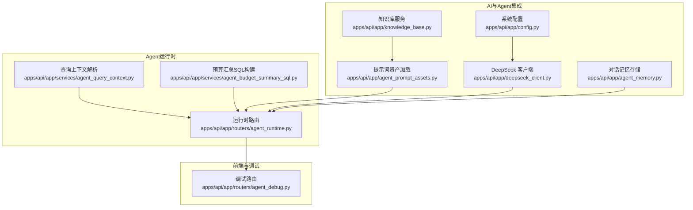
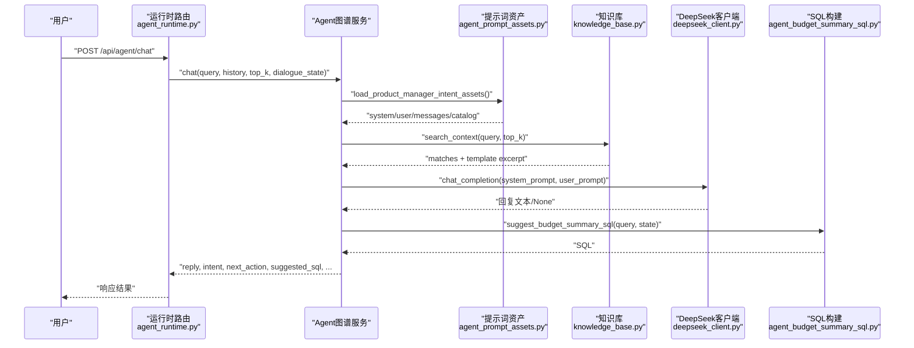
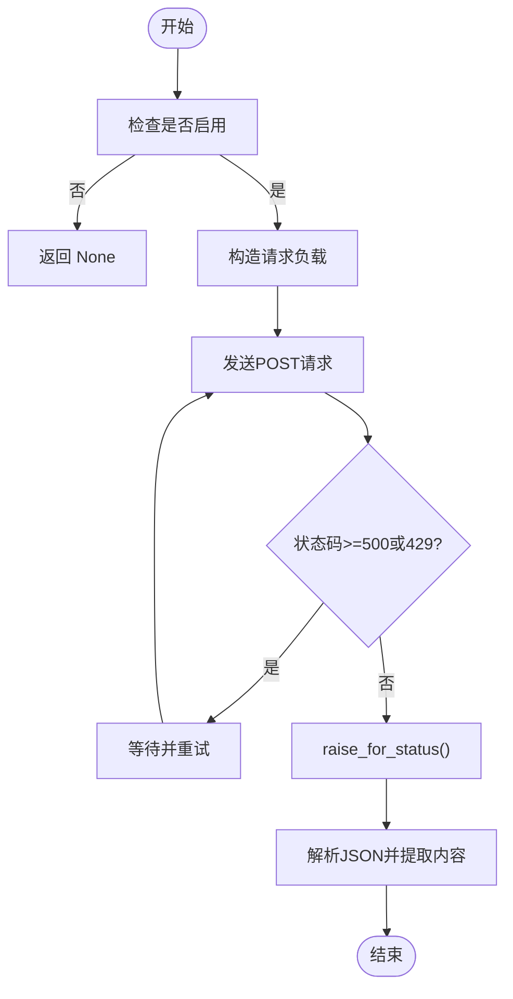
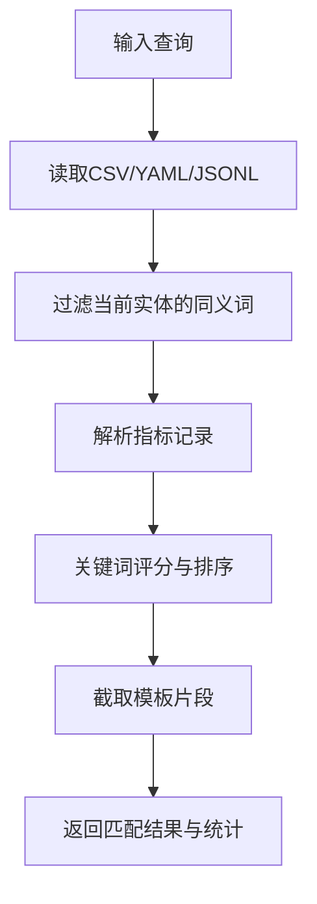
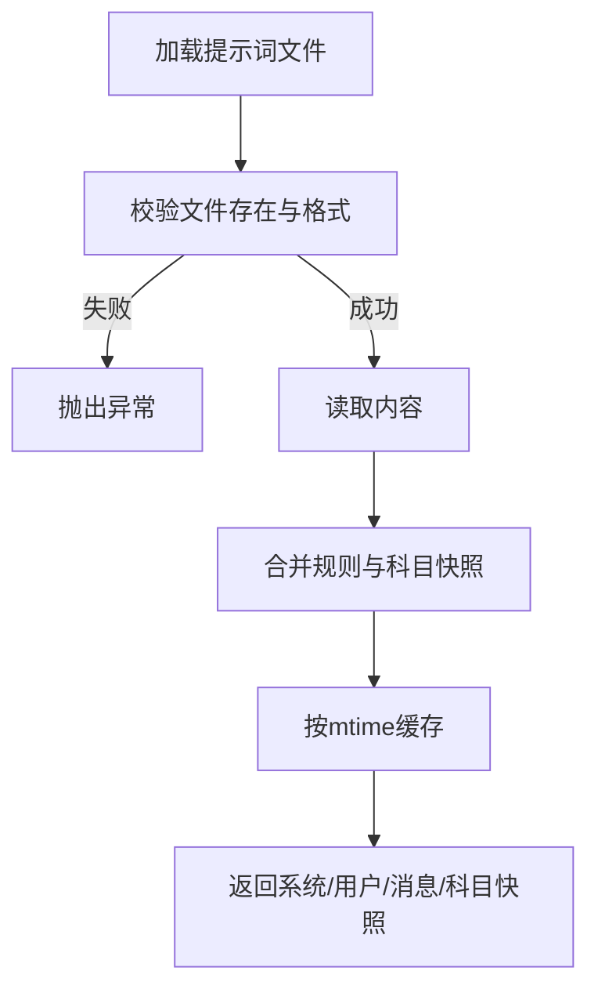
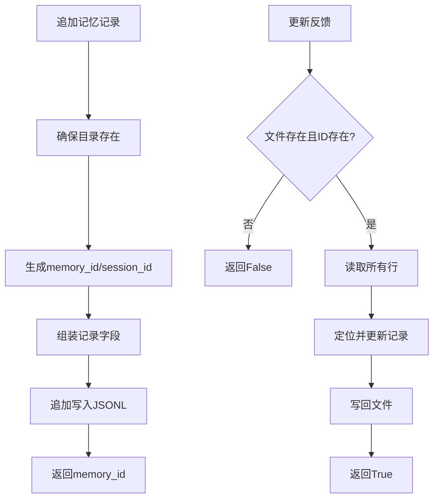
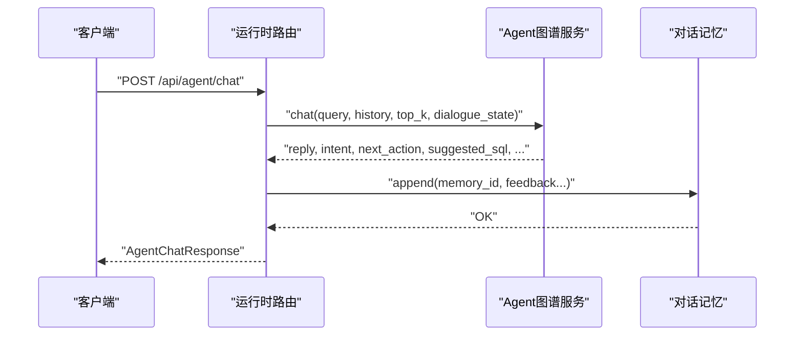
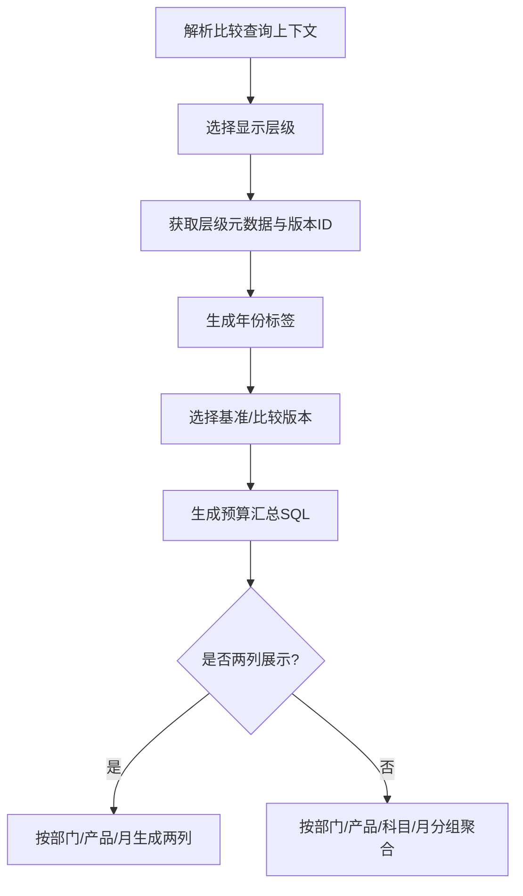
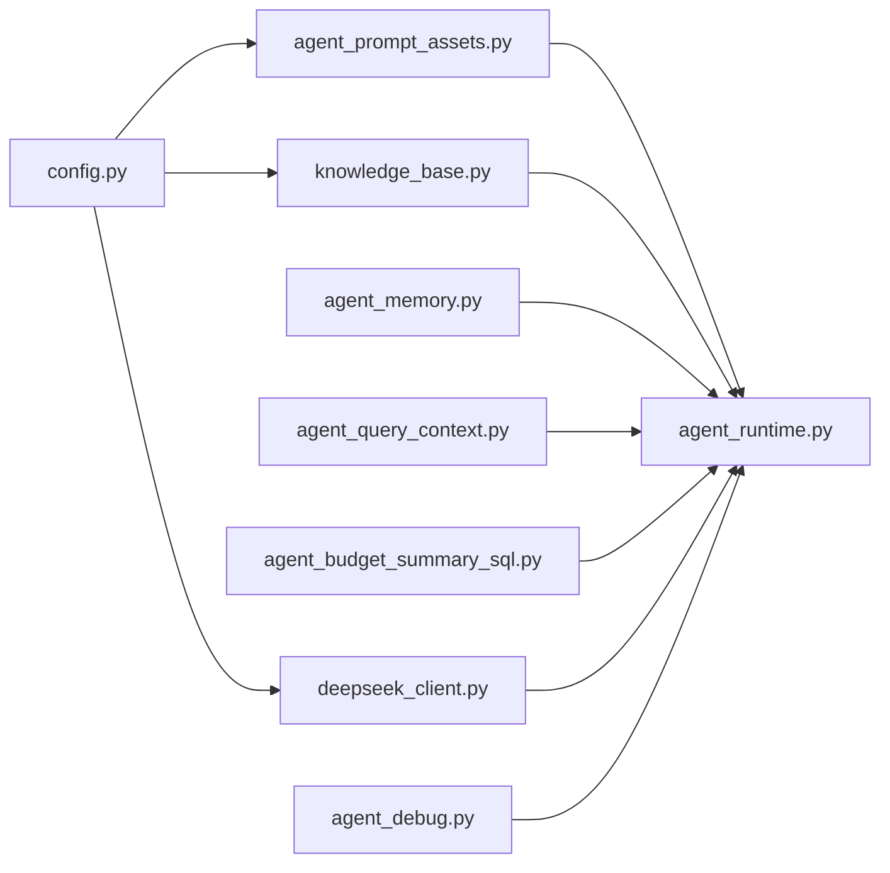

# AI集成说明

<cite>
**本文档引用的文件**
- [apps/api/app/deepseek_client.py](file://apps/api/app/deepseek_client.py)
- [apps/api/app/knowledge_base.py](file://apps/api/app/knowledge_base.py)
- [apps/api/app/agent_prompt_assets.py](file://apps/api/app/agent_prompt_assets.py)
- [apps/api/app/agent_memory.py](file://apps/api/app/agent_memory.py)
- [apps/api/app/config.py](file://apps/api/app/config.py)
- [apps/api/app/routers/agent_runtime.py](file://apps/api/app/routers/agent_runtime.py)
- [apps/api/app/routers/agent_debug.py](file://apps/api/app/routers/agent_debug.py)
- [apps/api/app/services/agent_budget_summary_sql.py](file://apps/api/app/services/agent_budget_summary_sql.py)
- [apps/api/app/services/agent_query_context.py](file://apps/api/app/services/agent_query_context.py)
- [resources/knowledge_base/06_agent_prompts/product_manager_intent_system.md](file://resources/knowledge_base/06_agent_prompts/product_manager_intent_system.md)
- [resources/knowledge_base/06_agent_prompts/product_manager_intent_user.md](file://resources/knowledge_base/06_agent_prompts/product_manager_intent_user.md)
- [resources/knowledge_base/06_agent_prompts/product_manager_intent_messages.json](file://resources/knowledge_base/06_agent_prompts/product_manager_intent_messages.json)
- [resources/knowledge_base/06_agent_prompts/product_manager_intent_catalog.md](file://resources/knowledge_base/06_agent_prompts/product_manager_intent_catalog.md)
</cite>

## 目录
1. [简介](#简介)
2. [项目结构](#项目结构)
3. [核心组件](#核心组件)
4. [架构总览](#架构总览)
5. [详细组件分析](#详细组件分析)
6. [依赖关系分析](#依赖关系分析)
7. [性能考量](#性能考量)
8. [故障排查指南](#故障排查指南)
9. [结论](#结论)
10. [附录](#附录)

## 简介
本文件面向智能预算预测系统中的AI集成，聚焦DeepSeek大模型在预算分析中的应用，包括预算预测、智能模拟、自然语言查询、智能建议等场景。文档还阐述Agent技能系统的设计与实现（技能资产与知识库维护）、AI服务的配置与API调用方式、错误处理机制、使用示例与最佳实践，以及AI与传统预算方法的结合方式与优势，并给出模型选择依据与性能考量。

## 项目结构
AI集成主要分布在后端API服务中，围绕以下模块协同工作：
- 配置与客户端：设置DeepSeek访问参数，封装HTTP调用与重试逻辑
- 知识库与提示词：提供领域规则、科目快照、历史对话与模板
- Agent运行时：接收用户消息，构建上下文，调用推理与SQL生成，返回分析结果与建议
- 对话记忆：记录每次交互的意图、动作、SQL与反馈，支撑持续优化
- 调试与追踪：提供事件流与清理接口，便于排障

**图表来源**
- [apps/api/app/deepseek_client.py:1-70](file://apps/api/app/deepseek_client.py#L1-L70)
- [apps/api/app/knowledge_base.py:1-282](file://apps/api/app/knowledge_base.py#L1-L282)
- [apps/api/app/agent_prompt_assets.py:1-83](file://apps/api/app/agent_prompt_assets.py#L1-L83)
- [apps/api/app/agent_memory.py:1-91](file://apps/api/app/agent_memory.py#L1-L91)
- [apps/api/app/config.py:1-41](file://apps/api/app/config.py#L1-L41)
- [apps/api/app/routers/agent_runtime.py:1-257](file://apps/api/app/routers/agent_runtime.py#L1-L257)
- [apps/api/app/services/agent_query_context.py:1-88](file://apps/api/app/services/agent_query_context.py#L1-L88)
- [apps/api/app/services/agent_budget_summary_sql.py:1-283](file://apps/api/app/services/agent_budget_summary_sql.py#L1-L283)
- [apps/api/app/routers/agent_debug.py:1-46](file://apps/api/app/routers/agent_debug.py#L1-L46)

**章节来源**
- [apps/api/app/config.py:1-41](file://apps/api/app/config.py#L1-L41)
- [apps/api/app/deepseek_client.py:1-70](file://apps/api/app/deepseek_client.py#L1-L70)
- [apps/api/app/knowledge_base.py:1-282](file://apps/api/app/knowledge_base.py#L1-L282)
- [apps/api/app/agent_prompt_assets.py:1-83](file://apps/api/app/agent_prompt_assets.py#L1-L83)
- [apps/api/app/agent_memory.py:1-91](file://apps/api/app/agent_memory.py#L1-L91)
- [apps/api/app/routers/agent_runtime.py:1-257](file://apps/api/app/routers/agent_runtime.py#L1-L257)
- [apps/api/app/services/agent_query_context.py:1-88](file://apps/api/app/services/agent_query_context.py#L1-L88)
- [apps/api/app/services/agent_budget_summary_sql.py:1-283](file://apps/api/app/services/agent_budget_summary_sql.py#L1-L283)
- [apps/api/app/routers/agent_debug.py:1-46](file://apps/api/app/routers/agent_debug.py#L1-L46)

## 核心组件
- DeepSeek客户端：封装模型调用、鉴权头、温度与令牌上限、超时与重试策略
- 知识库服务：读取CSV/YAML/JSONL等资源，构建匹配器，提供上下文检索
- 提示词资产：按文件变更时间缓存，加载系统/用户模板、消息与科目快照
- 对话记忆：追加运行时记录，支持反馈更新，生成嵌入文本
- 运行时路由：接收消息与历史，调用Agent图谱服务，返回意图、SQL建议、透视建议等
- 查询上下文解析：基于比较库与公共库，确定显示层级、年份与版本
- SQL构建：根据用户意图与查询规范，生成预算汇总查询SQL
- 调试路由：事件列表、SSE流与清理

**章节来源**
- [apps/api/app/deepseek_client.py:9-70](file://apps/api/app/deepseek_client.py#L9-L70)
- [apps/api/app/knowledge_base.py:50-282](file://apps/api/app/knowledge_base.py#L50-L282)
- [apps/api/app/agent_prompt_assets.py:33-83](file://apps/api/app/agent_prompt_assets.py#L33-L83)
- [apps/api/app/agent_memory.py:14-91](file://apps/api/app/agent_memory.py#L14-L91)
- [apps/api/app/routers/agent_runtime.py:121-257](file://apps/api/app/routers/agent_runtime.py#L121-L257)
- [apps/api/app/services/agent_query_context.py:14-88](file://apps/api/app/services/agent_query_context.py#L14-L88)
- [apps/api/app/services/agent_budget_summary_sql.py:69-283](file://apps/api/app/services/agent_budget_summary_sql.py#L69-L283)
- [apps/api/app/routers/agent_debug.py:13-46](file://apps/api/app/routers/agent_debug.py#L13-L46)

## 架构总览
AI集成以“提示词+知识库+对话记忆+推理服务+SQL生成”的闭环实现预算分析能力。用户通过运行时路由提交自然语言查询，系统解析意图、检索上下文、调用DeepSeek生成回复与SQL建议，最终返回分析结果与可选的透视建议。

**图表来源**
- [apps/api/app/routers/agent_runtime.py:136-213](file://apps/api/app/routers/agent_runtime.py#L136-L213)
- [apps/api/app/agent_prompt_assets.py:33-83](file://apps/api/app/agent_prompt_assets.py#L33-L83)
- [apps/api/app/knowledge_base.py:197-248](file://apps/api/app/knowledge_base.py#L197-L248)
- [apps/api/app/deepseek_client.py:18-69](file://apps/api/app/deepseek_client.py#L18-L69)
- [apps/api/app/services/agent_budget_summary_sql.py:142-283](file://apps/api/app/services/agent_budget_summary_sql.py#L142-L283)

## 详细组件分析

### DeepSeek客户端
- 职责：封装模型调用，支持基础URL、模型名、API密钥配置；提供重试与状态码处理
- 关键点：启用条件、请求负载构造、鉴权头、超时控制、异常回退
- 性能与可靠性：指数退避重试、5xx与429自动重试、最大尝试次数限制

**图表来源**
- [apps/api/app/deepseek_client.py:18-69](file://apps/api/app/deepseek_client.py#L18-L69)

**章节来源**
- [apps/api/app/deepseek_client.py:9-70](file://apps/api/app/deepseek_client.py#L9-L70)

### 知识库服务
- 职责：读取数据语义、指标定义、同义词、对话记忆与分析模板，提供关键词匹配与上下文检索
- 关键点：实体索引过滤、同义词与当前实体集合的交叉、JSONL行解析、构建匹配结果
- 安全性：退休资源标记校验，防止使用已淘汰口径

**图表来源**
- [apps/api/app/knowledge_base.py:197-248](file://apps/api/app/knowledge_base.py#L197-L248)

**章节来源**
- [apps/api/app/knowledge_base.py:50-282](file://apps/api/app/knowledge_base.py#L50-L282)

### 提示词资产加载
- 职责：从知识库目录加载系统提示、用户模板、消息与科目快照，按文件mtime缓存
- 关键点：文件存在性校验、JSON根校验、规则文本拼接、进程内缓存

**图表来源**
- [apps/api/app/agent_prompt_assets.py:33-83](file://apps/api/app/agent_prompt_assets.py#L33-L83)

**章节来源**
- [apps/api/app/agent_prompt_assets.py:1-83](file://apps/api/app/agent_prompt_assets.py#L1-L83)
- [resources/knowledge_base/06_agent_prompts/product_manager_intent_system.md:1-17](file://resources/knowledge_base/06_agent_prompts/product_manager_intent_system.md#L1-L17)
- [resources/knowledge_base/06_agent_prompts/product_manager_intent_user.md:1-104](file://resources/knowledge_base/06_agent_prompts/product_manager_intent_user.md#L1-L104)
- [resources/knowledge_base/06_agent_prompts/product_manager_intent_messages.json:1-20](file://resources/knowledge_base/06_agent_prompts/product_manager_intent_messages.json#L1-L20)
- [resources/knowledge_base/06_agent_prompts/product_manager_intent_catalog.md:1-539](file://resources/knowledge_base/06_agent_prompts/product_manager_intent_catalog.md#L1-L539)

### 对话记忆
- 职责：追加运行时记忆记录，包含会话ID、意图、SQL、分析摘要、用户反馈等；支持反馈更新
- 关键点：运行时文件路径、唯一ID生成、嵌入文本构造、行级更新

**图表来源**
- [apps/api/app/agent_memory.py:18-91](file://apps/api/app/agent_memory.py#L18-L91)

**章节来源**
- [apps/api/app/agent_memory.py:1-91](file://apps/api/app/agent_memory.py#L1-L91)

### 运行时路由与Agent交互
- 职责：接收消息与历史，标准化对话状态，调用Agent图谱服务，返回意图、SQL建议、透视建议、执行结果预览等
- 关键点：问候前置、回复选项与透视建议的序列化、文件解析与OCR/PDF/Docx支持

**图表来源**
- [apps/api/app/routers/agent_runtime.py:136-213](file://apps/api/app/routers/agent_runtime.py#L136-L213)
- [apps/api/app/agent_memory.py:18-60](file://apps/api/app/agent_memory.py#L18-L60)

**章节来源**
- [apps/api/app/routers/agent_runtime.py:121-257](file://apps/api/app/routers/agent_runtime.py#L121-L257)

### 查询上下文解析与SQL构建
- 职责：解析比较库与公共库的显示层级、年份与版本，生成预算汇总SQL；支持“预算/实际”两列展示与按部门/产品/科目聚合
- 关键点：比较层级元数据、YOY开关、版本ID选择、条件拼装与分组聚合

**图表来源**
- [apps/api/app/services/agent_query_context.py:14-88](file://apps/api/app/services/agent_query_context.py#L14-L88)
- [apps/api/app/services/agent_budget_summary_sql.py:142-283](file://apps/api/app/services/agent_budget_summary_sql.py#L142-L283)

**章节来源**
- [apps/api/app/services/agent_query_context.py:1-88](file://apps/api/app/services/agent_query_context.py#L1-L88)
- [apps/api/app/services/agent_budget_summary_sql.py:1-283](file://apps/api/app/services/agent_budget_summary_sql.py#L1-L283)

### 调试与追踪
- 职责：提供事件列表、SSE流与清理接口，便于观察Agent执行轨迹
- 关键点：事件游标、心跳ping、批量拉取与清理

**章节来源**
- [apps/api/app/routers/agent_debug.py:13-46](file://apps/api/app/routers/agent_debug.py#L13-L46)

## 依赖关系分析
- 配置层：config.py集中管理资源目录、知识库根路径、DeepSeek参数
- 客户端层：deepseek_client.py依赖httpx，受config配置驱动
- 知识层：knowledge_base.py与agent_prompt_assets.py共同提供上下文与提示词
- 运行时层：agent_runtime.py依赖Agent图谱服务、对话记忆、SQL构建与查询上下文
- 调试层：agent_debug.py提供事件流与清理

**图表来源**
- [apps/api/app/config.py:9-41](file://apps/api/app/config.py#L9-L41)
- [apps/api/app/deepseek_client.py:9-14](file://apps/api/app/deepseek_client.py#L9-L14)
- [apps/api/app/knowledge_base.py:50-64](file://apps/api/app/knowledge_base.py#L50-L64)
- [apps/api/app/agent_prompt_assets.py:33-64](file://apps/api/app/agent_prompt_assets.py#L33-L64)
- [apps/api/app/agent_memory.py:14-16](file://apps/api/app/agent_memory.py#L14-L16)
- [apps/api/app/services/agent_query_context.py:14-20](file://apps/api/app/services/agent_query_context.py#L14-L20)
- [apps/api/app/services/agent_budget_summary_sql.py:142-150](file://apps/api/app/services/agent_budget_summary_sql.py#L142-L150)
- [apps/api/app/routers/agent_runtime.py:121-125](file://apps/api/app/routers/agent_runtime.py#L121-L125)
- [apps/api/app/routers/agent_debug.py:13-14](file://apps/api/app/routers/agent_debug.py#L13-L14)

**章节来源**
- [apps/api/app/config.py:1-41](file://apps/api/app/config.py#L1-L41)
- [apps/api/app/routers/agent_runtime.py:1-257](file://apps/api/app/routers/agent_runtime.py#L1-L257)

## 性能考量
- 模型调用
  - 温度与最大令牌：平衡创造性与稳定性，避免过长输出导致延迟
  - 超时与重试：合理设置超时与最大尝试次数，减少上游不稳定影响
- 上下文检索
  - top_k裁剪：限制匹配数量，避免过多上下文增加推理负担
  - 文件缓存：按mtime缓存提示词资产，减少磁盘IO
- SQL生成
  - 分组与限制：对聚合结果添加LIMIT，避免大数据量返回
  - 条件拼装：按需拼装where条件，减少全表扫描
- IO与并发
  - JSONL追加写入：顺序写入，避免频繁随机访问
  - SSE流：后台异步生成事件，保持连接活跃但低占用

[本节为通用指导，无需特定文件引用]

## 故障排查指南
- DeepSeek调用失败
  - 检查API密钥与基础URL配置，确认启用状态
  - 观察状态码与异常回退，必要时查看SSE调试事件
- 提示词资产缺失
  - 确认提示词目录与文件存在，JSON根必须为对象
  - 修改提示词后，进程内缓存会按mtime自动刷新
- 对话记忆写入失败
  - 检查知识库根路径下的内存文件是否存在，权限是否正确
- 文件解析异常
  - 确认依赖安装（docx、pypdf、PIL+pytesseract）
  - 对老版.doc建议转换为.docx以提升解析质量

**章节来源**
- [apps/api/app/deepseek_client.py:18-69](file://apps/api/app/deepseek_client.py#L18-L69)
- [apps/api/app/agent_prompt_assets.py:41-64](file://apps/api/app/agent_prompt_assets.py#L41-L64)
- [apps/api/app/agent_memory.py:62-91](file://apps/api/app/agent_memory.py#L62-L91)
- [apps/api/app/routers/agent_runtime.py:229-254](file://apps/api/app/routers/agent_runtime.py#L229-L254)
- [apps/api/app/routers/agent_debug.py:20-38](file://apps/api/app/routers/agent_debug.py#L20-L38)

## 结论
本AI集成以“提示词+知识库+对话记忆+推理+SQL生成”为核心闭环，借助DeepSeek实现自然语言预算分析与智能建议。通过严格的上下文检索、意图识别与SQL生成，系统在保证合规与口径一致的前提下，提升了预算查询的效率与准确性。配合调试与追踪能力，可快速定位问题并持续优化Agent表现。

[本节为总结，无需特定文件引用]

## 附录

### AI服务配置方法
- 配置项
  - DeepSeek API密钥、基础URL、模型名
  - 资源目录、知识库根路径、下载模板目录、业务输入目录
- 设置位置
  - 使用环境变量文件加载，遵循Pydantic Settings约定

**章节来源**
- [apps/api/app/config.py:27-30](file://apps/api/app/config.py#L27-L30)
- [apps/api/app/config.py:13-18](file://apps/api/app/config.py#L13-L18)

### API调用方式
- 聊天接口
  - 路径：POST /api/agent/chat
  - 输入：消息、历史、top_k、对话状态、会话与用户上下文
  - 输出：回复、意图、下一步动作、SQL建议、执行结果预览、透视建议等
- 反馈接口
  - 路径：POST /api/agent/feedback
  - 输入：memory_id、满意度、评论
  - 输出：更新结果
- 文件解析接口
  - 路径：POST /api/agent/file/parse
  - 输入：上传文件
  - 输出：摘要、要点、建议动作、警告

**章节来源**
- [apps/api/app/routers/agent_runtime.py:136-213](file://apps/api/app/routers/agent_runtime.py#L136-L213)
- [apps/api/app/routers/agent_runtime.py:215-227](file://apps/api/app/routers/agent_runtime.py#L215-L227)
- [apps/api/app/routers/agent_runtime.py:229-254](file://apps/api/app/routers/agent_runtime.py#L229-L254)

### 错误处理机制
- 模型调用
  - 5xx与429自动重试，异常捕获后回退为None
- 提示词加载
  - 文件缺失与JSON格式错误直接抛出异常
- 对话记忆
  - 更新失败返回404，确保幂等性
- 文件解析
  - 依赖缺失抛出500，未知类型按文本回退并给出警告

**章节来源**
- [apps/api/app/deepseek_client.py:46-68](file://apps/api/app/deepseek_client.py#L46-L68)
- [apps/api/app/agent_prompt_assets.py:41-64](file://apps/api/app/agent_prompt_assets.py#L41-L64)
- [apps/api/app/agent_memory.py:62-91](file://apps/api/app/agent_memory.py#L62-L91)
- [apps/api/app/routers/agent_runtime.py:88-118](file://apps/api/app/routers/agent_runtime.py#L88-L118)

### 使用示例与最佳实践
- 自然语言查询
  - 明确时间、指标树节点与组织维度，避免歧义
  - 使用“最近X月/季度”等相对期时，系统内置默认含义
- 智能建议
  - 基于回复中的建议动作，补充时间范围、业务对象与对比方式
- 知识库维护
  - 保持指标定义、同义词与科目快照的同步更新
  - 避免使用退休口径，系统会进行标记校验
- 性能优化
  - 控制top_k与SQL LIMIT，减少不必要的聚合
  - 使用SSE调试事件流定位瓶颈

[本节为通用指导，无需特定文件引用]

### AI与传统预算方法的结合
- 传统方法：强口径、强规则、稳定可靠
- AI增强：自然语言交互、上下文检索、SQL建议、可视化建议
- 结合优势：在保证口径一致与合规前提下，提升用户体验与分析效率

[本节为概念性说明，无需特定文件引用]

### 模型选择依据与性能考量
- 选择依据
  - 任务适配：对话与结构化输出需求
  - 可靠性：稳定的API与合理的限流策略
- 性能考量
  - 温度与令牌上限平衡输出质量与延迟
  - 超时与重试策略降低上游波动影响
  - 上下文裁剪与缓存减少推理负担

[本节为通用指导，无需特定文件引用]