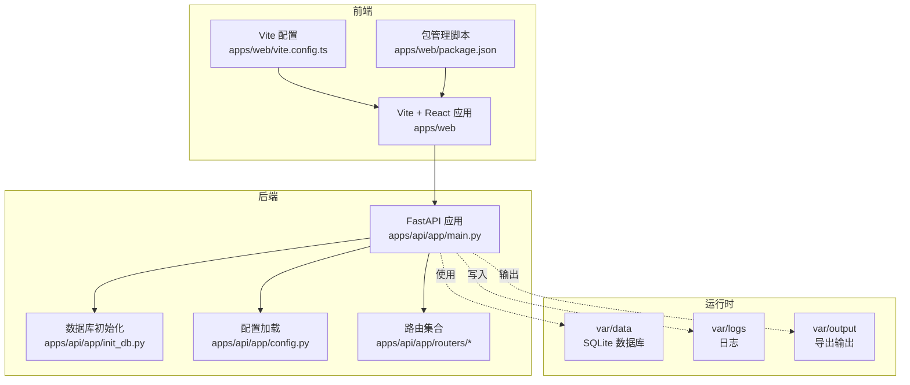
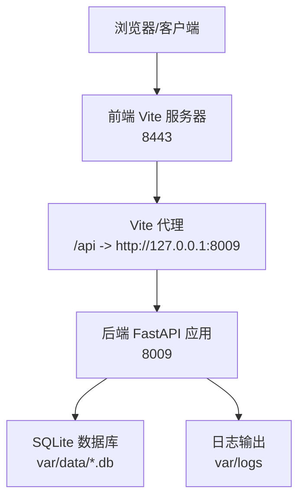
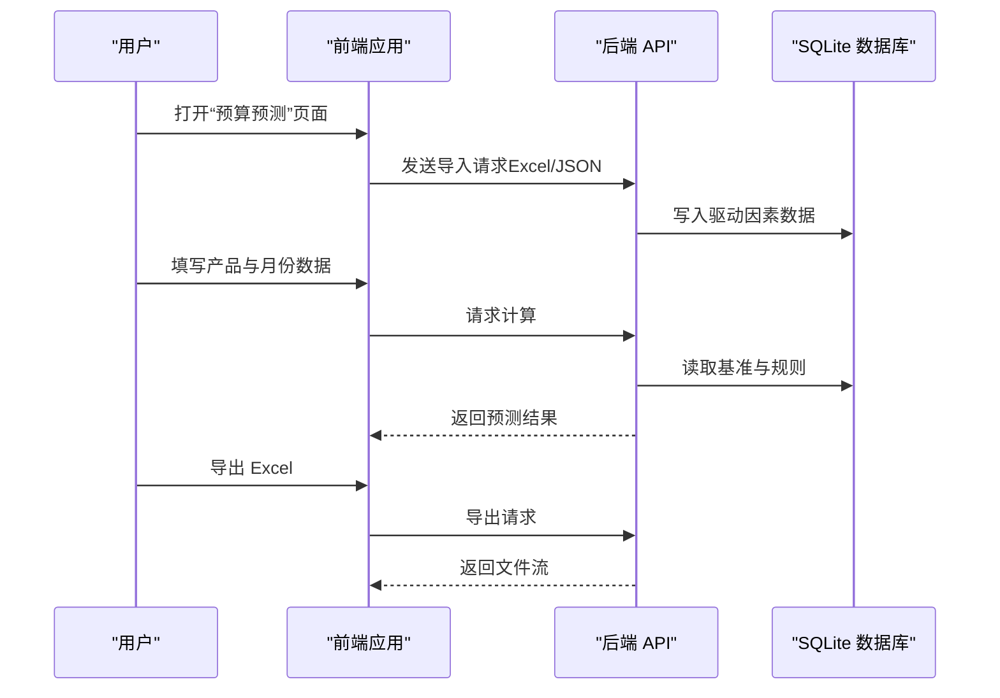
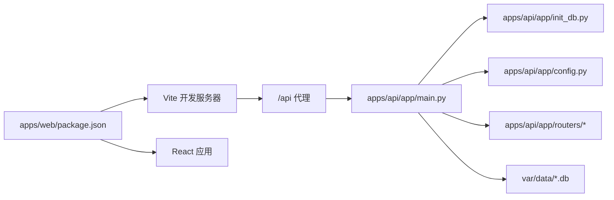

# 快速开始指南

<cite>
**本文引用的文件**
- [README.md](file://README.md)
- [start.sh](file://start.sh)
- [stop.sh](file://stop.sh)
- [apps/api/pyproject.toml](file://apps/api/pyproject.toml)
- [apps/api/requirements.txt](file://apps/api/requirements.txt)
- [apps/api/run_server.py](file://apps/api/run_server.py)
- [apps/api/app/config.py](file://apps/api/app/config.py)
- [apps/api/app/init_db.py](file://apps/api/app/init_db.py)
- [apps/api/app/main.py](file://apps/api/app/main.py)
- [apps/api/app/routers/budget_simulation.py](file://apps/api/app/routers/budget_simulation.py)
- [apps/web/package.json](file://apps/web/package.json)
- [apps/web/vite.config.ts](file://apps/web/vite.config.ts)
- [apps/web/src/app/App.tsx](file://apps/web/src/app/App.tsx)
</cite>

## 目录
1. [简介](#简介)
2. [项目结构](#项目结构)
3. [核心组件](#核心组件)
4. [架构总览](#架构总览)
5. [详细组件分析](#详细组件分析)
6. [依赖关系分析](#依赖关系分析)
7. [性能注意事项](#性能注意事项)
8. [故障排除指南](#故障排除指南)
9. [结论](#结论)
10. [附录](#附录)

## 简介
本指南面向首次接触智能预算预测系统的用户，帮助你在约30分钟内完成环境准备、安装与启动，并成功运行第一个预算预测任务。系统采用前后端分离架构：后端基于 FastAPI 提供 REST 接口与数据库初始化；前端基于 Vite + React 提供可视化界面与交互体验。

## 项目结构
- 后端应用位于 apps/api，包含 FastAPI 应用、数据库初始化脚本、路由与服务层。
- 前端应用位于 apps/web，包含 Vite + React 前端工程、构建与开发脚本。
- 运行时数据与日志位于 var 目录，包含 var/data（SQLite 数据库）、var/logs、var/output 等。
- 根目录提供一键启动/停止脚本 start.sh 与 stop.sh，便于快速搭建测试环境。

图表来源
- [apps/api/app/main.py:109-119](file://apps/api/app/main.py#L109-L119)
- [apps/api/app/init_db.py:142-284](file://apps/api/app/init_db.py#L142-L284)
- [apps/api/app/config.py:9-40](file://apps/api/app/config.py#L9-L40)
- [apps/web/vite.config.ts:1-22](file://apps/web/vite.config.ts#L1-L22)
- [apps/web/package.json:6-14](file://apps/web/package.json#L6-L14)

章节来源
- [README.md:7-21](file://README.md#L7-L21)
- [apps/api/app/main.py:109-119](file://apps/api/app/main.py#L109-L119)

## 核心组件
- 后端服务
  - FastAPI 应用：负责注册路由、中间件与生命周期管理。
  - 数据库初始化：自动创建并同步数据库结构、种子数据与运行时校验。
  - 配置系统：集中管理路径、CORS、AI 服务参数与飞书机器人配置。
- 前端服务
  - Vite 开发服务器：提供热更新与代理转发至后端。
  - React 应用：通过 API 调用实现预算预测、导入导出与报表生成。
- 运行控制
  - start.sh：一键启动后端与前端，自动处理依赖安装与日志输出。
  - stop.sh：优雅关闭服务并清理端口占用。

章节来源
- [apps/api/app/main.py:102-119](file://apps/api/app/main.py#L102-L119)
- [apps/api/app/init_db.py:142-284](file://apps/api/app/init_db.py#L142-L284)
- [apps/api/app/config.py:9-40](file://apps/api/app/config.py#L9-L40)
- [apps/web/vite.config.ts:5-21](file://apps/web/vite.config.ts#L5-L21)
- [start.sh:111-179](file://start.sh#L111-L179)
- [stop.sh:13-122](file://stop.sh#L13-L122)

## 架构总览
系统采用“前端代理 + 后端 API + 本地 SQLite”的轻量级架构。前端通过 /api 代理访问后端，后端在启动时完成数据库初始化与服务注册，随后对外提供预算预测、导入导出、报表生成等能力。

图表来源
- [apps/web/vite.config.ts:17-19](file://apps/web/vite.config.ts#L17-L19)
- [apps/api/app/main.py:109-119](file://apps/api/app/main.py#L109-L119)
- [start.sh:182-187](file://start.sh#L182-L187)

## 详细组件分析

### 环境要求
- 操作系统
  - 支持 macOS/Linux；Windows 未在仓库中声明官方支持。
- Python 版本
  - 后端要求 Python >= 3.10（运行器检查），推荐使用 3.11+。
- Node.js 版本
  - 前端使用 Vite 6 与 TypeScript，建议使用 Node.js LTS（如 18.x/20.x）。
- 其他依赖
  - 后端依赖 SQLite（aiosqlite）、FastAPI、Uvicorn 等；前端依赖 React、Vite、TailwindCSS 等。

章节来源
- [apps/api/run_server.py:17-23](file://apps/api/run_server.py#L17-L23)
- [apps/api/pyproject.toml:5-24](file://apps/api/pyproject.toml#L5-L24)
- [apps/web/package.json:1-34](file://apps/web/package.json#L1-L34)

### 安装步骤
- 安装后端依赖
  - 使用 pip 或 uv 安装后端依赖（推荐 uv）。
  - 依赖清单可参考 requirements.txt 或 pyproject.toml。
- 安装前端依赖
  - 在 apps/web 目录下执行 npm install，自动安装 Vite、React、TailwindCSS 等。
- 初始化数据库
  - 首次启动后端会自动创建并初始化数据库文件于 var/data。
  - 如需手动初始化，可直接运行数据库初始化脚本。

章节来源
- [apps/api/requirements.txt:1-18](file://apps/api/requirements.txt#L1-L18)
- [apps/api/pyproject.toml:6-24](file://apps/api/pyproject.toml#L6-L24)
- [apps/api/app/init_db.py:142-284](file://apps/api/app/init_db.py#L142-L284)

### 启动与停止服务
- 启动
  - 使用一键脚本：bash start.sh 将同时启动后端（FastAPI）与前端（Vite）。
  - 默认端口：后端 8009，前端 8443；前端 /api 代理指向后端。
  - 若需后台运行且无 screen，脚本会以 nohup 方式启动并记录 PID。
- 停止
  - 使用一键脚本：bash stop.sh 将停止 screen 会话、终止进程并清理端口占用。

章节来源
- [README.md:23-49](file://README.md#L23-L49)
- [start.sh:111-179](file://start.sh#L111-L179)
- [stop.sh:13-122](file://stop.sh#L13-L122)

### 开发环境与生产环境差异
- 开发环境
  - 后端支持 --reload 参数（start.sh 中可通过 BACKEND_RELOAD=1 触发），便于热更新。
  - 前端支持 --host 与 LAN 访问，便于局域网联调。
- 生产环境
  - 建议使用 screen 或 systemd 管理后端进程，避免 --reload。
  - 前端构建后通过静态服务器部署，后端提供稳定 API 服务。
- 配置差异
  - CORS、AI 服务地址与密钥、飞书机器人参数等在配置文件中集中管理，按环境切换。

章节来源
- [apps/web/package.json:9-9](file://apps/web/package.json#L9-L9)
- [apps/api/run_server.py:12-12](file://apps/api/run_server.py#L12-L12)
- [apps/api/app/config.py:21-37](file://apps/api/app/config.py#L21-L37)

### 第一个预算预测任务操作示例
- 步骤一：启动服务
  - 执行 bash start.sh，等待后端与前端启动完成。
- 步骤二：登录与权限
  - 首次启动会在数据库中写入本地演示用户信息，用于本地调试。
- 步骤三：进入预算预测
  - 在前端导航中找到“预算预测”相关页面（例如预算预测驱动页面）。
- 步骤四：准备数据
  - 使用页面提供的 Excel/JSON 导入功能上传驱动因素数据。
- 步骤五：执行计算
  - 根据页面指引填写产品维度与月份数据，触发公式重算。
- 步骤六：查看结果与导出
  - 查看预测结果表格，必要时导出 Excel 报表。

图表来源
- [apps/api/app/routers/budget_simulation.py:29-70](file://apps/api/app/routers/budget_simulation.py#L29-L70)
- [apps/api/app/main.py:286-291](file://apps/api/app/main.py#L286-L291)

章节来源
- [apps/api/app/init_db.py:92-93](file://apps/api/app/init_db.py#L92-L93)
- [apps/web/src/app/App.tsx](file://apps/web/src/app/App.tsx)

## 依赖关系分析
后端应用在启动时完成数据库初始化与服务注册，前端通过 Vite 代理访问后端 API。整体依赖关系如下：

图表来源
- [apps/web/package.json:6-14](file://apps/web/package.json#L6-L14)
- [apps/web/vite.config.ts:17-19](file://apps/web/vite.config.ts#L17-L19)
- [apps/api/app/main.py:109-119](file://apps/api/app/main.py#L109-L119)
- [apps/api/app/init_db.py:142-284](file://apps/api/app/init_db.py#L142-L284)
- [apps/api/app/config.py:9-40](file://apps/api/app/config.py#L9-L40)

章节来源
- [apps/api/app/main.py:102-119](file://apps/api/app/main.py#L102-L119)
- [apps/web/vite.config.ts:17-19](file://apps/web/vite.config.ts#L17-L19)

## 性能注意事项
- 后端启动时会进行数据库结构校验与种子数据注入，首次启动可能耗时较长。
- 前端开发模式下启用热更新与代理，适合本地联调；生产部署建议构建静态资源并关闭代理。
- 大数据量导入时建议分批处理，避免长时间阻塞。

## 故障排除指南
- 端口被占用
  - 后端默认 8009，前端默认 8443；若端口占用，start.sh 会提示并跳过启动。
  - 使用 stop.sh 清理占用端口或手动结束进程。
- 依赖缺失
  - 后端依赖（如 aiosqlite、FastAPI、Uvicorn）需正确安装。
  - 前端依赖（Rollup 平台特定可选包）在某些 Linux 环境可能缺失，脚本会检测并提示重新安装。
- CORS 跨域问题
  - 配置文件中定义了允许的来源列表，确保前端访问地址在允许范围内。
- 日志定位
  - 后端与前端日志分别输出到 var/logs 下，便于排查问题。

章节来源
- [start.sh:43-46](file://start.sh#L43-L46)
- [start.sh:93-109](file://start.sh#L93-L109)
- [apps/api/app/config.py:21-23](file://apps/api/app/config.py#L21-L23)
- [stop.sh:80-111](file://stop.sh#L80-L111)

## 结论
按照本指南，你可以在约30分钟内完成环境准备、安装与启动，并成功运行第一个预算预测任务。如需进一步扩展，请参考各模块的路由与服务实现，结合配置文件进行定制化部署。

## 附录
- 常用命令
  - 启动：bash start.sh
  - 停止：bash stop.sh
  - 前端开发：npm run dev（apps/web）
  - 后端开发：python3 run_server.py（apps/api）

章节来源
- [README.md:23-49](file://README.md#L23-L49)
- [apps/web/package.json:6-14](file://apps/web/package.json#L6-L14)
- [apps/api/run_server.py:8-29](file://apps/api/run_server.py#L8-L29)