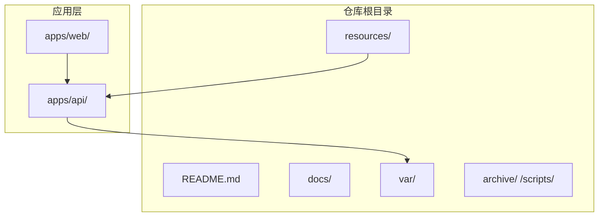
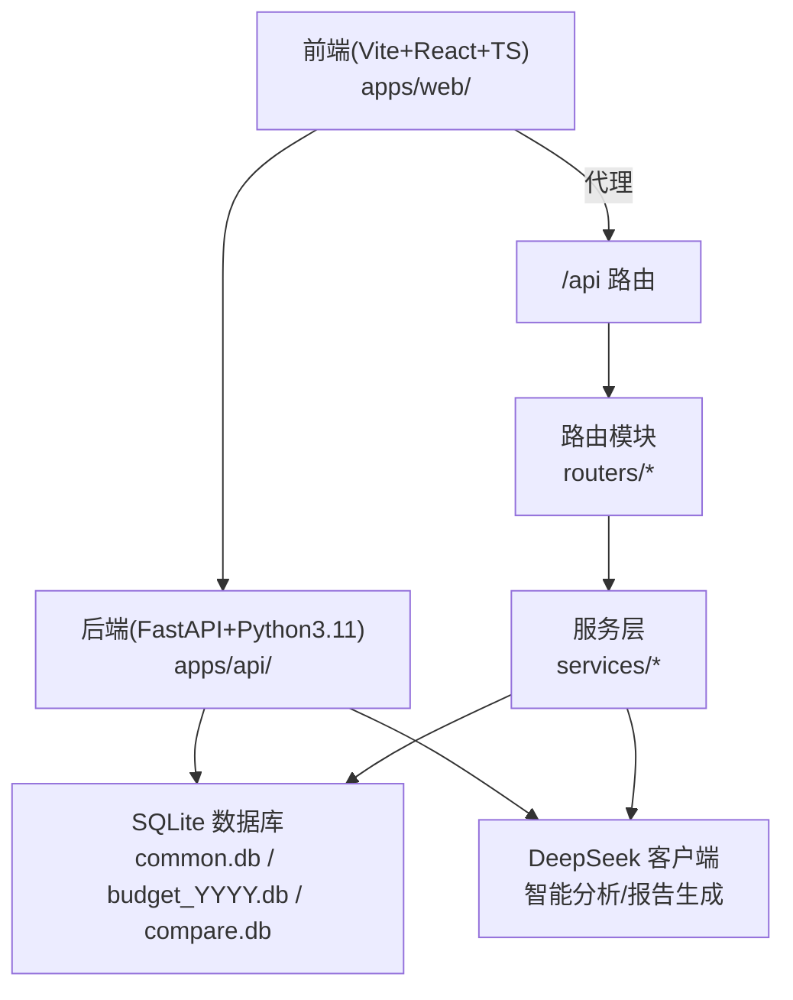
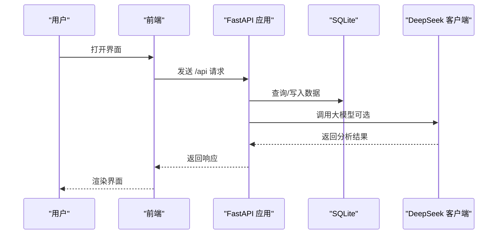
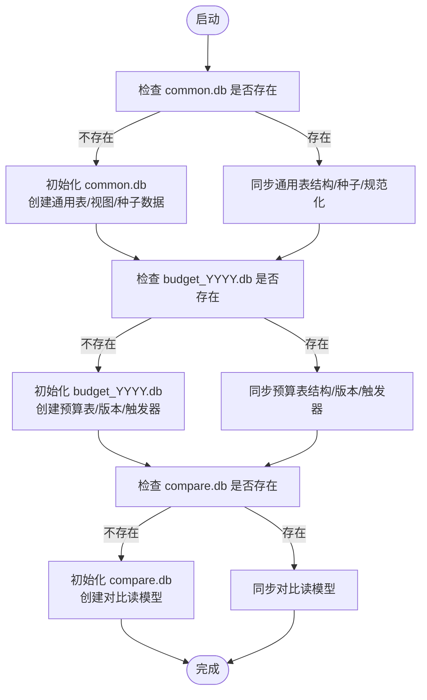
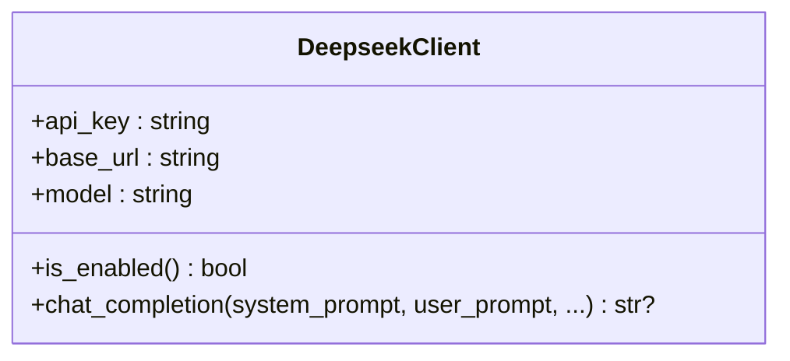
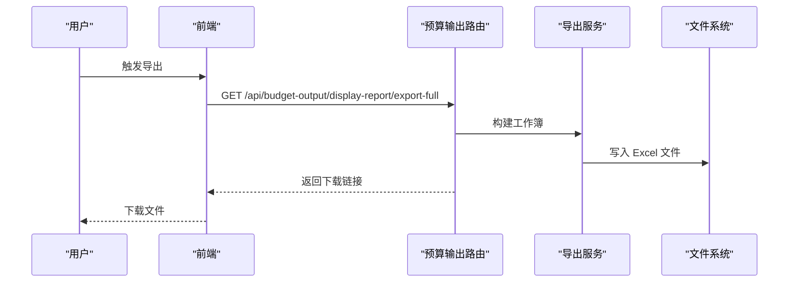
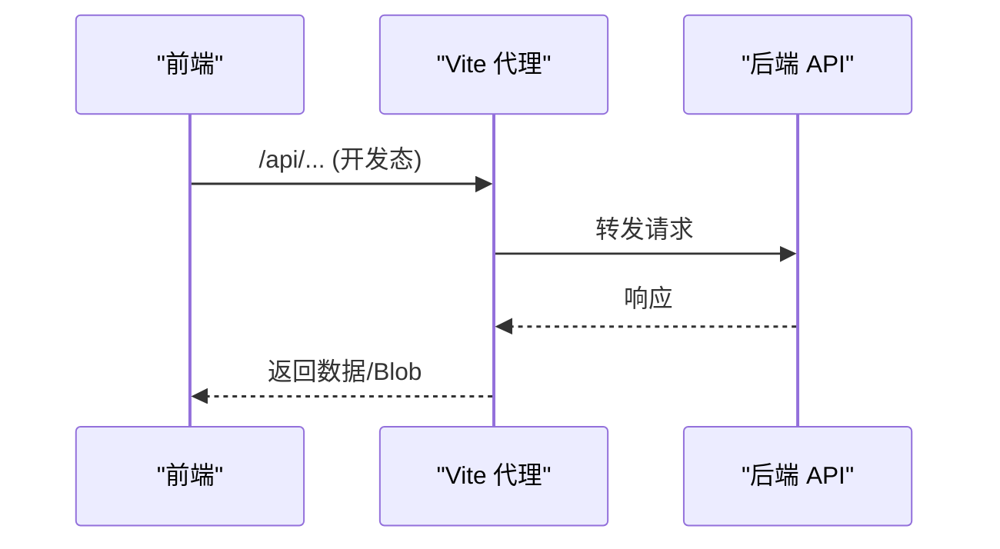
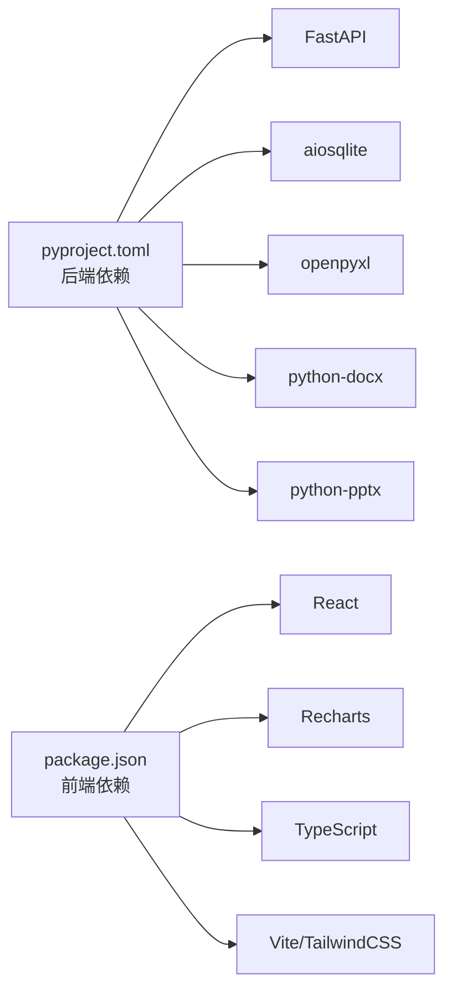

# 技术架构概览

<cite>
**本文档引用的文件**
- [README.md](file://README.md)
- [apps/api/pyproject.toml](file://apps/api/pyproject.toml)
- [apps/web/package.json](file://apps/web/package.json)
- [apps/api/run_server.py](file://apps/api/run_server.py)
- [apps/api/app/main.py](file://apps/api/app/main.py)
- [apps/api/app/config.py](file://apps/api/app/config.py)
- [apps/api/app/db_paths.py](file://apps/api/app/db_paths.py)
- [apps/api/app/init_db.py](file://apps/api/app/init_db.py)
- [apps/api/app/deepseek_client.py](file://apps/api/app/deepseek_client.py)
- [apps/api/app/routers/budget_output.py](file://apps/api/app/routers/budget_output.py)
- [apps/api/app/services/budget_output_export.py](file://apps/api/app/services/budget_output_export.py)
- [apps/api/app/services/smart_ppt_service.py](file://apps/api/app/services/smart_ppt_service.py)
- [apps/api/app/services/smart_report_service.py](file://apps/api/app/services/smart_report_service.py)
- [apps/web/vite.config.ts](file://apps/web/vite.config.ts)
- [apps/web/src/lib/api.ts](file://apps/web/src/lib/api.ts)
</cite>

## 目录
1. [引言](#引言)
2. [项目结构](#项目结构)
3. [核心组件](#核心组件)
4. [架构总览](#架构总览)
5. [详细组件分析](#详细组件分析)
6. [依赖关系分析](#依赖关系分析)
7. [性能考量](#性能考量)
8. [故障排除指南](#故障排除指南)
9. [结论](#结论)
10. [附录](#附录)

## 引言
本文件面向“智能预算预测系统”的技术架构，聚焦于前后端技术栈、monorepo 架构组织、数据库与AI服务集成、以及文件导入导出能力。系统采用 FastAPI + Python 3.11 作为后端，Vite + React + TypeScript 作为前端，统一通过 SQLite 存储核心数据，并集成 DeepSeek 大模型进行智能分析与报告生成。同时，系统提供 Excel/Word/PPT 的导入导出能力，覆盖预算展示、预测与报告自动化等关键场景。

## 项目结构
仓库采用 monorepo 结构，按职责划分目录：
- apps/web：前端应用（Vite + React + TypeScript），负责用户界面与交互。
- apps/api：后端应用（FastAPI + Python 3.11），提供 REST API、业务逻辑与数据处理。
- resources：知识库、模板与业务资源。
- var：本地数据库、日志、输出与临时文件。
- docs：产品与开发文档。
- 其他目录用于归档与历史交付。

**章节来源**
- [README.md:1-62](file://README.md#L1-L62)

## 核心组件
- 后端框架：FastAPI + Python 3.11，提供高性能异步 API 与中间件生态。
- 前端框架：Vite + React + TypeScript，提供现代化开发体验与类型安全。
- 数据库：SQLite（多库模式：common.db、budget_YYYY.db、compare.db），通过初始化脚本与迁移工具维护一致性。
- AI 服务：DeepSeek 大模型客户端封装，支持对话式分析与报告生成。
- 导入导出：基于 openpyxl、python-docx、python-pptx 等库实现 Excel/Word/PPT 的读写与渲染。
- 代理与跨域：前端通过 Vite 代理转发 /api 请求至后端，后端启用 CORS 中间件。

**章节来源**
- [apps/api/pyproject.toml:1-33](file://apps/api/pyproject.toml#L1-L33)
- [apps/web/package.json:1-34](file://apps/web/package.json#L1-L34)
- [apps/api/app/config.py:9-41](file://apps/api/app/config.py#L9-L41)
- [apps/api/app/db_paths.py:6-29](file://apps/api/app/db_paths.py#L6-L29)
- [apps/api/app/init_db.py:142-290](file://apps/api/app/init_db.py#L142-L290)
- [apps/api/app/deepseek_client.py:9-70](file://apps/api/app/deepseek_client.py#L9-L70)
- [apps/web/vite.config.ts:1-22](file://apps/web/vite.config.ts#L1-L22)
- [apps/api/app/main.py:109-119](file://apps/api/app/main.py#L109-L119)

## 架构总览
系统采用前后端分离与 monorepo 组织，前端通过代理访问后端 API，后端以 FastAPI 提供统一接口，内部按领域模块化组织路由与服务，数据库采用 SQLite 并通过初始化脚本确保结构一致。AI 能力通过 DeepSeek 客户端注入到报告与演示服务中，形成“数据-算法-产出”的闭环。

**图表来源**
- [apps/api/app/main.py:109-412](file://apps/api/app/main.py#L109-L412)
- [apps/api/app/db_paths.py:6-29](file://apps/api/app/db_paths.py#L6-L29)
- [apps/api/app/deepseek_client.py:9-70](file://apps/api/app/deepseek_client.py#L9-L70)
- [apps/web/vite.config.ts:1-22](file://apps/web/vite.config.ts#L1-L22)

**章节来源**
- [apps/api/app/main.py:109-412](file://apps/api/app/main.py#L109-L412)
- [apps/api/app/config.py:9-41](file://apps/api/app/config.py#L9-L41)
- [apps/api/app/db_paths.py:6-29](file://apps/api/app/db_paths.py#L6-L29)
- [apps/api/app/init_db.py:142-290](file://apps/api/app/init_db.py#L142-L290)
- [apps/api/app/deepseek_client.py:9-70](file://apps/api/app/deepseek_client.py#L9-L70)
- [apps/web/vite.config.ts:1-22](file://apps/web/vite.config.ts#L1-L22)

## 详细组件分析

### 后端应用与生命周期
- 应用入口：FastAPI 实例注册健康检查、模板、全局中间件与各类路由。
- 生命周期钩子：启动时确保数据库存在并初始化，后台启动飞书机器人（如启用）。
- 认证与会话：内置认证中间件与会话上下文加载，支持权限策略与密码策略校验。
- 路由组织：按业务域拆分路由模块（预算、执行、预测、BI 映射、图表等），统一挂载到应用。

**图表来源**
- [apps/api/app/main.py:109-412](file://apps/api/app/main.py#L109-L412)
- [apps/api/app/deepseek_client.py:9-70](file://apps/api/app/deepseek_client.py#L9-L70)
- [apps/api/app/db_paths.py:6-29](file://apps/api/app/db_paths.py#L6-L29)

**章节来源**
- [apps/api/app/main.py:109-412](file://apps/api/app/main.py#L109-L412)
- [apps/api/run_server.py:16-35](file://apps/api/run_server.py#L16-L35)

### 数据库设计与初始化
- 多库模式：common.db（通用表与配置）、budget_YYYY.db（预算事实与版本）、compare.db（对比读模型）。
- 初始化流程：首次运行或缺失时创建数据库与核心表结构，同步预算版本、BI 映射、指标树、预算输出展示等；后续运行进行增量同步与校验。
- 读模型：预算摘要与对比读模型在初始化阶段同步，保证查询性能与一致性。

**图表来源**
- [apps/api/app/init_db.py:142-290](file://apps/api/app/init_db.py#L142-L290)
- [apps/api/app/db_paths.py:6-29](file://apps/api/app/db_paths.py#L6-L29)

**章节来源**
- [apps/api/app/init_db.py:142-290](file://apps/api/app/init_db.py#L142-L290)
- [apps/api/app/db_paths.py:6-29](file://apps/api/app/db_paths.py#L6-L29)

### AI 服务集成（DeepSeek）
- 客户端封装：支持配置 API Key、Base URL、Model，提供带重试与错误处理的聊天补全接口。
- 使用场景：智能报告解析（Word）、报告蓝图生成、PPT 场景参数渲染与图表数据取数。
- 错误处理：对 5xx 与限流（429）进行退避重试，异常时返回 None 并记录日志。

**图表来源**
- [apps/api/app/deepseek_client.py:9-70](file://apps/api/app/deepseek_client.py#L9-L70)

**章节来源**
- [apps/api/app/deepseek_client.py:9-70](file://apps/api/app/deepseek_client.py#L9-L70)
- [apps/api/app/services/smart_report_service.py:161-213](file://apps/api/app/services/smart_report_service.py#L161-L213)
- [apps/api/app/services/smart_ppt_service.py:215-289](file://apps/api/app/services/smart_ppt_service.py#L215-L289)

### 文件导入导出（Excel/Word/PPT）
- Excel 导出：预算展示报表导出为 Excel，支持多版本、多维度、公式回填与样式美化。
- Word 导入：智能报告解析（AI），支持从 Word 中抽取结构化块、度量与问题项。
- PPT 生成：根据场景模板与参数生成演示文稿，支持多种图表类型与数据绑定。

**图表来源**
- [apps/api/app/routers/budget_output.py:143-161](file://apps/api/app/routers/budget_output.py#L143-L161)
- [apps/api/app/services/budget_output_export.py:506-638](file://apps/api/app/services/budget_output_export.py#L506-L638)

**章节来源**
- [apps/api/app/routers/budget_output.py:143-161](file://apps/api/app/routers/budget_output.py#L143-L161)
- [apps/api/app/services/budget_output_export.py:506-638](file://apps/api/app/services/budget_output_export.py#L506-L638)
- [apps/api/app/services/smart_report_service.py:161-213](file://apps/api/app/services/smart_report_service.py#L161-L213)
- [apps/api/app/services/smart_ppt_service.py:215-289](file://apps/api/app/services/smart_ppt_service.py#L215-L289)

### 前端通信与代理
- 代理配置：前端通过 Vite 将 /api 代理到后端地址，默认 127.0.0.1:8009。
- API 封装：统一的 fetch 工具，支持 JSON、Blob、表单上传与下载文件名解析。
- 会话保持：请求携带 cookies，确保后端认证与会话正常。

**图表来源**
- [apps/web/vite.config.ts:17-19](file://apps/web/vite.config.ts#L17-L19)
- [apps/web/src/lib/api.ts:23-63](file://apps/web/src/lib/api.ts#L23-L63)

**章节来源**
- [apps/web/vite.config.ts:1-22](file://apps/web/vite.config.ts#L1-L22)
- [apps/web/src/lib/api.ts:1-132](file://apps/web/src/lib/api.ts#L1-L132)

## 依赖关系分析
- 技术栈依赖：后端依赖 FastAPI、aiosqlite、pydantic、openpyxl、python-docx、python-pptx 等；前端依赖 React、Recharts、TailwindCSS、TypeScript 等。
- 运行时依赖：后端通过 uvicorn 提供 ASGI 服务；前端通过 Vite 提供开发服务器与构建工具链。
- 配置与路径：后端通过 Settings 统一管理数据目录、模板目录、知识库目录与 CORS 配置；数据库路径通过 db_paths 统一解析。

**图表来源**
- [apps/api/pyproject.toml:6-24](file://apps/api/pyproject.toml#L6-L24)
- [apps/web/package.json:15-32](file://apps/web/package.json#L15-L32)

**章节来源**
- [apps/api/pyproject.toml:1-33](file://apps/api/pyproject.toml#L1-L33)
- [apps/web/package.json:1-34](file://apps/web/package.json#L1-L34)
- [apps/api/app/config.py:9-41](file://apps/api/app/config.py#L9-L41)

## 性能考量
- 数据库性能：采用 SQLite 多库模式与读模型（预算摘要、对比读模型）提升查询效率；初始化阶段同步触发器与索引相关结构。
- 异步化：后端使用 aiosqlite 与 FastAPI 异步特性，减少阻塞；前端通过并发请求优化用户体验。
- 导出性能：Excel 导出采用流式写入与批量样式设置，避免内存峰值；图表渲染使用 Agg 后端，适合无 GUI 环境。
- 缓存与复用：报告与图表缓存目录（chart_cache）减少重复计算；模板版本化管理，便于快速迭代。

## 故障排除指南
- 启动失败（Python 版本）：后端启动脚本要求 Python 3.10+，低于要求会报错退出。
- CORS 与代理：前端代理默认指向 127.0.0.1:8009，需确保后端已启动；后端 CORS 配置需包含前端地址。
- 数据库初始化：若数据库缺失或结构不一致，初始化脚本会自动修复；如出现异常，检查 var/data 权限与磁盘空间。
- AI 服务：DeepSeek 客户端对 5xx 与 429 进行退避重试；若未配置 API Key，则相关功能降级为不可用。
- 导出异常：Excel 导出失败通常与权限或磁盘空间有关；Word/PPT 解析失败可能由于文件格式不符或内容为空。

**章节来源**
- [apps/api/run_server.py:16-35](file://apps/api/run_server.py#L16-L35)
- [apps/api/app/main.py:109-119](file://apps/api/app/main.py#L109-L119)
- [apps/api/app/deepseek_client.py:46-69](file://apps/api/app/deepseek_client.py#L46-L69)
- [apps/api/app/services/budget_output_export.py:506-638](file://apps/api/app/services/budget_output_export.py#L506-L638)

## 结论
本系统通过 FastAPI + React 的现代技术栈，结合 SQLite 的轻量存储与 DeepSeek 的智能能力，实现了预算预测、展示与报告的自动化闭环。monorepo 组织提升了协作效率与交付质量，而完善的导入导出能力则保障了与业务流程的无缝衔接。建议在生产环境中强化监控与日志，完善备份与灾备策略，并持续优化数据库与 AI 服务的性能与稳定性。

## 附录
- 端口约定：前端开发端口 8443，后端开发端口 8009；代理固定为 /api -> 127.0.0.1:8009。
- 命令示例：安装依赖、启动前端、启动后端、构建与预览、端到端测试等。
- 交付与验证：提供完整运行包与源码审核包两类交付门禁，确保合规与可审计性。

**章节来源**
- [README.md:23-62](file://README.md#L23-L62)