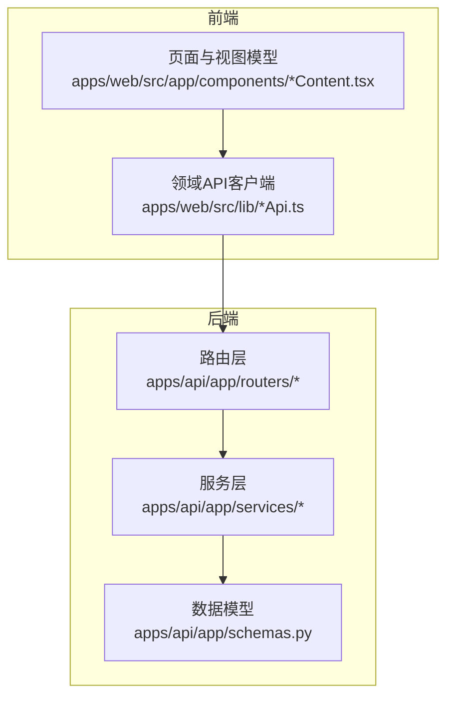
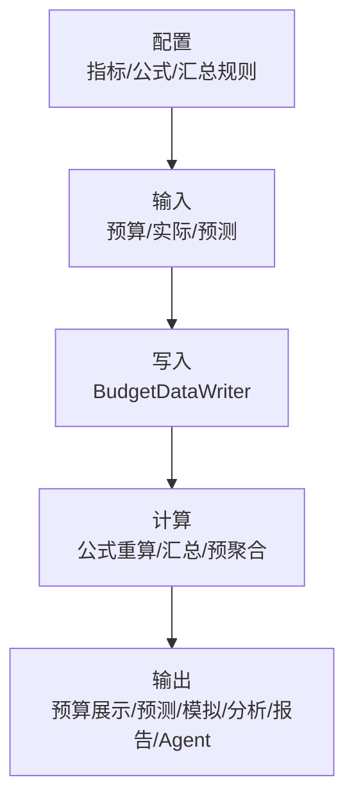
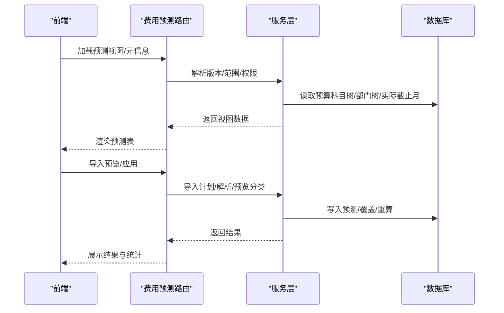
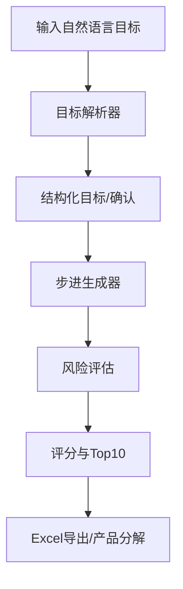
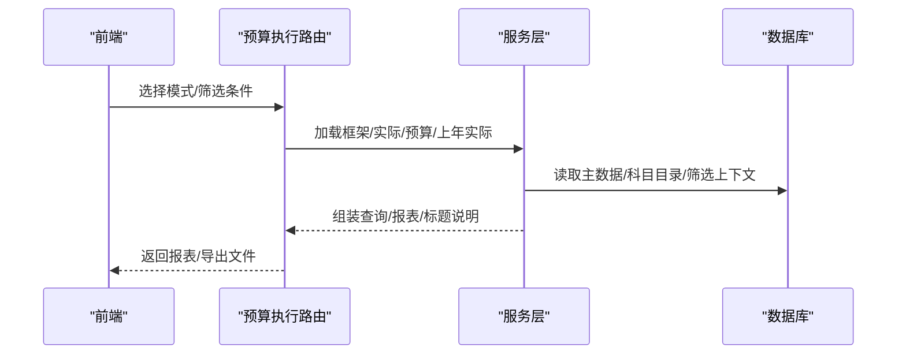
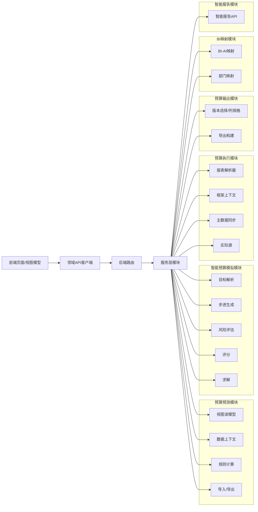

# 核心功能模块简介

<cite>
**本文档引用的文件**
- [Banking_Budget_System_PDD.md](file://docs/product/Banking_Budget_System_PDD.md)
- [2026-06-12-intelligent-budget-simulation.md](file://docs/superpowers/plans/2026-06-12-intelligent-budget-simulation.md)
- [department-expense-module-map.md](file://docs/development/department-expense-module-map.md)
- [HIDDEN_MODULE_AUDIT.md](file://.scratch/architecture-deep-clean/HIDDEN_MODULE_AUDIT.md)
- [CODEBASE_REDUCTION_AUDIT.md](file://.scratch/architecture-deep-clean/CODEBASE_REDUCTION_AUDIT.md)
- [2026-06-12-business-framework-two-pages.html](file://docs/superpowers/specs/2026-06-12-business-framework-two-pages.html)
- [budget_output_display.py](file://apps/api/app/services/budget_output_display.py)
- [budget_output_export.py](file://apps/api/app/services/budget_output_export.py)
- [expense_forecast_export.py](file://apps/api/app/services/expense_forecast_export.py)
- [expense_forecast_import_plan.py](file://apps/api/app/services/expense_forecast_import_plan.py)
- [expense_forecast_import_preview.py](file://apps/api/app/services/expense_forecast_import_preview.py)
- [expense_forecast_import_apply.py](file://apps/api/app/services/expense_forecast_import_apply.py)
- [expense_forecast_rule_calculation.py](file://apps/api/app/services/expense_forecast_rule_calculation.py)
- [expense_forecast_data_context.py](file://apps/api/app/services/expense_forecast_data_context.py)
- [expense_forecast_view_model.py](file://apps/api/app/services/expense_forecast_view_model.py)
- [expense_budget_execution_report_resolver.py](file://apps/api/app/services/expense_budget_execution_report_resolver.py)
- [bi_ai_subject_mapping.py](file://apps/api/app/services/bi_ai_subject_mapping.py)
- [bi_department_mapping.py](file://apps/api/app/services/bi_department_mapping.py)
- [intelligent_budget_risk.py](file://apps/api/app/services/intelligent_budget_risk.py)
- [intelligent_budget_steps.py](file://apps/api/app/services/intelligent_budget_steps.py)
- [intelligent_budget_scoring.py](file://apps/api/app/services/intelligent_budget_scoring.py)
- [intelligent_budget_target_parser.py](file://apps/api/app/services/intelligent_budget_target_parser.py)
- [intelligent_budget_solver.py](file://apps/api/app/services/intelligent_budget_solver.py)
- [budgetActualBatchApi.ts](file://apps/web/src/lib/budgetActualBatchApi.ts)
- [expenseForecastViewModel.ts](file://apps/web/src/lib/expenseForecastViewModel.ts)
- [BiMappingContent.tsx](file://apps/web/src/app/components/BiMappingContent.tsx)
- [smartReportApi.ts](file://apps/web/src/lib/smartReportApi.ts)
</cite>

## 目录
1. [引言](#引言)
2. [项目结构](#项目结构)
3. [核心组件](#核心组件)
4. [架构总览](#架构总览)
5. [详细组件分析](#详细组件分析)
6. [依赖分析](#依赖分析)
7. [性能考虑](#性能考虑)
8. [故障排查指南](#故障排查指南)
9. [结论](#结论)
10. [附录](#附录)

## 引言
本文件面向智能预算预测系统的核心功能模块，围绕六大模块进行系统化介绍：预算预测模块、智能预算模拟模块、预算执行模块、预算输出模块、BI映射模块、智能报告模块。内容涵盖模块职责、应用场景、模块间依赖与数据流转，并提供模块功能对比表，帮助用户快速理解各模块特点与适用场景。同时强调模块化设计在可扩展性与可维护性方面的优势。

## 项目结构
系统采用前后端分离的模块化架构：
- 后端（FastAPI）：按领域拆分为多个服务模块，每个模块聚焦特定业务面，如预算预测、预算执行、BI映射、智能报告等。
- 前端（React/TypeScript）：通过领域客户端封装HTTP接口，降低页面与后端耦合，提升可测试性与可维护性。

**图表来源**
- [HIDDEN_MODULE_AUDIT.md](file://.scratch/architecture-deep-clean/HIDDEN_MODULE_AUDIT.md)
- [CODEBASE_REDUCTION_AUDIT.md](file://.scratch/architecture-deep-clean/CODEBASE_REDUCTION_AUDIT.md)

**章节来源**
- [HIDDEN_MODULE_AUDIT.md](file://.scratch/architecture-deep-clean/HIDDEN_MODULE_AUDIT.md)
- [CODEBASE_REDUCTION_AUDIT.md](file://.scratch/architecture-deep-clean/CODEBASE_REDUCTION_AUDIT.md)

## 核心组件
六大核心模块职责与边界如下：
- 预算预测模块：负责费用预测表的视图装配、规则计算、导入/导出、实际截止月控制、追踪溯源等。
- 智能预算模拟模块：面向目标驱动的预算模拟工作台，包含目标解析、步骤生成、风险评估、评分与Top10解集输出。
- 预算执行模块：面向预算执行报表的多维度读模型与导出，支持月报格式、部门/科目模式、模板模式等。
- 预算输出模块：面向预算展示报表的配置、渲染与Excel导出，统一版本选择与列规格。
- BI映射模块：维护BI-AI科目映射与BI部门映射，支撑费用预测与执行的数据口径一致。
- 智能报告模块：提供智能报告模板、变量、AI检查与生成能力，支撑自动化报告生产。

**章节来源**
- [2026-06-12-intelligent-budget-simulation.md](file://docs/superpowers/plans/2026-06-12-intelligent-budget-simulation.md)
- [department-expense-module-map.md](file://docs/development/department-expense-module-map.md)
- [2026-06-12-business-framework-two-pages.html](file://docs/superpowers/specs/2026-06-12-business-framework-two-pages.html)

## 架构总览
系统遵循“配置 → 输入 → 写入 → 计算 → 输出”的闭环业务链路：
- 配置：机构及产品、指标、公式、数值类型、汇总规则。
- 输入：预算/实际/预测录入与导入。
- 写入：通过统一写入器写入预算事实。
- 计算：公式重算、横纵汇总、预聚合。
- 输出：预算展示、预测输出、模拟测算、透视分析、报告/PPT、Agent。

**图表来源**
- [2026-06-12-business-framework-two-pages.html](file://docs/superpowers/specs/2026-06-12-business-framework-two-pages.html)

**章节来源**
- [2026-06-12-business-framework-two-pages.html](file://docs/superpowers/specs/2026-06-12-business-framework-two-pages.html)

## 详细组件分析

### 预算预测模块
- 主要功能
  - 视图装配：按主体/事业群/费用归属部门与按预算科目两种视角，聚合预算科目树与部门树，输出预测表。
  - 规则计算：基于规则定义、参数与变量，逐月计算预测值，支持人工覆盖与系统测算协同。
  - 导入/导出：支持普通导出与按群组导出，统一Excel列与公式。
  - 实际截止月控制：根据实际导入截止月决定预测/实际列来源。
  - 追踪溯源：输出manual/auto/override三类月度来源与最终值。
- 关键服务
  - 视图读模型：装配预测树、权限过滤、规则/覆盖标记与年度业务指标。
  - 数据上下文：统一读取责任部门、预算科目树、管理部继承、实际数Adapter、手工预测、年度输入与预算映射。
  - 规则计算：余额分摊、逐月递增/系数、指标表达式、变量取数与测算依据。
  - 导入计划/预览/应用：单部门/群组/科目模式校验与解析。
- 应用场景
  - 月度预算预测编制、规则配置与重算、导入预览与批量应用、导出与追踪。

**图表来源**
- [expense_forecast_view_model.py](file://apps/api/app/services/expense_forecast_view_model.py)
- [expense_forecast_data_context.py](file://apps/api/app/services/expense_forecast_data_context.py)
- [expense_forecast_rule_calculation.py](file://apps/api/app/services/expense_forecast_rule_calculation.py)
- [expense_forecast_import_plan.py](file://apps/api/app/services/expense_forecast_import_plan.py)
- [expense_forecast_import_preview.py](file://apps/api/app/services/expense_forecast_import_preview.py)
- [expense_forecast_import_apply.py](file://apps/api/app/services/expense_forecast_import_apply.py)
- [expense_forecast_export.py](file://apps/api/app/services/expense_forecast_export.py)

**章节来源**
- [expense_forecast_view_model.py](file://apps/api/app/services/expense_forecast_view_model.py)
- [expense_forecast_data_context.py](file://apps/api/app/services/expense_forecast_data_context.py)
- [expense_forecast_rule_calculation.py](file://apps/api/app/services/expense_forecast_rule_calculation.py)
- [expense_forecast_import_plan.py](file://apps/api/app/services/expense_forecast_import_plan.py)
- [expense_forecast_import_preview.py](file://apps/api/app/services/expense_forecast_import_preview.py)
- [expense_forecast_import_apply.py](file://apps/api/app/services/expense_forecast_import_apply.py)
- [expense_forecast_export.py](file://apps/api/app/services/expense_forecast_export.py)

### 智能预算模拟模块
- 主要功能
  - 目标解析：自然语言目标解析为结构化JSON，支持确认提示。
  - 步骤生成：基于敏感度、夹紧与业务单位四舍五入生成候选步进。
  - 风险评估：推导NPL、NPL比率、拨备余额、超额拨备与规模稀释标志。
  - 评分与Top10：过滤硬约束失败后进行排名，输出Top10解卡。
  - Excel导出：导出解集详情与产品分解。
- 关键服务
  - 目标解析器：DeepSeek解析失败时回退到确定性解析。
  - 步进生成器：公式感知的步进策略。
  - 风险派生器：风险链路计算。
  - 评分器：可行性与排名。
  - 解读模型：Top10卡片与谈判建议。
- 应用场景
  - 正向/逆向模拟工作台、目标确认与解集评审、Excel导出与分享。

**图表来源**
- [intelligent_budget_target_parser.py](file://apps/api/app/services/intelligent_budget_target_parser.py)
- [intelligent_budget_steps.py](file://apps/api/app/services/intelligent_budget_steps.py)
- [intelligent_budget_risk.py](file://apps/api/app/services/intelligent_budget_risk.py)
- [intelligent_budget_scoring.py](file://apps/api/app/services/intelligent_budget_scoring.py)
- [intelligent_budget_solver.py](file://apps/api/app/services/intelligent_budget_solver.py)

**章节来源**
- [2026-06-12-intelligent-budget-simulation.md](file://docs/superpowers/plans/2026-06-12-intelligent-budget-simulation.md)
- [intelligent_budget_target_parser.py](file://apps/api/app/services/intelligent_budget_target_parser.py)
- [intelligent_budget_steps.py](file://apps/api/app/services/intelligent_budget_steps.py)
- [intelligent_budget_risk.py](file://apps/api/app/services/intelligent_budget_risk.py)
- [intelligent_budget_scoring.py](file://apps/api/app/services/intelligent_budget_scoring.py)
- [intelligent_budget_solver.py](file://apps/api/app/services/intelligent_budget_solver.py)

### 预算执行模块
- 主要功能
  - 多维度读模型：月报格式、部门模式、科目模式、模板模式。
  - 报表组装：按主体/事业群/费用归属部门聚合，支持本年实际/去年同期列展开。
  - 指标表格：业务费用、IT费用、日常费用分块，支持层级分组与进度指标。
  - 矩阵表格：动态预算科目列、预算/进度列组与层级分组。
  - 导出：统一工作簿公式、数据源元信息与单位缩放。
- 关键服务
  - 报表解析器：组装查询、月报/部门/科目响应标题与说明。
  - 框架上下文：工作簿解析、别名上下文、快照过滤与同步元数据。
  - 主数据同步：部门规划、科目匹配、备份创建与主表写入。
  - 实际源：原始明细读优先、月度回退读与快照写入。
- 应用场景
  - 月度预算执行报告、部门/科目对比分析、导出与审计。

**图表来源**
- [expense_budget_execution_report_resolver.py](file://apps/api/app/services/expense_budget_execution_report_resolver.py)

**章节来源**
- [expense_budget_execution_report_resolver.py](file://apps/api/app/services/expense_budget_execution_report_resolver.py)

### 预算输出模块
- 主要功能
  - 版本选择：基线版本与预测版本的智能选择与默认策略。
  - 列规格：统一预测、预测-预算、预算达成、同比等列与月度列。
  - Excel导出：构建带公式的工作簿，统一命名与文件流返回。
- 关键服务
  - 版本选择：基线版本提示词与候选池排序。
  - 列规格构建：差异列、比率列、同比列与月度列。
  - 导出构建：报表构建与工作簿生成。
- 应用场景
  - 年度预算展示全套报表生成与下载。

**章节来源**
- [budget_output_display.py](file://apps/api/app/services/budget_output_display.py)
- [budget_output_export.py](file://apps/api/app/services/budget_output_export.py)

### BI映射模块
- 主要功能
  - BI-AI科目映射：维护BI-AI科目与业务指标的映射关系。
  - BI部门映射：维护归口管理部门与费用归属部门的映射。
- 关键服务
  - BI-AI映射：Excel解析、种子/重载、空源容忍与列表DTO映射。
  - 部门映射：SQL、类别派生、自动生成功能与HTTP错误映射。
- 应用场景
  - 费用预测与执行的数据口径一致化，支撑导入与报表。

**章节来源**
- [bi_ai_subject_mapping.py](file://apps/api/app/services/bi_ai_subject_mapping.py)
- [bi_department_mapping.py](file://apps/api/app/services/bi_department_mapping.py)

### 智能报告模块
- 主要功能
  - 模板与变量：模板加载、变量占位与生成。
  - AI检查：文本块、问题检测、假设与警告提取。
  - 生成与下载：场景预览/生成、模板工作室与下载。
- 关键接口
  - 模板DTO、变量类型、AI检查块与问题项。
- 应用场景
  - 自动化报告生成与质量检查。

**章节来源**
- [smartReportApi.ts](file://apps/web/src/lib/smartReportApi.ts)

## 依赖分析
六大模块之间的依赖关系与数据流转如下：

**图表来源**
- [HIDDEN_MODULE_AUDIT.md](file://.scratch/architecture-deep-clean/HIDDEN_MODULE_AUDIT.md)
- [CODEBASE_REDUCTION_AUDIT.md](file://.scratch/architecture-deep-clean/CODEBASE_REDUCTION_AUDIT.md)

**章节来源**
- [HIDDEN_MODULE_AUDIT.md](file://.scratch/architecture-deep-clean/HIDDEN_MODULE_AUDIT.md)
- [CODEBASE_REDUCTION_AUDIT.md](file://.scratch/architecture-deep-clean/CODEBASE_REDUCTION_AUDIT.md)

## 性能考虑
- 服务层职责单一：每个模块的服务函数专注于特定读模型或命令，便于缓存与并发优化。
- 数据上下文集中：预测与执行模块共享实际截止月、主数据上下文，减少重复查询。
- 导出与报表构建：通过统一工作簿构建与列规格，降低前端重复计算与样式开销。
- 前端领域客户端：统一传输细节与下载逻辑，减少重复实现与网络开销。

## 故障排查指南
- 预算预测
  - 导入预览/应用异常：检查导入计划、解析器与预览分类逻辑，关注实际截止月与权限过滤。
  - 规则重算异常：核对规则头/参数/变量写入与计算结果持久化。
- 预算执行
  - 报表为空或列不一致：检查主数据同步与报表解析器的聚合与筛选。
  - 导出公式异常：核对工作簿公式与数据源元信息。
- 预算输出
  - 版本选择异常：检查基线版本提示词与候选池排序逻辑。
  - 列规格缺失：核对差异/比率/同比列与月度列构建。
- BI映射
  - 映射不生效：检查BI-AI与部门映射的Excel解析与种子/重载。
- 智能报告
  - 模板加载失败：检查模板DTO与变量占位，确认AI检查与生成流程。

**章节来源**
- [expense_forecast_import_preview.py](file://apps/api/app/services/expense_forecast_import_preview.py)
- [expense_forecast_rule_calculation.py](file://apps/api/app/services/expense_forecast_rule_calculation.py)
- [expense_budget_execution_report_resolver.py](file://apps/api/app/services/expense_budget_execution_report_resolver.py)
- [budget_output_display.py](file://apps/api/app/services/budget_output_display.py)
- [budget_output_export.py](file://apps/api/app/services/budget_output_export.py)
- [bi_ai_subject_mapping.py](file://apps/api/app/services/bi_ai_subject_mapping.py)
- [smartReportApi.ts](file://apps/web/src/lib/smartReportApi.ts)

## 结论
六大核心模块通过清晰的职责划分与稳定的领域接口，实现了预算预测、模拟、执行、输出、映射与报告的全链路贯通。模块化设计提升了系统的可扩展性与可维护性，服务层与前端领域的分离进一步增强了可测试性与演进弹性。建议在新增功能时遵循现有模块边界，优先通过服务层扩展与领域客户端封装，确保系统长期健康演进。

## 附录

### 模块功能对比表
- 预算预测模块：面向预测表的视图装配、规则计算、导入/导出与追踪溯源。
- 智能预算模拟模块：面向目标驱动的预算模拟工作台，包含目标解析、步骤生成、风险评估、评分与Top10解集输出。
- 预算执行模块：面向预算执行报表的多维度读模型与导出，支持月报格式、部门/科目模式、模板模式等。
- 预算输出模块：面向预算展示报表的配置、渲染与Excel导出，统一版本选择与列规格。
- BI映射模块：维护BI-AI科目映射与BI部门映射，支撑费用预测与执行的数据口径一致。
- 智能报告模块：提供智能报告模板、变量、AI检查与生成能力，支撑自动化报告生产。

**章节来源**
- [2026-06-12-business-framework-two-pages.html](file://docs/superpowers/specs/2026-06-12-business-framework-two-pages.html)
- [department-expense-module-map.md](file://docs/development/department-expense-module-map.md)
- [2026-06-12-intelligent-budget-simulation.md](file://docs/superpowers/plans/2026-06-12-intelligent-budget-simulation.md)