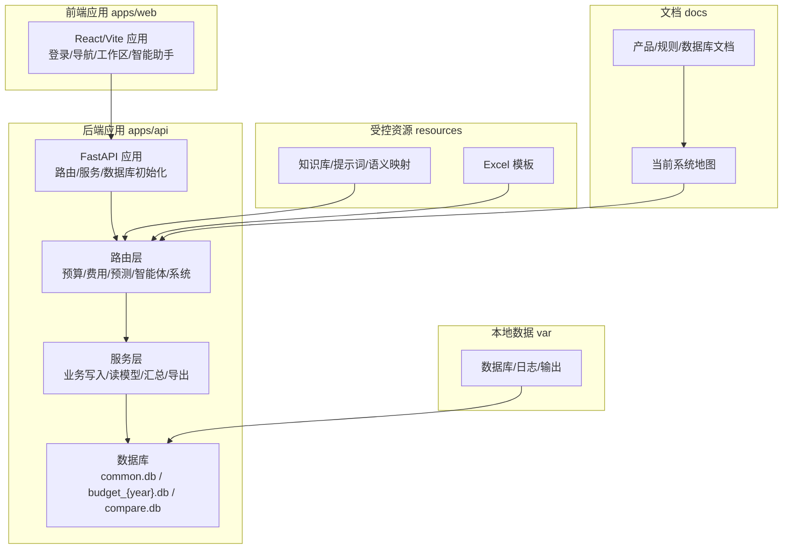
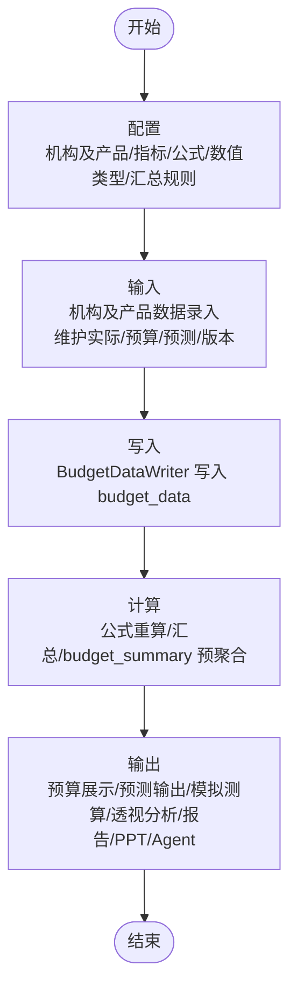
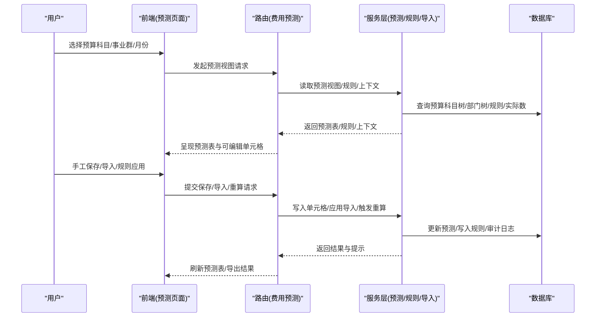
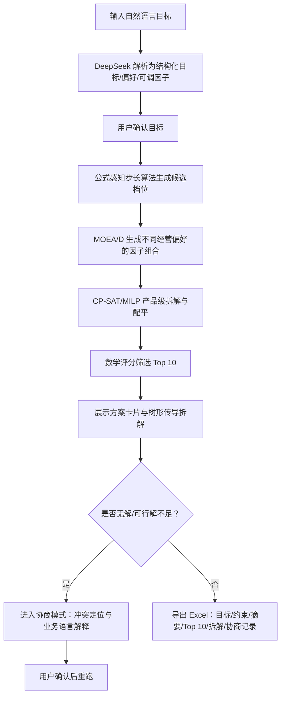
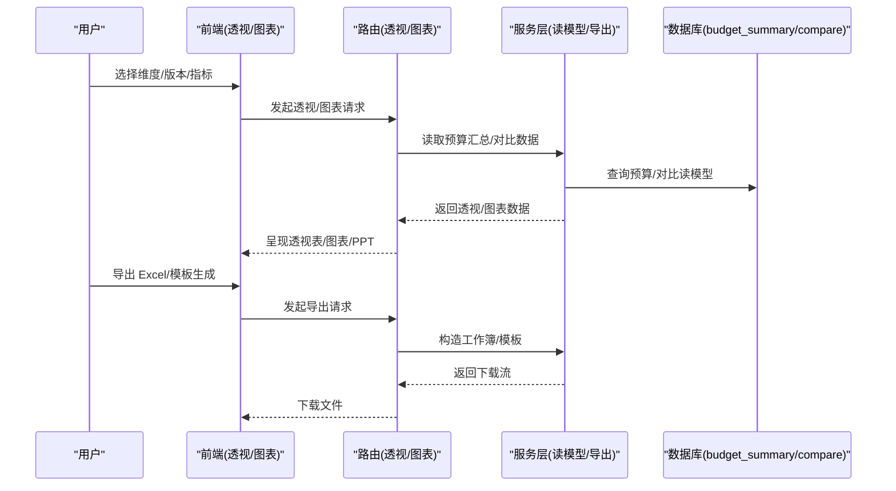
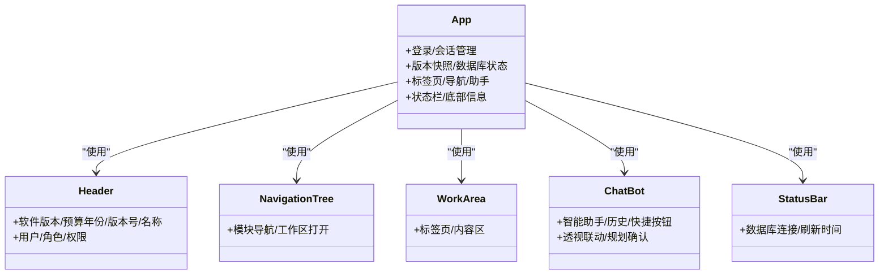
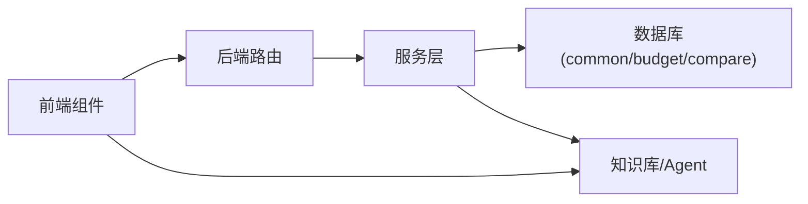

# 项目介绍与目标

<cite>
**本文引用的文件**
- [README.md](file://README.md)
- [Banking_Budget_System_PDD.md](file://docs/product/Banking_Budget_System_PDD.md)
- [Banking_Budget_Rules_PDD.md](file://docs/product/Banking_Budget_Rules_PDD.md)
- [Banking_Budget_Files.md](file://docs/product/Banking_Budget_Files.md)
- [current-system-map.md](file://docs/development/current-system-map.md)
- [main.py](file://apps/api/app/main.py)
- [App.tsx](file://apps/web/src/app/App.tsx)
- [2026-06-12-business-framework-two-pages.html](file://docs/superpowers/specs/2026-06-12-business-framework-two-pages.html)
- [PRD.md](file://.scratch/intelligent-budget-simulation/PRD.md)
</cite>

## 目录
1. [引言](#引言)
2. [项目结构](#项目结构)
3. [核心组件](#核心组件)
4. [架构总览](#架构总览)
5. [详细组件分析](#详细组件分析)
6. [依赖分析](#依赖分析)
7. [性能考虑](#性能考虑)
8. [故障排查指南](#故障排查指南)
9. [结论](#结论)
10. [附录](#附录)

## 引言
本项目是面向银行业务的财务预算原型系统，融合传统数据编报与 AI 原生智能体分析，打造“AI 原生”的预算管理与测算体验。系统采用 monorepo 架构，将前端（Vite + React）、后端（FastAPI）、受控业务资源与历史交付归档清晰分层，支持内网多用户、RBAC、版本与留痕、类 Excel 的高密度录入与查询、财务智能体（Agent）分析、大规模字典与效率、版本与留痕、多维分析工具、Excel 智能导出与公式血缘等能力。

项目核心目标：
- 以“配置 → 输入 → 写入 → 计算 → 输出”的闭环链路，统一业务口径、承接数据、进行计算、面向报表与分析使用。
- 通过 AI 驱动的预算预测与智能预算模拟，提升预算编制的科学性与可解释性。
- 以“机构及产品”指标体系为唯一配置入口，确保预算事实、公式与展示的可追溯与一致性。

## 项目结构
仓库采用 monorepo 结构，按职责拆分为多个目录：
- apps/web：前端 Vite + React 应用，承载登录、导航、工作区、智能助手、多维分析、系统配置等界面。
- apps/api：后端 FastAPI 应用，包含路由、服务、数据库初始化与脚本，提供预算管理、费用预算执行、预测、智能报告/PPT、Agent 等能力。
- resources：受控业务资源（知识库、提示词、语义映射、模板等）。
- docs：产品文档、开发文档与系统现状地图。
- var：本地数据库、日志、输出与 PID 文件（默认不提交）。
- archive：历史交付包、release 包、旧运行快照与团队提交 patch。

**图示来源**
- [README.md:7-21](file://README.md#L7-L21)
- [current-system-map.md:5-11](file://docs/development/current-system-map.md#L5-L11)

**章节来源**
- [README.md:7-21](file://README.md#L7-L21)
- [README.md:23-51](file://README.md#L23-L51)

## 核心组件
- 前端壳层与信息架构：顶栏（版本/年份/版本号/名称/用户/角色）、左侧导航树、中间工作区、右侧智能助手、底部状态栏。
- 后端 API：统一注册各类路由（预算、费用、预测、智能体、系统等），并注入服务层与中间件。
- 数据库：common.db（主数据/配置/用户/会话/审计/费用闭环/智能报告/PPT配置）、budget_{year}.db（版本/预算事实/预算汇总/聚合）、compare.db（多年度对比读模型）。
- 智能体（Agent）：LangGraph + Deepseek，支持预算查询分析、只读优先、高危写库人机共决、记忆与安全护栏。
- Excel 智能导出：与在线计算保持公式血缘一致，优先写入原生公式，支持分组与导出字段控制。

**章节来源**
- [Banking_Budget_System_PDD.md:157-211](file://docs/product/Banking_Budget_System_PDD.md#L157-L211)
- [Banking_Budget_System_PDD.md:291-305](file://docs/product/Banking_Budget_System_PDD.md#L291-L305)
- [current-system-map.md:16-22](file://docs/development/current-system-map.md#L16-L22)

## 架构总览
系统以“配置 → 输入 → 写入 → 计算 → 输出”形成闭环：
- 配置：机构及产品、机构及产品指标、公式、数值类型、汇总规则。
- 输入：机构及产品数据录入，维护实际/预算/预测与版本确认。
- 写入：确认后通过 BudgetDataWriter 写入 budget_data。
- 计算：公式重算、横纵汇总、budget_summary 预聚合。
- 输出：预算展示、预测输出、模拟测算、透视分析、报告/PPT、Agent。

**图示来源**
- [2026-06-12-business-framework-two-pages.html:637-644](file://docs/superpowers/specs/2026-06-12-business-framework-two-pages.html#L637-L644)

**章节来源**
- [2026-06-12-business-framework-two-pages.html:629-644](file://docs/superpowers/specs/2026-06-12-business-framework-two-pages.html#L629-L644)

## 详细组件分析

### 组件一：智能预算预测（AI 驱动的预算预测）
- 业务背景：银行预算管理面临复杂驱动因素与不确定性，传统方法难以捕捉多维联动关系与未来趋势。
- 系统方案：通过费用预测模块，结合“指标表达式”变量与规则定义，支持按预算科目/按事业群的预测表、导入/导出、规则配置与重算；前端提供预测表视图、导入弹窗、导出字段选择等交互。
- 关键能力：
  - 指标表达式取数与规则月度计算。
  - 导入解析、请求规划、预览与应用写库。
  - 手工单元格保存、人工覆盖保存/删除、规则重算与追踪明细。
- 价值主张：提升预测准确性与可解释性，支持多口径对比与版本管理，保障预测过程可审计。

**图示来源**
- [current-system-map.md:88-91](file://docs/development/current-system-map.md#L88-L91)
- [Banking_Budget_System_PDD.md:75-81](file://docs/product/Banking_Budget_System_PDD.md#L75-L81)

**章节来源**
- [current-system-map.md:88-91](file://docs/development/current-system-map.md#L88-L91)
- [Banking_Budget_System_PDD.md:74-81](file://docs/product/Banking_Budget_System_PDD.md#L74-L81)

### 组件二：智能预算模拟（AI 驱动的目标求解与传导）
- 业务背景：领导常给出模糊目标（如“净利润增长 10%”“风险不明显上升”），需要将自然语言转化为结构化目标，生成多套满足约束的方案并进行传导拆解。
- 系统方案：新增“智能预算模拟工作台”，在现有模拟测算模块下并列，不改造正算/倒算链路。用户输入自然语言目标后，系统调用 DeepSeek 解析为结构化硬目标、软偏好与可调因子，启动后端求解任务：公式感知步长算法生成候选档位，MOEA/D 生成不同经营偏好的因子组合，CP-SAT/MILP 做产品级拆解与配平，数学评分筛选 Top 10。DeepSeek 负责命名、解释、风险提示与协商话术，不参与最终排名。
- 关键能力：
  - 目标解析与确认、步长算法摘要、求解状态展示。
  - Top 10 方案卡片与右侧树形传导拆解（默认展示边际贡献最大的前 5 产品）。
  - 协商模式：冲突定位与业务语言解释，用户确认后重跑。
  - Excel 导出：目标、约束、步长摘要、Top 10、因子组合、产品拆解与协商记录。
- 价值主张：将模糊目标结构化，提供可解释、可审计、可传导的多套方案，支撑高层决策。

**图示来源**
- [.scratch/intelligent-budget-simulation/PRD.md:13-24](file://.scratch/intelligent-budget-simulation/PRD.md#L13-L24)

**章节来源**
- [.scratch/intelligent-budget-simulation/PRD.md:1-74](file://.scratch/intelligent-budget-simulation/PRD.md#L1-L74)

### 组件三：实时监控与多维分析
- 业务背景：预算执行过程中需要实时监控与多维分析，以便及时发现问题并采取措施。
- 系统方案：提供“当前年度多版本透视”“多年度对比透视”“多年度数据透视图”“智能分析报告”“智能演示PPT”等工具，数据源来自预算汇总与对比库，支持 Excel 导出与公式血缘一致。
- 关键能力：
  - 多版本透视与对比透视，支持指标层级/数据科目等维度。
  - 图表与 PPT 生成，支持模板式与场景化生成。
  - 智能体联动：Agent 输出透视建议与规划确认，支持锁定维度与搜索预填。
- 价值主张：提升预算执行透明度与分析效率，支持跨年度对比与多角度洞察。

**图示来源**
- [current-system-map.md:114-121](file://docs/development/current-system-map.md#L114-L121)
- [Banking_Budget_System_PDD.md:377-388](file://docs/product/Banking_Budget_System_PDD.md#L377-L388)

**章节来源**
- [current-system-map.md:114-121](file://docs/development/current-system-map.md#L114-L121)
- [Banking_Budget_System_PDD.md:377-388](file://docs/product/Banking_Budget_System_PDD.md#L377-L388)

### 组件四：前端壳层与智能助手
- 前端壳层：顶栏、左侧导航树、中间工作区、右侧智能助手、底部状态栏，支持标签页、折叠/展开、可调整宽度等交互。
- 智能助手：支持“智能提问”“上传文件”“语音输入”“历史问题”等快捷按钮，与后端 Agent 对话测试与透视联动。
- 价值主张：提供类 Excel 的高密度录入与查询体验，简化操作路径，提升协作效率。

**图示来源**
- [App.tsx:35-520](file://apps/web/src/app/App.tsx#L35-L520)

**章节来源**
- [App.tsx:35-520](file://apps/web/src/app/App.tsx#L35-L520)
- [Banking_Budget_System_PDD.md:157-211](file://docs/product/Banking_Budget_System_PDD.md#L157-L211)

## 依赖分析
- 前后端依赖：前端通过统一 API 客户端调用后端路由，页面组件不直接拼接后端路径；后端路由仅负责 HTTP 接口与服务调用，不重复维护响应样板。
- 数据依赖：预算事实写入统一通过 BudgetDataWriter；预算汇总与对比读模型统一从 budget_summary/compare_budget_summary 读取；费用闭环通过费用执行明细导入与预算科目/部门映射。
- 知识库与智能体：Agent 知识库同义词与领域词库统一过滤与解析，确保预算意图识别与只读优先。

**图示来源**
- [current-system-map.md:136-140](file://docs/development/current-system-map.md#L136-L140)
- [current-system-map.md:111-114](file://docs/development/current-system-map.md#L111-L114)

**章节来源**
- [current-system-map.md:136-140](file://docs/development/current-system-map.md#L136-L140)
- [current-system-map.md:111-114](file://docs/development/current-system-map.md#L111-L114)

## 性能考虑
- 大面查询走预聚合：当前年度多版本透视读取 budget_summary；多年度对比透视读取 compare_budget_summary；禁止前端临时全表聚合替代引擎结论。
- 异步轮询与“立即计算”：后台周期任务与用户触发的“全局计算并刷新”优先级与完成后界面与库内数据一致。
- 公式重算与依赖传播：同一版本内被标脏的行必须按公式依赖图级联标脏并重算，直至完成并正确清零。
- Excel 导出与公式血缘：优先写入原生公式，保证在线结果与导出后 Excel 重算一致。

**章节来源**
- [Banking_Budget_Rules_PDD.md:89-97](file://docs/product/Banking_Budget_Rules_PDD.md#L89-L97)
- [Banking_Budget_System_PDD.md:240-253](file://docs/product/Banking_Budget_System_PDD.md#L240-L253)

## 故障排查指南
- 登录与会话：检查会话 Cookie、首次登录改密、权限类型与用户角色；确认认证中间件与访问策略。
- 数据写入与审计：变更预算事实、字典、映射、版本等路径必须写入 operation_log，并保留可追溯的前后快照。
- 预算输入与重算：禁止在单元格保存后立即触发全局或级联重算；重算触发应收敛为页面首次进入、页面离开、用户显式点击“全局计算并刷新”等有限事件。
- Excel 导出一致性：导出中的公式与分组必须与在线计算逻辑一致；在线结果与导出公式结果不一致视为 P0 缺陷。
- Agent 安全与治理：高危写库必须经用户确认与审计；分析类能力默认只读，写库类能力仅通过固定接口暴露。

**章节来源**
- [Banking_Budget_Rules_PDD.md:68-87](file://docs/product/Banking_Budget_Rules_PDD.md#L68-L87)
- [Banking_Budget_Rules_PDD.md:110-135](file://docs/product/Banking_Budget_Rules_PDD.md#L110-L135)
- [Banking_Budget_System_PDD.md:254-268](file://docs/product/Banking_Budget_System_PDD.md#L254-L268)

## 结论
本项目通过 monorepo 架构整合前端、后端与受控资源，围绕“配置 → 输入 → 写入 → 计算 → 输出”的闭环，提供 AI 驱动的预算预测与智能预算模拟能力，辅以多维分析与智能报告/PPT，实现预算管理的智能化、可解释与可审计。系统坚持“单一事实来源”“预聚合优先”“只读优先”的工程底线，确保财务正确性与用户体验的平衡。

## 附录
- 适用场景：银行预算编制、预算执行监控、多维分析与报告、智能体辅助决策。
- 预期收益：提升预算编制效率与质量、增强预算执行透明度与可追溯性、降低人工干预与错误、支持高层目标结构化与方案生成。