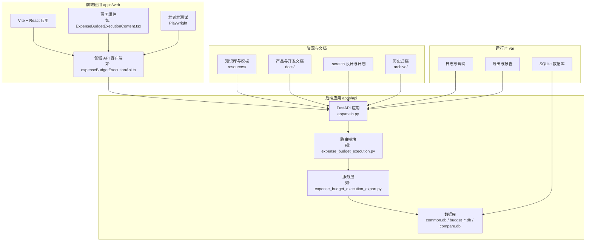
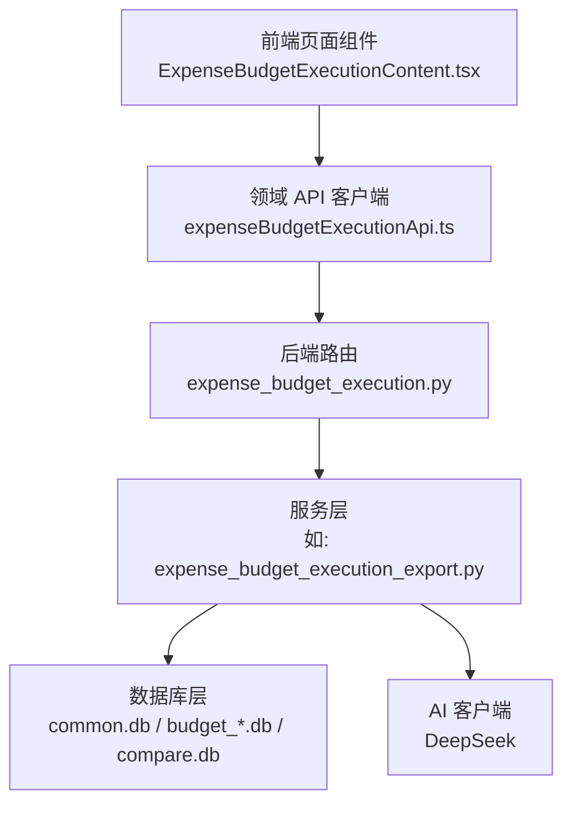
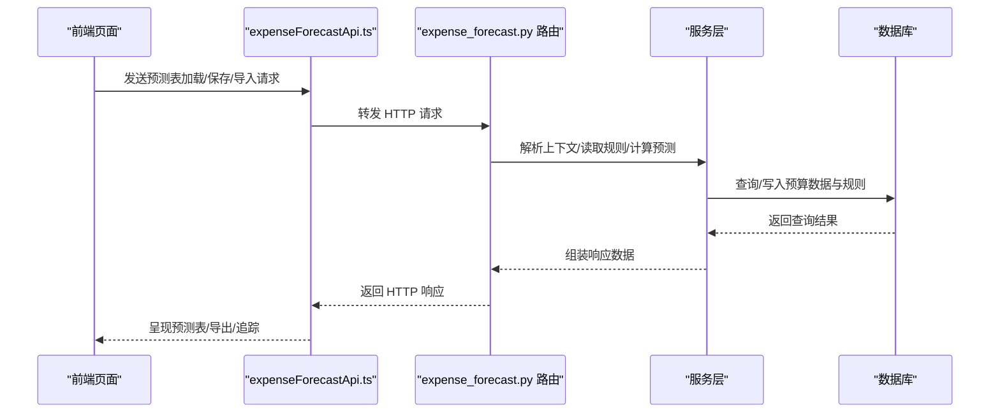
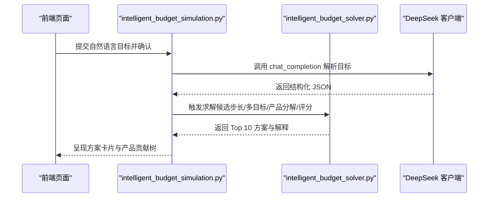
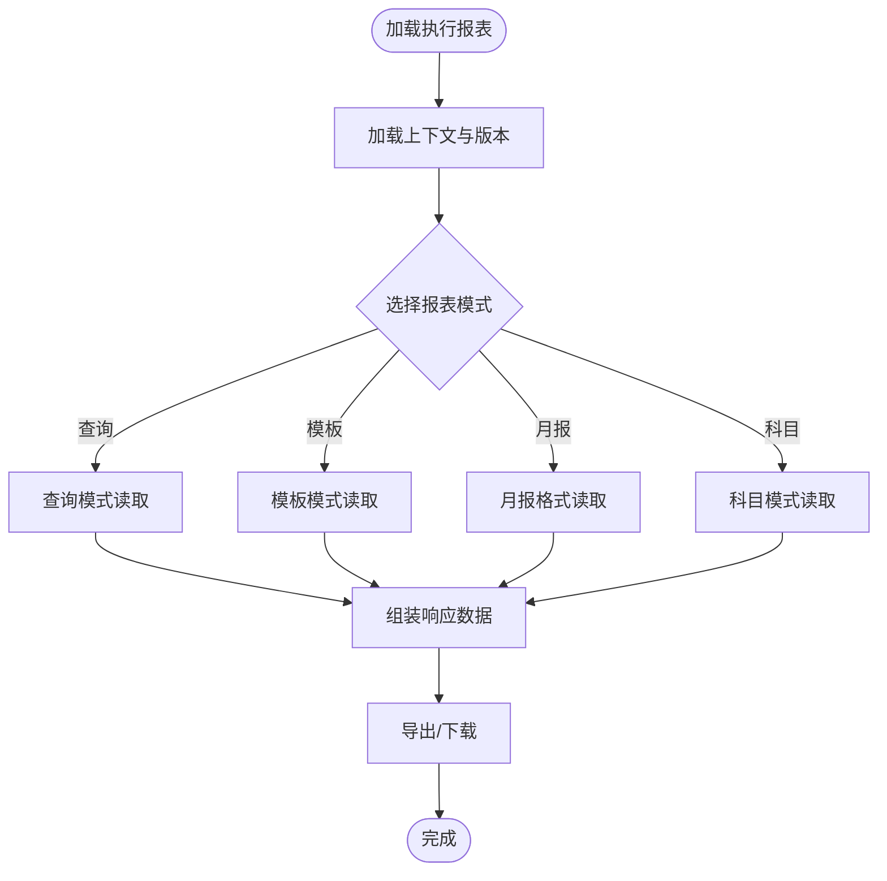
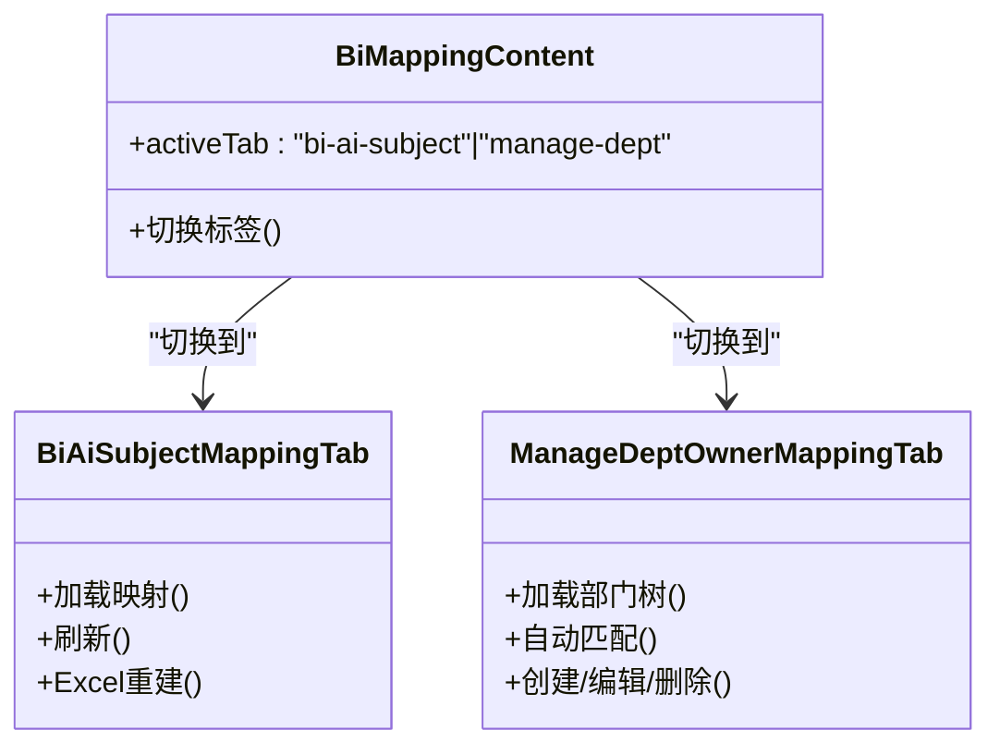
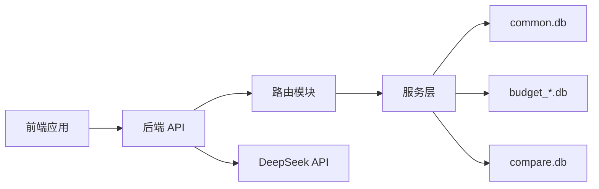

# 项目概述

<cite>
**本文档引用的文件**
- [README.md](file://README.md)
- [CONTEXT.md](file://CONTEXT.md)
- [apps/api/pyproject.toml](file://apps/api/pyproject.toml)
- [apps/api/app/main.py](file://apps/api/app/main.py)
- [apps/api/app/deepseek_client.py](file://apps/api/app/deepseek_client.py)
- [apps/api/app/routers/intelligent_budget_simulation.py](file://apps/api/app/routers/intelligent_budget_simulation.py)
- [apps/api/app/services/intelligent_budget_solver.py](file://apps/api/app/services/intelligent_budget_solver.py)
- [apps/api/app/routers/budget_simulation.py](file://apps/api/app/routers/budget_simulation.py)
- [apps/api/app/routers/expense_budget_execution.py](file://apps/api/app/routers/expense_budget_execution.py)
- [apps/web/src/lib/expenseBudgetExecutionApi.ts](file://apps/web/src/lib/expenseBudgetExecutionApi.ts)
- [apps/web/src/app/components/ExpenseBudgetExecutionContent.tsx](file://apps/web/src/app/components/ExpenseBudgetExecutionContent.tsx)
- [apps/web/src/lib/expenseForecastApi.ts](file://apps/web/src/lib/expenseForecastApi.ts)
- [apps/web/src/app/components/BiMappingContent.tsx](file://apps/web/src/app/components/BiMappingContent.tsx)
- [docs/development/department-expense-module-map.md](file://docs/development/department-expense-module-map.md)
- [docs/product/Banking_Budget_System_PDD.md](file://docs/product/Banking_Budget_System_PDD.md)
- [.scratch/architecture-deep-clean/CODEBASE_REDUCTION_AUDIT.md](file://.scratch/architecture-deep-clean/CODEBASE_REDUCTION_AUDIT.md)
- [.scratch/intelligent-budget-simulation/PRD.md](file://.scratch/intelligent-budget-simulation/PRD.md)
</cite>

## 目录
1. [简介](#简介)
2. [项目结构](#项目结构)
3. [核心组件](#核心组件)
4. [架构总览](#架构总览)
5. [详细组件分析](#详细组件分析)
6. [依赖关系分析](#依赖关系分析)
7. [性能考虑](#性能考虑)
8. [故障排除指南](#故障排除指南)
9. [结论](#结论)
10. [附录](#附录)

## 简介
智能预算预测系统是一个基于 monorepo 的银行预算管理平台，采用前后端分离架构，围绕“机构及产品指标体系”构建统一的数据与业务口径，提供预算预测、智能预算模拟、预算执行监控与 BI 映射管理等核心能力。系统通过 FastAPI 提供后端 API，React + Vite 提供前端界面，并深度集成了 DeepSeek 大模型进行自然语言目标解析与预算方案生成，实现从“领导目标”到“可执行方案”的自动化推理与可视化呈现。

## 项目结构
项目采用 monorepo 结构，按职责划分清晰：
- apps/web：前端应用，包含页面组件、API 客户端、视图模型与端到端测试
- apps/api：后端应用，包含路由、服务层、数据库初始化与集成测试
- resources：知识库、提示词、模板与业务资料
- docs：产品文档、开发规范与系统地图
- var：本地数据库、日志、输出与运行时产物
- .scratch：设计草案与临时计划
- archive：历史交付包、归档资料与迁移产物

**图表来源**
- [apps/api/app/main.py:109-145](file://apps/api/app/main.py#L109-L145)
- [apps/web/src/lib/expenseBudgetExecutionApi.ts:47-139](file://apps/web/src/lib/expenseBudgetExecutionApi.ts#L47-L139)

**章节来源**
- [README.md:1-62](file://README.md#L1-L62)
- [CONTEXT.md:1-81](file://CONTEXT.md#L1-L81)

## 核心组件
- 预算预测模块：提供费用预测表的录入、规则配置、导入导出与追踪能力，支撑部门费用预算闭环
- 智能预算模拟模块：基于自然语言目标解析与多目标优化算法，生成 Top 10 方案并可视化产品层面的传导路径
- 预算执行监控模块：提供费用预算执行报表，支持多维度透视与一致性校验
- BI 映射管理模块：维护 BI-AI 科目映射与部门归属映射，保障费用实际与预算口径一致
- 数据账户与指标体系：统一“机构及产品指标体系”，作为预算事实与公式引用的唯一主数据
- AI 集成：通过 DeepSeek API 实现目标解析、方案生成与解释说明

**章节来源**
- [docs/product/Banking_Budget_System_PDD.md:133-141](file://docs/product/Banking_Budget_System_PDD.md#L133-L141)
- [CONTEXT.md:3-38](file://CONTEXT.md#L3-L38)

## 架构总览
系统采用“前端页面 + 领域 API 客户端 + 后端路由 + 服务层 + 数据库”的分层架构。前端通过 typed API 客户端调用后端路由，路由将请求委派给服务层，服务层访问数据库并返回响应。AI 能力通过 DeepSeek 客户端接入，参与预算目标解析与方案生成。

**图表来源**
- [apps/web/src/app/components/ExpenseBudgetExecutionContent.tsx:32-38](file://apps/web/src/app/components/ExpenseBudgetExecutionContent.tsx#L32-L38)
- [apps/web/src/lib/expenseBudgetExecutionApi.ts:47-139](file://apps/web/src/lib/expenseBudgetExecutionApi.ts#L47-L139)
- [apps/api/app/routers/expense_budget_execution.py:128-161](file://apps/api/app/routers/expense_budget_execution.py#L128-L161)

**章节来源**
- [apps/api/app/main.py:109-145](file://apps/api/app/main.py#L109-L145)
- [apps/api/app/deepseek_client.py:9-70](file://apps/api/app/deepseek_client.py#L9-L70)

## 详细组件分析

### 预算预测模块
- 功能要点
  - 预测表视图：支持按主体/事业群/费用归属部门与按预算科目两种视图，提供月度与年度编辑能力
  - 规则配置：支持 RESIDUAL_ALLOC 与 METRIC_EXPR 两类规则，覆盖余额分摊与指标表达式
  - 导入导出：支持普通与分组导出，提供字段选择与锁定单元格规则
  - 追踪与回溯：提供手动/自动/覆盖三种来源的月度追踪
- 关键服务
  - 规则读模型与计算：expense_forecast_rule_read_model.py、expense_forecast_rule_calculation.py
  - 导入解析与应用：expense_forecast_import_parser.py、expense_forecast_import_apply.py
  - 视图与元数据：expense_forecast_view_model.py、expense_forecast_meta.py
- 前端对接
  - API 客户端：expenseForecastApi.ts
  - 页面组件：ExpenseForecastContent.tsx 及其子视图（选择器、编译表、导入导出对话框）

**图表来源**
- [apps/web/src/lib/expenseForecastApi.ts:44-88](file://apps/web/src/lib/expenseForecastApi.ts#L44-L88)
- [apps/api/app/routers/expense_budget_execution.py:128-161](file://apps/api/app/routers/expense_budget_execution.py#L128-L161)

**章节来源**
- [apps/api/app/routers/expense_budget_execution.py:128-161](file://apps/api/app/routers/expense_budget_execution.py#L128-L161)
- [apps/web/src/lib/expenseForecastApi.ts:44-88](file://apps/web/src/lib/expenseForecastApi.ts#L44-L88)

### 智能预算模拟模块
- 功能要点
  - 目标解析：通过 DeepSeek 将自然语言目标解析为结构化 JSON，包含硬性目标与软性偏好
  - 步长生成：基于公式敏感度与历史约束，生成精细/粗略的业务因子候选步长
  - 多目标优化：使用 MOEA/D 生成候选家族，CP-SAT/MILP 进行产品级分解，综合评分排序
  - 风险建模：关注 NPL 比率、拨备调节、回收/清收提升与新生成不良控制
  - 可视化：Top 10 方案卡片与自上而下的产品贡献树
- 关键流程
  - 目标解析与确认：intelligent_budget_simulation.py
  - 求解与评分：intelligent_budget_solver.py
  - AI 客户端：deepseek_client.py

**图表来源**
- [apps/api/app/routers/intelligent_budget_simulation.py:129-160](file://apps/api/app/routers/intelligent_budget_simulation.py#L129-L160)
- [apps/api/app/services/intelligent_budget_solver.py:54-97](file://apps/api/app/services/intelligent_budget_solver.py#L54-L97)
- [apps/api/app/deepseek_client.py:18-70](file://apps/api/app/deepseek_client.py#L18-L70)

**章节来源**
- [.scratch/intelligent-budget-simulation/PRD.md:25-113](file://.scratch/intelligent-budget-simulation/PRD.md#L25-L113)
- [apps/api/app/routers/intelligent_budget_simulation.py:129-160](file://apps/api/app/routers/intelligent_budget_simulation.py#L129-L160)
- [apps/api/app/services/intelligent_budget_solver.py:54-97](file://apps/api/app/services/intelligent_budget_solver.py#L54-L97)

### 预算执行监控模块
- 功能要点
  - 报表模式：查询模式、模板模式、月报格式、科目模式
  - 多维分析：支持主体/事业群/费用归属部门/预算科目/费用月份等筛选
  - 一致性校验：跨表一致性预警，确保统计口径一致
- 关键服务
  - 报表解析与响应：expense_budget_execution_report_resolver.py
  - 月报格式与矩阵：monthly_report 与 matrix_table 子模块
- 前端对接
  - API 客户端：expenseBudgetExecutionApi.ts
  - 页面组件：ExpenseBudgetExecutionContent.tsx 及其子视图

**图表来源**
- [apps/api/app/routers/expense_budget_execution.py:128-161](file://apps/api/app/routers/expense_budget_execution.py#L128-L161)
- [apps/web/src/lib/expenseBudgetExecutionApi.ts:47-139](file://apps/web/src/lib/expenseBudgetExecutionApi.ts#L47-L139)

**章节来源**
- [apps/api/app/routers/expense_budget_execution.py:128-161](file://apps/api/app/routers/expense_budget_execution.py#L128-L161)
- [apps/web/src/lib/expenseBudgetExecutionApi.ts:47-139](file://apps/web/src/lib/expenseBudgetExecutionApi.ts#L47-L139)
- [apps/web/src/app/components/ExpenseBudgetExecutionContent.tsx:32-38](file://apps/web/src/app/components/ExpenseBudgetExecutionContent.tsx#L32-L38)

### BI 映射管理模块
- 功能要点
  - BI-AI 科目映射：维护费用实际与预算科目的映射关系
  - 部门归属映射：维护“费用归属部门”与“归口管理部门”的映射
  - 前端 Tab 切换：BI-AI 科目映射表与 BI 部门维护
- 数据契约
  - bi_ai_subject_mapping：当前 BI-AI 科目映射表
  - manage_dept_owner_mapping：BI 部门维护表

**图表来源**
- [apps/web/src/app/components/BiMappingContent.tsx:1-36](file://apps/web/src/app/components/BiMappingContent.tsx#L1-L36)

**章节来源**
- [apps/web/src/app/components/BiMappingContent.tsx:1-36](file://apps/web/src/app/components/BiMappingContent.tsx#L1-L36)
- [docs/development/department-expense-module-map.md:39-54](file://docs/development/department-expense-module-map.md#L39-L54)

### 数据账户与指标体系
- 统一主数据
  - data_account：数据账户主表
  - data_account_metric_node：指标节点树
  - data_account_metric_binding：指标绑定关系
- 业务约束
  - 唯一指标号码：产品码.产品内指标码
  - 横向/纵向汇总：通过指标树的 rollup 方法实现
- 与预算事实的关系
  - budget_data：预算/实际/预测数值的事实表
  - 通过 data_account 与指标树建立引用关系

**章节来源**
- [CONTEXT.md:33-38](file://CONTEXT.md#L33-L38)
- [docs/development/department-expense-module-map.md:39-54](file://docs/development/department-expense-module-map.md#L39-L54)

## 依赖关系分析
- 前后端依赖
  - 前端通过 typed API 客户端调用后端路由，路由委派服务层，服务层访问数据库
  - 路由与服务层职责清晰，避免 UI 与业务逻辑耦合
- 外部依赖
  - FastAPI + uvicorn：后端 Web 框架
  - DeepSeek API：AI 目标解析与方案生成
  - OpenPyXL / python-docx / PyPDF / Pillow / python-pptx / matplotlib：报表与图表能力
- 数据库契约
  - common.db：用户、Smart 报告/PPT、费用框架、BI 映射等公共表
  - budget_*.db：年度预算库，包含 version、budget_data、budget_summary 等
  - compare.db：对比库，用于多版本对比分析

**图表来源**
- [apps/api/pyproject.toml:6-24](file://apps/api/pyproject.toml#L6-L24)
- [apps/api/app/main.py:109-145](file://apps/api/app/main.py#L109-L145)

**章节来源**
- [apps/api/pyproject.toml:1-33](file://apps/api/pyproject.toml#L1-L33)
- [apps/api/app/main.py:109-145](file://apps/api/app/main.py#L109-L145)

## 性能考虑
- 数据访问
  - 使用只读 SQL 执行器与版本上下文，避免不必要的写操作
  - 按需加载与缓存：如预算版本、周期映射等
- 导出与报表
  - Excel/Word/PDF/PPTX 导出采用流式写入，减少内存占用
  - 图表渲染与公式计算在服务层完成，前端仅负责展示
- AI 接口
  - DeepSeek 调用具备超时与重试机制，避免阻塞请求
  - 目标解析与方案生成采用任务式异步流程，支持长时间运行场景

[本节为通用指导，无需具体文件引用]

## 故障排除指南
- 启动与端口
  - 默认前端端口 8443，后端开发端口 8009；可通过 start.sh/stop.sh 管理
  - Playwright 端到端测试默认复用已启动的服务，避免重复启动
- 数据库与版本
  - 确保 common.db 与预算年度库存在且符合当前契约
  - 版本窗口与 current_month 合规检查失败时，需修正版本配置
- AI 配置
  - 确认 DEEPSEEK_API_KEY、DEEPSEEK_BASE_URL、DEEPSEEK_MODEL 环境变量正确
  - 若 AI 返回异常或格式不符，检查目标解析与 JSON Schema 校验
- 权限与会话
  - 认证会话与密码策略由服务层统一处理，确保 Cookie 名称与 TTL 配置正确

**章节来源**
- [README.md:23-62](file://README.md#L23-L62)
- [apps/api/app/main.py:132-145](file://apps/api/app/main.py#L132-L145)

## 结论
本项目通过 monorepo 结构实现了前后端一体化协作，围绕统一的“机构及产品指标体系”构建预算数据与业务口径，结合 DeepSeek 大模型实现从自然语言目标到可执行方案的自动化推理。系统在模块化、可扩展性与可维护性方面具备良好基础，适合持续演进与规模化应用。

[本节为总结性内容，无需具体文件引用]

## 附录

### 快速开始
- 环境要求
  - Python 3.11+（后端）
  - Node.js（前端）
  - SQLite（本地运行）
- 安装步骤
  - 后端：pip install -e apps/api
  - 前端：npm install
- 启动服务
  - 后端：uvicorn --reload apps.api.app.main:app --host 127.0.0.1 --port 8009
  - 前端：npm run dev
- 基本使用流程
  - 登录系统 → 选择预算版本与年份 → 编辑预算/实际/预测 → 查看预算执行报表与多维分析 → 导出报告与图表

**章节来源**
- [README.md:23-62](file://README.md#L23-L62)
- [apps/api/pyproject.toml:1-33](file://apps/api/pyproject.toml#L1-L33)

### 术语表
- 预算事实唯一录入口：统一的预算/实际/预测数值录入与清理
- 机构及产品指标体系：唯一主指标体系，承载产品维度与指标节点
- 数据科目运行模块：基于指标体系的运行读模型与公式引用
- 预算管理模块：预算工作台、规则配置、预算输入、预算输出的业务闭环
- 部门费用预算管理模块：围绕部门科目、BI 映射、费用执行明细、费用预测与预算执行报表的闭环

**章节来源**
- [CONTEXT.md:3-38](file://CONTEXT.md#L3-L38)