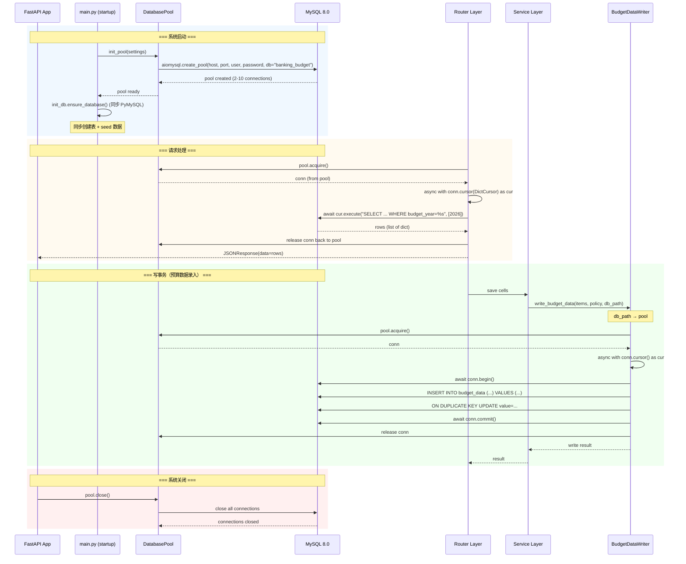
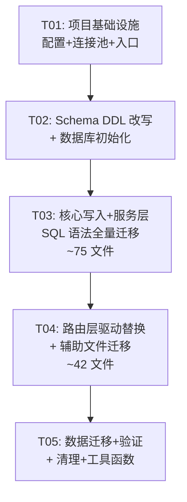

# SQLite → MySQL 迁移：系统架构设计与任务分解

> Bob（架构师）| 2026-05-07 | 基于 PRD v1 + 已确认决策

---

## Part A: 系统设计

### 1. 实现方案

#### 1.1 核心决策

| 决策项 | 选择 | 理由 |
|--------|------|------|
| 异步驱动 | **aiomysql** | 原生 async/await，与 FastAPI 异步范式一致；内置连接池 `aiomysql.create_pool()` |
| 同步驱动 | **PyMySQL** | 纯 Python 实现，无 C 依赖，用于 `init_db.py` 等同步初始化脚本 |
| 连接池 | **aiomysql 内置 Pool** | `aiomysql.Pool` 自带 `minsize`/`maxsize`/`pool_recycle`，无需引入 DBUtils |
| 数据库布局 | **方案 A：单 database `banking_budget`** | 所有表通过 `budget_year` 列区分年度；查询/事务最简单 |
| 字符集 | **utf8mb4** | 支持中文、emoji、特殊字符 |
| 上线策略 | **停机直接切换** | 迁移窗口内停机，迁移完成后切换配置启动 |

#### 1.2 不需要的

- ❌ 不需要双后端策略（SQLite + MySQL 并行）
- ❌ 不需要 SQLAlchemy ORM
- ❌ 不需要 DBUtils / sqlalchemy 连接池
- ❌ 不需要灰度 / 双写 / 热迁移

#### 1.3 技术难点与对策

| 难点 | 对策 |
|------|------|
| **PRAGMA 1200+ 处** | 全部删除（foreign_keys 默认 ON）；`PRAGMA table_info` → 统一封装 `get_table_columns()` 查询 `INFORMATION_SCHEMA.COLUMNS` |
| **GLOB 346 处** | 逐文件替换：`GLOB 'pattern'` → `REGEXP 'pattern'`（注意正则语法差异）；简单通配 → `LIKE` |
| **参数占位符 `?` → `%s`** | 全文逐文件替换，配合编译检查确认无遗漏 |
| **`INSERT OR IGNORE` 9 处** | → `INSERT IGNORE INTO` |
| **`ON CONFLICT ... DO UPDATE`** | → `ON DUPLICATE KEY UPDATE` |
| **`json_extract` 17 处** | → `JSON_EXTRACT`（MySQL 5.7+ 原生支持，语法相同） |
| **`||` 字符串拼接** | → `CONCAT()` |
| **`GROUP_CONCAT`** | SQLite `GROUP_CONCAT(col, ',')` → MySQL `GROUP_CONCAT(col SEPARATOR ',')` |
| **年度表合并** | 所有年度表增加 `budget_year` 列，主键/唯一约束包含 `budget_year` |
| **触发器改写** | `budget_data` 的 `update_time` trigger → MySQL `BEFORE INSERT`/`BEFORE UPDATE` trigger |
| **视图改写** | `data_account`、`data_account_metric_binding` VIEW → 保留 MySQL VIEW，SQLite `INSTR()` → MySQL `LOCATE()`/`INSTR()` |

#### 1.4 连接池参数（远程 MySQL）

```python
# 远程 MySQL 推荐配置
POOL_MINSIZE = 2          # 最小空闲连接
POOL_MAXSIZE = 10         # 最大连接数（远程网络延迟，不宜过大）
POOL_RECYCLE = 3600       # 连接回收时间（秒），避免 MySQL wait_timeout 断连
POOL_CONNECT_TIMEOUT = 10 # 连接超时（秒）
POOL_READ_TIMEOUT = 30    # 读取超时（秒）
AUTOCOMMIT = True         # 开启自动提交（匹配 SQLite 默认行为）
CURSORCLASS = aiomysql.DictCursor  # 返回字典而非元组（匹配 aiosqlite Row 行为）
```

---

### 2. 文件列表

#### 2.1 新建文件

| # | 文件路径 | 说明 |
|---|---------|------|
| 1 | `apps/api/app/core/database.py` | 异步连接池 `DatabasePool` + 同步 `SyncDatabase` |
| 2 | `apps/api/app/core/db_config.py` | 数据库名常量、年度表发现、替换旧 `db_paths.py` |
| 3 | `apps/api/scripts/migrate_sqlite_to_mysql.py` | 数据迁移脚本（支持 --dry-run, --resume, --verify-only） |
| 4 | `apps/api/scripts/verify_mysql_inventory.py` | MySQL 版数据库清单验证（替代 `verify_current_database_inventory.py`） |
| 5 | `apps/api/app/core/db_introspection.py` | 统一 schema 内省工具（`get_table_columns`、`table_exists` 等） |

#### 2.2 修改文件

| # | 文件路径 | 改动内容 |
|---|---------|---------|
| 6 | `apps/api/pyproject.toml` | 移除 `aiosqlite`，新增 `aiomysql` + `PyMySQL` |
| 7 | `apps/api/app/core/config.py` | 新增 MySQL 连接参数（host/port/user/password/database） |
| 8 | `apps/api/.env.example` | 更新为 MySQL 连接配置模板 |
| 9 | `apps/api/app/main.py` | startup 事件：初始化 MySQL 连接池；替代 `ensure_databases()` |
| 10 | `apps/api/app/init_db.py` | 同步 PyMySQL 改写：`executescript` → 逐条执行；单 database 初始化 |
| 11 | `apps/api/app/db_bootstrap/schemas.py` | **核心改写**：全部 DDL SQLite→MySQL，约 732 行 |
| 12 | `apps/api/app/db_bootstrap/runtime_metric_tree.py` | PRAGMA→INFORMATION_SCHEMA；GLOB→REGEXP/LIKE |
| 13 | `apps/api/app/db_bootstrap/budget_data.py` | trigger → MySQL trigger |
| 14 | `apps/api/app/db_bootstrap/derived_read_models.py` | DDL 适配 |
| 15 | `apps/api/app/db_bootstrap/business_cost_income.py` | DDL 适配 |
| 16 | `apps/api/app/db_bootstrap/retired_deletion.py` | `sqlite_master` → `INFORMATION_SCHEMA.TABLES` |
| 17 | `apps/api/app/db_bootstrap/runner.py` | `sqlite3.connect` → `pymysql.connect` |
| 18 | `apps/api/app/db_bootstrap/seeds.py` | 连接方式 + `?` → `%s` |
| 19 | `apps/api/app/db_bootstrap/generated_paths.py` | 适配 MySQL |
| 20 | `apps/api/app/db_bootstrap/current_contracts.py` | DDL 适配 |
| 21 | `apps/api/app/db_bootstrap/report_display.py` | DDL 适配 |
| 22 | `apps/api/app/db_bootstrap/budget_version.py` | `?` → `%s`；sqlite3→pymysql |
| 23 | `apps/api/app/db_bootstrap/expense.py` | DDL 适配 |
| 24 | `apps/api/app/db_bootstrap/smart_report.py` | DDL 适配 |
| 25 | `apps/api/app/budget_data_writer.py` | `aiosqlite.connect` → `pool.acquire`；`?`→`%s`；`rowid`→`lastrowid` |
| 26 | `apps/api/app/services/runtime_budget_paths.py` | 年度发现：`glob("budget_*.db")` → `SELECT DISTINCT budget_year FROM budget_data` |
| 27 | `apps/api/app/services/org_product_metric_runtime_sync.py` | 连接方式 + SQL 语法 |
| 28 | `apps/api/app/core/audit.py` | `sqlite3.connect` → `pymysql.connect` |
| 29 | `apps/api/app/integrations/feishu_store.py` | `aiosqlite.connect` → pool acquire |
| 30 | `apps/api/app/agent/agent_product_intent.py` | 连接方式 + SQL 语法 |
| 31 | `apps/api/app/agent/agent_query.py` | 连接方式 + SQL 语法 |
| 32-112 | `apps/api/app/routers/*.py`（约 41 个） | 逐个改写：`aiosqlite.connect(path)` → `pool.acquire()`；`?`→`%s`；PRAGMA 删除 |
| 113-182 | `apps/api/app/services/*.py`（约 70 个） | 逐个改写：同上 |

#### 2.3 删除/废弃文件

| # | 文件路径 | 说明 |
|---|---------|------|
| 183 | `apps/api/app/core/db_paths.py` | 功能迁移到 `db_config.py`，旧文件清理 |

---

### 3. 数据结构和接口

#### 3.1 DatabasePool（异步）

```python
# apps/api/app/core/database.py

import aiomysql
from typing import Any, AsyncContextManager

class DatabasePool:
    """MySQL 异步连接池，封装 aiomysql.Pool"""

    def __init__(self, *, host: str, port: int, user: str, password: str,
                 db: str, minsize: int = 2, maxsize: int = 10,
                 pool_recycle: int = 3600, connect_timeout: int = 10,
                 read_timeout: int = 30, charset: str = "utf8mb4",
                 autocommit: bool = True):
        ...

    async def init(self) -> None:
        """创建连接池，应用启动时调用一次"""
        ...

    async def close(self) -> None:
        """关闭连接池，应用关闭时调用"""
        ...

    def acquire(self) -> AsyncContextManager[aiomysql.Connection]:
        """获取连接上下文管理器：
            async with pool.acquire() as conn:
                async with conn.cursor(aiomysql.DictCursor) as cur:
                    await cur.execute(sql, params)
                    rows = await cur.fetchall()
        """
        ...

    async def execute(self, sql: str, params: tuple = ()) -> int:
        """执行写操作，返回 affected rows"""
        ...

    async def fetch_all(self, sql: str, params: tuple = ()) -> list[dict]:
        """执行查询，返回 dict 列表"""
        ...

    async def fetch_one(self, sql: str, params: tuple = ()) -> dict | None:
        """执行查询，返回单行 dict 或 None"""
        ...

    async def fetch_val(self, sql: str, params: tuple = ()) -> Any:
        """执行查询，返回第一行第一列值"""
        ...

    async def execute_many(self, sql: str, rows: list[tuple]) -> int:
        """批量执行，返回 affected rows"""
        ...


# 全局单例
_pool: DatabasePool | None = None

def init_pool(settings) -> DatabasePool:
    """工厂函数，创建全局单例"""
    ...

def get_pool() -> DatabasePool:
    """获取全局连接池（FastAPI 依赖注入用）"""
    ...
```

#### 3.2 SyncDatabase（同步，用于 init_db / 脚本）

```python
class SyncDatabase:
    """MySQL 同步连接（PyMySQL），用于初始化脚本和迁移脚本"""

    def __init__(self, *, host: str, port: int, user: str, password: str,
                 db: str, charset: str = "utf8mb4", autocommit: bool = True):
        ...

    def __enter__(self) -> "SyncDatabase":
        self.conn = pymysql.connect(...)
        return self

    def __exit__(self, ...):
        self.conn.close()

    def execute(self, sql: str, params: tuple = ()) -> int:
        """执行写操作，返回 affected rows"""
        ...

    def execute_script(self, sql: str) -> None:
        """逐条执行 DDL 脚本（MySQL 不支持 executescript）"""
        ...

    def fetch_all(self, sql: str, params: tuple = ()) -> list[dict]:
        ...

    def fetch_one(self, sql: str, params: tuple = ()) -> dict | None:
        ...
```

#### 3.3 db_config.py — 数据库名与年度发现

```python
# apps/api/app/core/db_config.py

DATABASE_NAME = "banking_budget"  # 单 database 名称

# 年度表列表（这些表有 budget_year 列）
YEARLY_TABLES = [
    "version", "settings", "budget_data", "budget_summary",
    "budget_pivot_aggregate",
    # business_cost_income_* 系列
    ...
]

# 非年度表（common 表直接合并）
COMMON_TABLES = [
    "users", "user_sessions", "operation_log",
    "data_account_metric_node", "org_product_tree_snapshot",
    "budget_output_display_item", ...
]

# Compare 表直接合并
COMPARE_TABLES = [
    "compare_budget_summary", "compare_pivot_aggregate",
    "compare_sync_job_log", ...
]

async def list_budget_years(pool: DatabasePool) -> list[int]:
    """从 budget_data 表 DISTINCT budget_year 获取活跃年度"""
    ...
```

#### 3.4 年度表合并后的主键/唯一约束设计

```
原则：所有原年度表的主键 + UNIQUE 约束都加上 budget_year

示例 — budget_data 表：
  旧 PRIMARY KEY: id (AUTO_INCREMENT)
  旧 UNIQUE: (data_acct_code, product_code, period_id, version_id, budget_actual)
  新 UNIQUE: (budget_year, data_acct_code, product_code, period_id, version_id, budget_actual)

示例 — budget_summary 表：
  旧 PRIMARY KEY: id (AUTO_INCREMENT)
  旧 无 UNIQUE（但有业务去重逻辑）
  新 加 UNIQUE INDEX：(budget_year, data_code_name, product_code_name, year, month, budget_actual, version_id)

示例 — version 表：
  旧 PRIMARY KEY: version_id (AUTO_INCREMENT)
  新 PRIMARY KEY: version_id (AUTO_INCREMENT)
  新 加列 budget_year INT NOT NULL
  新 UNIQUE: (budget_year, version_name)
```

#### 3.5 关键表的 MySQL DDL 示例

##### 3.5.1 budget_data（核心事实表）

```sql
CREATE TABLE IF NOT EXISTS budget_data (
    id INT AUTO_INCREMENT PRIMARY KEY,
    budget_year INT NOT NULL,
    data_acct_code VARCHAR(128) NOT NULL,
    product_code VARCHAR(64) NOT NULL,
    period_id INT NOT NULL,
    budget_actual TINYINT(1) NOT NULL CHECK (budget_actual IN (0, 1)),
    version_id INT NOT NULL,
    value DOUBLE NOT NULL DEFAULT 0,
    formula_value DOUBLE,
    manual_value DOUBLE,
    value_source VARCHAR(16) NOT NULL DEFAULT 'manual'
        CHECK (value_source IN ('manual', 'formula', 'none', 'rollup')),
    need_calc TINYINT(1) NOT NULL DEFAULT 1,
    create_time VARCHAR(32),
    update_time VARCHAR(32),
    UNIQUE KEY uk_budget_cell (budget_year, data_acct_code, product_code,
                                period_id, version_id, budget_actual),
    INDEX idx_budget_data_version (version_id),
    INDEX idx_budget_data_acct (data_acct_code),
    INDEX idx_budget_data_product (product_code),
    INDEX idx_budget_data_year (budget_year)
) ENGINE=InnoDB DEFAULT CHARSET=utf8mb4 COLLATE=utf8mb4_unicode_ci;
```

##### 3.5.2 data_account_metric_node（指标树核心表）

```sql
CREATE TABLE IF NOT EXISTS data_account_metric_node (
    node_code VARCHAR(128) PRIMARY KEY NOT NULL,
    node_name VARCHAR(256) NOT NULL,
    parent_code VARCHAR(128),
    product_code VARCHAR(64),
    local_metric_code VARCHAR(64),
    logic_code VARCHAR(64),
    functional_group_code VARCHAR(64),
    metric_table_name VARCHAR(128) NOT NULL DEFAULT '',
    level INT NOT NULL CHECK (level BETWEEN 1 AND 8),
    node_type VARCHAR(16) NOT NULL CHECK (node_type IN ('CATEGORY', 'GROUP', 'METRIC')),
    horizontal_rollup TINYINT(1) NOT NULL DEFAULT 0 CHECK (horizontal_rollup IN (0, 1)),
    vertical_rollup TINYINT(1) NOT NULL DEFAULT 0 CHECK (vertical_rollup IN (0, 1)),
    runtime_account_enabled TINYINT(1) NOT NULL DEFAULT 0 CHECK (runtime_account_enabled IN (0, 1)),
    budget_formula TEXT,
    actual_formula TEXT,
    budget_rule_code VARCHAR(64),
    budget_rule_config_json JSON,
    need_calc TINYINT(1) NOT NULL DEFAULT 0 CHECK (need_calc IN (0, 1)),
    formula_calc_mode INT NOT NULL DEFAULT 0 CHECK (formula_calc_mode BETWEEN 0 AND 3),
    allow_manual_entry TINYINT(1) NOT NULL DEFAULT 1 CHECK (allow_manual_entry IN (0, 1)),
    value_type VARCHAR(32) NOT NULL DEFAULT '金额',
    sort_order INT NOT NULL DEFAULT 0,
    is_active TINYINT(1) NOT NULL DEFAULT 1 CHECK (is_active IN (0, 1)),
    remark TEXT,
    created_at VARCHAR(32) NOT NULL DEFAULT (CURRENT_TIMESTAMP),
    updated_at VARCHAR(32) NOT NULL DEFAULT (CURRENT_TIMESTAMP),
    annual_agg_rule VARCHAR(128) NOT NULL DEFAULT '',
    INDEX idx_damn_parent (parent_code),
    INDEX idx_damn_product (product_code),
    INDEX idx_damn_active (is_active, runtime_account_enabled)
) ENGINE=InnoDB DEFAULT CHARSET=utf8mb4 COLLATE=utf8mb4_unicode_ci;
```

##### 3.5.3 users（用户表）

```sql
CREATE TABLE IF NOT EXISTS users (
    id INT AUTO_INCREMENT PRIMARY KEY,
    user_name VARCHAR(64) NOT NULL UNIQUE,
    first_login_password VARCHAR(256),
    daily_login_password VARCHAR(256),
    permission_type INT NOT NULL DEFAULT 1,
    first_login_flag TINYINT(1) NOT NULL DEFAULT 1,
    create_time VARCHAR(32) NOT NULL,
    update_time VARCHAR(32) NOT NULL
) ENGINE=InnoDB DEFAULT CHARSET=utf8mb4 COLLATE=utf8mb4_unicode_ci;
```

##### 3.5.4 budget_summary（预算汇总读模型）

```sql
CREATE TABLE IF NOT EXISTS budget_summary (
    id INT AUTO_INCREMENT PRIMARY KEY,
    budget_year INT NOT NULL,
    metric_level1 VARCHAR(128),
    metric_level2 VARCHAR(128),
    metric_level3 VARCHAR(128),
    metric_level4 VARCHAR(128),
    metric_level5 VARCHAR(128),
    dept_level1 VARCHAR(128),
    dept_level2 VARCHAR(128),
    dept_level3 VARCHAR(128),
    data_code_name VARCHAR(256) NOT NULL,
    product_code_name VARCHAR(256),
    year VARCHAR(8) NOT NULL,
    month VARCHAR(8) NOT NULL,
    quarter VARCHAR(8) NOT NULL,
    budget_actual TINYINT(1) NOT NULL CHECK (budget_actual IN (0, 1)),
    version_id INT NOT NULL,
    version_name VARCHAR(128),
    value DOUBLE NOT NULL DEFAULT 0,
    value_type VARCHAR(32) NOT NULL,
    value_source VARCHAR(16) NOT NULL DEFAULT 'manual',
    update_time VARCHAR(32),
    INDEX idx_bs_year (budget_year),
    INDEX idx_bs_version (version_id),
    INDEX idx_bs_code_name (data_code_name)
) ENGINE=InnoDB DEFAULT CHARSET=utf8mb4 COLLATE=utf8mb4_unicode_ci;
```

##### 3.5.5 compare_budget_summary（对比汇总）

```sql
CREATE TABLE IF NOT EXISTS compare_budget_summary (
    id INT AUTO_INCREMENT PRIMARY KEY,
    show_level INT NOT NULL CHECK (show_level BETWEEN 1 AND 5),
    data_file_id INT NOT NULL,
    source_year INT NOT NULL,
    source_version_id INT NOT NULL,
    source_version_name VARCHAR(128),
    metric_level1 VARCHAR(128),
    metric_level2 VARCHAR(128),
    metric_level3 VARCHAR(128),
    metric_level4 VARCHAR(128),
    metric_level5 VARCHAR(128),
    dept_level1 VARCHAR(128),
    dept_level2 VARCHAR(128),
    dept_level3 VARCHAR(128),
    data_code_name VARCHAR(256) NOT NULL,
    product_code_name VARCHAR(256),
    year VARCHAR(8) NOT NULL,
    month VARCHAR(8) NOT NULL,
    quarter VARCHAR(8) NOT NULL,
    budget_actual TINYINT(1) NOT NULL CHECK (budget_actual IN (0, 1)),
    value DOUBLE NOT NULL DEFAULT 0,
    value_type VARCHAR(32) NOT NULL,
    value_source VARCHAR(16) NOT NULL DEFAULT 'manual',
    sync_time VARCHAR(32) NOT NULL,
    INDEX idx_cbs_show_level (show_level),
    INDEX idx_cbs_source (source_year, source_version_id)
) ENGINE=InnoDB DEFAULT CHARSET=utf8mb4 COLLATE=utf8mb4_unicode_ci;
```

---

### 4. 程序调用流程



---

### 5. 待明确事项

| # | 问题 | 影响 |
|---|------|------|
| Q1 | `budget_2025.db` 和 `budget_2026.db` 的表结构是否 **100%** 完全一致？还是存在细微列差异？ | 如果列不完全一致，合并 DDL 需要处理 NULL 兼容性 |
| Q2 | 年度表合并后，`budget_year` 的值用 INT 还是 VARCHAR？"2025"/"2026" 还是 2025/2026？ | 当前假设 INT |
| Q3 | 远程 MySQL 服务器的 `wait_timeout` 和 `interactive_timeout` 配置值？ | 影响 `pool_recycle` 参数设置 |
| Q4 | MySQL 用户权限范围？是否允许 CREATE DATABASE / CREATE TABLE / ALTER TABLE？ | init_db 需要 DDL 权限 |
| Q5 | `verify_current_database_inventory.py` 是否需要完整保留所有检查项，还是精简为核心表？ | 影响 MySQL 版验证脚本范围 |
| Q6 | `expense_forecast` 模块中是否也有 PRAGMA / GLOB / `||` 等 SQLite 特有语法？ | 已知 expense_forecast 文件较多，需逐文件确认 |
| Q7 | samesite cookie + HTTP 环境下 `secure=False` 是否继续保留？ | 影响 auth.py 配置 |

---

## Part B: 任务分解

### 6. 依赖包列表

#### 新增

```
aiomysql>=0.2.0        # 异步 MySQL 驱动（含连接池）
PyMySQL>=1.1.0         # 同步 MySQL 驱动（init_db / 迁移脚本）
```

#### 移除

```
aiosqlite==0.20.0      # SQLite 异步驱动（迁移完成后移除）
```

> **注意**：`sqlite3` 是 Python 标准库，无需移除。迁移脚本仍用它读取旧 SQLite 数据。

---

### 7. 任务列表

#### T01: 项目基础设施 — 配置 + 连接池 + 入口

| 属性 | 内容 |
|------|------|
| **优先级** | P0 |
| **依赖** | 无 |
| **源文件** | `apps/api/pyproject.toml`、`apps/api/app/core/config.py`、`apps/api/app/core/database.py`（新）、`apps/api/app/core/db_config.py`（新）、`apps/api/.env.example`、`apps/api/app/main.py` |
| **完成标准** | ① `pyproject.toml` 移除 `aiosqlite`，增加 `aiomysql` + `PyMySQL`；② `config.py` 含全部 MySQL 连接参数，可自 `.env` 读取；③ `database.py` 实现 `DatabasePool` 类（init/close/acquire/execute/fetch_all/fetch_one），全局单例 `get_pool()`；④ `db_config.py` 定义 `DATABASE_NAME = "banking_budget"`、年度表/非年度表列表、`list_budget_years()` 异步函数；⑤ `.env.example` 更新模板；⑥ `main.py` startup/shutdown 事件接入连接池；⑦ `uv run` 可启动并打印 "MySQL pool initialized" |

#### T02: Schema DDL 改写 + 数据库初始化

| 属性 | 内容 |
|------|------|
| **优先级** | P0 |
| **依赖** | T01 |
| **源文件** | `apps/api/app/db_bootstrap/schemas.py`、`apps/api/app/init_db.py`、`apps/api/app/db_bootstrap/runtime_metric_tree.py`、`apps/api/app/db_bootstrap/budget_data.py`、`apps/api/app/db_bootstrap/derived_read_models.py`、`apps/api/app/db_bootstrap/business_cost_income.py`、`apps/api/app/db_bootstrap/retired_deletion.py`、`apps/api/app/db_bootstrap/runner.py`、`apps/api/app/db_bootstrap/seeds.py`、`apps/api/app/db_bootstrap/generated_paths.py`、`apps/api/app/db_bootstrap/current_contracts.py`、`apps/api/app/db_bootstrap/report_display.py`、`apps/api/app/db_bootstrap/budget_version.py`、`apps/api/app/db_bootstrap/expense.py`、`apps/api/app/db_bootstrap/smart_report.py` |
| **完成标准** | ① `schemas.py` 全部 DDL 从 SQLite 语法转为 MySQL：类型映射、PRAGMA 删除、CHECK 保留（8.0.16+）、年度表加 `budget_year` 列并重构主键/唯一约束、视图 `data_account`/`data_account_metric_binding` 用 MySQL VIEW 改写（`INSTR`→`LOCATE`）；② `init_db.py` 用 `SyncDatabase`（PyMySQL）替代 `sqlite3`，`executescript`→逐条执行，`ATTACH`→单 database 内操作；③ bootstrap/*.py 全部适配：`PRAGMA table_info`→`INFORMATION_SCHEMA`、`sqlite_master`→`INFORMATION_SCHEMA.TABLES`；④ `budget_data.py` trigger 转 MySQL `BEFORE INSERT`/`BEFORE UPDATE` trigger（设置 `update_time`）；⑤ 执行 `python apps/api/app/init_db.py` 可在空 MySQL 库中完整建表 |

#### T03: 核心写入 + 服务层 SQL 语法全量迁移

| 属性 | 内容 |
|------|------|
| **优先级** | P0 |
| **依赖** | T02 |
| **源文件** | `apps/api/app/budget_data_writer.py`、`apps/api/app/services/runtime_budget_paths.py`、`apps/api/app/core/audit.py`、`apps/api/app/integrations/feishu_store.py`、`apps/api/app/agent/agent_product_intent.py`、`apps/api/app/agent/agent_query.py`、以及 **全部 `apps/api/app/services/*.py`（约 70 个文件）** |
| **完成标准** | ① `budget_data_writer.py`：`aiosqlite.connect(path)`→`get_pool().acquire()`；`?`→`%s`；`rowid`→`cursor.lastrowid`；`ON CONFLICT`→`ON DUPLICATE KEY UPDATE`；② `runtime_budget_paths.py`：文件 glob→MySQL `SELECT DISTINCT budget_year`；③ 全部 services/*.py：PRAGMA 全删、`?`→`%s`、GLOB→REGEXP/LIKE、`INSERT OR IGNORE`→`INSERT IGNORE`、`json_extract`→`JSON_EXTRACT`、`\|\|`→`CONCAT()`、`GROUP_CONCAT(col, ',')`→`GROUP_CONCAT(col SEPARATOR ',')`、`ON CONFLICT`→`ON DUPLICATE KEY UPDATE`；④ 全部 services/*.py 连接方式改为 `get_pool().acquire()`；⑤ `core/audit.py`、`integrations/feishu_store.py`、`agent/*.py` 同样改写 |

#### T04: 路由层驱动替换 + 辅助文件迁移

| 属性 | 内容 |
|------|------|
| **优先级** | P0 |
| **依赖** | T03 |
| **源文件** | **全部 `apps/api/app/routers/*.py`（约 41 个文件）**、`apps/api/app/services/org_product_metric_runtime_sync.py`、`apps/api/app/db_bootstrap/runtime_metric_tree.py`（如有残留） |
| **完成标准** | ① 全部 routers/*.py：`aiosqlite.connect(path)`→`get_pool().acquire()`；`async with aiosqlite.connect(db_path) as db:`→`async with get_pool().acquire() as conn:`、`db.execute(sql, params)`→`cur.execute(sql, params)`、`await cur.fetchall()`→`await cur.fetchall()`（aiomysql DictCursor 返回 dict 列表，与 aiosqlite Row 行为一致）；② `?`→`%s` 占位符全替换；③ 所有 `PRAGMA` 删除；④ `org_product_metric_runtime_sync.py` 中跨文件 ATTACH 逻辑 → 单 database 直接 JOIN；⑤ 编译检查 `python -m py_compile` 全部通过 |

#### T05: 数据迁移 + 验证 + 清理

| 属性 | 内容 |
|------|------|
| **优先级** | P0 |
| **依赖** | T04 |
| **源文件** | `apps/api/scripts/migrate_sqlite_to_mysql.py`（新）、`apps/api/scripts/verify_mysql_inventory.py`（新）、`apps/api/app/core/db_paths.py`（删）、`apps/api/app/core/db_introspection.py`（新） |
| **完成标准** | ① `migrate_sqlite_to_mysql.py`：支持 `--dry-run`、`--resume`、`--verify-only`、`--year 2025 --year 2026`、`--report <path>`；逐表读取 SQLite→批量 INSERT MySQL；NULL/布尔/日期类型转换；断点续传；② 执行迁移后逐表行数一致、主键集一致、关键表字段 hash 一致；③ `verify_mysql_inventory.py`：检查表存在性、列类型、约束、VIEW 是否可查、trigger 是否生效；④ `db_paths.py` 标记废弃/删除；⑤ `db_introspection.py` 实现 `get_table_columns()`（查询 INFORMATION_SCHEMA）、`table_exists()` 等工具函数；⑥ 全文搜索确认无残留 `PRAGMA`、`GLOB`、`aiosqlite`、`sqlite_master`、`ATTACH` 关键字（除迁移脚本和文档） |

---

### 8. 共享知识（跨文件约定）

#### 8.1 连接池使用规范

```python
# ✅ 正确：路由/服务中获取连接
from app.core.database import get_pool

async def some_handler():
    pool = get_pool()
    async with pool.acquire() as conn:
        async with conn.cursor(aiomysql.DictCursor) as cur:
            await cur.execute("SELECT ...", (param1, param2))
            rows = await cur.fetchall()
    # conn 自动归还连接池

# ✅ 正确：事务写操作
async with pool.acquire() as conn:
    await conn.begin()
    try:
        async with conn.cursor() as cur:
            await cur.execute("INSERT ...", params)
        await conn.commit()
    except Exception:
        await conn.rollback()
        raise

# ❌ 禁止：直接创建新连接
conn = await aiomysql.connect(...)  # 绕过连接池，禁止！

# ❌ 禁止：不释放连接
conn = await pool.acquire().__aenter__()  # 忘记 __aexit__
```

#### 8.2 参数占位符规范

```python
# 全局统一使用 %s（PyMySQL/aiomysql 规范）
await cur.execute("SELECT * FROM users WHERE user_name = %s", (user_name,))

# 不再使用 ?
# await cur.execute("SELECT * FROM users WHERE user_name = ?", (user_name,))  # 禁止
```

#### 8.3 事务处理规范

```python
# SQLite 默认自动事务，MySQL 需要显式管理
# 对于读操作：autocommit=True（连接池默认），无需手动事务
# 对于写操作：
#   单条 INSERT/UPDATE：autocommit=True 即可
#   多条写操作需原子性：显式 begin/commit/rollback
```

#### 8.4 数据库名常量

```python
# 全局唯一 database 名
DATABASE_NAME = "banking_budget"

# 不再使用 db_paths.py 的 Path 概念
# 旧: common_db_path() → Path("/var/data/common.db")
# 新: pool.acquire() → 始终连接 banking_budget
```

#### 8.5 年度区分规范

```python
# 所有涉及年度库的查询都必须加 budget_year 条件
await cur.execute(
    "SELECT * FROM budget_data WHERE budget_year = %s AND ...",
    (year, ...)
)

# 年度发现
async def list_budget_years(pool) -> list[int]:
    rows = await pool.fetch_all(
        "SELECT DISTINCT budget_year FROM budget_data ORDER BY budget_year"
    )
    return [r["budget_year"] for r in rows]
```

#### 8.6 数据类型约定

| SQLite | MySQL | 说明 |
|--------|-------|------|
| `INTEGER PRIMARY KEY` | `INT AUTO_INCREMENT PRIMARY KEY` | 自增主键 |
| `TEXT`（≤255 字符） | `VARCHAR(255)` | 短文本 |
| `TEXT`（长文本/JSON） | `TEXT` 或 `LONGTEXT` | 长文本 |
| `REAL` | `DOUBLE` | 浮点数 |
| `INTEGER DEFAULT 0`（布尔） | `TINYINT(1) DEFAULT 0` | 布尔值 |
| `BLOB` | `LONGBLOB` | 二进制 |
| JSON 字段 | `JSON` 类型 | MySQL 原生 JSON |

#### 8.7 SQL 函数映射速查

| SQLite | MySQL |
|--------|-------|
| `?` | `%s` |
| `PRAGMA table_info(t)` | `SELECT COLUMN_NAME, DATA_TYPE FROM INFORMATION_SCHEMA.COLUMNS WHERE TABLE_SCHEMA='banking_budget' AND TABLE_NAME='t'` |
| `GLOB 'pattern'` | `REGEXP 'pattern'` |
| `GLOB '*keyword*'` | `LIKE '%keyword%'` |
| `INSERT OR IGNORE` | `INSERT IGNORE` |
| `ON CONFLICT(...) DO UPDATE SET` | `ON DUPLICATE KEY UPDATE` |
| `json_extract(col, '$.key')` | `JSON_EXTRACT(col, '$.key')` |
| `col1 \|\| col2` | `CONCAT(col1, col2)` |
| `INSTR(str, substr)` | `LOCATE(substr, str)` 或 `INSTR(str, substr)` |
| `last_insert_rowid()` | `cursor.lastrowid` |
| `changes()` | `cursor.rowcount` |
| `sqlite_master` | `INFORMATION_SCHEMA.TABLES` |

---

### 9. 任务依赖图



---

> **文档版本**: v1.0 | **作者**: Bob（架构师）| **审核状态**: 待 team-lead 审核
