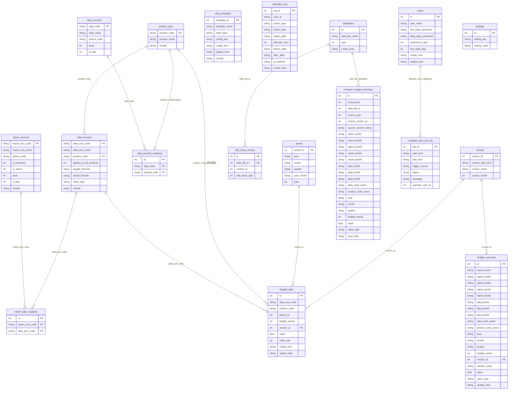

# 银行业务预算管理系统 — 数据库结构图（ERD）

| 项目 | 说明 |
|------|------|
| **文档版本** | v1.0 |
| **交付范围** | 与 **Rules「范围与演进」**、**System PDD §2.4**、Database PDD 表头一致：当前目标为**内网多用户**，并支持 `compare.db` 多年度对比透视。 |

**依据**：[`Banking_Budget_Database_PDD.md`](Banking_Budget_Database_PDD.md)（**唯一数据模型权威**；与 PDD **逐字段同步**）。产品语义、界面壳层与前端逻辑见 [`Banking_Budget_System_PDD.md`](Banking_Budget_System_PDD.md)；**Figma 示例数据不作为模型来源**。表名为 **SQLite 物理名**（snake_case）。

> 2026-04-28 同步说明：本轮仅调整 Agent 问询文案与前端透视交互（如透视搜索预填保留、导航文案更新），不涉及 ERD 结构变化；本图无需结构性改动。

**图例**

- **实线**：同一 `.db` 文件内、PDD 中已标注的 **FK / 业务引用** 关系。
- **跨库**：`budget_data` → `data_account`、`period` 为 **逻辑引用**（两文件分离时通常不设数据库级外键），见 PDD「跨库逻辑引用与 SQLite 限制」。
- **树表自引用**：`report_account.parent_code` → `report_account.report_acct_code`；`dept_account.parent_code` → `dept_account.dept_code`（图中用文字说明，避免 Mermaid 自环兼容问题）。
- **`budget_summary`**：预聚合**宽表**，含 **`budget_actual`**（与 `budget_data` 一致）、**`year` / `month` / `quarter`**、版本、数值等，**无**指向 `budget_data` 的外键；由引擎 **派生写入**。
- **`operation_log`**：位于 **`common.db`**，**无**外键；`target_table` 为物理表名；按时间追加，见 Database PDD **§1.9**。
- **界面与字段（非 ERD 关系，供对照）**：**`data_account.value_type`** ↔ Figma「数据科目维护」**数值类型**；**`budget_data.budget_actual`** ↔「预算基础数据维护」**预算值/实际值**；**`need_calc`** 无界面对应项，见 System PDD **§4.8**。

---

## 总览（Mermaid）

在支持 Mermaid 的编辑器或 GitHub/GitLab 预览中查看下图。**各实体块已列出与 PDD 一致的全部字段**（PDD 中的 **Text** 在图中写作 `string`，SQLite 类型仍为 TEXT）。

---

## 关系一览表

| 自表 | 字段 / 约束 | 指向 | 库 | 备注 |
|------|----------------|------|-----|------|
| `data_account` | `product_code` | `product_type.product_code` | common | FK；**单产品绑定**时非空；**适用所有产品**（`applies_to_all_products=1`）时为 `NULL` |
| `data_account` | `applies_to_all_products` | — | common | `0/1`；与 `product_code` 互斥，见 PDD **§1.1** |
| `report_data_mapping` | `report_acct_code` | `report_account.report_acct_code` | common | FK；联合唯一 `(report_acct_code, data_acct_code)` |
| `report_data_mapping` | `data_acct_code` | `data_account.data_acct_code` | common | FK |
| `dept_product_mapping` | `dept_code` | `dept_account.dept_code` | common | FK（仅允许部门叶子节点挂接产品） |
| `dept_product_mapping` | `product_code` | `product_type.product_code` | common | FK；唯一约束 `product_code`（单产品唯一归属） |
| `report_account` | `parent_code` | `report_account.report_acct_code` | common | 树自引用 |
| `dept_account` | `parent_code` | `dept_account.dept_code` | common | 树自引用 |
| `budget_data` | `data_acct_code` | `data_account.data_acct_code` | **跨库** | 逻辑引用 |
| `budget_data` | `product_code` | `product_type.product_code` | **跨库** | 逻辑引用；明细行级产品维 |
| `budget_data` | `period_id` | `period.period_id` | **跨库** | 逻辑引用 |
| `budget_data` | `version_id` | `version.version_id` | year | FK |
| `budget_data` | — | — | year | 联合唯一 `(data_acct_code, product_code, period_id, version_id, budget_actual)` |
| `version` | `current_month` | — | year | 取值 1-13，用于滚动预算规则 |
| `settings` | `setting_key`/`setting_value` | — | year | 年度库元信息（`year/create_user/create_time`） |
| `budget_summary` | **全字段见上图 `budget_summary` 实体块**（含 `report_level1`…`5`、`dept_level1`…`3`、`data_code_name`、`product_code_name`、`year`、`month`、`quarter`、`budget_actual`、`version_id`、`version_name`、`value`、`value_type`、`update_time`） | `version_id` → `version` | year | 仅 `version_id` 为 FK；余为展开/冗余列；与 PDD **§2.4** 一致 |
| `users` | `id` | — | common | 登录身份与权限 |
| `databases` | `id` | — | common | 年度库文件登记 |
| `edit_show_version` | `data_file_id` | `databases.id` | common | 编辑/展示版本配置 |
| `compare_budget_summary` | `data_file_id` | `databases.id` | compare | 多年度对比透视事实表（逻辑关联） |
| `compare_sync_job_log` | `operator_user_id` | `users.id` | compare | 同步任务日志（逻辑关联） |
| `chart_template` | — | — | common | 无外向 FK |
| `operation_log` | — | — | common | 无 FK；见 PDD **§1.9** |

---

## 分库存放

| 文件 | 包含表 |
|------|--------|
| `common.db` | `data_account`, `report_account`, `report_data_mapping`, `dept_account`, `dept_product_mapping`, `product_type`, `period`, `chart_template`, `operation_log`, `users`, `databases`, `edit_show_version` |
| `budget_{year}.db` | `version`, `settings`, `budget_data`, `budget_summary` |
| `compare.db` | `compare_budget_summary`, `compare_sync_job_log` |
