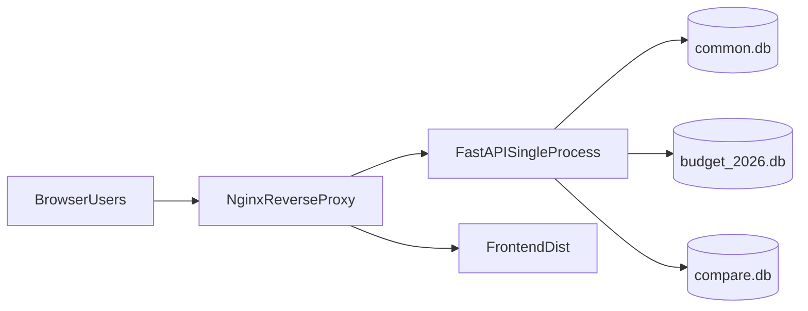

# Banking Budget 多用户内网版落地方案

本文档仅描述“改造计划与落地建议”，不包含代码实施。

适用对象：`cursor_budget_test3`（代码基线源于单机单用户，目标交付为内网多用户版本）  
目标规模：约 20 名用户，其中约 5 名可并发写 `budget_data`，其余用户仅可读 `budget_summary`

---

## 0. 本轮关联更新（2026-04-28）

- 本文多用户部署与权限方案不变；本轮新增需求主要落在 Agent 问询文案与前端导航交互。
- 与多用户直接相关的注意点：
  - 导航中“智能分析报告”“智能演示PPT”改为灰色视觉态，但入口仍可点击，RBAC 判定逻辑保持原有分层。
  - Agent 查询确认文案精简（锁定维度紧凑、透视建议去重）不影响会话鉴权与审计链路。

---

## 1. 目标与边界

## 1.1 目标
- 将系统从单用户改造为公司内网可用的多用户系统。
- 严格实现权限隔离：
  - 写用户：可写/改 `budget_data`。
  - 读用户：仅可读 `budget_summary`，不可触达 `budget_data` 写入口。
- 支持约 5 名写用户并发操作，保持稳定性。

## 1.2 已确认方案
- 数据库策略：**SQLite 继续使用**，采用**单后端进程 + 写操作串行化**。
- 认证策略：**应用内账号体系**（本地用户表 + 登录会话）。

---

## 2. 当前系统现状（问题清单）

- 当前“用户会话”是配置项模拟，不是真实登录身份。
- 所有 API 基本无权限隔离，读写接口都可调用。
- 审计日志中的用户信息非真实登录用户，IP 记录不完整。
- SQLite 并发控制未做生产化强化（锁等待、WAL、写队列等不足）。
- 现有部署偏开发形态（Vite + Uvicorn），缺少内网生产部署规范。

---

## 3. 推荐服务器端落地架构（按当前选型）

关键原则：
- 后端固定单进程（1 worker），避免 SQLite 多进程写锁冲突。
- Nginx 统一入口：
  - `/` 提供前端静态文件
  - `/api` 反代到 FastAPI
- 数据库文件放持久化目录，配备定时备份。

---

## 4. 分阶段改造计划

## 阶段1：账号与会话体系
- 新增用户与角色数据模型（例如 `user_account`, `role`, `user_role`, `session`）。
- 实现登录/登出、会话有效期、密码哈希存储（bcrypt/argon2）。
- `/api/session` 改为返回真实登录用户信息。
- 前端增加登录页与会话守卫。

交付结果：
- 系统不再依赖本地配置用户；所有操作有真实身份。

---

## 阶段2：接口级 RBAC 权限
- 为写接口增加 `writer` 权限依赖：
  - `budget-input` 写、重算、批量写、汇总重建等。
- 为读接口增加 `reader` 及以上权限。
- 明确读用户不可调用任何 `budget_data` 写入口。
- 若产品要求更严格，可进一步限制读用户不访问预算明细接口，仅允许 `budget_summary` 读。
- 多年度对比透视读取 `compare.db.compare_budget_summary`，并受读权限保护。

交付结果：
- 读写权限硬隔离，满足“读用户不可碰 BudgetData”。

---

## 阶段3：SQLite 并发稳定化（核心）
- 统一连接层配置：
  - `PRAGMA journal_mode=WAL`
  - `PRAGMA busy_timeout=5000`（可按压测上调）
  - 合理 `synchronous` 策略（一般 NORMAL）。
- 预算写路径串行化：
  - 应用层写锁（全局或按产品粒度）。
- 将“写入 + 公式重算 + 标记更新”尽量合并为事务，降低中间态与竞争。
- `budget-summary/rebuild` 做排队或后台任务化，避免与高峰写入冲突。

交付结果：
- 5 人并发写入下，显著降低 `SQLITE_BUSY` 与不一致风险。

---

## 阶段4：审计与可观测
- 审计日志记录真实 `user_id` 与客户端 IP。
- 增加请求日志（请求ID、用户、耗时、状态码）。
- 增加 compare 同步日志（`compare_sync_job_log`）追踪多年度对比数据刷新行为。
- 增加健康检查与就绪检查区分。
- 明确备份与恢复流程（`common.db`、`budget_2026.db`）。

交付结果：
- 满足内网运维与追责要求，问题可定位。

---

## 阶段5：内网部署交付
- 前端 `vite build` 后交由 Nginx 托管。
- 后端用 systemd/supervisor 以单进程运行 Uvicorn。
- 后端运行规范同时覆盖 macOS 与 Windows（同一套代码 + 平台化启动脚本）。
- `compare.db` 与其刷新任务一并纳入部署、备份与监控。
- 环境变量生产化：
  - `data_dir` 指向服务器持久化目录
  - `cors_origins` 指向内网域名
  - 会话与安全参数独立配置。
- 网络策略：仅内网网段可访问。

## 阶段6：双透视入口（当前年度 + 多年度对比）
- 多维分析工具下拆分两个透视入口：
  - `数据透视表-当前年度多版本透视`：读取当前编辑年度 `budget_summary`。
  - `数据透视表-多年度对比透视`：读取 `compare.db.compare_budget_summary`。
- 两个透视页面保持一致交互模型，减少学习成本。
- 多年度透视“带公式 Excel 导出”后续单独分期。

交付结果：
- 可稳定上线到公司内网服务器。

---

## 5. 角色权限矩阵（按已确认口径）

- `全权管理员`
  - 权限1：使用数据报表和图表
  - 权限2：输入或上传预算数据
  - 权限3：修改科目及管理版本
- `数据录入用户`
  - 权限1：使用数据报表和图表
  - 权限2：输入或上传预算数据
- `数据浏览用户`
  - 权限1：使用数据报表和图表

---

## 6. 验收标准（建议）

- 并发测试：5 用户并发执行预算写入，连续压测无失败、无脏数据。
- 权限测试：读用户调用任一写接口必须返回 403。
- 一致性测试：写入后公式重算与汇总结果一致。
- 运维测试：服务重启、备份恢复、日志追踪均正常。

---

## 7. 风险与升级建议

- 当前方案适合“20人、5写并发、单机部署”场景。
- 当出现以下情况时建议迁移 PostgreSQL：
  - 需要多实例后端横向扩展
  - 并发写明显增加
  - 合规审计要求进一步提升

---

## 8. 实施顺序建议（简版）

1. 先做账号会话与 RBAC（先把权限边界立住）  
2. 再做 `compare.db` 与双透视入口（先把分析消费层定稿）  
3. 再做 SQLite 并发稳态改造（避免上线后写冲突）  
4. 最后完成部署、审计、备份与压测验收  

