# 银行业务预算管理系统 — 数据库结构图（ERD）

| 项目 | 说明 |
|------|------|
| **文档版本** | v1.0 |
| **交付范围** | 与 **Rules「范围与演进」**、**System PDD §2.4**、Database PDD 表头一致：当前目标为**内网多用户**，并支持 `compare.db` 多年度对比透视。 |

**依据**：[`Banking_Budget_Database_PDD.md`](Banking_Budget_Database_PDD.md)（**唯一数据模型权威**；与 PDD **逐字段同步**）。产品语义、界面壳层与前端逻辑见 [`Banking_Budget_System_PDD.md`](Banking_Budget_System_PDD.md)；**Figma 示例数据不作为模型来源**。除明确标注为服务内展开的读模型外，表名为 **SQLite 物理名**（snake_case）。

> 2026-06-10 当前产品主表合同：机构及产品主表为 `org_product_tree_snapshot`；旧“产品科目维护”物理表和同名视图已经下线删除。运行产品清单由服务从 `org_product_tree_snapshot.payload_json` 展开，用于运行 SQL/展示模块读取产品名称和层级，不得作为配置入口、CRUD 目标或导入目标恢复。

> 2026-05-19 架构清理补充：运行库完整表归属见 `.scratch/architecture-deep-clean/TABLE_OWNERSHIP.md`。本 ERD 主图继续展示核心主事实、投影和关键 adapter 关系；费用、智能报告、智能 PPT、预测假设等 Module 私有表在「分库存放」中分类列出，除 owner Module 外不应直接 SQL 依赖。旧 `chart_template` 空表已退休。

> 2026-06-01 投影表合同补充：`budget_pivot_aggregate` 与 `compare_pivot_aggregate` 是当前透视聚合 Module 的预聚合投影表，随 `budget_summary` / `compare_budget_summary` 一起使用 `metric_level1`…`metric_level5` 和 `value_source`；历史 `report_level*` / `display_level*` 投影列不得作为兼容输入。

> 2026-05-19 部门科目补充：`dept_account` 当前按潘潘部门架构维护模版维护 `主体 -> 事业群 -> 费用归属部门` 两级部门科目；费用发生部门保留在 `expense_framework_budget_department`，不进入部门科目树。

> 2026-04-28 同步说明：本轮仅调整 Agent 问询文案与前端透视交互（如透视搜索预填保留、导航文案更新），不涉及 ERD 结构变化；本图无需结构性改动。

**图例**

- **实线**：同一 `.db` 文件内、PDD 中已标注的 **FK / 业务引用** 关系。
- **跨库**：`budget_data` → `data_account`、`period` 为 **逻辑引用**（两文件分离时通常不设数据库级外键），见 PDD「跨库逻辑引用与 SQLite 限制」。
- **树表自引用**：`dept_account.parent_code` → `dept_account.dept_code`（图中用文字说明，避免 Mermaid 自环兼容问题）。
- **`budget_summary` / `budget_pivot_aggregate` / `compare_budget_summary` / `compare_pivot_aggregate`**：预聚合投影，含 **`budget_actual`**（与 `budget_data` 一致）、**`year` / `month` / `quarter`**、版本或展示层级、数值、`value_source` 等，**无**指向 `budget_data` 的外键；由引擎 **派生写入**。
- **`operation_log`**：位于 **`common.db`**，**无**外键；`target_table` 为物理表名；按时间追加，见 Database PDD **§1.9**。
- **运行字段对照（非 ERD 关系）**：**`data_account.value_type`** 为机构及产品指标同步到数据科目运行链路的数值类型；**`budget_data.budget_actual`** ↔「机构及产品数据录入」确认同步后的**预算/实际口径**；**`need_calc`** 无界面对应项，见 System PDD **§4.8**。

---

## 总览（Mermaid）

在支持 Mermaid 的编辑器或 GitHub/GitLab 预览中查看下图。**各实体块已列出与 PDD 一致的全部字段**（PDD 中的 **Text** 在图中写作 `string`，SQLite 类型仍为 TEXT）。

```mermaid
erDiagram
    %% ========== common.db ==========
    org_product_tree_snapshot {
        int id PK
        string payload_json
        string updated_at
    }

    data_account {
        string data_acct_code PK
        string data_acct_name
        string budget_formula
        string actual_formula
        string budget_rule_code
        string budget_rule_config_json
        int need_calc
        int formula_calc_mode
        int allow_manual_entry
        string value_type
        string remark
    }

    data_account_metric_node {
        string node_code PK
        string node_name
        string parent_code
        string product_code
        string local_metric_code
        string logic_code
        string functional_group_code
        int level
        string node_type
        int horizontal_rollup
        int vertical_rollup
        int sort_order
        int is_active
        string remark
        string created_at
        string updated_at
    }

    data_account_metric_binding {
        string data_acct_code PK
        string metric_node_code FK
        string scope_type
        string scope_code
        int sort_order
        int is_active
        string remark
        string created_at
        string updated_at
    }

    dept_account {
        string dept_code PK
        string dept_name
        string entity_name
        string parent_code
        int level
        int is_leaf
    }

    period {
        int period_id PK
        string year
        string month
        string quarter
        string year_month
        int days
    }

    operation_log {
        int log_id PK
        string user_id
        string action_type
        string action_desc
        string target_table
        int affected_rows
        string before_data
        string after_data
        string ip_address
        string create_time
    }

    users {
        int id PK
        string user_name
        string first_login_password
        string daily_login_password
        int permission_type
        int first_login_flag
        string create_time
        string update_time
    }

    databases {
        int id PK
        string data_file_name
        int year
        string create_time
    }

    edit_show_version {
        int id PK
        int data_file_id FK
        int version_id
        int edit_show_sign
    }

    %% ========== budget_{year}.db ==========
    version {
        int version_id PK
        string version_date_time
        string version_name
        int current_month
    }

    settings {
        int id PK
        string setting_key
        string setting_value
    }

    budget_data {
        int id PK
        string data_acct_code
        string product_code
        int period_id
        int budget_actual
        int version_id FK
        float value
        float formula_value
        float manual_value
        string value_source
        int need_calc
        string create_time
        string update_time
    }

    budget_summary {
        int id PK
        string metric_level1
        string metric_level2
        string metric_level3
        string metric_level4
        string metric_level5
        string dept_level1
        string dept_level2
        string dept_level3
        string data_code_name
        string product_code_name
        string year
        string month
        string quarter
        int budget_actual
        int version_id FK
        string version_name
        float value
        string value_type
        string value_source
        string update_time
    }

    budget_pivot_aggregate {
        int id PK
        string grain
        string metric_level1
        string metric_level2
        string metric_level3
        string metric_level4
        string metric_level5
        string dept_level1
        string dept_level2
        string dept_level3
        string data_code_name
        string product_code_name
        string year
        string month
        string quarter
        int budget_actual
        int version_id FK
        string version_name
        float value
        string value_type
        string value_source
        string update_time
    }

    %% ========== compare.db ==========
    compare_budget_summary {
        int id PK
        int show_level
        int data_file_id
        int source_year
        int source_version_id
        string source_version_name
        string metric_level1
        string metric_level2
        string metric_level3
        string metric_level4
        string metric_level5
        string dept_level1
        string dept_level2
        string dept_level3
        string data_code_name
        string product_code_name
        string year
        string month
        string quarter
        int budget_actual
        float value
        string value_type
        string value_source
        string sync_time
    }

    compare_pivot_aggregate {
        int id PK
        string grain
        int show_level
        int data_file_id
        int source_year
        int source_version_id
        string source_version_name
        string metric_level1
        string metric_level2
        string metric_level3
        string metric_level4
        string metric_level5
        string dept_level1
        string dept_level2
        string dept_level3
        string data_code_name
        string product_code_name
        string year
        string month
        string quarter
        int budget_actual
        float value
        string value_type
        string value_source
        string sync_time
    }

    compare_sync_job_log {
        int job_id PK
        string start_time
        string end_time
        string trigger_source
        string status
        string message
        int operator_user_id
    }

    %% common.db 内外键
    data_account_metric_node ||--o{ data_account_metric_binding : "metric_node_code"
    data_account ||--|| data_account_metric_binding : "data_acct_code"
    databases ||--o{ edit_show_version : "data_file_id"
    users ||--o{ compare_sync_job_log : "operator_user_id(logical)"
    databases ||--o{ compare_budget_summary : "data_file_id(logical)"
    databases ||--o{ compare_pivot_aggregate : "data_file_id(logical)"

    %% 跨库逻辑引用（非 DB 级 FK）
    data_account ||--o{ budget_data : "data_acct_code"
    org_product_tree_snapshot ||--o{ budget_data : "product_code (logical runtime catalog)"
    period ||--o{ budget_data : "period_id"

    %% budget_{year}.db 内外键
    version ||--o{ budget_data : "version_id"
    version ||--o{ budget_summary : "version_id"
    version ||--o{ budget_pivot_aggregate : "version_id"
```

---

## 关系一览表

| 自表 | 字段 / 约束 | 指向 | 库 | 备注 |
|------|----------------|------|-----|------|
| `data_account_metric_binding` | `data_acct_code` | `data_account.data_acct_code` | common | PK/FK；唯一指标号码，必须等于产品前缀 `metric_node_code` |
| `data_account_metric_binding` | `metric_node_code` | `data_account_metric_node.node_code` | common | 产品前缀指标节点引用；产品内分段表达业务对象和细分归属 |
| `data_account_metric_binding` | `scope_code` | 机构及产品主表产品编码 | common | 产品编码；必须等于 `metric_node_code` 的产品前缀 |
| 运行产品清单 | `parent_code` | 机构及产品主表产品编码 | common | 服务展开后的产品层级自引用；不代表物理产品科目维护表 |
| `dept_account` | `parent_code` | `dept_account.dept_code` | common | 树自引用 |
| `budget_data` | `data_acct_code` | `data_account.data_acct_code` | **跨库** | 逻辑引用 |
| `budget_data` | `product_code` | 机构及产品主表产品编码 | **跨库** | 逻辑引用；明细行级产品维 |
| `budget_data` | `period_id` | `period.period_id` | **跨库** | 逻辑引用 |
| `budget_data` | `version_id` | `version.version_id` | year | FK |
| `budget_data` | — | — | year | 联合唯一 `(data_acct_code, product_code, period_id, version_id, budget_actual)` |
| `version` | `current_month` | — | year | 取值 1-13，用于滚动预算规则 |
| `settings` | `setting_key`/`setting_value` | — | year | 年度库元信息（`year/create_user/create_time`） |
| `budget_summary` | **全字段见上图 `budget_summary` 实体块**（含 `metric_level1`…`5`、`dept_level1`…`3`、`data_code_name`、`product_code_name`、`year`、`month`、`quarter`、`budget_actual`、`version_id`、`version_name`、`value`、`value_type`、`value_source`、`update_time`） | `version_id` → `version` | year | 仅 `version_id` 为 FK；余为展开/冗余列；与 PDD **§2.4** 一致 |
| `budget_pivot_aggregate` | `version_id` | `version.version_id` | year | 当前年度透视预聚合投影；由预算/实际跑批或透视聚合 Module 重建 |
| `users` | `id` | — | common | 登录身份与权限 |
| `databases` | `id` | — | common | 年度库文件登记 |
| `edit_show_version` | `data_file_id` | `databases.id` | common | 编辑/展示版本配置 |
| `compare_budget_summary` | `data_file_id` | `databases.id` | compare | 多年度对比透视事实表（逻辑关联） |
| `compare_pivot_aggregate` | `data_file_id` | `databases.id` | compare | 多年度对比透视预聚合投影（逻辑关联） |
| `compare_sync_job_log` | `operator_user_id` | `users.id` | compare | 同步任务日志（逻辑关联） |
| `operation_log` | — | — | common | 无 FK；见 PDD **§1.9** |

---

## 分库存放

| 文件 | 表类型 | 包含表 |
|------|--------|--------|
| `common.db` | 核心事实表/运行读模型 | `data_account`, `data_account_metric_node`, `data_account_metric_binding`, `org_product_tree_snapshot`, `org_product_metric_table`, `dept_account`, `budget_subject_catalog`, `period`, `users`, `user_sessions`, `operation_log`, `databases`, `edit_show_version`, `feishu_user_binding`；旧 `product_type` 对象已删除 |
| `common.db` | Module 私有表 | `smart_report_template`, `smart_report_template_variable`, `smart_report_blueprint`, `smart_report_calc_metric`, `smart_report_instance`, `smart_report_job`, `smart_ppt_scene`, `smart_ppt_chart_config`, `smart_ppt_instance`, `expense_sync_meta`, `expense_framework_budget_department`, `expense_framework_product_department`, `expense_framework_subject`, `expense_actual_import_batch`, `expense_actual_detail_raw`, `bi_ai_subject_mapping`, `manage_dept_owner_mapping`, `expense_forecast_entry`, `expense_forecast_annual_entry`, `expense_forecast_rule`, `expense_forecast_rule_param`, `expense_forecast_rule_variable`, `expense_forecast_calc_result`, `expense_forecast_override` |
| `budget_{year}.db` | 年度事实与投影 | `version`, `settings`, `budget_data`, `budget_summary`, `budget_pivot_aggregate` |
| `budget_{year}.db` | Module 私有表 | `business_cost_income_item`, `business_cost_income_indicator`, `business_cost_income_value` |
| `compare.db` | 对比快照与投影 | `compare_budget_summary`, `compare_pivot_aggregate`, `compare_sync_job_log`, `settings` |

## 部门费用链路（当前运行口径）

部门费用相关表是 `common.db` 内的 Module 私有表，除部门费用 Module 外不得作为通用主数据直接 SQL 依赖。当前链路为：

1. 费用框架导入写入 `expense_framework_budget_department`、`expense_framework_product_department`、`expense_framework_subject`，并通过 `expense_sync_meta.framework_import` 记录来源。
2. 框架应用到主数据时更新 `dept_account` 与 `budget_subject_catalog`，并通过 `expense_sync_meta.master_apply` 记录结果；`expense_framework_product_department` 只是费用框架快照，不是产品主数据。
3. 费用执行明细导入写入 `expense_actual_import_batch` 与 `expense_actual_detail_raw`；`import_kind` 区分 `current_year_actual`、`current_year_budget`、`prior_year_actual`。
4. BI-AI 和归口部门映射分别由 `bi_ai_subject_mapping`、`manage_dept_owner_mapping` 承载；旧 `control_item_subject_mapping` 已从当前运行 schema 删除，只保留在退休表删除清单和历史审计中。当前映射只服务费用执行明细匹配，不是标准指标树或部门主数据。
5. 费用预算执行报表读取 `expense_actual_detail_raw` 当前实际、`budget_summary` 年度预算/上一年实际、`budget_subject_catalog` 科目树和 `dept_account` 部门树；旧 `expense_execution_monthly` 不在当前 ERD 中。
