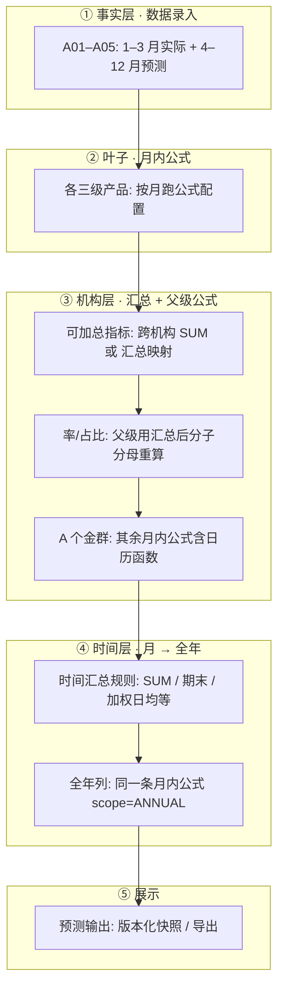

# 机构及产品 · 滚动预测计算体系（整合方案 PDD）

| 项目 | 说明 |
|------|------|
| **文档版本** | v1.2 |
| **适用范围** | 「预算数据输入」下的 **数据录入**、**机构及产品指标**、**预测规则（新建）**、**预测输出**；以 **2026 年 3 月滚动预测** 为典型场景 |
| **相关文档** | [`OrgProduct_Naming_Glossary.md`](OrgProduct_Naming_Glossary.md)（**术语表 · 提需求用**）、[`Banking_Budget_System_PDD.md`](Banking_Budget_System_PDD.md)、[`Banking_Budget_Database_PDD.md`](Banking_Budget_Database_PDD.md)、[`OrgProduct_Matrix_Output_PDD.md`](OrgProduct_Matrix_Output_PDD.md)（矩阵输出：**风险驱动表**、**税前利润分解表**等） |
| **代码锚点（现状）** | `OrgProductDataEntryContent.tsx`、`OrgProductMetricContent.tsx`、`OrgProductForecastOutputContent.tsx`、`backend/app/routers/org_product_metrics.py`（`/api/org-product-output/run`） |

---

## 0. 试点起步（B01 · 企业金融业务状况表）— 从这里开始

**当前阶段：阶段 1（无需先配公式）**

| 步骤 | 页面 | 操作 |
|------|------|------|
| 1 | **数据录入** | 打开后应默认 **B01 企业金融**；指标表选 **企业金融业务状况表**（若仅有「业务状况表」也可用）。选 2026 年、3 月滚动，录若干指标 1–3 月实际、4–12 月预测 → **版本确认** |
| 2 | **预测输出** | 同 B01、同表、同年、**同一数据版本** → 点 **运行** |
| 3 | 核对 | 1–12 月与录入一致；**年度汇总**：收入≈12 月合计、余额≈12 月、日均≈按天加权（阶段 1.2 已落地） |
| 4 | 以后再配 | **机构及产品指标 → 公式配置** 逐条加公式；率类全年将按公式重算（阶段 1.3） |

代码默认试点常量：`src/app/orgProductPilot.ts`（`B01` / `企业金融业务状况表`）。

---

## 1. 业务目标（一句话）

在选定 **滚动月份 M**（如 2026 年 3 月）下：三级产品录入 **1–M 月实际 + (M+1)–12 月预测** → 按月计算指标 → 按规则汇总到上级机构 → 将 12 个月合成为 **全年预测** → 在 **预测输出** 展示与导出。

---

## 2. 设计原则

| # | 原则 | 说明 |
|---|------|------|
| P1 | **配置与执行分离** | 规则在维护模块配置；**预测输出** 只负责按版本跑批、展示、导出 |
| P2 | **三类规则不混写** | **月内公式**、**时间汇总**、**机构汇总（含异码映射）** 分属不同配置面，避免在「公式配置」里写全年 SUM、12 月取数等 |
| P3 | **同一套月内公式覆盖「月列 + 全年列」** | 含年化/去年化的率、收入互推，通过 **时间上下文函数** 区分，不维护两套公式文案 |
| P4 | **率类禁止简单相加** | 下级机构的率/占比不直接 SUM；在父级用 **已汇总的分子分母** 重算 |
| P5 | **与现有能力对齐** | 跨机构引用格式 `机构代码/表名/指标代码` 已存在于公式解析与 `run` API，方案在其上扩展 |

---

## 3. 模块与职责（信息架构）

### 3.1 菜单结构（定稿）

```text
预算数据维护                    ← 主数据 / 结构（「有什么」）
├── 机构及产品                  ← 机构树：AAA（集团根）→ AA、AB；D 在 AA 下；无 AC 实体
└── 机构及产品指标              ← 指标树、科目性质、月内公式（含跨机构引用）
                                  ※ 不放：时间汇总、矩阵版式、合并损益拼表

预算数据输入                    ← 事实 + 输出规则 + 执行（「录什么、怎么出表」）
├── 数据录入                    ← 按机构/表/月录入与版本确认
├── 预测规则（新建）            ← 见 §3.2；不依赖「预测预算工作台」
│   ├── 时间汇总规则            ← 12 月 → 全年（按性质默认 + 按指标覆盖）
│   └── 矩阵报表模板            ← 风险驱动、分产品利润、国际业务合并损益、集团合并损益等
└── 预测输出                    ← 只跑批、展示、导出（读：指标公式 + 预测规则）
    ├── 模式 A：单机构指标表    ← 1–12 月 + 全年（现有）
    └── 模式 B：矩阵报表        ← 选模板运行（见 OrgProduct_Matrix_Output_PDD）

※ 「预测预算工作台」：现有页面保留即可，后续建设不以其为枢纽。
```

### 3.2 为何「预测规则」放在预算数据输入（而非数据维护）

| 维度 | 预算数据维护 | 预测规则 |
|------|--------------|----------|
| 定义对象 | 机构、指标、月内公式 | 在已有指标之上的 **汇总与出表方式** |
| 是否主数据 | 是 | **否**（依赖指标 code，描述运行/输出行为） |
| 典型内容 | B01 损益表有哪些科目 | 收入全年=12 月 SUM；矩阵行=泛微粒贷 |
| 使用路径 | 编表前维护 | 录入后 → 配规则 → **预测输出** 跑批 |

**结论**：预测规则 **不属于** 基础数据维护；与 **数据录入、预测输出** 同属输入侧一条线。规则由具体指标 **引用** 而成，但不改变指标主数据定义。

### 3.2.1 术语与命名（需求用语）

**单机构指标表**（指标表定义 / 录入 / 输出）与 **矩阵报表** 的区分、发需求时的标准叫法，见 **[`OrgProduct_Naming_Glossary.md`](OrgProduct_Naming_Glossary.md)**（含 **§2.1 汇总型/引用型** 如 AA 损益从各产品表取数仍属指标表）。后续工单可直接引用该文档中的名称，避免与矩阵版式混淆。

### 3.3 与机构及产品指标的分工（避免重复）

| 配置项 | 维护入口 | 执行入口 |
|--------|----------|----------|
| 指标树、代码、名称、性质 | 机构及产品指标 | — |
| 月内公式（同月 A+B、跨机构引用） | 机构及产品指标 · 公式配置 | 预测输出 `run` |
| 时间汇总（SUM / 期末 / 加权日均 / 全年公式） | **预测规则 · 时间汇总** | 预测输出 `run` |
| 矩阵行/列、D+AB 合并、产品利润表版式 | **预测规则 · 矩阵模板** | 预测输出 · 模式 B |
| 机构异码汇总映射（可选） | 预测规则 或 指标页快捷入口 | 预测输出 |

指标页可预留 **「跳转：该表时间汇总 / 所属矩阵」** 链接；**主维护入口仍在预测规则**。

### 3.4 机构树与「国际业务（整体）」（方案 B）

| 节点 | 是否实体 | 说明 |
|------|----------|------|
| AAA 微众集团 | 集团根（轻量） | **保留于机构树**；**无**单机构指标表；集团合并见 **矩阵报表** |
| AA 微众银行 | 是 | 含 A～F、D 国际业务、A01…；指标表 6 张：业务状况、损益、资产负债表（余额/日均）、资产质量、利息净收入 |
| AB 微众科技 | 是 | 与 AA 并列，自有损益指标表 |
| AC 国际业务（整体） | **否** | **不进机构树**；D+AB 合并损益 = **矩阵模板**，分产品利润表引用合并利润 |

**不单独建设**与「公式配置」平行的巨型「机构汇总规则」菜单；机构关系以 **公式 + 汇总映射** 表达。矩阵详见 [`OrgProduct_Matrix_Output_PDD.md`](OrgProduct_Matrix_Output_PDD.md)。

---

## 4. 端到端计算流水线

以 **2026 年 3 月滚动、A 个金群（含 A01–A05 三级产品）** 为例：



### 4.1 数据录入（已实现 · 持续增强）

| 项 | 说明 |
|----|------|
| 滚动列 | 展示 `Y年预算`、`Y年预测`（只读汇总）、`1..M 实际`、`M+1..12 预测` |
| `Y年预测` | = Σ(1..M 实际) + Σ(M+1..12 预测)（录入侧展示用，与输出侧全年列口径可不同，见 §5.2） |
| 范围 | 主要在 **三级产品** 录入；上级机构可不录或仅录少量假设项 |

### 4.2 月内公式（机构及产品指标 · 公式配置）

| 项 | 说明 |
|----|------|
| 作用域 | **单机构、单表、单个月份** 的指标 DAG |
| 引用 | 同表 `AA.01.01`；跨表 `表名/AA.01.01`；跨机构 `A01/总资产/A01.10.01` |
| 函数（现状） | `SUM` / `AVG` / `MAX` / `MIN` |
| 函数（待扩展） | `DAYS_YEAR`、`DAYS_MONTH`、`ANNUALIZE_FACTOR`、`DEANNUALIZE_FACTOR`（§6） |
| 禁止 | 在公式中写「12 个月相加」「取 12 月」等 **时间聚合** 语义 |

### 4.3 机构汇总（公式为主 + 映射为辅）

#### 场景 A：同码可加总（如一级段 01–09）

- 父级指标 code 与下级一致（仅差产品号前缀）。
- **做法**：父级公式中 `SUM(A01/表/代码, A02/表/代码, …)`；或阶段 3 提供 **「按子机构同码生成 SUM」** 草稿按钮。
- **不需要** 独立「机构汇总规则」表。

#### 场景 B：异码汇总（全行 vs 三级口径不同）

示例：全行 **表内贷款 `AA.12.01`** = 各三级 **自持贷款 `产品号.10.01`** 之和（全行在总资产下，产品在管理贷款下）。

- **做法 1（指标少）**：父级公式显式写跨机构引用。
- **做法 2（指标多）**：**汇总映射表** 维护多行 `(子机构, 子表, 子指标) → 父指标`，聚合算子 `SUM`；执行前编译为与公式等价的引用。
- **率/占比**：禁止映射为 SUM；在父级配置 **月内公式**，引用父级已汇总的流量/存量。

#### 场景 C：A 个金群输出形态

- A 个金群与 A01 使用 **同一套指标表结构**；输出在 **预测输出** 中按机构切换查看。
- 配置集中在 **A 个金群** 实体的公式/映射，不在三级重复维护汇总逻辑。

#### 执行顺序（机构层 · MUST）

```text
1. 自底向上处理机构树（先三级，后二级、一级）
2. 对每个 (机构, 表, 月):
   a. 若指标为「可加总」且有映射/汇总公式 → 先得到汇总值
   b. 再跑该机构「派生类」月内公式（含率、收入互推）
3. 禁止：先算父级率再向下分配（除非未来单独做分摊模块）
```

### 4.4 时间汇总（预测规则 · 阶段 2）

将 **12 个月已算满的指标值** 合成为 **全年列**（与录入里的 `Y年预测` 列解耦，输出侧以本规则为准）。

| 汇总类型 | 代码（建议） | 典型科目性质 | 全年算法 |
|----------|--------------|--------------|----------|
| 期末时点 | `END_OF_PERIOD` | 资产余额、负债余额 | 取 **12 月** 值 |
| 期间合计 | `SUM` | 收入、支出、利润 | **12 个月相加** |
| 加权日均 | `WEIGHTED_AVG_BY_DAYS` | 资产日均、负债日均 | Σ(月日均 × 当月天数) / 当年天数 |
| 简单平均 | `AVG`（可选） | 少数特殊项 | 12 个月算术平均 |
| 全年重算 | `FORMULA_ON_ANNUAL` | 率、部分占比 | 不聚合月率；全年列走 **同一条月内公式** + `scope=ANNUAL` |
| 仅录入 | `NONE` | 纯假设项 | 全年列空或仅展示录入 |

**默认**：按指标 **科目性质** 套用上表；允许按 `metric_code` **覆盖**。

**现状**：`org_product_metrics._annual_summary_by_nature` 已部分实现（余额=12 月、收入=SUM、日均=简单平均）；阶段 2 改为读规则表并支持 **按天加权**。

### 4.5 预测输出（执行层）

| 项 | 说明 |
|----|------|
| 输入 | 数据录入版本、`month_index`（滚动月 M）、机构、指标表 |
| 处理 | 按 §4 流水线跑批 |
| 输出 | 每指标 `months[12]` + `annual` + `month_errors` |
| 定位 | **不**在此维护公式/规则；可提供「跳转规则配置」链接 |
| API | `POST /api/org-product-output/run`（已有，按阶段扩展） |

---

## 5. 指标元数据扩展

在指标节点（`MetricNode`）上增加字段，供引擎与 UI 共用：

| 字段 | 类型 | 说明 |
|------|------|------|
| `nature` | string | 已有：资产余额、收入、率类展示等 |
| `calc_role` | enum | `entry` \| `formula` \| `entry_overrides_formula` |
| `time_agg` | enum | 可选，覆盖默认时间汇总类型（§4.4） |
| `rollup_mode` | enum | `none` \| `sum_children` \| `formula` \| `mapped`（提示性，执行仍以公式/映射为准） |

### 5.1 calc_role 与录入/公式分工

| calc_role | 含义 | 典型 |
|-----------|------|------|
| `entry` | 以数据录入为准 | 预测月的年化收息率（假设） |
| `formula` | 以公式为准 | 利息收入 = 日均 × 率 × 去年化系数 |
| `entry_overrides_formula` | 有录入用录入，无则公式 | 实际月常录入，预测月走公式 |

### 5.2 录入「Y年预测」列 vs 输出「annual」列

| 列 | 模块 | 口径 |
|----|------|------|
| `year_forecast`（录入 UI） | 数据录入 | 滚动窗口内：M 月前实际 + 后段预测之和（业务快速查看） |
| `annual`（输出） | 预测输出 | 经 **月内公式 + 机构汇总 + 时间汇总 + 全年公式** 后的正式全年预测 |

两者可不一致；**对外报表以预测输出 `annual` 为准**。

---

## 6. 公式语言扩展（月内 + 时间上下文）

### 6.1 设计目标

- **收息率（年化展示）** 与 **全年收息率** 共用一条公式，仅系数不同。
- **利息收入** 与 **收息率** 互推共用日历逻辑，不拆两个模块。

### 6.2 建议内置函数

| 函数 | 月列 (scope=MONTH) | 全年列 (scope=ANNUAL) |
|------|--------------------|------------------------|
| `DAYS_YEAR()` | 当年总天数（365/366） | 同左 |
| `DAYS_MONTH()` | 当前计算月份天数 | 视为 `DAYS_YEAR()`（或返回 12 个月天数之和） |
| `ANNUALIZE_FACTOR()` | `DAYS_YEAR / DAYS_MONTH` | `1` |
| `DEANNUALIZE_FACTOR()` | `DAYS_MONTH / DAYS_YEAR` | `1` |

### 6.3 公式示例（配置在机构及产品指标）

**（1）收息率 — 收入驱动（问 2）**

```text
利息收入 / 贷款日均 * ANNUALIZE_FACTOR()
```

- 月度：当月收入、当月日均，结果 **年化率**。
- 全年：`利息收入`、`贷款日均` 取 **时间汇总后** 的全年值，`ANNUALIZE_FACTOR()=1` → 全年收息率。

**（2）利息收入 — 率驱动（问 3）**

```text
贷款日均 * 贷款收息率 * DEANNUALIZE_FACTOR()
```

- `贷款收息率`：`calc_role=entry`（录入为年化口径）。
- 月度：去年化得到当月收入。
- 全年：全年日均 × 全年率（录入或汇总后）× 1。

**（3）个金群汇总（问 1 · 同码）**

```text
SUM(A01/总资产/A01.03.01, A02/总资产/A02.03.01, A03/总资产/A03.03.01, A04/总资产/A04.03.01, A05/总资产/A05.03.01)
```

**（4）全行异码（问 1 · 映射或手写）**

```text
A01/管理贷款/A01.10.01 + A02/管理贷款/A02.10.01 + ... 
```

或在 **汇总映射** 中配置 `AA.12.01 ← SUM(上述各行)`，由系统生成等价公式。

---

## 7. 数据模型（阶段 2 起落库）

### 7.1 时间汇总规则 `org_product_time_agg_rule`

| 字段 | 说明 |
|------|------|
| `id` | PK |
| `nature` | 科目性质（默认规则） |
| `metric_code` | 可选，非空则覆盖 nature 默认 |
| `entity_code` | 可选，机构级覆盖 |
| `agg_type` | `END_OF_PERIOD` \| `SUM` \| `WEIGHTED_AVG_BY_DAYS` \| `AVG` \| `FORMULA_ON_ANNUAL` \| `NONE` |
| `priority` | 覆盖优先级：metric+entity > metric > nature |

### 7.2 汇总映射 `org_product_rollup_mapping`

| 字段 | 说明 |
|------|------|
| `id` | PK |
| `parent_entity_code` | 父机构，如 A |
| `parent_table_name` | 父表名 |
| `parent_metric_code` | 父指标，如 AA.12.01 |
| `child_entity_code` | 子机构 |
| `child_table_name` | 子表名 |
| `child_metric_code` | 子指标，如 A01.10.01 |
| `operator` | 默认 `SUM` |
| `sort_order` | 展示/计算顺序 |

### 7.3 预测输出快照（已有）

表 `org_product_output_snapshot_v1`：存跑批结果，关联 `input_version_id`、`output_version_id`。

---

## 8. 引擎伪代码（实现参照）

```text
function runForecast(entity, table, year, versionId, rollingMonth M):
  monthsData = loadDataEntry(entity, table, year, versionId)
  metricDefs = loadMetricDefs(entity, table)
  mappings = loadRollupMappings(parentEntity)  // 若 entity 为父级

  for month in 1..12:
    resolveMonthValues(entity, table, month, monthsData, metricDefs, mappings)
    // 内部：拓扑排序；先子机构（若 include_children）；再加总；再公式

  annualValues = {}
  for metric in metricDefs:
    if timeAgg(metric) == FORMULA_ON_ANNUAL:
      annualValues[metric] = evalFormula(metric, scope=ANNUAL, refs=annualRefs)
    else:
      annualValues[metric] = applyTimeAgg(metric, months[1..12])

  return { months, annual: annualValues }
```

---

## 9. 分阶段实施计划（工作顺序 · 建议按序执行）

```text
阶段 0  机构树 → 补指标表 → 录入 → 预测输出（单表）
   ↓
阶段 1  预测规则（时间汇总）+ 月内公式逐步补全
   ↓
阶段 2  预测规则（矩阵模板）+ 预测输出（模式 B）
   ↓
阶段 3  公式增强、机构汇总、矩阵间引用
```

### 阶段 0：基础（当前优先）

| 顺序 | 任务 | 涉及 | 状态 |
|------|------|------|------|
| 0.1 | **更新机构树**：AAA（集团根）、AA/AB 并列；D 在 AA 下；**不加 AC** | `OrgProductContent`、树快照 | 待做 |
| 0.2 | **补全指标表**：AA 下产品/群、AB 损益、D；科目树与性质 | `OrgProductMetricContent` | 进行中 |
| 0.3 | **数据录入**打通：保存、版本确认、再打开 | `OrgProductDataEntryContent` | 进行中 |
| 0.4 | **预测输出模式 A**：单机构单表运行/导出 | `OrgProductForecastOutputContent` | 进行中 |
| 0.5 | 试点默认 B01 + 表名；全年列算法（加权日均、率类全年） | `orgProductPilot.ts`、`org_product_metrics.py` | 部分 ✅ |
| 0.6 | 业务确认：`year_forecast`（录入）与 `annual`（输出）口径（§5.2） | 业务 | 待做 |

**完成标志**：至少一个主体（如 B01）「录入 → 预测输出」手算可核对。

### 阶段 1：预测规则 · 时间汇总 + 公式（指标表补完后）

| 顺序 | 任务 | 涉及 |
|------|------|------|
| 1.1 | 导航新增 **预算数据输入 → 预测规则**（不用工作台） | `NavigationTree`、`WorkArea` |
| 1.2 | 时间汇总规则表 + Tab「时间汇总」UI | 新 API、配置页 |
| 1.3 | `run` 读规则表，替代 `_annual_summary_by_nature` 硬编码 | `org_product_metrics.py` |
| 1.4 | 指标节点可选 `calc_role`、`time_agg`（覆盖默认） | 指标 snapshot |
| 1.5 | **月内公式**在机构及产品指标中逐条补充 | 公式配置 |

**交付物**：全年列可配置；公式与时间汇总分离。

### 阶段 2：预测规则 · 矩阵 + 预测输出模式 B

| 顺序 | 任务 | 涉及 |
|------|------|------|
| 2.1 | 矩阵引擎 + 模板 JSON（先期可文件/导入） | 新 API `/org-product-matrix/*` |
| 2.2 | 预测规则 Tab「矩阵报表模板」 | 配置页 |
| 2.3 | 预测输出：指标表 / 矩阵报表 切换运行与导出 | `OrgProductForecastOutputContent` |
| 2.4 | 优先模板：分产品利润表 → 风险驱动表 → 国际业务整体合并损益 → 集团合并损益 | 见 Matrix PDD |

**交付物**：矩阵不在「机构及产品指标」下维护；指标表仅作数据源。

### 阶段 3：增强（靠后）

| 任务 | 内容 |
|------|------|
| 3.1 | 日历函数 `ANNUALIZE_FACTOR` 等；`scope=MONTH\|ANNUAL` |
| 3.2 | 汇总映射、自下而上机构跑批、异码 SUM 辅助 |
| 3.3 | 产品利润表 ← 国际业务整体合并利润；矩阵单元格引用 |
| 3.4 | 体验：版本 diff、错误定位、与 Database PDD 对齐 |

### 阶段 1（原编码项）— 已与 0.5 合并

| 任务 | 状态 |
|------|------|
| 预测输出 UI 全年列说明 | ✅ |
| 日均加权、率类全年重算 | ✅ |
| B01 手算回归 | 待做 |

---

## 10. 验收场景（阶段 3 完成时）

| # | 场景 | 预期 |
|---|------|------|
| V1 | A01 录入 3 月实际 + 4–12 预测，有月内公式 | 预测输出 12 月 + 全年与手算一致 |
| V2 | A 个金群公式 SUM(A01..A05 同码指标) | 各月 = 五产品之和 |
| V3 | 全行 AA.12.01 映射五个 .10.01 | 各月 = 映射子项之和 |
| V4 | 收息率公式含 `ANNUALIZE_FACTOR` | 月列年化、全年列不年化 |
| V5 | 利息收入 = 日均×率×`DEANNUALIZE_FACTOR`，率录入 | 预测月收入与 Excel 一致 |
| V6 | 父级收息率 | ≠ 五产品收息率之和；= 父级收入/父级日均（年化） |

---

## 11. 决策记录（整合两轮讨论）

| 议题 | 决策 |
|------|------|
| 是否在公式配置里写时间聚合？ | **否** → 时间汇总规则 |
| 是否单独建「机构汇总规则」大模块？ | **否** → 公式跨机构引用为主 + 汇总映射为辅 |
| 预测输出是否放公式？ | **否** → 仅执行与展示 |
| 月/年收息率是否两套公式？ | **否** → 一条 + `ANNUALIZE_FACTOR` |
| 收入与率互推放哪？ | **公式配置** + `calc_role` 区分录入/推导 |
| 新菜单命名 | **预测规则**（时间汇总 + 矩阵模板）；放在 **预算数据输入** 下 |
| 预测规则 vs 数据维护 | **不放** 在预算数据维护；非主数据，依赖指标 |
| 预测预算工作台 | **不作为** 后续建设枢纽 |
| 国际业务（整体） | **方案 B**：不进机构树；矩阵合并 + 产品利润表引用 |
| 集团层级 | AAA 轻量根；AA、AB 并列实体；合并表在矩阵输出 |

---

## 12. 附录：与现状代码对照

| 能力 | 现状 | 目标 |
|------|------|------|
| 数据录入滚动列 | ✅ `OrgProductDataEntryContent` | 保持 |
| 跨机构公式引用 | ✅ `实体/表/指标` 解析 | 保持 |
| 按月跑公式 | ✅ `run_org_product_output` | 保持 |
| 全年列 | ⚠️ `_annual_summary_by_nature` 硬编码 | 阶段 2 规则表 + 阶段 1 加权日均 |
| 机构自下而上汇总 | ⚠️ `include_children` 多实体各自算 | 阶段 3 真汇总 |
| 日历函数 | ❌ | 阶段 3 |
| 汇总映射 | ❌ | 阶段 3 |
| calc_role | ❌ | 阶段 2 |

---

**下一步建议**：按 **§9 阶段 0**（机构树 → 补表 → 录入 → 单表输出）推进；阶段 0 通过后再做 **预测规则** 菜单（阶段 1）。

---

## 13. 变更记录

| 版本 | 日期 | 说明 |
|------|------|------|
| v1.0 | 2026-05 | 滚动预测整合方案初稿 |
| v1.1 | 2026-05-27 | B01 试点、阶段 1 全年列 |
| v1.2 | 2026-05-27 | §3 信息架构：预测规则归预算数据输入；机构树 AAA/AB；国际业务方案 B；§9 工作顺序；不依赖预测预算工作台 |
