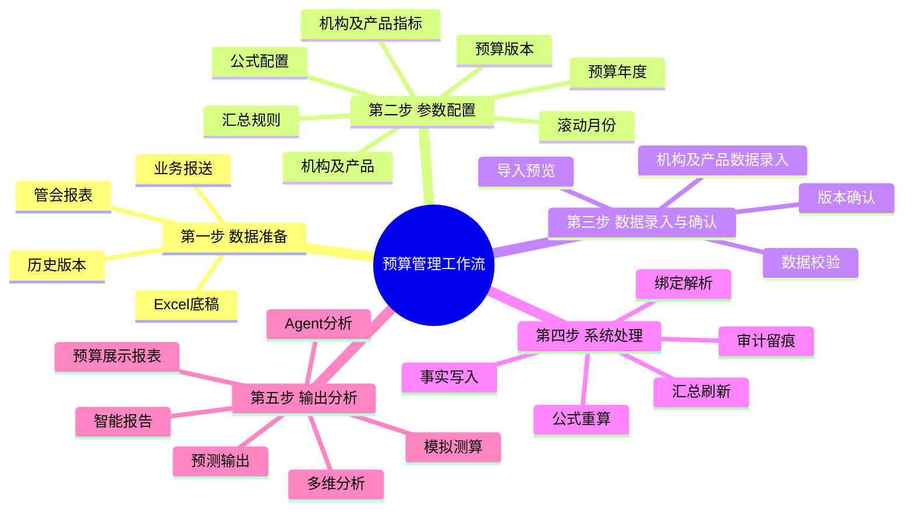
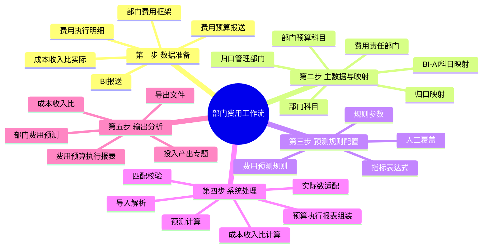
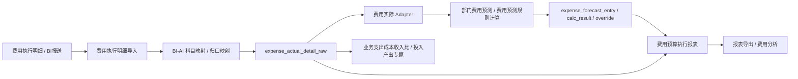
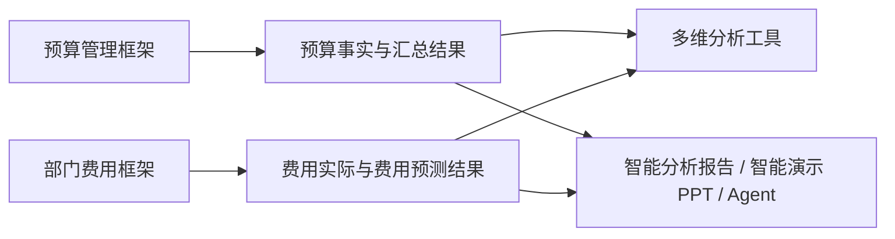

# 业务整体框架图设计稿：预算管理与部门费用

## 1. 设计目标

本设计用于整理一份面向业务方的系统框架图。最终建议做成两页：

- 第 1 页：预算管理整体框架。
- 第 2 页：部门费用整体框架。

两页采用同一套数据分层表达：**数据来源层 -> 参数规则层 -> 数据处理层 -> 事实汇总层 -> 输出分析层**。这样可以把两个业务闭环分开讲，又保持统一的阅读结构。

本设计不新增系统功能，也不调整现有代码。它只定义业务框架图、工作流脑图、数据流脑图、参数清单和先后顺序，供后续制作 PPT、Word 或详细设计文档使用。

## 2. 总体表达方式

### 2.1 两页结构

| 页码 | 主题 | 讲清楚的问题 | 推荐图形 |
| --- | --- | --- | --- |
| 第 1 页 | 预算管理整体框架 | 预算数据从哪里来，如何经过机构及产品指标体系、公式、汇总和版本管理，最终形成预算展示、预测输出、模拟测算和多维分析 | 数据分层框架图 |
| 第 2 页 | 部门费用整体框架 | 费用执行、部门科目、预算科目、BI 映射和预测规则如何形成部门费用预测、费用执行报表和投入产出专题 | 数据分层框架图 |

### 2.2 统一五层

| 层级 | 业务含义 | 图中建议写法 |
| --- | --- | --- |
| 数据来源层 | 外部报表、业务报送、人工录入、历史版本等原始输入 | “数据从哪里来” |
| 参数规则层 | 年度、版本、组织、科目、指标、映射、公式、规则等业务口径配置 | “按什么口径处理” |
| 数据处理层 | 导入、校验、匹配、写入、计算、汇总、刷新等系统动作 | “系统如何处理” |
| 事实汇总层 | 事实表、快照表、汇总表、读模型、审计日志等数据沉淀 | “沉淀到哪里” |
| 输出分析层 | 报表、预测、专题、透视、智能报告、Agent 等最终使用场景 | “最后给谁用” |

## 3. 第 1 页：预算管理整体框架

### 3.1 框架图

```mermaid
flowchart TB
  subgraph S1["1. 数据来源层"]
    A1["管会报表"]
    A2["业务报送"]
    A3["机构及产品数据录入"]
    A4["Excel 底稿"]
    A5["历史预算/实际版本"]
  end

  subgraph S2["2. 参数规则层"]
    B1["预算年度 / 预算版本"]
    B2["滚动月份 / current_month"]
    B3["机构及产品"]
    B4["机构及产品指标"]
    B5["唯一指标号码"]
    B6["预算公式 / 实际公式"]
    B7["横向汇总 / 纵向汇总 / 逻辑码"]
    B8["展示版本槽位 / 展示配置"]
  end

  subgraph S3["3. 数据处理层"]
    C1["导入预览与格式校验"]
    C2["版本确认"]
    C3["指标绑定解析"]
    C4["BudgetDataWriter 写入"]
    C5["公式标脏与重算"]
    C6["父节点派生汇总"]
    C7["预算汇总与对比库刷新"]
  end

  subgraph S4["4. 事实汇总层"]
    D1["budget_data"]
    D2["budget_summary"]
    D3["budget_pivot_aggregate"]
    D4["compare_budget_summary"]
    D5["compare_pivot_aggregate"]
    D6["operation_log"]
  end

  subgraph S5["5. 输出分析层"]
    E1["预算展示报表"]
    E2["机构及产品预测输出"]
    E3["模拟测算"]
    E4["当前年度多版本透视"]
    E5["多年度对比透视"]
    E6["智能分析报告 / 智能演示 PPT"]
    E7["Agent 分析"]
  end

  S1 --> S2 --> S3 --> S4 --> S5
```

### 3.2 工作流程脑图

### 3.3 数据流脑图

### 3.4 关键参数清单

| 参数类别 | 参数 | 作用 |
| --- | --- | --- |
| 版本参数 | 预算年度、预算版本、版本名称、current_month、展示版本槽位 | 决定预算/实际月份窗口、展示列组和对比口径 |
| 组织产品参数 | 机构及产品节点、产品编码、产品层级、AA 实体、全行汇总视角 | 决定数据录入和报表展示范围 |
| 指标参数 | 机构及产品指标、唯一指标号码、产品内指标码、value_type | 决定指标身份、展示精度和事实写入主键 |
| 公式参数 | 预算公式、实际公式、公式引用、allow_manual_entry、need_calc | 决定可录入性、计算依赖和重算范围 |
| 汇总参数 | horizontal_rollup、vertical_rollup、logic_code、value_source | 决定父节点派生事实和横向/纵向汇总方式 |
| 展示参数 | 展示视图、展示行、展示版本、金额单位、月份展开 | 决定预算展示报表和导出样式 |

### 3.5 先后顺序

1. 维护机构及产品和机构及产品指标，确认唯一指标号码。
2. 配置预算年度、版本、滚动月份和展示版本槽位。
3. 录入或导入机构及产品数据，系统进行格式校验和预览。
4. 用户确认版本，系统解析指标绑定并写入预算事实。
5. 系统执行公式重算、横纵汇总、预算汇总和对比库刷新。
6. 预算展示报表、预测输出、模拟测算、多维透视和 Agent 读取汇总结果。

## 4. 第 2 页：部门费用整体框架

### 4.1 框架图

```mermaid
flowchart TB
  subgraph F1["1. 数据来源层"]
    A1["费用执行明细"]
    A2["BI 报送"]
    A3["部门费用框架"]
    A4["部门费用预算报送"]
    A5["上年实际 / 本年预算"]
    A6["成本收入比实际"]
  end

  subgraph F2["2. 参数规则层"]
    B1["主体 / 事业群"]
    B2["费用责任部门"]
    B3["归口管理部门"]
    B4["部门科目"]
    B5["部门预算科目"]
    B6["BI-AI 科目映射"]
    B7["归口映射"]
    B8["费用预测规则"]
    B9["规则参数 / 指标表达式 / 人工覆盖"]
  end

  subgraph F3["3. 数据处理层"]
    C1["导入解析"]
    C2["BI 与部门映射匹配"]
    C3["费用实际 Adapter"]
    C4["预测规则计算"]
    C5["预测重算"]
    C6["人工覆盖"]
    C7["预算执行口径组装"]
    C8["成本收入比计算"]
  end

  subgraph F4["4. 事实汇总层"]
    D1["expense_actual_detail_raw"]
    D2["expense_forecast_entry"]
    D3["expense_forecast_calc_result"]
    D4["expense_forecast_override"]
    D5["budget_subject_catalog"]
    D6["dept_account"]
    D7["费用报表读模型"]
  end

  subgraph F5["5. 输出分析层"]
    E1["部门费用预测"]
    E2["费用预算执行报表"]
    E3["业务支出成本收入比维护"]
    E4["投入产出专题概览"]
    E5["Excel 导出结果文件"]
  end

  F1 --> F2 --> F3 --> F4 --> F5
```

### 4.2 工作流程脑图

### 4.3 数据流脑图

### 4.4 关键参数清单

| 参数类别 | 参数 | 作用 |
| --- | --- | --- |
| 组织参数 | 主体、事业群、费用责任部门、归口管理部门 | 决定费用归属、筛选范围和报表汇总层级 |
| 科目参数 | 部门科目、部门预算科目、预算科目叶子节点 | 决定费用预测和费用执行报表的科目口径 |
| 映射参数 | BI-AI 科目映射、归口管理部门到费用归属部门映射 | 决定外部费用明细如何进入系统口径 |
| 导入参数 | import_kind、来源文件、报表月份、匹配状态、覆盖策略 | 决定费用实际、上年实际和本年预算的取数来源 |
| 预测参数 | 预测规则、规则参数、指标表达式、规则变量、重算范围 | 决定部门费用预测如何自动计算 |
| 覆盖参数 | 人工覆盖值、系统测算值、最终预测值 | 决定人工调整后如何保留测算依据 |
| 输出参数 | 报表视角、报表月份、金额单位、零值行、关键字、导出模式 | 决定费用预算执行报表展示和导出 |

### 4.5 先后顺序

1. 维护部门科目、部门预算科目和费用责任部门口径。
2. 维护 BI-AI 科目映射和归口管理部门映射。
3. 导入费用执行明细，系统解析、匹配并形成费用实际明细。
4. 配置费用预测规则、规则参数和指标表达式。
5. 系统读取实际数、规则和人工覆盖，形成部门费用预测。
6. 费用预算执行报表综合预算、实际、上年同期和预算科目树形成展示。
7. 成本收入比和投入产出专题读取各自私有状态与映射结果形成专题分析。

## 5. 两页之间的关系

两页是并列业务闭环，不建议合并成一张大图：

- 预算管理更强调机构及产品指标体系、预算事实、公式、版本、预测输出和预算展示。
- 部门费用更强调费用责任部门、部门预算科目、BI 映射、费用实际、费用预测和费用执行报表。
- 两者最终都可以进入多维分析、智能报告、智能演示 PPT 和 Agent 分析，但不共享同一套录入口径。

## 6. PPT 或 Word 落版建议

### 第 1 页：预算管理

标题建议：**预算管理整体框架：从指标配置到预算输出**

版式建议：

- 左侧或顶部放五层分层框架。
- 每层用 3 到 6 个关键词，避免塞满表名。
- 底部放一条工作顺序：配置 -> 录入 -> 确认 -> 写入 -> 计算 -> 输出。
- 备注区说明：机构及产品指标体系是唯一主指标体系，预算事实通过 BudgetDataWriter 写入。

### 第 2 页：部门费用

标题建议：**部门费用整体框架：从费用实际到预测与执行报表**

版式建议：

- 复用第 1 页五层结构，让业务方一眼知道两页是同一套表达。
- 每层突出“部门、科目、映射、预测、报表”。
- 底部放一条工作顺序：主数据 -> 映射 -> 导入 -> 匹配 -> 预测 -> 报表。
- 备注区说明：费用执行明细是费用实际 Adapter，不替代预算事实表。

## 7. 边界与后续详细设计

本设计只解决业务框架表达，不替代数据库设计、接口设计或页面原型。后续如果要推进到详细设计，建议按以下顺序展开：

1. 为两页分别补充可交付版 PPT 图。
2. 为每个层级列出当前页面入口和责任模块。
3. 补充每个导入流程的模板、预览、应用和结果文件要求。
4. 补充每个报表输出的取数口径、版本口径和导出血缘。
5. 如需开发变更，再拆成具体 issue 或 PRD。
