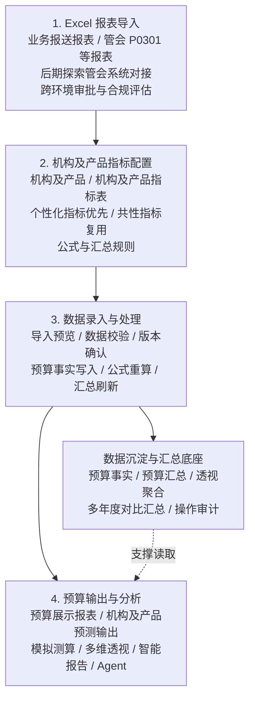
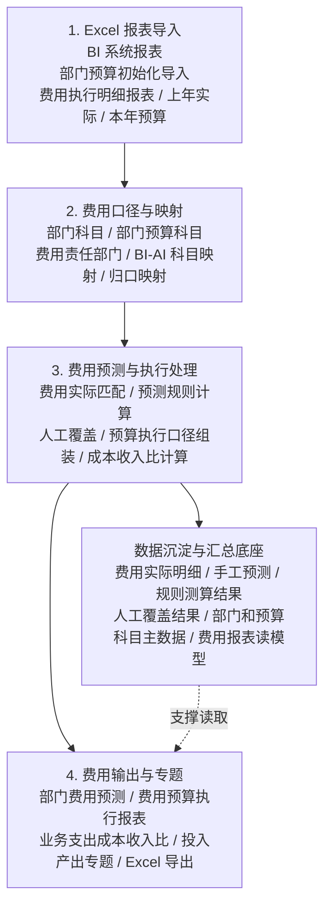
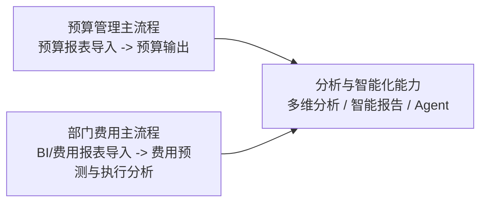

# 业务整体框架图：预算管理与部门费用

## 1. 目标

这份框架图面向业务沟通和汇报，不作为代码设计文档使用。核心目标是让业务方看懂：

- 数据从哪里来。
- 进入系统后按什么口径处理。
- 当前系统哪些页面承接这些流程。
- 最终形成哪些报表、预测和分析结果。

最终交付建议做成两页：

- 第 1 页：预算管理主流程。
- 第 2 页：部门费用主流程。

每页统一采用：

```text
外部报表导入
  ↓
口径确认与映射
  ↓
数据录入、处理与计算
  ↓
输出报表与分析

底部支撑：数据沉淀与汇总底座
```

## 2. 第 1 页：预算管理主流程

### 2.1 一句话说明

外部预算报表通过 Excel 导入进入系统，以机构及产品、机构及产品指标表作为核心配置，支持不同机构和产品保留个性化指标，最终形成预算展示、预测输出和分析结果。

### 2.2 主流程图



### 2.3 当前系统对应页面

| 主流程环节 | 当前系统页面 |
| --- | --- |
| 机构及产品指标配置 | 机构及产品、机构及产品指标 |
| 数据录入与处理 | 机构及产品数据录入、预算事实刷新跑批 |
| 预算输出与分析 | 预算展示报表、机构及产品预测输出、模拟测算、多维分析工具、智能报告/PPT、Agent |

### 2.4 讲解重点

- 当前先以 Excel 报表导入为主，来源包括业务报送报表和管会 P0301 等报表。
- 后期可以探索管会系统对接，但涉及跨环境、合规和审批，不应作为当前主路径承诺。
- 机构及产品指标表是预算管理的核心配置，报表导入后必须回到这套指标体系。
- 这样设置的主要考虑是灵活性：不同机构、不同产品可以保留自己的个性化指标。
- 共性指标可以复用，但不强行覆盖个性化指标，避免为了统一而牺牲业务差异。
- 数据底座不作为业务操作步骤展示，只说明系统如何沉淀数据并支撑报表取数。

### 2.5 工作顺序

```text
导入：业务报送、管会 P0301 等报表
  ↓
配置：机构及产品、机构及产品指标表
  ↓
确认：导入预览、校验、版本确认
  ↓
计算：事实写入、公式重算、汇总刷新
  ↓
输出：预算报表、预测输出、透视分析
```

## 3. 第 2 页：部门费用主流程

### 3.1 一句话说明

BI 系统报表和部门预算初始化数据通过 Excel 导入进入系统，经部门、预算科目和映射规则归集，形成费用预测、执行报表和专题分析。

### 3.2 主流程图



### 3.3 当前系统对应页面

| 主流程环节 | 当前系统页面 |
| --- | --- |
| 费用口径与映射 | 部门科目维护、部门预算科目维护、BI 映射维护 |
| 费用实际与预算导入 | 费用执行明细导入、部门预算初始化相关导入 |
| 费用预测与执行处理 | 费用预测逻辑配置、部门费用预测 |
| 费用输出与专题 | 费用预算执行报表、业务支出成本收入比、投入产出专题概览 |

### 3.4 讲解重点

- 部门费用的数据来源以 BI 系统报表和部门预算初始化导入为主。
- 费用能否看懂，关键在部门、预算科目、BI-AI 科目映射和归口映射。
- 费用预测和费用预算执行报表是同一条费用闭环的两个输出。
- 费用执行明细是费用实际来源，不替代预算管理里的预算事实表。

### 3.5 工作顺序

```text
导入：BI 报表、部门预算初始化数据
  ↓
映射：部门、预算科目、BI-AI 口径
  ↓
匹配：费用实际与预算科目归集
  ↓
预测：规则计算、重算、人工覆盖
  ↓
输出：费用预测、执行报表、专题分析
```

## 4. 两页之间的关系



两页不要合并成一张大图：

- 预算管理强调机构及产品指标、版本、预算事实、预算展示和预测输出。
- 部门费用强调部门、预算科目、BI 映射、费用实际、费用预测和费用执行报表。
- 两者最后都可以进入分析和智能化能力，但数据来源、处理口径和业务页面不同。

## 5. HTML 展示版

对应的两页 HTML 展示稿为：

```text
docs/superpowers/specs/2026-06-12-business-framework-two-pages.html
```
